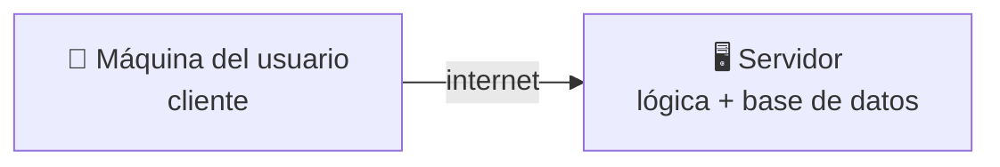
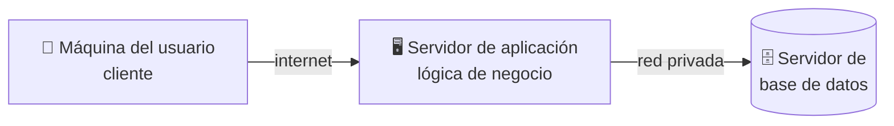
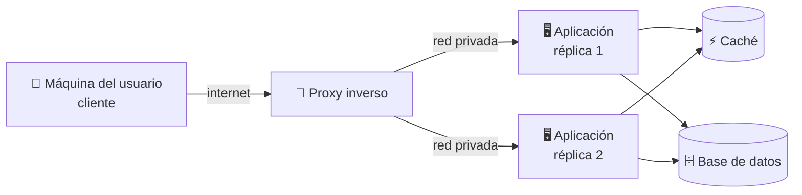
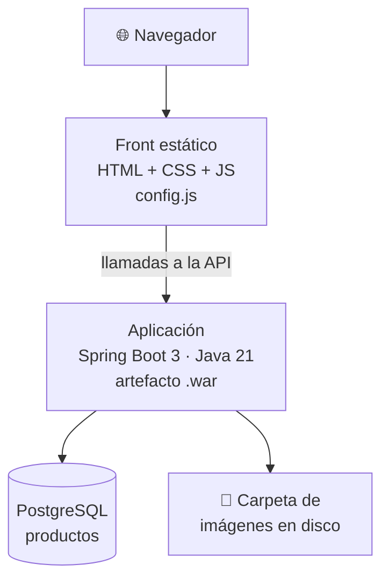

# 🚀 1. Arquitecturas web y proceso de despliegue

!!!info "Descarga de diapositivas"
    [Descarga las diapositivas](diapositivas/arquitecturas-despliegue.pptx){target="_blank" rel="noopener"}

---

En primero aprendiste, entre otras cosas, sobre programación y bases de datos. Durante este segundo curso de DAW vas a aprender, en otros módulos, a escribir el lado servidor de una aplicación web, a montar la interfaz que consume su API y a diseñarla. Este módulo se ocupa de lo que viene justo después, que es también lo que decide si todo aquello llega a existir para alguien: **una aplicación que solo funciona en el ordenador donde se escribió no le sirve a nadie**.

Aquí no vas a programar. Vas a coger una aplicación ya escrita y a conseguir que funcione en un sitio que no es tu ordenador, que siga funcionando cuando te vas a casa, que no se caiga porque entren cien personas a la vez y que se pueda actualizar sin apagarla. Antes de tocar una sola herramienta, hoy toca entender qué es exactamente lo que hay que mover, en qué piezas se descompone y por qué el trayecto desde tu ordenador hasta el servidor tiene tantas paradas.

---

## 🌐 Todo empieza con una petición

El modelo **cliente-servidor** es la base de todo lo que verás este curso: un programa pide (el cliente, casi siempre un navegador) y otro responde (el servidor). El cliente inicia la conversación, el servidor nunca llama primero. Esa asimetría, que parece trivial, condiciona el resto del módulo: cualquier cosa que quieras que el usuario vea tiene que estar escuchando en algún sitio, esperando a que alguien pregunte.

Lo que el servidor devuelve puede ser de dos naturalezas muy distintas, y la diferencia importa mucho más de lo que parece:

| | Contenido estático | Contenido dinámico |
|---|---|---|
| **Qué es** | Un fichero que ya existe en disco: `.html`, `.css`, `.js`, imágenes | Una respuesta que se **fabrica** en el momento de la petición |
| **Quién lo sirve** | Un servidor web (Nginx, Apache), o directamente un almacenamiento de objetos o una CDN | Un runtime que ejecuta código: Java, PHP, Node… |
| **Coste por petición** | Casi cero: leer un fichero y enviarlo | Consultar base de datos, aplicar lógica, generar la respuesta |
| **¿Hay que ejecutar lógica para producirlo?** | No: el fichero ya está hecho | Sí, en cada petición |

Fíjate en la última fila, que es la que de verdad separa las dos columnas. No es que lo estático sea igual para todo el mundo —un fichero puede servirse solo a quien haya iniciado sesión—, sino que **el servidor no tiene que ejecutar nada para producirlo**: ya está hecho, solo hay que entregarlo.

De aquí sale una de las decisiones de arquitectura más rentables que existen: **separar lo estático de lo dinámico** para que cada uno lo sirva quien mejor lo hace. Verás las consecuencias prácticas de esta separación en la sesión 6, cuando pongas un servidor web delante, y en la 9 de *Introducción a la Nube Pública*, cuando lo estático viaje por una red de distribución de contenido y lo dinámico se quede en el servidor.

---

## 🧱 De dos capas a n capas

Cuando decimos que una aplicación tiene *capas* hablamos de **responsabilidades separadas**: la presentación por un lado, la lógica de negocio por otro y los datos por otro. Eso es una decisión de diseño, y no dice nada sobre dónde se ejecuta cada parte.

Lo que sí nos interesa aquí es la pregunta siguiente: **cuántas máquinas distintas hacen falta para ejecutarlas**. Una aplicación de tres capas puede correr entera en un portátil o repartirse entre tres servidores, y las dos cosas son igual de legítimas. En la industria, a esa separación física se le llama a veces *nivel* o *tier* para distinguirla de la lógica, aunque en el día a día casi todo el mundo dice «capas» para ambas cosas.

En este módulo nos importa el reparto físico, porque es lo que hay que desplegar, configurar y pagar. Así que en los diagramas que vienen **cada caja es una máquina distinta**, y conviene que no interiorices lo contrario: que tu aplicación tenga tres capas no obliga a nadie a comprar tres servidores.

En **dos capas**, la máquina del usuario habla directamente contra un servidor que tiene la lógica y los datos juntos:



Es el modelo del programa de escritorio conectado a una base de datos corporativa, y aguanta mal en web: cada cliente necesitaría credenciales de la base de datos, y eso es inaceptable en cuanto el cliente es un navegador que cualquiera puede abrir y curiosear.

En **tres capas repartidas** aparece la disposición que domina la web actual: presentación, lógica de negocio y datos, cada una en su propia máquina.



En estos diagramas, **cada caja representa un componente desplegado de forma independiente y cada flecha una comunicación entre componentes**. Ese componente podría ejecutarse en una máquina virtual, un contenedor o un servicio administrado. Varias cajas podrían incluso compartir físicamente una misma máquina.

Fíjate en la consecuencia: el navegador nunca habla con la base de datos. Habla con la aplicación, que es la única que tiene las credenciales y la única que decide qué se puede consultar y qué no. Y el servidor de base de datos ni siquiera necesita estar accesible desde internet, solo desde la máquina de la aplicación. Esta es la arquitectura que vas a desplegar durante casi todo el módulo.

**Una arquitectura puede repartir todavía más sus componentes**: puedes insertar un proxy inverso delante, una caché en medio o un servicio de búsqueda al lado. Cada componente desplegado de forma independiente aporta algo, pero también añade complejidad, posibles puntos de fallo y coste. Recuerda la distinción anterior: una capa es una separación lógica de responsabilidades; un componente o nodo de despliegue es una pieza que ejecutamos de forma independiente.



!!! tip "La regla del despliegue"
    Cada capa nueva mejora una propiedad concreta (rendimiento, seguridad, escalabilidad) y empeora dos: complejidad operativa y coste. Todo el módulo consiste en aprender a decidir cuándo esa permuta compensa. No hay arquitecturas buenas y malas, hay arquitecturas proporcionadas y desproporcionadas al problema.

---

## 🧩 Monolito o servicios

Otra decisión, distinta de la anterior aunque se confundan a menudo. Las capas dicen *dónde se ejecuta cada parte*; el monolito frente a los servicios dice **en cuántos trozos independientes se despliega la lógica**.

Una aplicación **monolítica** se construye y se despliega como una unidad: un solo artefacto que contiene el catálogo, los pedidos, las facturas y los usuarios. Una arquitectura de **microservicios** parte esa lógica en componentes pequeños, autónomos, con su propio almacén de datos y su propio ciclo de despliegue, que se comunican por API.

| | Monolito | Microservicios |
|---|---|---|
| **Desplegar un cambio pequeño** | Se vuelve a desplegar todo | Solo el servicio afectado |
| **Escalar la parte que se satura** | Se replica la aplicación entera, aunque solo se ahogue una función | Se replica solo ese servicio |
| **Depurar un error** | Un log, una traza, un proceso | Traza repartida entre varios servicios y varias máquinas |
| **Equipo necesario** | Uno puede con todo | Un equipo por servicio, y alguien que orqueste |
| **Cuándo elegirlo** | Producto joven, equipo pequeño, dominio poco claro | Escala alta, equipos independientes, partes con cargas muy distintas |

La tentación es pensar que los microservicios son «lo moderno» y el monolito «lo antiguo». No es así: la mayoría de las aplicaciones del mundo real son monolitos bien hechos, y muchas migraciones a microservicios acaban en un sistema distribuido que nadie sabe operar. Cuando una empresa sí necesita hacer la transición, además, no la hace de golpe.

!!! info "Para saber más: cómo se migra un monolito"
    La transición no se hace reescribiendo la aplicación entera y cambiándola un lunes por la mañana. Se sustituye funcionalidad poco a poco dejando la vieja en marcha, con algo delante que decide qué peticiones van a la parte nueva y cuáles a la antigua, hasta que el monolito se queda sin trabajo y se apaga. El patrón tiene nombre —*Strangler Fig*— y lo entenderás mucho mejor en la sesión 7, cuando pongas tú ese «algo delante».

!!! warning "Repartir capas no es trocear la lógica"
    Es la confusión más habitual, y la vas a tener delante todo el curso. A partir de la sesión 5 verás el front, la aplicación y la base de datos de Escaparate ejecutándose por separado, primero en contenedores distintos y más adelante en máquinas distintas. Eso es **separar capas**: cada pieza se ejecuta donde le conviene, pero toda la lógica de negocio —catálogo, altas de producto, imágenes— sigue viviendo en un único artefacto que se construye y se despliega de una vez. Trocearla en un servicio de catálogo, otro de pedidos y otro de usuarios, cada uno con sus propios datos y su propio despliegue, sería otra cosa. Eso no lo vas a hacer aquí.

La aplicación que vas a desplegar este curso es, por tanto, un **monolito de tres capas**. Y está bien que lo sea: te permite ver todos los problemas de despliegue sin añadirles el de coordinar seis servicios a la vez.

---

## 📨 HTTP: el idioma en el que se habla el despliegue

HTTP lo vas a ver como programador en otros módulos. Aquí lo miras con otros ojos, porque cuando algo falla en producción **la respuesta HTTP suele ser la única pista que tienes** antes de entrar en la máquina.

Una petición lleva un **método** (`GET` para pedir, `POST` para crear, `PUT` para reemplazar, `DELETE` para borrar), una ruta, unas **cabeceras** y a veces un cuerpo. La respuesta trae un **código de estado**, sus propias cabeceras y el contenido. Los códigos se agrupan en familias, y esa agrupación funciona como una primera orientación sobre dónde mirar:

| Familia | Significado | Quién tiene el problema |
|---|---|---|
| `2xx` | Todo bien | Nadie |
| `3xx` | Redirección: lo que buscas está en otro sitio | Nadie, pero comprueba que el destino es correcto |
| `4xx` | El cliente ha pedido mal (`404` no existe, `401` no autenticado, `403` sin permiso) | Quien pregunta |
| `5xx` | El servidor ha fallado atendiendo una petición válida (`500` error interno, `502`/`503` no llega al backend) | Tú |

!!! warning "La regla sirve para orientarse, no para cerrar el caso"
    «Los 4xx son de quien pregunta y los 5xx de quien responde» es una regla mnemotécnica útil, pero no es una ley. Un `404` puede ser una URL mal escrita por el usuario y también un despliegue que no copió los ficheros donde tocaba; un `403` puede ser un permiso mal puesto por ti. Úsala para decidir por dónde empezar a mirar, no para decidir de quién es la culpa.

Esa última fila es la que te va a quitar el sueño. Un `502` no significa «la aplicación tiene un error»: significa que **quien recibió la petición no consiguió hablar con quien tenía que responderla**. Es un error de despliegue, no de programación, y buena parte de este módulo consiste en aprender a diagnosticarlo.

Las cabeceras son el otro instrumento de diagnóstico. Con una petición que pide solo la cabecera de la respuesta, sin descargar el contenido, ya se ve muchísimo:

```bash
curl -I https://ejemplo.org
```

```text
HTTP/2 200
server: nginx
content-type: text/html; charset=UTF-8
cache-control: max-age=3600
set-cookie: JSESSIONID=8F2A...; Path=/; HttpOnly
strict-transport-security: max-age=31536000
```

Línea a línea: `HTTP/2 200` dice que la petición fue bien y con qué versión del protocolo se habló. `server` delata qué software está atendiendo, lo cual cuenta bastante sobre la arquitectura que hay detrás. `content-type` indica qué tipo de contenido devuelve, y es la causa de un error clásico: un fichero servido con el tipo equivocado que el navegador se niega a interpretar. `cache-control` decide durante cuánto tiempo el navegador o una CDN pueden guardarse la respuesta sin volver a pedirla. `set-cookie` es el servidor entregando un identificador de sesión. Y `strict-transport-security` obliga al navegador a no volver a conectarse a ese sitio sin cifrado.

!!! info "Tu salida no tiene por qué ser idéntica"
    El juego exacto de cabeceras depende de cómo esté configurado cada servidor y cambia con el tiempo. Lo importante no es que coincida con la de arriba, sino que sepas leer la que te devuelva a ti.

Detente en la cookie de sesión, porque tiene consecuencias importantes más adelante. **HTTP no tiene estado**: cada petición llega al servidor de forma independiente. Una forma habitual de mantener una sesión consiste en guardar su estado en el servidor y entregar al navegador un identificador mediante una cookie. Mientras existe una sola instancia esto es sencillo; cuando aparecen varias réplicas, si cada una guarda las sesiones únicamente en su propia memoria, una petición puede llegar a otra instancia que no conozca esa sesión. Habrá que resolverlo compartiendo el estado, manteniendo afinidad entre usuario e instancia o utilizando otras estrategias. Ese problema reaparecerá cuando trabajes con varias réplicas.
---

## 📦 De qué está hecha una aplicación web

Aquí está el cambio de mentalidad que trae este módulo. Como programador, «la aplicación» es tu proyecto. Como responsable del despliegue, la aplicación es un conjunto de **cinco piezas de naturaleza distinta**, y cada una viaja de una manera:

| Pieza | Qué es | En tu ordenador | Qué necesita fuera de él |
|---|---|---|---|
| **Estáticos** | HTML, CSS, JS, imágenes | Ficheros en una carpeta | Alguien que los sirva por HTTP, rápido y cacheados |
| **Artefacto y runtime** | El código compilado y el intérprete o máquina virtual que lo ejecuta | Tu IDE lo arranca por ti | Un proceso que arranque solo, se reinicie si muere y escuche en un puerto |
| **Datos** | La base de datos y su contenido | Una instalación local con cuatro filas de prueba | Un servidor propio, con copias de seguridad y acceso restringido |
| **Configuración** | Dirección de la base de datos, rutas, puertos, modo de ejecución | Escrita a fuego en el código o en un fichero | Debe cambiar **sin recompilar**: es distinta en cada entorno |
| **Secretos** | Contraseñas, claves de API, certificados | Suelen estar en el mismo fichero de configuración | Nunca en el repositorio, nunca dentro del paquete de la aplicación |

Las dos últimas filas son las que más problemas dan en la vida real. Si la dirección de la base de datos está dentro del código, tienes que recompilar para desplegar en otro entorno, y a la tercera vez alguien desplegará la versión de pruebas contra la base de datos de producción. Si las contraseñas están en el repositorio, están en el historial de Git para siempre, aunque las borres mañana.

!!! warning "El error más caro es siempre el mismo"
    Empaquetar la configuración y los secretos junto con la aplicación. Todo el módulo vuelve una y otra vez a la misma regla: **el paquete de la aplicación es idéntico en todos los entornos; lo que cambia es lo que le inyectas desde fuera al arrancarlo.** Lo verás con contenedores en la sesión 5, con el servidor de aplicaciones en la 10 y, más adelante, al desplegar contenedores en servicios administrados de nube.

---

## 🛍️ Escaparate: la aplicación que vas a desplegar todo el curso

**Escaparate** es un catálogo de productos con imágenes. Nada espectacular: se listan productos, se ve el detalle de cada uno, se da de alta uno nuevo con su foto. Te la entregamos hecha y **no vas a programarla**. Lo que vas a construir es todo lo que la rodea, que es precisamente el contenido del módulo.



Estas son sus piezas y por qué están así:

- **El front es estático puro.** HTML, CSS y JavaScript sin ningún proceso de construcción, con un único fichero `config.js` de una línea donde se indica en qué dirección está la API. Está separado del back a propósito: eso te permitirá servirlo desde sitios muy distintos a lo largo del curso —el propio servidor web, un almacenamiento de objetos, una red de distribución— cambiando exclusivamente esa línea.
- **El back es un `.war` de Spring Boot 3 sobre Java 21** que sirve para las dos cosas: puede arrancarse solo, porque lleva un servidor dentro, o desplegarse en un Tomcat instalado aparte. Que valga para ambas te dejará comparar las dos formas de ejecutar exactamente el mismo artefacto en la sesión 10.
- **Los datos viven en PostgreSQL**, con su esquema y sus productos de ejemplo ya preparados.
- **Las imágenes de los productos se guardan en una carpeta del disco de la máquina** donde corre la aplicación. Apunta este detalle: parece el sitio más natural del mundo para dejarlas, y de hecho lo es… mientras haya una sola máquina.
- **Tres endpoints de instrumentación** que no existen para el usuario, sino para ti: uno dice qué máquina concreta ha respondido, otro genera carga de trabajo a propósito, y otro responde si la aplicación está sana. Son las tres sondas con las que verás, más adelante, cómo se reparte el tráfico, cómo escala un sistema y cómo se detecta que una pieza ha muerto.

!!! example "Por qué una aplicación tan sencilla"
    Porque el objetivo no es la aplicación, es el trayecto. Una aplicación complicada te haría perder las tres horas de clase entendiendo su código en lugar de desplegándola. Escaparate es lo bastante pequeña para caber en la cabeza el primer día y lo bastante completa para tener las cinco piezas de la tabla anterior: estáticos, artefacto, datos, configuración y secretos.

---

## 🚚 Qué falta para que esto salga de tu ordenador

Imagina que hoy mismo te piden poner Escaparate en producción para una tienda real. Tienes el código y una máquina con acceso a internet. Esta es la lista de todo lo que falta, ordenada tal como la vas a ir resolviendo:

1. Que el código y el **procedimiento de despliegue** estén escritos, versionados y documentados, no en tu cabeza.
2. Que la aplicación arranque en esa máquina **con las mismas versiones** de Java y PostgreSQL que en tu equipo, y que eso siga siendo repetible dentro de seis meses.
3. Que la **configuración y las contraseñas** vengan de fuera del paquete, distintas en cada entorno y fuera del repositorio.
4. Que responda en los puertos 80 y 443, no en el 8080, con un **nombre** que la gente pueda teclear, y que los estáticos los sirva quien mejor lo hace.
5. Que haya un **único punto de entrada** capaz de repartir el trabajo entre varias copias de la aplicación.
6. Que la conexión vaya **cifrada**, con un certificado válido que se renueve solo, y que la base de datos **no sea accesible desde internet**.
7. Que puedas saber, sin entrar en la máquina, **qué está pasando**: cuántos errores hay, qué ruta falla, si la memoria está al límite.
8. Que el proceso **arranque solo**, se reinicie si muere y aguante un pico de visitas sin desplomarse.
9. Que publicar **una nueva versión** sea automático y volver atrás cueste un minuto si sale mal.
10. Que si una copia se cae **se reponga sola**, y que actualizar no implique cortar el servicio.

Ninguno de esos diez puntos es un problema de programación. Todos son problemas de despliegue, y cada uno tiene su sitio en el calendario:

| Lo que falta | Dónde se resuelve |
|---|---|
| 1 · Versionado y documentación | Sesión 2 |
| 2 · Empaquetado reproducible | Sesiones 3 a 5 · contenedores |
| 3 · Configuración y secretos externos | Sesión 5 y refuerzos posteriores |
| 4 · Servir estáticos y configurar el servidor web | Sesión 6 |
| 5 · Proxy inverso y ejecución de la aplicación | Sesión 7 |
| 6 · Cifrado, certificados y endurecimiento | Sesión 8 |
| 7 · Saber qué ocurre mediante logs y observabilidad | Sesión 9 |
| 8 · Verificar disponibilidad y rendimiento | Sesiones 10 y 11 |
| 9 · Automatizar construcción, publicación y despliegue | Sesiones 12 y 13 |
| 10 · Auditar y defender el despliegue completo | Sesiones 14 a 16 |

Ese es el módulo entero. Cada sesión existe porque resuelve un punto de esa lista, y al final del curso Escaparate estará desplegada de cuatro formas distintas y sabrás argumentar cuál le venderías a qué cliente.

De todos ellos, el segundo es la puerta de entrada: mientras «funciona en mi máquina» siga siendo cierto solo en tu máquina, el resto no se puede ni empezar. La respuesta a ese problema tiene nombre y llega en la sesión 3.

---

## 🎯 Qué debes saber hacer al salir de esta sesión

- Nombrar las cinco piezas de una aplicación web desplegada y decir qué necesita cada una.
- Distinguir contenido estático de dinámico y explicar por qué conviene separarlos.
- Leer la cabecera de una respuesta HTTP e interpretar el código de estado, el servidor, el tipo de contenido y la caché.
- Usar la pestaña de red del navegador para saber cuántas peticiones hace una página y de qué tipo son.
- Explicar por qué la configuración y los secretos nunca viajan dentro del paquete.

Todo lo demás de este apunte —las arquitecturas de n capas, los microservicios, la lista de los diez puntos— es el mapa del curso. Está aquí para que sepas dónde estás en cada momento, no para memorizarlo hoy.

---

## ✅ Ideas clave

??? tip "Abrir resumen"

    - En el modelo cliente-servidor siempre pregunta el cliente: cualquier cosa que el usuario deba ver tiene que estar escuchando en algún sitio, esperando la petición.
    - Contenido estático es un fichero que ya existe; contenido dinámico se fabrica en cada petición. Separarlos permite que cada uno lo sirva quien mejor lo hace, y es la base de media docena de decisiones posteriores.
    - Las capas separan responsabilidades: presentación, lógica y datos. Pueden ejecutarse juntas o distribuirse entre distintos componentes o nodos. En la arquitectura que utilizaremos, el navegador no accede directamente a la base de datos: habla con la aplicación, que es quien conoce las credenciales y aplica las reglas de acceso.
    - Cada capa nueva mejora una propiedad y empeora dos: complejidad y coste. No hay arquitecturas buenas, hay arquitecturas proporcionadas al problema.
    - El monolito se despliega y se escala como una unidad; los microservicios, pieza a pieza, a cambio de un sistema distribuido que hay que saber operar. La mayoría de aplicaciones reales son monolitos bien hechos.
    - Repartir las capas entre varias máquinas no convierte un monolito en microservicios: mientras la lógica de negocio siga siendo un único artefacto que se construye y se despliega de una vez, sigue siendo un monolito.
    - Los códigos HTTP `4xx` suelen orientar primero hacia la petición o el acceso y los `5xx` hacia el servidor, pero son solo una pista inicial. Un `502`, por ejemplo, suele indicar que un intermediario no ha podido obtener una respuesta válida del servicio que tenía detrás.
    - HTTP no guarda estado; la sesión es un parche que funciona con un servidor y se rompe con dos. Recuérdalo cuando llegue el balanceo.
    - Una aplicación web son cinco piezas con necesidades distintas: estáticos, artefacto y runtime, datos, configuración y secretos. Las dos últimas nunca viajan dentro del paquete.
    - El paquete de la aplicación debe ser idéntico en todos los entornos; lo que cambia es lo que se le inyecta desde fuera al arrancar.
    - Escaparate es el hilo del curso: front estático separado, artefacto que vale para servidor embebido y externo, datos en PostgreSQL, imágenes en disco local y tres endpoints de instrumentación para ver el reparto de tráfico, generar carga y comprobar la salud.

---

Con esto ya tienes el mapa: sabes de qué está hecha una aplicación web, qué piezas tiene Escaparate y qué le falta para vivir fuera de tu ordenador. En la **Actividad 1.1** vas a comprobar que todo lo anterior se puede leer directamente en sitios reales: abrirás dos webs muy distintas, mirarás qué servidor las atiende, qué recursos cargan y qué cabeceras devuelven, y deducirás de ahí qué arquitectura tienen detrás y qué habría hecho falta para desplegarlas.