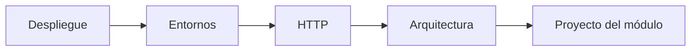
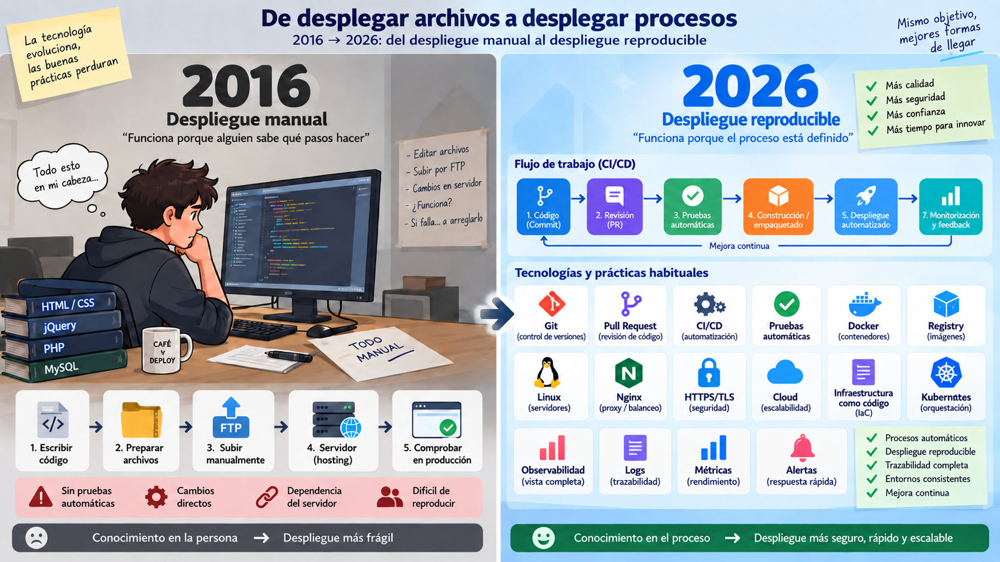
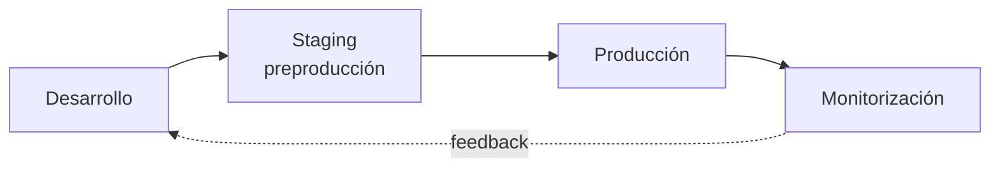
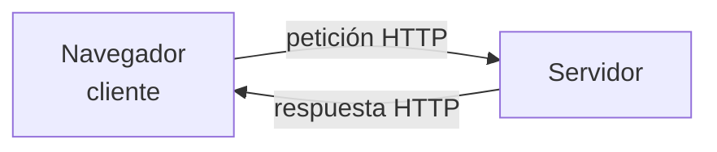
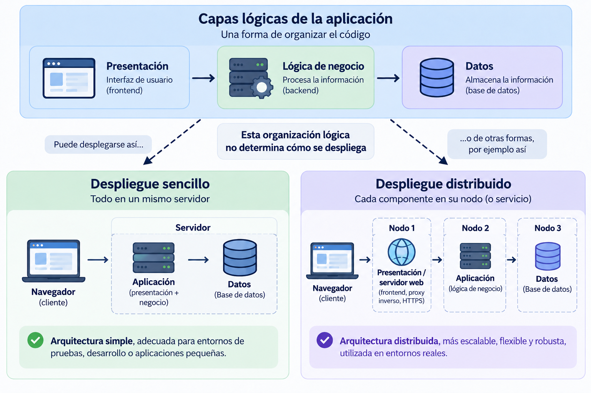
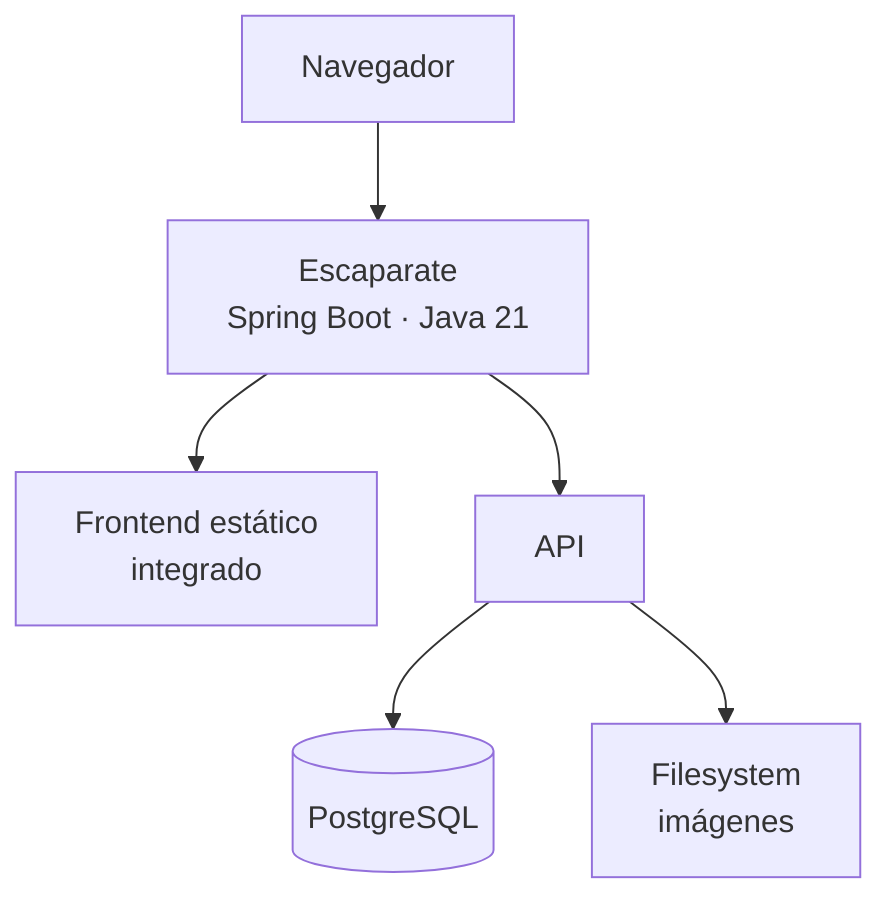
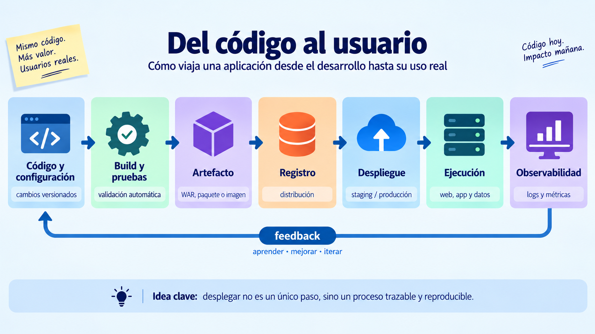
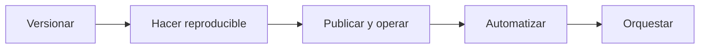

# 🚀 Arquitecturas web y proceso de despliegue

!!! info "Descarga de diapositivas"
    [Descarga las diapositivas](diapositivas/arquitecturas-despliegue.pdf){target="_blank" rel="noopener"}

---

En primero aprendiste a programar, trabajar con bases de datos y construir aplicaciones. En segundo, seguirás desarrollando frontend y backend en otros módulos. Sin embargo, en el módulo de Despliegue de Aplicaciones Web el foco cambia: **una aplicación no está terminada cuando funciona en tu ordenador, sino cuando puede ejecutarse de forma fiable para otras personas**.

Desplegar no es "subir archivos a un servidor". Significa preparar todo lo necesario para que una aplicación pueda arrancar, conectarse a sus datos, recibir configuración, proteger sus secretos, responder por red, soportar fallos, actualizarse y dejar pistas cuando algo va mal.

Ese es el problema que recorre todo el módulo.

!!! abstract "Mapa de la sesión"
    Durante esta sesión construiremos un primer mapa del despliegue: **qué significa desplegar**, qué cambia entre entornos, cómo interviene HTTP, cómo se organizan las piezas de una arquitectura y cómo aplicaremos estas ideas al **proyecto del módulo**.



---

## 🕰️ 1. Del despliegue artesanal al despliegue reproducible

Hace años era habitual que muchos proyectos pequeños se publicaran mediante procedimientos muy manuales: compilar en el equipo del desarrollador, copiar ficheros por FTP, modificar la configuración directamente en el servidor y comprobar después si todo seguía funcionando.

Ese modelo sigue existiendo, pero cuanto más crecen una aplicación, un equipo o el número de despliegues, más problemas aparecen:

- pasos que solo conoce una persona;
- servidores configurados de forma distinta;
- versiones difíciles de identificar;
- errores humanos al repetir tareas;
- actualizaciones que producen interrupciones;
- pruebas que se hacen demasiado tarde;
- dificultad para saber qué cambió cuando algo falla.

El despliegue moderno intenta convertir ese procedimiento artesanal en un **proceso reproducible, trazable y progresivamente automatizado**.

| Despliegue artesanal | Despliegue reproducible |
|---|---|
| Pasos manuales y difíciles de repetir | Procedimiento versionado y repetible |
| La validación suele llegar al final | Validación y pruebas antes de desplegar |
| El servidor puede acumular cambios hechos a mano | La configuración se declara y puede reconstruirse |
| Cuesta saber qué versión está funcionando | Código, artefactos y cambios son trazables |
| Volver atrás depende de recordar qué se tocó | Se intenta que rollback y recuperación formen parte del proceso |



*Figura 1. De desplegar archivos a desplegar procesos. Elaboración propia.*

La imagen resume el cambio importante sin convertirlo en una comparación entre tecnologías concretas. En el lado izquierdo, el despliegue depende sobre todo de **pasos manuales y conocimiento que permanece en la persona**. En el derecho, ese conocimiento se traslada progresivamente al **proceso**: control de versiones, revisión, pruebas, construcción, despliegue, monitorización y feedback.

Las herramientas cambian con los años; la idea que interesa conservar es esta:

> **un despliegue profesional intenta que el camino desde el código hasta producción pueda entenderse, repetirse, comprobarse y mejorarse.**

!!! note "Una comparación deliberadamente simplificada"
    No significa que antes todo se hiciera por FTP ni que hoy todas las empresas utilicen Kubernetes, microservicios o nube pública. La tendencia importante es otra: **el camino entre escribir código y ponerlo delante de usuarios se ha convertido en una parte explícita del producto, versionada, comprobable y cada vez más automatizada**.

Esta evolución también explica por qué desarrollo y operaciones ya no pueden vivir completamente separados. Quien escribe una aplicación debe entender cómo se ejecutará, cómo recibirá configuración, cómo se comprobará su estado y qué ocurrirá cuando falle. Esa colaboración entre desarrollo, operaciones, automatización y feedback continuo es parte de la cultura que suele agruparse bajo el término **DevOps**.

---

## 🎯 2. Qué queremos conseguir cuando desplegamos

El objetivo no es simplemente que la página "se abra". Un buen despliegue debería reunir varias propiedades:

| Propiedad | Qué significa |
|---|---|
| **Reproducible** | Dos personas pueden seguir el mismo procedimiento y obtener un resultado equivalente. |
| **Trazable** | Podemos saber qué versión está funcionando, quién la cambió y cómo llegó hasta allí. |
| **Configurable** | El mismo artefacto puede ejecutarse en distintos entornos cambiando la configuración externa. |
| **Seguro** | Los secretos no viajan en el código y solo se exponen los servicios necesarios. |
| **Observable** | Podemos saber si funciona, cuánto tarda y por qué falla sin adivinar. |
| **Escalable** | Podemos aumentar capacidad cuando la carga lo exige. |
| **Actualizable** | Podemos publicar una versión nueva de forma controlada y volver atrás si algo sale mal. |

A lo largo del módulo irás construyendo estas propiedades una por una.

---

## 🌍 3. Desarrollo, staging y producción

Una misma aplicación suele pasar por varios **entornos**. El código puede ser el mismo, pero cambian los datos, las credenciales, los nombres de host, los recursos disponibles y el nivel de exigencia.

| Entorno | Para qué sirve | Ejemplo |
|---|---|---|
| **Desarrollo** | Trabajar rápido y probar cambios | PostgreSQL local, datos de ejemplo |
| **Staging / preproducción** | Validar una versión en condiciones parecidas a producción | Servicios de prueba, configuración casi real |
| **Producción** | Dar servicio a usuarios reales | Datos reales, seguridad y disponibilidad exigentes |



Una regla te acompañará todo el curso:

> **El artefacto de la aplicación debería ser el mismo en todos los entornos. Lo que cambia es la configuración que se le proporciona desde fuera.**

Si para pasar de desarrollo a producción necesitas modificar el código o recompilar con una contraseña distinta, el despliegue se vuelve frágil.

---

## 🌐 4. Todo empieza con una petición

El modelo **cliente-servidor** es la base de la web. Un cliente, normalmente un navegador, inicia una petición y un servidor responde.



Lo que el servidor devuelve puede tener dos naturalezas distintas:

| | Contenido estático | Contenido dinámico |
|---|---|---|
| **Qué es** | Un fichero que ya existe: HTML, CSS, JS, imagen... | Una respuesta que se genera al recibir la petición |
| **Quién lo sirve** | Servidor web, almacenamiento de objetos, CDN... | Un runtime que ejecuta código: Java, PHP, Node... |
| **Trabajo por petición** | Leer y entregar | Aplicar lógica, consultar datos, construir la respuesta |
| **¿Hay que ejecutar lógica para producirlo?** | No | Sí |

La diferencia importante no es si el contenido "cambia", sino **si hay que ejecutar lógica para producir la respuesta**.

Separar contenido estático y dinámico permite que cada parte sea atendida por la pieza más adecuada.

A lo largo del módulo distinguiremos dos responsabilidades que a veces se mezclan bajo la palabra *servidor*:

| Pieza | Responsabilidad principal |
|---|---|
| **Servidor web** | Recibe peticiones HTTP de los usuarios, les entrega los archivos estáticos y redirige el tráfico. |
| **Servidor de aplicaciones** | Ejecuta el código que genera respuestas dinámicas. |

En el desarrollo moderno, ambas piezas trabajan en equipo. Por ejemplo, el servidor web (**Nginx**) atiende al usuario y sirve lo estático, pero le pasa el resto de peticiones a nuestra aplicación (**Spring Boot**) para que ejecute la lógica pesada por detrás. Más adelante construirás precisamente esta cooperación.

---

## 🧱 5. Capas lógicas y unidades de despliegue

Cuando hablamos de **capas lógicas** describimos **responsabilidades dentro de la aplicación**, no necesariamente máquinas distintas. De forma general, distinguimos tres grandes bloques:

- **Presentación**: lo que interactúa con el usuario.
- **Lógica de negocio**: donde se procesa la información y se aplican las reglas.
- **Datos**: donde la información se almacena y se recupera.

Estas capas ayudan a **organizar el código**, pero **no determinan por sí solas cómo se despliega una aplicación**.



*Figura 2. Una misma organización lógica puede desplegarse de formas distintas. Elaboración propia.*

La figura muestra que una misma organización lógica puede materializarse de formas muy distintas.

En un **despliegue sencillo**, presentación, lógica de negocio y datos se ejecutan dentro de un mismo servidor. Es una opción fácil de comprender y administrar, adecuada para entornos de desarrollo, prácticas o aplicaciones pequeñas.

En un **despliegue distribuido**, las responsabilidades se reparten entre distintos **nodos**. En el ejemplo:

- un nodo atiende la entrada web y el frontend;
- otro ejecuta la lógica de negocio;
- otro mantiene los datos.

Un **nodo** representa aquí una unidad de ejecución diferenciada, pero no necesariamente una máquina física. Puede ser una máquina virtual, un contenedor o un servicio gestionado, y varios nodos podrían incluso compartir el mismo host.

Distribuir el sistema puede facilitar el **aislamiento, el escalado o la evolución independiente** de sus componentes, pero también introduce más comunicaciones, configuración y complejidad operativa.

!!! tip "No confundas capa y nodo"
    **Capas lógicas** y **nodos de despliegue** responden a preguntas diferentes:

    - una capa indica **qué responsabilidad tiene una parte de la aplicación**;
    - un nodo indica **dónde y cómo se ejecuta esa parte**.

---

## 🧩 6. Monolito o microservicios

Hasta ahora hemos visto que las **capas lógicas** no determinan cómo se distribuye físicamente una aplicación. Hay otra decisión diferente: **cómo se divide la propia lógica de negocio en unidades desplegables**.

Una aplicación **monolítica** concentra esa lógica en una única aplicación que se construye y despliega como una unidad. Una arquitectura de **microservicios** la divide en varios servicios autónomos, cada uno con su propio ciclo de despliegue y, potencialmente, de escalado.

| | Monolito | Microservicios |
|---|---|---|
| **Desplegar un cambio pequeño** | Se despliega la aplicación completa | Puede desplegarse solo el servicio afectado |
| **Escalar una función concreta** | Se replica todo el monolito | Puede escalarse solo ese servicio |
| **Depurar un fallo** | Menos procesos y comunicaciones | Logs y trazas repartidos entre servicios |
| **Complejidad operativa** | Menor | Mucho mayor |
| **Cuándo encaja** | Equipos pequeños o medianos, producto joven | Sistemas grandes con dominios y equipos realmente independientes |

!!! warning "Varios nodos no significa microservicios"
    Un monolito puede ejecutarse en varias réplicas o nodos para mejorar disponibilidad o capacidad. Lo que lo hace monolítico es que la aplicación sigue siendo **una única unidad lógica de despliegue**, no que exista una sola máquina o un solo proceso.

También existen otros modelos, como PaaS, serverless o arquitecturas orientadas a eventos. Los irás encontrando en otros contextos, pero no necesitas dominarlos ahora para aprender a desplegar.

!!! info "Conexión con la práctica"
    Antes de construir infraestructura conviene aprender a **observar un sistema desplegado y separar evidencias de suposiciones**. Las peticiones HTTP, sus cabeceras y la diferencia entre contenido estático y dinámico serán las primeras herramientas para hacerlo.

---

## 📨 7. HTTP: el idioma del diagnóstico

HTTP no solo sirve para programar APIs. Para quien despliega una aplicación es también una herramienta de diagnóstico.

Una petición contiene:

```text
método + ruta + cabeceras + cuerpo opcional
```

y una respuesta:

```text
código de estado + cabeceras + cuerpo
```

Los códigos proporcionan una primera pista:

| Familia | Orientación inicial |
|---|---|
| `2xx` | La petición ha sido atendida correctamente |
| `3xx` | El cliente debe continuar en otro destino |
| `4xx` | Hay un problema con la petición, el recurso o el acceso |
| `5xx` | El servidor o algún componente intermedio no ha podido responder correctamente |

!!! warning "Es una pista, no una sentencia"
    Un `404` puede ser una URL mal escrita, pero también un despliegue que no copió un recurso. Un `403` puede deberse a permisos mal configurados. Los códigos ayudan a decidir dónde empezar a investigar.

Con `curl` puedes observar una respuesta sin depender del navegador:

```bash
curl -I https://ejemplo.org
```

Una salida posible sería:

```text
HTTP/2 200
server: nginx
content-type: text/html; charset=UTF-8
cache-control: max-age=3600
strict-transport-security: max-age=31536000
```

Las cabeceras pueden revelar qué servidor responde, qué contenido entrega, qué política de caché aplica o si el navegador debe utilizar siempre HTTPS.

HTTP además es **stateless**: cada petición es independiente. Esta propiedad parece sencilla mientras hay una única instancia, pero se vuelve importante cuando aparezcan varias réplicas y haya que decidir dónde guardar el estado de una sesión.

---

## 📦 8. De qué está hecho realmente un despliegue

Como programador puedes pensar que "la aplicación" es el proyecto de tu IDE. Para desplegarla necesitas distinguir varias piezas:

| Pieza | Qué es | Qué necesita al desplegar |
|---|---|---|
| **Estáticos** | HTML, CSS, JS, imágenes del frontend | Un servicio capaz de entregarlos por HTTP |
| **Artefacto y runtime de aplicación** | WAR/JAR, binario, paquete + Java, Node, PHP... | Un proceso o servidor de aplicaciones capaz de ejecutarlo y reiniciarlo |
| **Datos** | Información persistente | Almacenamiento estable, copias y acceso restringido |
| **Configuración** | Hosts, puertos, rutas, modo de ejecución | Poder cambiar sin recompilar |
| **Secretos** | Contraseñas, tokens, certificados | Permanecer fuera del código y del repositorio |

Las dos últimas piezas son especialmente importantes.

Si la dirección de PostgreSQL está escrita dentro del código, tendrás que modificar o recompilar la aplicación para cambiar de entorno. Si una contraseña entra en Git, borrarla del fichero después no garantiza que haya desaparecido del historial.

!!! warning "Una regla para todo el curso"
    **El paquete de la aplicación debe ser independiente del entorno.** La configuración y los secretos se proporcionan desde fuera cuando la aplicación arranca.

---

## 🛍️ 9. Escaparate: el hilo conductor del módulo

Hasta ahora hemos hablado de despliegue de forma general. A partir de este punto vamos a aplicar esas ideas sobre una misma aplicación que evolucionará durante todo el módulo.

**Escaparate** será ese proyecto de referencia: una aplicación sencilla desde el punto de vista funcional, pero preparada para ir incorporando progresivamente distintas decisiones de despliegue.

### 9.1. Arquitectura inicial de Escaparate

Escaparate es un pequeño catálogo de productos. La aplicación está deliberadamente hecha para que el problema interesante no sea programarla, sino desplegarla.

Al principio del módulo utilizarás su distribución integrada:



En esta primera versión:

- el frontend está hecho con HTML, CSS y JavaScript y se entrega desde la propia aplicación Spring Boot;
- frontend y API funcionan juntos en el **mismo contenedor** y comparten el mismo puerto;
- la aplicación se empaqueta como `escaparate.war`;
- los datos se guardan en PostgreSQL;
- las imágenes subidas se almacenan inicialmente en el sistema de archivos;
- la conexión a la base de datos y la ubicación de almacenamiento se configuran desde fuera de la aplicación.

Más adelante separaremos algunas de estas piezas para estudiar cómo cambia el despliegue. Aunque el frontend llegue a desplegarse por separado, **Escaparate seguirá siendo un monolito**, porque su lógica de negocio continuará formando una única aplicación.

### 9.2. Endpoints para observar el sistema

Escaparate incluye además endpoints que existen para ayudarte a estudiar el despliegue:

| Endpoint | Para qué sirve |
|---|---|
| `/api/salud/vivo` | Indica si el proceso está vivo |
| `/api/salud/listo` | Comprueba si la aplicación está preparada para trabajar |
| `/api/instancia` | Permite saber qué instancia ha respondido |
| `/api/carga?ms=...` | Genera carga de CPU de forma controlada |

Los utilizarás más adelante para comprobar readiness, balanceo, escalado y comportamiento ante carga.

---

## 🔄 10. Del código al usuario

Entre escribir código y poner una aplicación a disposición de sus usuarios existe todo un **proceso de construcción, publicación, ejecución y observación**. El objetivo es que ese recorrido pueda repetirse de forma fiable y que los cambios realizados puedan identificarse, comprobarse y mejorar con el tiempo.



*Figura 3. Del código al usuario: un despliegue entendido como proceso trazable y reproducible. Elaboración propia.*

La figura representa el **recorrido general que iremos construyendo durante el módulo**. No significa que todas esas etapas estén automatizadas desde el principio ni que todos los proyectos utilicen exactamente las mismas herramientas.

A medida que avancemos, distintas tecnologías irán resolviendo problemas concretos dentro de ese proceso:

- **Git** mantiene el historial del código y de la configuración versionable.
- **Docker** permite empaquetar la aplicación y sus dependencias de forma reproducible.
- Un **registry** almacena y distribuye las imágenes construidas.
- **Nginx** puede servir contenido web, actuar como proxy inverso o repartir tráfico.
- **TLS/HTTPS** protege las comunicaciones.
- **Logs y métricas** permiten observar y diagnosticar el sistema.
- **CI** automatiza comprobaciones y construcción.
- **CD** automatiza la publicación y el despliegue.
- **Kubernetes** permite declarar y mantener el estado deseado de conjuntos de contenedores.

!!! tip "Qué debes retener ahora"
    No necesitas dominar todavía todas estas herramientas. Lo importante es entender que **desplegar no es una acción aislada**, sino un proceso que conecta el código con su construcción, publicación, ejecución y observación, y que genera información para seguir mejorándolo.

---

## 🚚 11. Qué falta para sacar Escaparate de tu ordenador

Imagina que hoy te piden poner Escaparate en producción. Tienes el código y una máquina conectada a Internet. Todavía faltan muchas cosas:

1. Que el código y el **procedimiento de despliegue** estén versionados y documentados.
2. Que la aplicación se ejecute con **versiones y dependencias reproducibles**.
3. Que **configuración y secretos** estén fuera del artefacto y del repositorio.
4. Que responda con un **nombre**, por los puertos adecuados, y que los recursos web se sirvan correctamente.
5. Que pueda existir un **punto de entrada** capaz de dirigir y repartir tráfico.
6. Que las comunicaciones estén **cifradas** y los servicios internos no queden expuestos innecesariamente.
7. Que puedas saber **qué está ocurriendo** mediante estado, logs y métricas.
8. Que puedas medir disponibilidad y rendimiento y entender qué limita al sistema.
9. Que construir, comprobar, publicar, desplegar y volver atrás sea cada vez más **automático**.
10. Que varias instancias puedan ser **orquestadas**, reemplazadas y actualizadas progresivamente.

Cada una de estas necesidades irá encontrando respuesta a lo largo del módulo:

| Necesidad | Dónde se trabaja |
|---|---|
| 1 · Versionado y documentación | **Tema 1 · Sesión 2** |
| 2 · Ejecución reproducible y dependencias | **Tema 2 · Sesiones 3 a 5** |
| 3 · Configuración y secretos externos | **Tema 2 · Sesión 5**, y de forma recurrente después |
| 4 · Nombres, puertos y publicación web | **Tema 3 · Sesión 6** |
| 5 · Punto de entrada, proxy y balanceo | **Tema 3 · Sesión 7** |
| 6 · HTTPS y exposición segura de servicios | **Tema 3 · Sesión 8** |
| 7 · Estado, logs y métricas | **Tema 3 · Sesión 9** |
| 8 · Disponibilidad, sesiones y rendimiento | **Tema 3 · Sesión 10** |
| 9 · Integración y despliegue continuos | **Tema 4 · Sesiones 11 a 13** |
| 10 · Orquestación y actualizaciones progresivas | **Tema 5 · Sesiones 14 a 16** |

Visto en conjunto, el módulo sigue una progresión sencilla: primero aprendemos a **controlar y reproducir** el despliegue, después a **publicarlo y operarlo**, y finalmente a **automatizarlo y orquestarlo**:



---

## 🎯 Qué debes saber hacer al salir de esta sesión

Al terminar esta primera sesión deberías poder:

- explicar qué significa **desplegar una aplicación** y por qué no basta con que funcione en el equipo de desarrollo;
- distinguir **contenido estático y dinámico** e identificar el papel del servidor web y de la aplicación;
- diferenciar **capas lógicas, nodos de despliegue y unidades de ejecución**;
- interpretar **códigos de estado y cabeceras HTTP** como primeras pistas de diagnóstico;
- reconocer las piezas básicas de un despliegue: **aplicación, datos, configuración, secretos y recursos estáticos**;
- distinguir entre lo que puedes **observar, inferir o desconocer** al analizar un sistema desde fuera.

---

## ✅ Ideas clave

??? tip "Abrir resumen"

    - Una aplicación que solo funciona en el equipo del desarrollador **todavía no está desplegada**.
    - El objetivo es sustituir pasos manuales por procesos cada vez más **reproducibles, trazables y automatizados**.
    - Los entornos pueden cambiar, pero conviene mantener el mismo **artefacto** y externalizar la **configuración y los secretos**.
    - **Capas lógicas y despliegue no son lo mismo**: las capas describen responsabilidades; los nodos indican dónde y cómo se ejecutan.
    - Un **monolito** puede ser una solución actual y profesional. Los microservicios solo tienen sentido cuando su complejidad está justificada.
    - **HTTP también sirve para diagnosticar**: códigos, cabeceras y comportamiento de las peticiones ofrecen evidencias sobre el sistema.
    - Un despliegue profesional debe poder **observarse, actualizarse y reproducirse** de forma controlada.
    - El módulo avanzará progresivamente desde el **versionado y la reproducibilidad** hasta la **publicación, automatización y orquestación**.

---

En la primera actividad aplicarás estas ideas sobre sistemas ya desplegados: observarás qué información exponen y distinguirás entre **evidencias, inferencias y aspectos que no pueden conocerse desde fuera**.
