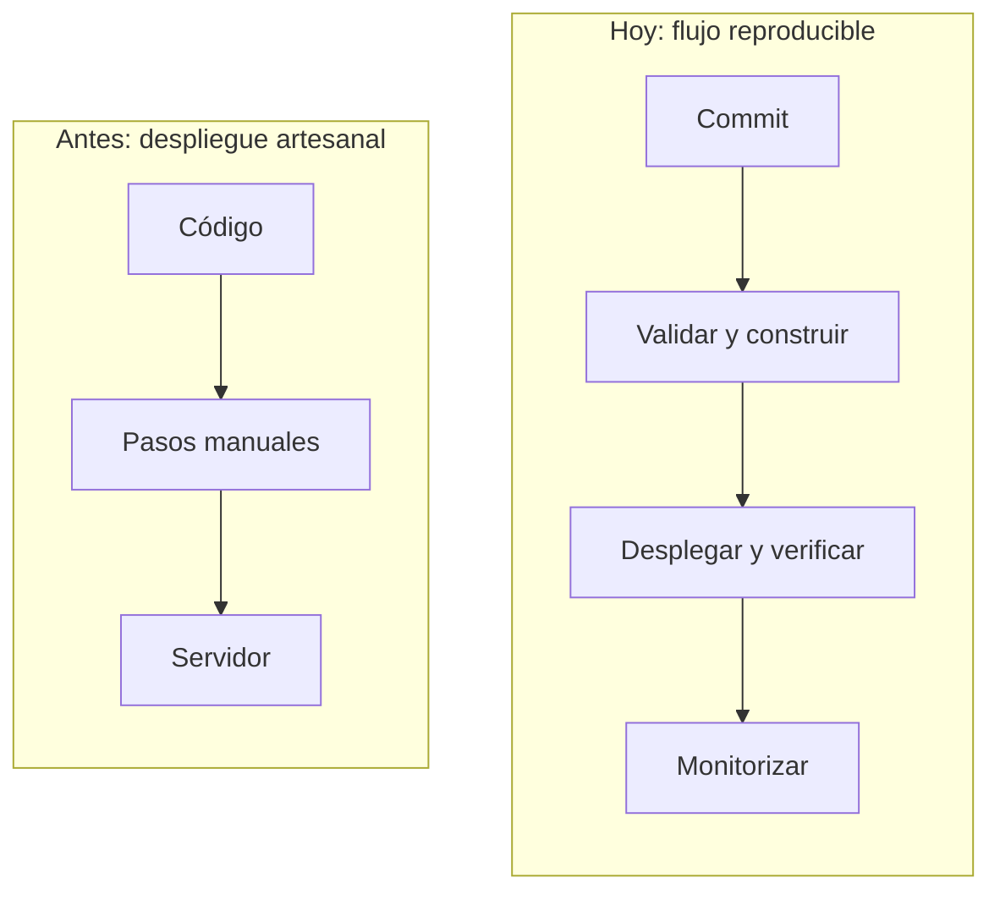
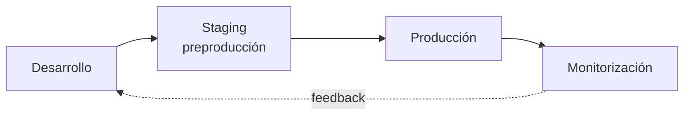
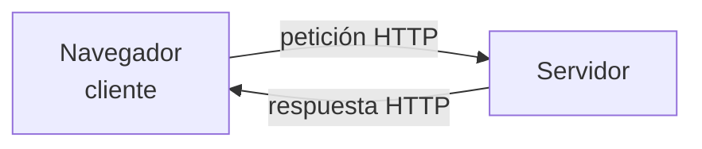
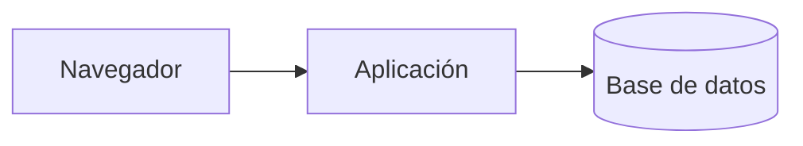
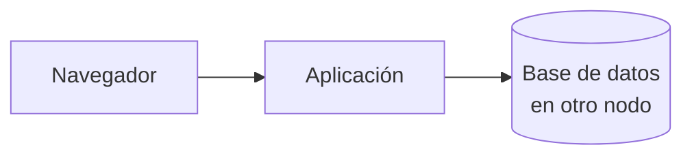
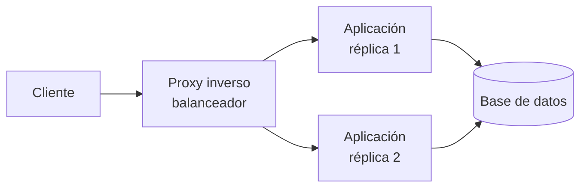
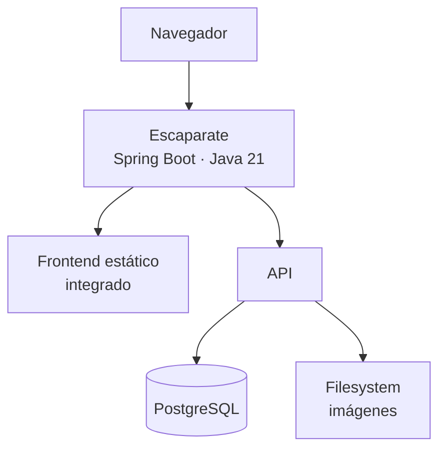
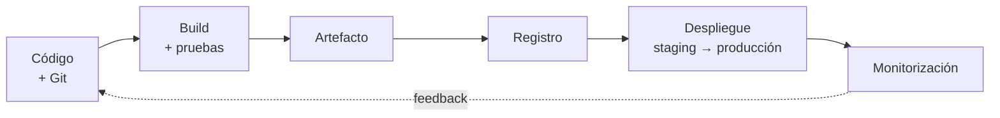

# 🚀 Arquitecturas web y proceso de despliegue

!!! info "Descarga de diapositivas"
    [Descarga las diapositivas](diapositivas/arquitecturas-despliegue.pptx){target="_blank" rel="noopener"}

---

En primero aprendiste a programar, trabajar con bases de datos y construir aplicaciones. En segundo, seguirás desarrollando frontend y backend en otros módulos. Sin embargo, en el módulo de Despliegue de Aplicaciones Web el foco cambia: **una aplicación no está terminada cuando funciona en tu ordenador, sino cuando puede ejecutarse de forma fiable para otras personas**.

Desplegar no es "subir archivos a un servidor". Significa preparar todo lo necesario para que una aplicación pueda arrancar, conectarse a sus datos, recibir configuración, proteger sus secretos, responder por red, soportar fallos, actualizarse y dejar pistas cuando algo va mal.

Ese es el problema que recorre todo el módulo.

---

## 🕰️ 1. Del despliegue artesanal al despliegue reproducible

Hace años era habitual que muchos proyectos pequeños se publicaran mediante procedimientos muy manuales: compilar en el equipo del desarrollador, copiar ficheros por FTP, modificar la configuración directamente en el servidor y comprobar después si todo seguía funcionando.

Ese modelo sigue existiendo, pero cuanto más crecen una aplicación, un equipo o el número de despliegues, más problemas aparecen:

- pasos que solo conoce una persona;
- servidores configurados de forma distinta;
- versiones difíciles de identificar;
- errores humanos al repetir tareas;
- actualizaciones que producen interrupciones;
- pruebas que se hacen demasiado tarde;
- dificultad para saber qué cambió cuando algo falla.

El despliegue moderno intenta convertir ese procedimiento artesanal en un **proceso reproducible, trazable y progresivamente automatizado**.



!!! note "Una comparación deliberadamente simplificada"
    No significa que antes todo se hiciera por FTP ni que hoy todas las empresas utilicen Kubernetes, microservicios o nube pública. La tendencia importante es otra: **el camino entre escribir código y ponerlo delante de usuarios se ha convertido en una parte explícita del producto, versionada, comprobable y cada vez más automatizada**.

Esta evolución también explica por qué desarrollo y operaciones ya no pueden vivir completamente separados. Quien escribe una aplicación debe entender cómo se ejecutará, cómo recibirá configuración, cómo se comprobará su estado y qué ocurrirá cuando falle. Esa colaboración entre desarrollo, operaciones, automatización y feedback continuo es parte de la cultura que suele agruparse bajo el término **DevOps**.

---

## 🎯 2. Qué queremos conseguir cuando desplegamos

El objetivo no es simplemente que la página "se abra". Un buen despliegue debería reunir varias propiedades:

| Propiedad | Qué significa |
|---|---|
| **Reproducible** | Dos personas pueden seguir el mismo procedimiento y obtener un resultado equivalente. |
| **Trazable** | Podemos saber qué versión está funcionando, quién la cambió y cómo llegó hasta allí. |
| **Configurable** | El mismo artefacto puede ejecutarse en distintos entornos cambiando la configuración externa. |
| **Seguro** | Los secretos no viajan en el código y solo se exponen los servicios necesarios. |
| **Observable** | Podemos saber si funciona, cuánto tarda y por qué falla sin adivinar. |
| **Escalable** | Podemos aumentar capacidad cuando la carga lo exige. |
| **Actualizable** | Podemos publicar una versión nueva de forma controlada y volver atrás si algo sale mal. |

A lo largo del módulo irás construyendo estas propiedades una por una.

---

## 🌍 3. Desarrollo, staging y producción

Una misma aplicación suele pasar por varios **entornos**. El código puede ser el mismo, pero cambian los datos, las credenciales, los nombres de host, los recursos disponibles y el nivel de exigencia.

| Entorno | Para qué sirve | Ejemplo |
|---|---|---|
| **Desarrollo** | Trabajar rápido y probar cambios | PostgreSQL local, datos de ejemplo |
| **Staging / preproducción** | Validar una versión en condiciones parecidas a producción | Servicios de prueba, configuración casi real |
| **Producción** | Dar servicio a usuarios reales | Datos reales, seguridad y disponibilidad exigentes |



Una regla te acompañará todo el curso:

> **El artefacto de la aplicación debería ser el mismo en todos los entornos. Lo que cambia es la configuración que se le proporciona desde fuera.**

Si para pasar de desarrollo a producción necesitas modificar el código o recompilar con una contraseña distinta, el despliegue se vuelve frágil.

---

## 🌐 4. Todo empieza con una petición

El modelo **cliente-servidor** es la base de la web. Un cliente, normalmente un navegador, inicia una petición y un servidor responde.



Lo que el servidor devuelve puede tener dos naturalezas distintas:

| | Contenido estático | Contenido dinámico |
|---|---|---|
| **Qué es** | Un fichero que ya existe: HTML, CSS, JS, imagen... | Una respuesta que se genera al recibir la petición |
| **Quién lo sirve** | Servidor web, almacenamiento de objetos, CDN... | Un runtime que ejecuta código: Java, PHP, Node... |
| **Trabajo por petición** | Leer y entregar | Aplicar lógica, consultar datos, construir la respuesta |
| **¿Hay que ejecutar lógica para producirlo?** | No | Sí |

La diferencia importante no es si el contenido "cambia", sino **si hay que ejecutar lógica para producir la respuesta**.

Separar contenido estático y dinámico permite que cada parte sea atendida por la pieza más adecuada. Más adelante servirás estáticos con un servidor web y también estudiarás cómo pueden distribuirse desde otros servicios.

---

## 🧱 5. Capas lógicas y unidades de despliegue

Cuando hablamos de **capas** describimos responsabilidades lógicas:

```text
presentación
lógica de negocio
datos
```

Eso no determina automáticamente cuántas máquinas, contenedores o servicios hacen falta.

Una aplicación con tres capas puede ejecutarse entera en un ordenador:



o distribuir sus componentes:



!!! info "Cómo leer los diagramas de este módulo"
    Cada caja representa una **unidad o componente desplegado de forma independiente**, no necesariamente una máquina física. Puede ejecutarse en una máquina física, una máquina virtual, un contenedor, un servicio PaaS o un servicio administrado. Varias unidades pueden incluso compartir el mismo host.

Cuando el sistema crece aparecen más piezas:



Cada nueva pieza puede mejorar una propiedad concreta, como seguridad, disponibilidad o rendimiento, pero también aumenta el coste y la complejidad operativa.

!!! tip "La regla del despliegue"
    No existe una arquitectura universalmente mejor. Una solución es buena cuando su complejidad es proporcional al problema que resuelve.

---

## 🧩 6. Monolito o microservicios

Esta decisión es distinta de separar capas.

Las capas indican **qué responsabilidades existen**. Monolito y microservicios indican **en cuántas unidades independientes se divide y despliega la lógica de negocio**.

Una aplicación **monolítica** se construye y despliega como una unidad. Una arquitectura de **microservicios** divide la lógica en servicios autónomos que pueden tener ciclos de despliegue y escalado independientes.

| | Monolito | Microservicios |
|---|---|---|
| **Desplegar un cambio pequeño** | Se despliega la aplicación completa | Puede desplegarse solo el servicio afectado |
| **Escalar una función concreta** | Se replica todo el monolito | Puede escalarse solo ese servicio |
| **Depurar un fallo** | Menos procesos y comunicaciones | Logs y trazas repartidos entre servicios |
| **Complejidad operativa** | Menor | Mucho mayor |
| **Cuándo encaja** | Equipos pequeños o medianos, producto joven | Sistemas grandes con dominios y equipos realmente independientes |

!!! warning "Moderno no significa microservicios"
    Un monolito bien modularizado sigue siendo una solución perfectamente actual. Dividir un sistema en microservicios introduce red, fallos parciales, observabilidad distribuida, coordinación de datos y más infraestructura. Solo compensa cuando existe un problema que justifica ese coste.

También existen otros modelos, como PaaS, serverless o arquitecturas orientadas a eventos. Los irás encontrando en otros contextos, pero no necesitas dominarlos ahora para aprender a desplegar.

!!! info "Conexión con la práctica"
    Antes de construir infraestructura conviene aprender a **observar un sistema desplegado y separar evidencias de suposiciones**. Las peticiones HTTP, sus cabeceras y la diferencia entre contenido estático y dinámico serán las primeras herramientas para hacerlo.

---

## 📨 7. HTTP: el idioma del diagnóstico

HTTP no solo sirve para programar APIs. Para quien despliega una aplicación es también una herramienta de diagnóstico.

Una petición contiene:

```text
método + ruta + cabeceras + cuerpo opcional
```

y una respuesta:

```text
código de estado + cabeceras + cuerpo
```

Los códigos proporcionan una primera pista:

| Familia | Orientación inicial |
|---|---|
| `2xx` | La petición ha sido atendida correctamente |
| `3xx` | El cliente debe continuar en otro destino |
| `4xx` | Hay un problema con la petición, el recurso o el acceso |
| `5xx` | El servidor o algún componente intermedio no ha podido responder correctamente |

!!! warning "Es una pista, no una sentencia"
    Un `404` puede ser una URL mal escrita, pero también un despliegue que no copió un recurso. Un `403` puede deberse a permisos mal configurados. Los códigos ayudan a decidir dónde empezar a investigar.

Con `curl` puedes observar una respuesta sin depender del navegador:

```bash
curl -I https://ejemplo.org
```

Una salida posible sería:

```text
HTTP/2 200
server: nginx
content-type: text/html; charset=UTF-8
cache-control: max-age=3600
strict-transport-security: max-age=31536000
```

Las cabeceras pueden revelar qué servidor responde, qué contenido entrega, qué política de caché aplica o si el navegador debe utilizar siempre HTTPS.

HTTP además es **stateless**: cada petición es independiente. Esta propiedad parece sencilla mientras hay una única instancia, pero se vuelve importante cuando aparezcan varias réplicas y haya que decidir dónde guardar el estado de una sesión.

---

## 📦 8. De qué está hecho realmente un despliegue

Como programador puedes pensar que "la aplicación" es el proyecto de tu IDE. Para desplegarla necesitas distinguir varias piezas:

| Pieza | Qué es | Qué necesita al desplegar |
|---|---|---|
| **Estáticos** | HTML, CSS, JS, imágenes del frontend | Un servicio capaz de entregarlos por HTTP |
| **Artefacto y runtime** | WAR/JAR, binario, paquete + Java, Node, PHP... | Un proceso capaz de ejecutarlo y reiniciarlo |
| **Datos** | Información persistente | Almacenamiento estable, copias y acceso restringido |
| **Configuración** | Hosts, puertos, rutas, modo de ejecución | Poder cambiar sin recompilar |
| **Secretos** | Contraseñas, tokens, certificados | Permanecer fuera del código y del repositorio |

Las dos últimas piezas son especialmente importantes.

Si la dirección de PostgreSQL está escrita dentro del código, tendrás que modificar o recompilar la aplicación para cambiar de entorno. Si una contraseña entra en Git, borrarla del fichero después no garantiza que haya desaparecido del historial.

!!! warning "Una regla para todo el curso"
    **El paquete de la aplicación debe ser independiente del entorno.** La configuración y los secretos se proporcionan desde fuera cuando la aplicación arranca.

---

## 🛍️ 9. Escaparate: el hilo conductor del módulo

### 9.1. Arquitectura inicial de Escaparate

Durante el curso desplegarás una aplicación llamada **Escaparate**, un pequeño catálogo de productos. La aplicación está deliberadamente hecha para que el problema interesante no sea programarla, sino desplegarla.

Al principio del módulo utilizarás su distribución integrada:



En esta primera versión:

- el frontend está formado por HTML, CSS y JavaScript, pero se sirve desde la propia aplicación Spring Boot;
- frontend y API salen inicialmente del **mismo contenedor y del mismo puerto**;
- el backend se empaqueta como `escaparate.war`;
- los datos viven en PostgreSQL;
- las imágenes subidas se almacenan inicialmente en el filesystem;
- la configuración de base de datos y almacenamiento puede recibirse desde fuera.

Más adelante utilizarás otras distribuciones para estudiar qué ocurre cuando algunas piezas se despliegan por separado. Separar el frontend no convierte a Escaparate en microservicios: la lógica de negocio seguirá siendo un único monolito.

### 9.2. Endpoints para observar el sistema

Escaparate incluye además endpoints que existen para ayudarte a estudiar el despliegue:

| Endpoint | Para qué sirve |
|---|---|
| `/api/salud/vivo` | Indica si el proceso está vivo |
| `/api/salud/listo` | Comprueba si la aplicación está preparada para trabajar |
| `/api/instancia` | Permite saber qué instancia ha respondido |
| `/api/carga?ms=...` | Genera carga de CPU de forma controlada |

Los utilizarás más adelante para comprobar readiness, balanceo, escalado y comportamiento ante carga.

---

## 🔄 10. Del código al usuario

La aplicación no salta directamente desde el editor hasta producción. El recorrido moderno se parece más a esto:



No vas a automatizar todo esto en la primera semana. El propósito de este esquema es que puedas ubicar cada herramienta cuando aparezca:

- Git da trazabilidad al código y a la configuración.
- Docker ayuda a empaquetar de forma reproducible.
- Un registry distribuye las imágenes.
- Nginx puede actuar como servidor web, proxy o balanceador.
- TLS protege las comunicaciones.
- Logs y métricas permiten observar el sistema.
- CI valida y construye automáticamente.
- CD automatiza la publicación y el despliegue.
- Kubernetes declara y mantiene el estado deseado de un conjunto de contenedores.

---

## 🚚 11. Qué falta para sacar Escaparate de tu ordenador

Imagina que hoy te piden poner Escaparate en producción. Tienes el código y una máquina conectada a Internet. Todavía faltan muchas cosas:

1. Que el código y el **procedimiento de despliegue** estén versionados y documentados.
2. Que la aplicación se ejecute con **versiones y dependencias reproducibles**.
3. Que **configuración y secretos** estén fuera del artefacto y del repositorio.
4. Que responda con un **nombre**, por los puertos adecuados, y que los recursos web se sirvan correctamente.
5. Que pueda existir un **punto de entrada** capaz de dirigir y repartir tráfico.
6. Que las comunicaciones estén **cifradas** y los servicios internos no queden expuestos innecesariamente.
7. Que puedas saber **qué está ocurriendo** mediante estado, logs y métricas.
8. Que puedas medir disponibilidad y rendimiento y entender qué limita al sistema.
9. Que construir, comprobar, publicar, desplegar y volver atrás sea cada vez más **automático**.
10. Que varias instancias puedan ser **orquestadas**, reemplazadas y actualizadas progresivamente.

Cada punto tiene su lugar en el curso:

| Problema | Dónde se trabaja |
|---|---|
| 1 · Versionado y documentación | Sesión 2 |
| 2 · Contenedores, imágenes y despliegue reproducible | Sesiones 3 a 5 |
| 3 · Configuración y secretos externos | Sesión 5 y refuerzos posteriores |
| 4 · Servidor web y nombres | Sesión 6 |
| 5 · Proxy inverso y balanceo | Sesión 7 |
| 6 · HTTPS y endurecimiento | Sesión 8 |
| 7 · Observabilidad | Sesión 9 |
| 8 · Servidores de aplicaciones y rendimiento | Sesiones 10 y 11 |
| 9 · CI, CD y rollback | Sesiones 12 y 13 |
| 10 · Kubernetes local, rolling updates y nube | Sesiones 14 a 16 |

Ese es el mapa del módulo:

```text
manual
  ↓
reproducible
  ↓
automatizado
  ↓
orquestado
```

---

## 🎯 Qué debes saber hacer al salir de esta sesión

Al terminar esta primera sesión deberías poder:

- explicar qué significa desplegar una aplicación y por qué no equivale a que "funcione en mi ordenador";
- distinguir contenido estático y dinámico;
- entender que las capas lógicas de una aplicación no determinan cuántas máquinas o servicios necesita;
- interpretar códigos y algunas cabeceras HTTP como primeras pistas de diagnóstico;
- identificar las cinco piezas básicas de un despliegue: estáticos, artefacto/runtime, datos, configuración y secretos;
- distinguir entre lo que puedes observar desde fuera, lo que puedes inferir y lo que no puedes conocer sin acceso al sistema.

---

## ✅ Ideas clave

??? tip "Abrir resumen"

    - Una aplicación que solo funciona en el equipo del desarrollador todavía no está desplegada.
    - El despliegue moderno intenta sustituir procedimientos manuales por procesos reproducibles, trazables y progresivamente automatizados.
    - Desarrollo, staging y producción son entornos distintos. El artefacto debería mantenerse; la configuración cambia.
    - Un buen despliegue debe ser reproducible, trazable, configurable, seguro, observable, escalable y actualizable.
    - Las capas separan responsabilidades; las unidades de despliegue indican dónde y cómo se ejecutan los componentes.
    - Monolito no significa antiguo y microservicios no significa automáticamente mejor.
    - HTTP es también una herramienta de diagnóstico: códigos y cabeceras ayudan a localizar problemas.
    - Un despliegue incluye estáticos, artefacto/runtime, datos, configuración y secretos.
    - Configuración y secretos no deben quedar incorporados al artefacto.
    - Escaparate comienza como un monolito integrado con frontend y API en Spring Boot, PostgreSQL y almacenamiento de imágenes en filesystem.
    - El camino completo va desde código y repositorio hasta build, pruebas, artefacto, despliegue, verificación y monitorización.
    - El módulo avanza desde procedimientos manuales hacia despliegues reproducibles, automatizados y finalmente orquestados.
    - Observar no es lo mismo que inferir: una buena diagnosis distingue la evidencia de aquello que solo parece probable.

---

En la primera actividad aplicarás este mapa a sistemas ya desplegados: observarás lo que exponen y distinguirás entre **evidencia, inferencia y aspectos que no pueden conocerse desde fuera**.
