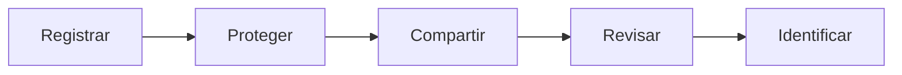
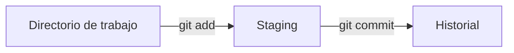
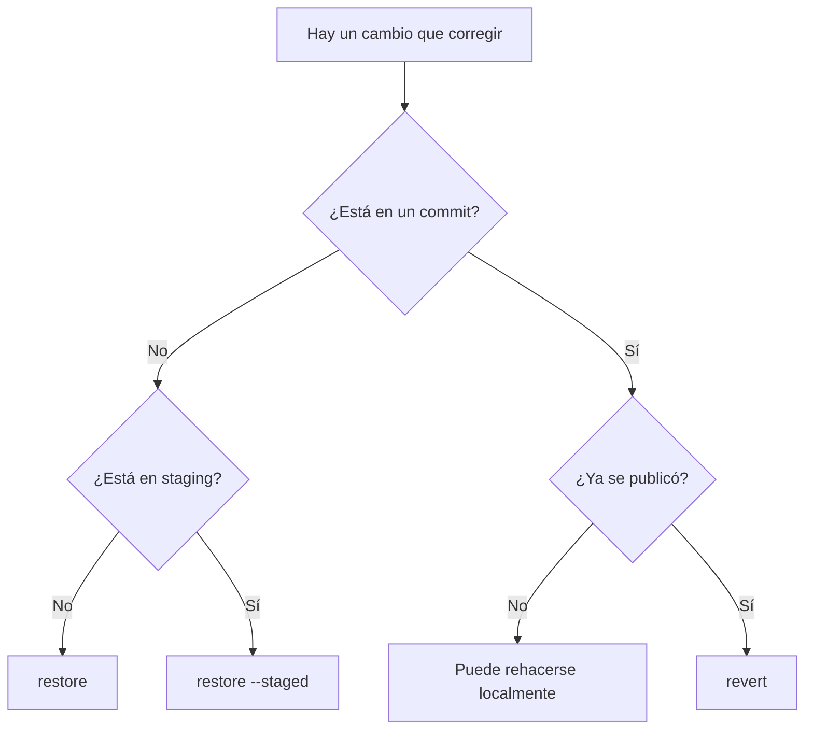
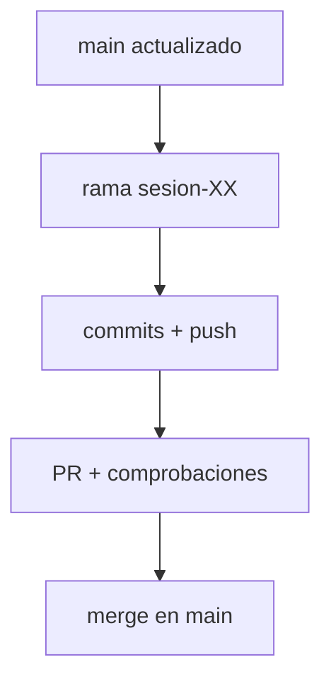
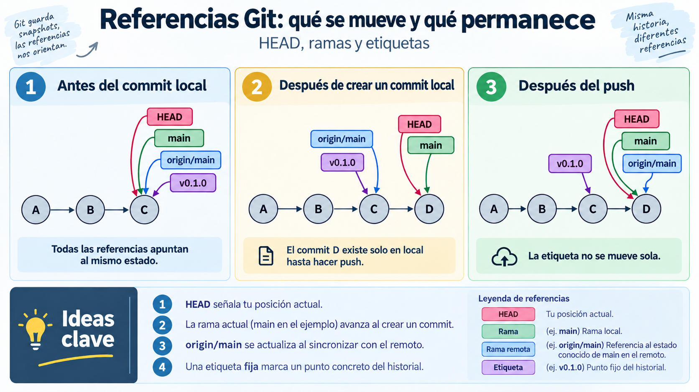

# 🧩 Control de versiones y documentación

!!! info "Descarga de diapositivas"
    <!-- [Descarga las diapositivas](diapositivas/control-versiones-documentacion.pptx){target="_blank" rel="noopener"} -->

---

La sesión anterior terminó con una idea importante: un despliegue profesional no puede depender de **los ficheros que casualmente tenemos en un ordenador** ni de una lista de pasos que solo recuerda una persona.

Antes de contenerizar, automatizar o publicar una aplicación necesitamos una **fuente de verdad** donde queden registrados el código, la configuración que sí puede compartirse, la documentación y el procedimiento de trabajo.

Ese lugar será el repositorio Git.

> **El repositorio debe permitir reconstruir y explicar un estado desplegable del sistema.**

Eso no significa guardar todo en Git. Los secretos, los datos generados y los artefactos reconstruibles deben permanecer fuera. En esta sesión aprenderás a decidir **qué se versiona, cómo evoluciona y cómo se comparte sin perder trazabilidad**.

!!! abstract "Mapa de la sesión"
    El trabajo seguirá una progresión sencilla: **registrar → proteger → compartir → revisar → identificar versiones**.



---

## 🧠 1. Git registra estados, no copias de carpetas

Git permite conservar la evolución de un conjunto de ficheros. Cada commit identifica un estado del proyecto y queda relacionado con los estados anteriores.

Esto nos interesa especialmente en despliegue porque no solo versionaremos código: también aparecerán documentación, configuración reproducible y ficheros que describen cómo ejecutar o publicar la aplicación.

### 1.1. Directorio de trabajo, staging e historial

Entre editar un fichero y registrarlo en el historial existe una zona intermedia: el **área de preparación** o *staging area*.



| Zona | Qué contiene | Operación habitual |
|---|---|---|
| **Directorio de trabajo** | El estado actual de los ficheros | editar |
| **Staging** | Los cambios elegidos para el próximo commit | `git add` |
| **Historial** | Los estados ya registrados | `git commit` |

La preparación permite decidir qué cambios forman parte del siguiente commit. Si has modificado tres ficheros, no estás obligado a registrarlos todos juntos.

Por ejemplo:

```bash
git add README.md docs/instalacion.md
git status
```

Solo esos cambios preparados entrarán en el próximo commit.

!!! tip "Acostúmbrate a `git status`"
    Utilízalo antes y después de `git add` y antes de cada commit. Git registra lo que has preparado, no lo que recuerdas haber modificado.

### 1.2. Un commit debe representar una idea

Un commit útil debería responder a una intención concreta. En el módulo utilizaremos una convención sencilla inspirada en *Conventional Commits*:

| Prefijo | Uso habitual |
|---|---|
| `feat:` | añade funcionalidad |
| `fix:` | corrige un error |
| `docs:` | modifica documentación |
| `test:` | añade o modifica pruebas |
| `chore:` | mantenimiento o configuración |

Ejemplos:

```text
docs: añade instrucciones de arranque
fix: corrige la ruta de almacenamiento
chore: configura variables de desarrollo
```

Mensajes como `cambios`, `final` o `arreglo2` hacen que el historial pierda utilidad.

Puedes inspeccionarlo con:

```bash
git log --oneline
git show <commit>
```

!!! info "Git no versiona directorios vacíos"
    Git registra ficheros. Si una carpeta está vacía, no existe nada que añadir al historial. Por eso algunos proyectos utilizan un fichero convencional como `.gitkeep` cuando necesitan conservar una estructura vacía.

---

## 🚫 2. Decide qué entra antes de hacer el primer commit

Un repositorio útil contiene aquello que necesitamos **conservar, revisar y reconstruir**. No debe convertirse en una copia indiscriminada del directorio de trabajo.

### 2.1. `.gitignore`: excluir lo que no debe versionarse

Las exclusiones más habituales pertenecen a tres grupos:

| Tipo | Ejemplos | Por qué queda fuera |
|---|---|---|
| **Artefactos reconstruibles** | `target/`, `.class` | pueden volver a generarse |
| **Configuración local** | `.idea/`, `.vscode/`, `*.iml` | depende del equipo |
| **Secretos o datos locales** | `.env`, claves, `uploads/` | no deben publicarse o no forman parte del código |

Las reglas se escriben en `.gitignore`:

```gitignore
# Maven / Java
target/
*.class

# IDE
.idea/
.vscode/
*.iml

# Variables locales y secretos
.env
.env.*
!.env.example

# Datos generados
uploads/
```

Para saber qué regla está ignorando una ruta:

```bash
git check-ignore -v ruta/al/fichero
```

!!! warning "No ignores demasiado"
    Un fichero de configuración no es automáticamente un secreto y un `.jar` no es automáticamente prescindible. Excluye aquello que sabes que es local, generado o sensible.

Un repositorio puede contener varios `.gitignore`. Las reglas de uno situado dentro de una carpeta pueden complementar las reglas generales de la raíz.

### 2.2. `.gitignore` no borra el historial

Añadir un fichero a `.gitignore` **no elimina lo que ya se registró antes**.

Si un fichero ya está versionado y solo quieres dejar de seguirlo:

```bash
git rm --cached .env
git commit -m "chore: deja de versionar la configuración local"
```

Pero si ese fichero contenía una contraseña o un token real, el problema es distinto:

> **Un secreto publicado debe considerarse comprometido y debe revocarse o cambiarse.**

Borrarlo en un commit posterior no impide que siga existiendo en commits anteriores o en clones realizados antes.

La forma habitual de documentar la configuración necesaria sin publicar valores reales es versionar una plantilla:

```text
.env           no se versiona
.env.example   sí se versiona
```

Por ejemplo:

```dotenv
DB_HOST=bd
DB_NAME=escaparate
DB_USER=cambia-este-valor
DB_PASSWORD=cambia-este-valor
```

!!! warning "Evita repositorios Git anidados"
    Si incorporas un proyecto dentro de otro repositorio, comprueba que no conserva accidentalmente su propio directorio `.git/`. En este módulo queremos un único historial para el repositorio completo.

En Linux puedes localizar repositorios anidados con:

```bash
find . -name .git -type d -print
```

---

## 🧯 3. Deshacer: primero identifica dónde está el cambio

No existe un único comando para “deshacer”.

Antes de actuar responde dos preguntas:

1. ¿El cambio está en el **directorio de trabajo**, en **staging** o en un **commit**?
2. Si está en un commit, ¿ese commit **ya se ha publicado**?



### 3.1. Cambios que todavía no forman parte del historial compartido

Si has modificado un fichero, no lo has preparado y quieres recuperar la versión del último commit:

```bash
git restore README.md
```

!!! danger "El cambio sin registrar se pierde"
    `git restore` descarta esas modificaciones. Git no puede recuperar algo que nunca llegó a registrarse.

Si el fichero ya está en staging pero quieres conservar lo escrito:

```bash
git restore --staged README.md
```

El fichero seguirá modificado, pero dejará de formar parte del próximo commit.

También puedes recuperar un fichero desde otro punto del historial:

```bash
git restore --source=<commit> README.md
```

Si necesitas rehacer un commit que **todavía es únicamente local**, Git permite modificar ese historial. Por ejemplo:

```bash
git reset --soft HEAD~1
```

!!! info "`reset` queda como operación de consulta"
    No necesitas utilizarlo en la actividad de hoy. Lo importante es comprender que un commit local puede rehacerse antes de compartirlo.

### 3.2. Un error ya publicado se corrige hacia delante

Si el commit erróneo ya está en el remoto, normalmente no conviene hacerlo desaparecer reescribiendo un historial que otras personas pueden haber descargado.

Supón:

```text
A --- B --- C
          error
```

Con:

```bash
git revert C
```

obtienes:

```text
A --- B --- C --- D
                  revierte C
```

El commit original sigue existiendo y queda registrada también su corrección.

> **Error privado y local: puedes rehacer.  
> Error publicado y compartido: corrige hacia delante.**

| Situación | Operación habitual |
|---|---|
| Cambio no preparado que quieres descartar | `git restore <fichero>` |
| Fichero preparado que quieres conservar | `git restore --staged <fichero>` |
| Recuperar un fichero desde otro commit | `git restore --source=<commit> <fichero>` |
| Rehacer el último commit todavía local | `git reset --soft HEAD~1` |
| Deshacer el efecto de un commit ya publicado | `git revert <commit>` |

---

## ☁️ 4. Del repositorio local a GitHub

Hasta ahora el historial existe únicamente en tu equipo. Un **repositorio remoto** permite compartirlo y será durante el módulo el punto común desde el que se revisará el trabajo.

### 4.1. Autenticación por HTTPS

GitHub permite trabajar con repositorios mediante SSH o HTTPS. En este módulo utilizaremos **HTTPS**.

Cuando Git necesita autenticarse contra GitHub por HTTPS, no se utiliza la contraseña normal de la cuenta. Puede utilizarse una credencial como un **Personal Access Token (PAT)**.

Un PAT:

- puede tener caducidad;
- puede limitar sus permisos;
- puede revocarse sin cambiar la contraseña de la cuenta.

!!! danger "Un PAT es un secreto"
    No lo escribas en el repositorio, no lo incluyas en capturas y no lo guardes en un fichero versionado. Si se publica accidentalmente, revócalo y crea uno nuevo.

!!! info "Simplificación utilizada en el aula"
    Durante las primeras sesiones utilizaremos un único **PAT classic** con los ámbitos necesarios para trabajar con el repositorio privado y publicar posteriormente imágenes en GitHub Container Registry:

    ```text
    repo
    workflow
    write:packages
    ```

    Esta decisión reduce el número de credenciales que tendrás que gestionar, pero el ámbito `repo` es amplio.

!!! info "En un entorno profesional: mínimo privilegio"
    Siempre que sea viable conviene limitar cada credencial a los repositorios y permisos estrictamente necesarios. Una alternativa más restrictiva sería utilizar un token *fine-grained* para Git y una credencial separada para el registro de contenedores.

Aunque reutilicemos el mismo token, **Git y Docker no comparten una sesión**: Git se autenticará contra `github.com` y Docker, más adelante, contra `ghcr.io`.

### 4.2. Remoto y sincronización

Si partes de una carpeta nueva, puedes crear el repositorio local haciendo que la rama principal se llame `main` desde el principio:

```bash
mkdir daw-despliegue
cd daw-despliegue
git init -b main
```

Después crea en GitHub un repositorio **vacío** y configura el remoto:

```bash
git remote add origin https://github.com/usuario/daw-despliegue.git
git remote -v
```

Publica `main`:

```bash
git push -u origin main
```

`-u` asocia la rama local con su rama remota. Después normalmente bastará con:

```bash
git push
```

`fetch` y `pull` no hacen exactamente lo mismo:

| Operación | Qué hace |
|---|---|
| `git fetch` | actualiza la información conocida del remoto sin modificar tu rama actual |
| `git pull` | descarga e intenta integrar los cambios |
| `git pull --ff-only` | actualiza solo si la rama puede avanzar sin crear una fusión inesperada |

Durante el curso utilizaremos con frecuencia:

```bash
git pull --ff-only
```

!!! info "Repositorio privado"
    El repositorio del curso será privado. Para que el profesor pueda revisarlo tendrás que añadirlo como colaborador. Antes de hacer público cualquier repositorio revisa siempre el historial, secretos, claves, datos personales y capturas.

---

## 🌿 5. Ramas, Pull Requests y comprobaciones

Trabajar directamente sobre `main` dificulta separar cambios incompletos del último estado integrado. Por eso utilizaremos **ramas cortas** para el trabajo de cada sesión.

> **En este módulo, `main` representa el último estado integrado que consideramos desplegable.**

No significa que esté desplegado en producción en ese momento; significa que evitaremos integrar deliberadamente trabajo incompleto o roto.

### 5.1. El flujo habitual del módulo



Para empezar una sesión:

```bash
git switch main
git pull --ff-only
git switch -c sesion-XX
```

Después de trabajar:

```bash
git status
git add <ficheros>
git commit -m "docs: documenta la sesión"
git push -u origin sesion-XX
```

### 5.2. La Pull Request es el punto de revisión

Una **Pull Request (PR)** propone incorporar los cambios de una rama en otra. Permite revisar:

- qué commits entrarán;
- qué ficheros y líneas cambian;
- por qué se realizó el cambio;
- qué comprobaciones se han hecho;
- si las comprobaciones automáticas han terminado correctamente.

Una descripción sencilla puede responder a tres preguntas:

```markdown
## Qué cambia
Se añade la documentación de la sesión.

## Por qué
El repositorio debe permitir reproducir el procedimiento.

## Cómo se ha comprobado
Se han revisado los cambios y los enlaces del README.
```

!!! tip "Documenta el propósito"
    En una PR interesa explicar qué cambia, por qué y cómo se ha comprobado. No hace falta narrar cada `git add` o `git push`.

Una PR abierta **sigue la evolución de la rama**. Si haces otro commit y lo publicas, la misma PR se actualiza automáticamente.

GitHub también puede ejecutar comprobaciones automáticas mediante **GitHub Actions**. Estos workflows se guardan dentro de `.github/workflows/`. Durante las primeras sesiones utilizarás uno ya preparado; de momento basta con saber:

```text
push a la rama
      ↓
Pull Request
      ↓
comprobaciones automáticas
      ↓
revisar el resultado
      ↓
fusionar solo si el estado es correcto
```

Más adelante estudiaremos cómo construir estas automatizaciones.

### 5.3. Fusionar y volver a `main`

En el módulo utilizaremos **Create a merge commit** cuando queramos conservar de forma visible la bifurcación y la integración de la rama.

Después de fusionar la PR en GitHub:

```bash
git switch main
git pull --ff-only
```

Puedes observar el historial con:

```bash
git log --graph --oneline --all --decorate
```

---

## 🏷️ 6. Ramas, referencias y versiones

Una rama y una versión no representan lo mismo.

Una **rama** avanza a medida que aparecen nuevos commits. Una **etiqueta** permite identificar un punto concreto del historial aunque la rama siga avanzando.

### 6.1. `HEAD`, `main`, `origin/main` y las etiquetas

En Git, varios nombres pueden señalar al mismo commit y después **evolucionar de forma distinta**. Entender qué representa cada referencia ayuda a saber qué tienes en local, qué estado conoces del remoto y qué versión has decidido conservar como punto estable.



*Figura 4. Comportamiento de `HEAD`, `main`, `origin/main` y una etiqueta antes y después de crear y publicar un commit. Elaboración propia.*

En el ejemplo, al principio todas las referencias apuntan al commit `C`. Cuando creas un nuevo commit `D`:

- `main`, que es la rama actual, **avanza hasta `D`**;
- `HEAD` continúa asociado a `main`, por lo que también queda situado en ese nuevo estado;
- `origin/main` sigue representando el último estado conocido de `main` en el remoto;
- la etiqueta `v0.1.0` permanece en `C`.

Cuando publicas el cambio con `push`, el remoto avanza y `origin/main` pasa a reflejar ese nuevo estado. La etiqueta, en cambio, **no se mueve automáticamente**.

!!! tip "Qué debes retener"
    - **`HEAD`** indica dónde estás trabajando.
    - **`main`** es una rama local y avanza cuando haces nuevos commits sobre ella.
    - **`origin/main`** representa el estado conocido de `main` en el remoto.
    - Una **etiqueta** identifica un punto concreto del historial y permanece allí hasta que la cambies deliberadamente.

### 6.2. Etiquetas y versionado semántico

Para crear una etiqueta anotada:

```bash
git tag -a v0.1.0 -m "Primer estado identificable del repositorio"
git push origin v0.1.0
```

Comprueba:

```bash
git tag -n
git show v0.1.0 --no-patch
```

Cuando una aplicación utiliza versionado semántico, una versión suele expresarse como:

```text
MAYOR.MENOR.PARCHE
```

| Parte | Cuándo cambia |
|---|---|
| **MAYOR** | cambios incompatibles |
| **MENOR** | nueva funcionalidad compatible |
| **PARCHE** | corrección compatible |

Ejemplos:

```text
1.4.2 → 1.4.3   corrección
1.4.2 → 1.5.0   nueva funcionalidad
1.4.2 → 2.0.0   cambio incompatible
```

!!! note "La etiqueta del repositorio del curso"
    `v0.1.0` identificará un primer estado del repositorio del módulo. No tiene por qué coincidir con la versión interna de la aplicación Escaparate.

---

## 📝 7. Documentación que también se versiona

La documentación forma parte del despliegue porque explica **qué contiene el repositorio, qué necesita y cómo se trabaja con él**.

Markdown encaja bien porque es texto plano, Git puede mostrar sus cambios línea a línea y los enlaces relativos siguen funcionando cuando otra persona clona el repositorio.

### 7.1. Markdown esencial

No necesitas memorizar una sintaxis extensa. Para las prácticas del módulo bastará con unas pocas construcciones:

| Necesidad | Ejemplo |
|---|---|
| Título | `# Informe` |
| Subtítulo | `## Comprobación` |
| Lista | `- elemento` |
| Código en línea | `` `git status` `` |
| Enlace | `[Informe](docs/informe.md)` |
| Imagen | `` |

Para bloques de comandos:

````markdown
```bash
git status
git add README.md
git commit -m "docs: actualiza la documentación"
```
````

Utiliza **rutas relativas** para enlazar ficheros del propio repositorio:

```markdown
[Informe anterior](../actividad-1.1/actividad-1.1.md)


```

No utilices rutas absolutas de tu equipo, porque dejarían de funcionar al clonar el repositorio en otra máquina.

### 7.2. Un README útil

El README no es un diario de clase. Es la **puerta de entrada al repositorio**.

Una estructura inicial razonable es:

```markdown
# Nombre del proyecto

Breve explicación.

## Requisitos
Herramientas necesarias.

## Estructura del repositorio
Qué contiene cada carpeta.

## Flujo de trabajo
Cómo se utilizan las ramas y las Pull Requests.

## Puesta en marcha
Cómo ejecutar o desplegar el proyecto.

## Comprobación
Cómo saber que funciona.

## Entregas
Enlaces a la documentación de las actividades.
```

Al principio algunos apartados estarán incompletos. El README evolucionará junto con el proyecto.

Evita duplicar los ficheros técnicos dentro de la documentación. Si existe:

```text
practicas/
└── compose/
    └── compose.yaml
```

el README puede enlazar o explicar su función, pero no necesita copiar el mismo YAML en varios lugares.

Durante el módulo mantendremos una separación semejante a:

```text
daw-despliegue/
├── escaparate/     aplicación
├── practicas/      configuración y despliegues
├── entregas/       respuestas, evidencias y mediciones
└── docs/           documentación general
```

!!! tip "Fuente de verdad, no almacén de secretos"
    El repositorio debe contener la información necesaria para **entender y reconstruir** el despliegue, pero no los valores secretos ni los datos privados necesarios para ejecutarlo.

---

## 🎯 Qué debes saber hacer al salir de esta sesión

Al terminar deberías poder:

- distinguir **directorio de trabajo, staging e historial**;
- preparar cambios y crear commits con una intención clara;
- decidir qué debe quedar fuera del repositorio y comprobar reglas de `.gitignore`;
- explicar por qué un secreto publicado debe revocarse;
- elegir entre `restore`, `restore --staged` y `revert` según el estado del cambio;
- conectar un repositorio local con GitHub y trabajar mediante una rama corta;
- entender el papel de una **Pull Request** y de sus comprobaciones automáticas;
- distinguir una rama que avanza de una **etiqueta que identifica un estado**;
- documentar el repositorio con Markdown, rutas relativas y un README útil.

---

## ✅ Ideas clave

??? tip "Abrir resumen"

    - Git registra estados de ficheros y permite reconstruir su evolución.
    - El flujo básico es **directorio de trabajo → staging → commit**.
    - `git status` es la comprobación habitual antes de registrar cambios.
    - `.gitignore` evita nuevas incorporaciones, pero **no borra el pasado**.
    - Un secreto publicado se **revoca o cambia**; borrarlo después no elimina la exposición.
    - La forma de deshacer depende de **dónde está el cambio** y de si ya se ha compartido.
    - En el módulo trabajaremos con **rama corta → Pull Request → comprobaciones → `main`**.
    - Una rama avanza; una etiqueta permite identificar un estado concreto.
    - La documentación y la configuración reproducible forman parte del repositorio; los secretos no.

---

En la actividad aplicarás estas ideas al repositorio que utilizarás durante todo el módulo. Lo importante no será memorizar comandos aislados, sino entender **qué estado tiene el repositorio, qué información debe conservarse y qué operación mantiene mejor la trazabilidad**.
