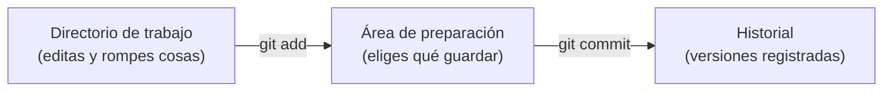

# 🧩 2. Control de versiones y documentación

!!!info "Descarga de diapositivas"
    [Descarga las diapositivas](diapositivas/control-versiones-documentacion.pptx){target="_blank" rel="noopener"}

---

La semana pasada abriste tres sitios reales con las herramientas del navegador y terminaste con una lista incómoda: para replicar cualquiera de ellos hace falta el código, sí, pero también la configuración, los ficheros estáticos, las credenciales de la base de datos y un procedimiento que ahora mismo solo está en la cabeza de alguien. Quedó una pregunta abierta: **¿dónde vive todo eso mientras no está desplegado, y cómo llega al servidor sin que se pierda nada por el camino?**

La respuesta empieza hoy. Ya usaste Git el curso pasado, así que buena parte de lo que viene te sonará. Pero conviene que sepas desde el primer minuto que aquí significa otra cosa. En programación, el repositorio es la red de seguridad del que escribe código: guarda tu trabajo y te deja volver atrás. En despliegue, el repositorio es **el origen de todo lo que se pone en marcha**: lo que está en la rama principal es lo que debería estar funcionando en el servidor, y todo lo que llegue a producción tiene que haber pasado por ahí. Un repositorio bien montado es media infraestructura; uno mal montado es un incidente esperando su turno.

---

## 🧠 Repaso exprés: las tres áreas

Git no funciona como el «guardar» de un editor de texto. Entre lo que editas y lo que queda registrado hay un paso intermedio, y esa es la pieza que más cuesta.



| Área | Qué contiene | Cómo se entra |
|---|---|---|
| Directorio de trabajo | Los ficheros tal como están ahora mismo en tu disco | Editando |
| Área de preparación (*staging*) | Los cambios que entrarán en el próximo commit | `git add` |
| Historial | Los commits ya registrados, con autor, fecha y mensaje | `git commit` |

La razón de que exista el paso intermedio es práctica: mientras arreglas una cosa acabas tocando otras dos. Si lo guardas todo junto, el historial deja de servir para lo único que importa —saber qué cambió y poder deshacerlo por separado—. El área de preparación te deja partir un revoltijo de cambios en commits con sentido.

`git status` te dice en qué área está cada fichero, y es el comando que más vas a escribir:

```bash
git init
git status
git add README.md
git commit -m "Añade el README inicial del repositorio"
git log --oneline
```

- `git init` crea el repositorio: aparece una carpeta oculta `.git/` y a partir de ese momento Git vigila el directorio.
- `git status` muestra tres bloques: lo preparado, lo modificado sin preparar y lo que Git ni siquiera sigue todavía (*untracked*).
- `git add` mueve un fichero al área de preparación. Con un nombre concreto, no con `.`, mientras estés aprendiendo a separar commits.
- `git commit -m` registra **solo lo preparado**, con un mensaje que debe decir qué cambia y para qué.
- `git log --oneline` lista el historial en una línea por commit. Los siete caracteres del principio son el identificador abreviado del commit, y los vas a necesitar para todo lo que viene después.

!!! tip "Mensajes que sirven de algo"
    Dentro de tres meses vas a leer tu propio historial buscando en qué momento se rompió el despliegue. «Cambios» y «arreglos» no te van a servir. «Corrige la ruta de las imágenes en la configuración de producción», sí.

---

## 🧯 Deshacer sin romper nada

Aquí es donde se separa quien ha usado Git de quien lo entiende. La pregunta no es «cómo deshago», sino **qué área quiero tocar y si el error ya lo ha visto alguien más**.

Con cambios que todavía no has registrado:

```bash
git restore README.md
git restore --staged README.md
git restore --source=8f3c1a2 README.md
```

- La primera forma descarta lo que hayas escrito y devuelve el fichero al estado del último commit. No hay papelera: lo descartado se pierde.
- La segunda saca el fichero del área de preparación **sin tocar tus cambios**: siguen ahí, solo que ya no entrarían en el próximo commit.
- La tercera trae ese fichero tal como estaba en un commit concreto. Aparece como modificado en tu directorio de trabajo; si quieres conservarlo, tienes que preparar y confirmar.

Con commits que ya existen, hay dos caminos y no son intercambiables:

```bash
git revert 8f3c1a2
git reset --soft HEAD~1
```

- `git revert` crea **un commit nuevo** que deshace exactamente lo que hizo el commit indicado. El historial crece y no se reescribe.
- `git reset` mueve el puntero hacia atrás y **hace desaparecer commits**. Lo que ocurre con sus cambios depende de la variante:

| Variante | ¿Adónde van los cambios del commit eliminado? | ¿Recuperable? |
|---|---|---|
| `--soft` | Al área de preparación, listos para volver a confirmar | Sí |
| `--mixed` (por defecto) | Al directorio de trabajo, sin preparar | Sí |
| `--hard` | Se borran | No |

El criterio para elegir entre uno y otro no es técnico, es social:

| Situación | Qué usar | Por qué |
|---|---|---|
| El commit está solo en tu máquina y el mensaje está mal | `git reset --soft HEAD~1` | Rehaces el commit y nadie se entera |
| El commit ya está publicado en el remoto | `git revert` | Reescribir historial publicado rompe el de los demás |
| Quieres recuperar un fichero suelto a como estaba | `git restore --source=<commit>` | No toca el historial |
| Quieres ver qué hizo un commit antes de decidir | `git show <commit>` | No modifica nada |

!!! danger "Reescribir historial publicado"
    Si haces `reset` sobre commits que ya están en el remoto, la única forma de subirlos es forzando el push. Eso borra en el servidor un trabajo que otra persona puede haberse descargado ya. En un repositorio de despliegue es todavía peor: el historial es la trazabilidad de qué versión se puso en marcha y cuándo. Cuando el error ya está publicado, se corrige hacia delante, con `revert`.

---

## ☁️ El remoto y la credencial

Un repositorio local no sirve para desplegar nada: el servidor tiene que poder descargarlo, y tú tienes que poder trabajar desde cualquier equipo del aula. Para eso está el repositorio remoto, que en este módulo vive en GitHub.

Lo primero es la credencial, y conviene resolverlo hoy porque no se puede aplazar: **GitHub no acepta tu contraseña de la web para subir código.** Tienes dos opciones.

```bash
ssh-keygen -t ed25519 -C "tu.correo@ejemplo.com"
cat ~/.ssh/id_ed25519.pub
ssh -T git@github.com
```

- El primer comando genera un par de claves: una privada que se queda en tu equipo y no sale de ahí nunca, y una pública que sí se puede repartir.
- El segundo muestra la pública, que es la que pegas en GitHub, en *Settings → SSH and GPG keys → New SSH key*.
- El tercero comprueba la conexión. Si responde saludándote por tu nombre de usuario, ya está.

La alternativa es un **token de acceso personal**: una cadena que se genera en *Settings → Developer settings → Personal access tokens*, se usa en lugar de la contraseña y se puede revocar sin cambiar nada más. Funciona igual de bien, pero hay que guardarlo en algún sitio y ese sitio nunca es el repositorio.

!!! warning "El `home` del aula"
    Si los equipos del aula borran tu carpeta personal entre sesiones, la clave privada desaparece cada viernes y tendrás que registrar una nueva. Compruébalo hoy: si es el caso, usa token, que se guarda donde tú quieras.

Con la credencial resuelta, el resto es rutina:

```bash
git remote add origin git@github.com:tu-usuario/daw-despliegue.git
git push -u origin main
git fetch
git pull
```

- `git remote add origin` guarda la dirección del repositorio remoto bajo un nombre corto. `origin` es el convenio.
- `git push -u origin main` sube tu rama por primera vez y deja anotada la correspondencia, de modo que a partir de ahí basta con `git push`.
- `git fetch` descarga lo que hay en el remoto **sin tocar tus ficheros**. Te deja mirar antes de decidir.
- `git pull` hace lo mismo y además lo integra en tu rama actual.

---

## 🌿 La rama deja de ser trabajo paralelo

El curso pasado una rama era una línea de trabajo: te la creabas para una funcionalidad, la fusionabas y la borrabas. Aquí eso sigue siendo cierto, pero se le añade un significado nuevo: **la rama es un estado del sistema**. Y la rama principal tiene un significado muy concreto que conviene decir en voz alta desde hoy:

!!! info "El convenio de este módulo"
    **En este módulo adoptamos el convenio de que `main` representa el estado desplegable**: no lo que funciona en tu portátil ni lo que casi está listo, sino lo que podría ponerse en producción ahora mismo. En muchos equipos reales se trabaja así, pero no es una ley de Git: hay proyectos con una rama por entorno, con ramas de publicación por versión o con esquemas más elaborados. Lo que sí es universal es que **alguna** rama tiene ese papel y que todo el mundo sabe cuál es.

Hay tres formas habituales de organizar esto, y te las nombro para que las reconozcas cuando te las encuentres, no para que las memorices:

| Modelo | Cómo funciona | Cuándo tiene sentido |
|---|---|---|
| Rama por entorno | Una rama permanente por entorno (`desarrollo`, `preproduccion`, `main`), y el cambio va ascendiendo | Entregas espaciadas y entornos muy distintos entre sí |
| Git-flow | Ramas permanentes de desarrollo y publicación, más ramas de funcionalidad, corrección y versión | Producto con versiones que se mantienen a la vez |
| Tronco con ramas cortas | Una sola rama permanente; el trabajo entra en ramas que viven horas o días | Entrega frecuente y automatizada |

**Este módulo usa el tercero**, que es el que domina hoy en despliegue continuo, por una razón que entenderás mejor en diciembre: cuantas más ramas permanentes tienes, más tiempo pasa entre que alguien escribe algo y ese algo se prueba junto a lo demás; y cuanto más tarda esa integración, más caro sale el conflicto.

**Este módulo trabaja así, con una rama por sesión.** El convenio es `sesion-NN`:

```bash
git switch -c sesion-02
git add entregas/tema1/
git commit -m "Documenta la actividad 1.2"
git push -u origin sesion-02
```

Cada viernes te creas la rama de la sesión, trabajas en ella, la publicas y la integras en `main` cuando la actividad está terminada. Al final del curso el historial de `main` es, literalmente, la lista ordenada de todo lo que has sido capaz de desplegar.

---

## 🔀 La pull request como punto de control

Podrías fusionar tu rama en `main` con un comando y ahorrarte todo lo que viene. La razón para no hacerlo es que la **pull request** —la petición de fusión— no es un trámite de cortesía, sino el sitio donde se decide si un cambio entra o no.

Una pull request es una propuesta: *estos commits de esta rama quieren entrar en `main`; que alguien lo mire antes*. Y a diferencia de un merge silencioso, deja constancia de cuatro cosas que un commit suelto no guarda: qué se propuso, quién lo revisó, qué se discutió y qué comprobaciones pasó.

Ese último punto es la clave del tema. Hoy, en tu repositorio, no hay nadie revisando y ninguna comprobación que pasar: eres tú abriendo una petición y tú aceptándola. Parece ceremonia vacía y en cierto modo lo es. Pero estás montando el sitio donde en diciembre se instalará un guardián.

!!! info "Para saber más: la puerta que falta"
    GitHub permite exigir, antes de que el botón de fusionar se active, que nadie pueda subir directamente a `main`, que alguien haya revisado y que **las comprobaciones automáticas estén en verde**. Esa tercera condición es la que convierte la pull request en una puerta de verdad. No la vas a configurar hoy: es la sesión 12, y para entonces habrás abierto una petición de fusión cada viernes durante tres meses. Hoy solo colocas el marco.

Dos detalles prácticos que vas a usar desde ya. En la descripción de la propuesta escribe qué cambia y por qué, no qué comandos ejecutaste: dentro de dos meses eso será tu documentación. Y si tienes tareas apuntadas como *issues*, escribir `Closes #4` en la descripción cierra la tarea número 4 automáticamente al fusionar.

---

## 🏷️ La etiqueta: la versión que se despliega

Una rama se mueve. Cada commit que haces desplaza su punta, así que decir «despliega la rama `main`» es decir «despliega lo que haya ahí cuando te toque mirar». Sirve para trabajar, no para desplegar.

Una **etiqueta de versión se trata como inmutable**: se crea para identificar un commit concreto y no debería reutilizarse después para señalar otro. Esa estabilidad es precisamente lo que interesa en un despliegue.

```bash
git tag -a v0.1.0 -m "Repositorio del curso montado y documentado"
git push origin v0.1.0
```

- `git tag -a` crea una etiqueta anotada, con autor, fecha y mensaje. Es la que se usa para marcar versiones.
- Las etiquetas **no viajan con `git push` normal**: hay que subirlas aparte. Es el olvido más frecuente.

El nombre no es libre. El **versionado semántico** propone tres números con significado, `MAYOR.MENOR.PARCHE`:

| Número | Se incrementa cuando | Ejemplo |
|---|---|---|
| MAYOR | El cambio rompe la compatibilidad con la versión anterior | `1.4.2` → `2.0.0` |
| MENOR | Se añade funcionalidad sin romper nada | `1.4.2` → `1.5.0` |
| PARCHE | Se corrige un error sin cambiar el comportamiento esperado | `1.4.2` → `1.4.3` |

Con eso, quien lee `2.0.0` en un registro de cambios sabe que actualizar le va a costar trabajo, y quien lee `1.4.3` sabe que puede hacerlo sin mirar. Es información, no burocracia.

De aquí sale una distinción que vas a reencontrar en dos semanas y que decide despliegues:

| Tipo de referencia | Ejemplo | Qué garantiza |
|---|---|---|
| Inmutable | `v1.4.2` | Siempre apunta al mismo contenido. Reproducible |
| Móvil | `main`, `latest`, `estable` | Apunta a lo último. Cómoda y no reproducible |

!!! warning "«Funcionaba ayer»"
    Si despliegas una referencia móvil, dos despliegues consecutivos con el mismo comando pueden poner en marcha cosas distintas, y no tienes forma de saber cuál está corriendo. Toda la trazabilidad del despliegue descansa en usar referencias inmutables para lo que se pone en producción y móviles solo para lo que se está probando.

---

## 🚫 Lo que no entra en el repositorio

Hay dos familias de ficheros que no deben estar nunca en el historial, y las dos por motivos de despliegue.

**Los artefactos generados.** El `.war`, la carpeta `target/`, los `.class`, la documentación compilada. No se versionan porque **se reconstruyen**: si el código está en el repositorio, el artefacto se puede volver a producir a partir de él. Versionarlo duplica información que puede quedar desincronizada, hincha el repositorio y, sobre todo, invita al peor hábito de todos, que es desplegar un fichero que alguien compiló en su portátil sin que nadie sepa a partir de qué.

**Los secretos.** Contraseñas de base de datos, claves de API, tokens, certificados privados. Estos no es que sea mala práctica: es que una vez dentro del historial, están comprometidos.

El mecanismo para dejarlos fuera es un fichero `.gitignore` en la raíz:

```gitignore
# Artefactos de construcción
target/
*.war
*.class

# Configuración local y secretos
.env
*.pem
credenciales.properties

# Ruido del entorno
.idea/
.vscode/
```

Cada línea es un patrón: un nombre de carpeta ignora la carpeta entera, un asterisco sustituye a cualquier cosa y las líneas que empiezan por almohadilla son comentarios. Git actuará como si esos ficheros no existieran.

!!! danger "El `.gitignore` no borra el pasado"
    Solo afecta a lo que todavía no está en el historial. Si ya has confirmado un fichero, añadirlo al `.gitignore` no lo saca: hace falta `git rm --cached <fichero>` y un commit. Y si lo que se coló era una credencial, sacarla del historial **no la protege**: cualquiera que clonase el repositorio antes ya la tiene. La única respuesta correcta es cambiar la credencial comprometida, y después limpiar.

Si los secretos no van al repositorio, ¿de dónde los saca la aplicación? De **fuera**: variables de entorno que se le pasan al arrancar, ficheros de configuración que viven solo en el servidor, o almacenes de secretos de la plataforma. En el repositorio sí puede haber un fichero de ejemplo, con los nombres de las variables y valores falsos, para que quien despliegue sepa qué tiene que rellenar.

---

## 📖 La documentación también se versiona

El `README.md` es lo primero que se ve al abrir un repositorio y lo primero que se ignora al escribirlo. En un módulo de despliegue tiene un cometido concreto: **que alguien que no eres tú sea capaz de poner esto en marcha**. Ese alguien puede ser un compañero, un profesor corrigiendo, o tú mismo en enero.

Un esqueleto que funciona:

```markdown
# Nombre del proyecto
Una frase: qué es y para quién.

## Requisitos
Qué hay que tener instalado y en qué versión.

## Configuración
Variables de entorno y qué significa cada una.

## Puesta en marcha
Los comandos exactos, en orden.

## Comprobación
Cómo saber que ha funcionado.
```

Ese último apartado es el que separa un README útil de uno decorativo: si no dice cómo comprobar que el despliegue ha ido bien, quien lo siga no sabrá si ha terminado.

Todo esto se escribe en **Markdown**, que es texto plano con marcas mínimas —almohadillas para los títulos, asteriscos para las listas, acentos graves para el código—. Su ventaja aquí no es la comodidad: al ser texto plano, Git puede mostrarte qué línea de la documentación cambió en cada commit, igual que con el código. Un documento de ofimática, no.

Hay un segundo tipo de documentación que no se escribe a mano: la que **se genera a partir del código**. En un proyecto Java, los comentarios estructurados de las clases producen un sitio web navegable con todas las clases, sus métodos y sus parámetros. Se genera con una orden y su ventaja es que no puede quedarse anticuada por olvido, porque nace del código que documenta.

Y aquí aparece una contradicción que conviene ver ahora: esa documentación es un **artefacto generado**, así que no se versiona. Pero si no está en el repositorio, ¿dónde se consulta?

La respuesta honesta es que a mano no hay buena solución. O la versionas —y entonces cada cambio en el código deja el sitio desactualizado hasta que alguien se acuerde de regenerarla— o la generas cada uno en su equipo, y entonces no la puede consultar nadie más. La salida buena es que **la genere y la publique una máquina en cada cambio**, y eso es exactamente lo que montarás en diciembre.

Hoy te basta con generarla, abrirla en tu navegador y **anotar en el `README` el comando exacto que la produce**. Esa línea es la que en la sesión 12 dejará de hacer falta.

!!! info "Para saber más: documentación colaborativa"
    Para lo que no encaja en el README ni en la documentación del código —decisiones de arquitectura, guías largas, actas de reunión— cada repositorio de GitHub tiene una **wiki**, editable por varias personas y con su propio historial. La regla práctica: en el README lo que hay que leer para desplegar; en la wiki lo que hay que leer para entender por qué está así.

---

## 🎯 Qué debes saber hacer al salir de esta sesión

- Registrar cambios en un repositorio y leer su historial: `status`, `add`, `commit`, `log`.
- Descartar cambios del directorio de trabajo y sacar un fichero de la preparación sin perderlo.
- Deshacer con `revert` un commit que ya está publicado, y saber por qué ahí no se usa `reset`.
- Dejar fuera del repositorio, desde el primer commit, los artefactos generados y cualquier credencial.
- Trabajar en una rama corta, publicarla e integrarla mediante una petición de fusión.
- Marcar una versión con una etiqueta y explicar por qué se despliega una etiqueta y no una rama.
- Escribir un `README` que permita a otra persona trabajar en el repositorio sin preguntarte.

De lo demás basta con que sepas que existe y dónde buscarlo: las tres variantes de `reset`, los modelos de ramificación con nombre propio, la protección de rama y la wiki.

---

## ✅ Ideas clave

??? tip "Abrir resumen"

    - Git tiene tres áreas: directorio de trabajo, área de preparación e historial. `git add` mueve de la primera a la segunda; `git commit` de la segunda a la tercera.
    - `git status` antes de cada commit: confirma qué vas a guardar, no lo que crees que vas a guardar.
    - Para deshacer, la pregunta es si el error está publicado: si no lo está, `reset`; si lo está, `revert`. Nunca se reescribe historial que otros ya tienen.
    - `--soft` deja los cambios preparados, `--mixed` los deja en el directorio de trabajo, `--hard` los borra sin vuelta atrás.
    - GitHub no acepta contraseñas: se accede con clave SSH o con token de acceso personal, y ninguno de los dos se guarda en el repositorio.
    - Convenio del módulo: `main` es el estado desplegable. Todo lo demás entra a través de una rama de vida corta.
    - Este módulo usa una rama por sesión, `sesion-NN`, integrada mediante pull request.
    - La pull request deja constancia de qué se propuso, quién lo revisó y qué comprobaciones pasó. A partir de diciembre, además, podrá bloquear la fusión.
    - Una rama es una referencia móvil. Para un despliegue reproducible se utiliza una **versión identificable e inmutable**, como una etiqueta de versión, un commit concreto o, más adelante, una imagen con versión exacta.
    - Versionado semántico `MAYOR.MENOR.PARCHE`: el número dice cuánto duele actualizar.
    - Referencia inmutable para lo que va a producción; referencia móvil solo para lo que se está probando.
    - Los artefactos no se versionan porque se reconstruyen; los secretos no se versionan porque una vez dentro del historial están comprometidos.
    - Un secreto filtrado se cambia, no se borra: limpiar el historial no lo recupera.
    - Un README útil termina explicando cómo comprobar que el despliegue ha funcionado.
    - La documentación generada del código es un artefacto: no se versiona. Lo que se guarda es el comando que la regenera.

---

Con esto ya tienes las piezas para la **Actividad 1.2**, en la que montarás `daw-despliegue`, el repositorio que te va a acompañar los dieciséis viernes del curso. Lo dejarás con su `README`, su índice de entregas y sus exclusiones puestas antes del primer commit, incorporarás la entrega de la semana pasada y te sacarás de encima tres errores distintos eligiendo tú la forma correcta de deshacer cada uno. Después abrirás tu primera rama de sesión, la integrarás mediante una petición de fusión y marcarás la etiqueta `v0.1.0`.

Esa etiqueta parecerá inútil durante tres meses. En diciembre será la que te permita deshacer un despliegue roto en treinta segundos.