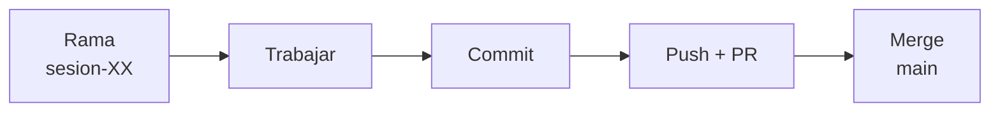
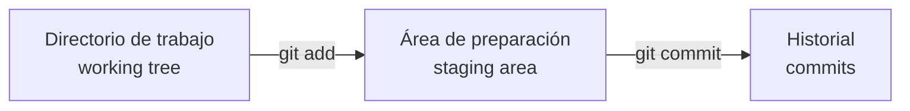
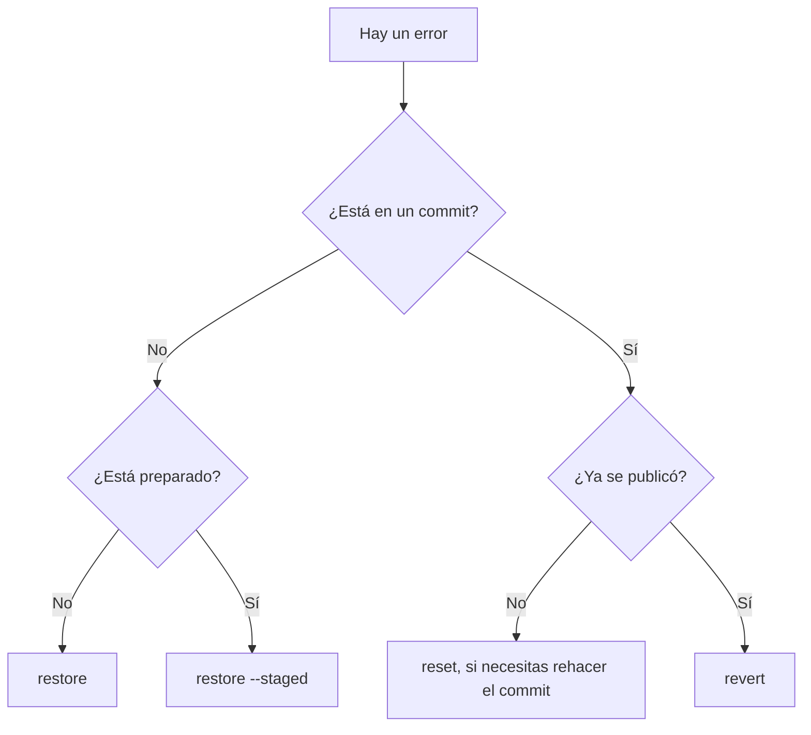

# 🧩 Control de versiones y documentación

!!! info "Descarga de diapositivas"
    [Descarga las diapositivas](diapositivas/control-versiones-documentacion.pptx){target="_blank" rel="noopener"}

---

La sesión anterior terminó con una idea importante: un despliegue profesional no puede depender de "los ficheros que tengo ahora mismo en mi ordenador" ni de una lista de pasos que solo recuerda una persona.

Antes de automatizar, contenerizar o desplegar nada necesitamos una **fuente de verdad**: un lugar donde queden registrados el código, la configuración que sí puede compartirse, la documentación y el procedimiento de trabajo.

Ese lugar será el repositorio Git.

En programación, Git suele presentarse como una forma de guardar versiones del código. En despliegue necesitamos verlo de una forma más amplia:

> **el repositorio contiene la información necesaria para reconstruir y explicar un estado desplegable del sistema.**

Eso no significa que todo deba guardarse en Git. Los secretos, los datos generados y los artefactos reconstruibles deben quedarse fuera. Aprender a distinguir qué entra, qué no entra y cómo evoluciona el historial es el objetivo de esta sesión.

---

## 🗺️ El flujo que vas a utilizar durante el módulo

El trabajo de cada sesión seguirá, con pequeñas variaciones, este recorrido:



Este será el flujo habitual del módulo:

- Antes de empezar una actividad, parte de `main` actualizado y crea la rama de la sesión. 
- Los cambios y commits se realizan en esa rama. 
- Después, la rama se publica y se integra en `main` mediante una Pull Request.

---

## 🧠 1. Qué guarda realmente Git

### 1.1. Git versiona ficheros, no directorios vacíos

Git no guarda carpetas como si fuera una copia de seguridad. Guarda **estados de ficheros** y las relaciones entre esos estados.

Esto tiene una consecuencia que suele sorprender al principio:

> **Git no versiona directorios vacíos.**

Si creas:

```text
entregas/
└── tema1/
```

pero dentro no existe ningún fichero, Git no tiene nada que registrar.

Por eso algunos proyectos añaden un fichero vacío como `.gitkeep` cuando necesitan conservar una estructura de directorios. `.gitkeep` no es una función especial de Git: es simplemente un nombre convencional.

---

### 1.2. Las tres áreas

Entre lo que editas y lo que termina en el historial existe un paso intermedio.



| Área | Qué contiene | Operación habitual |
|---|---|---|
| **Directorio de trabajo** | El estado actual de tus ficheros | editar |
| **Área de preparación** | Los cambios elegidos para el próximo commit | `git add` |
| **Historial** | Los cambios ya registrados | `git commit` |

La preparación existe porque un mismo rato de trabajo puede contener cambios distintos. No siempre quieres meterlos todos en el mismo commit.

#### Ejemplo

Imagina que has modificado:

```text
README.md
config/app.properties
docs/instalacion.md
```

pero solo quieres registrar la documentación.

Puedes preparar únicamente:

```bash
git add README.md docs/instalacion.md
```

y comprobar:

```bash
git status
```

El fichero `config/app.properties` seguirá modificado, pero no entrará en el siguiente commit.

!!! tip "Usa `git status` constantemente"
    Antes de cada `commit`, comprueba qué estás a punto de registrar. Git confirma lo que has preparado, no lo que tú crees haber preparado.

---

## 🏗️ 2. Crear un repositorio correctamente

### 2.1. Inicializar el repositorio

En proyectos nuevos puedes indicar desde el principio el nombre de la rama principal:

```bash
mkdir ejemplo-despliegue
cd ejemplo-despliegue

git init -b main
```

Comprueba:

```bash
git branch --show-current
```

Debería mostrar:

```text
main
```

Crea un primer fichero, por ejemplo:

```markdown
# Ejemplo de despliegue

Repositorio utilizado para practicar el flujo de trabajo.
```

Después:

```bash
git status
git add README.md
git status
git commit -m "Crea la documentación inicial"
git log --oneline
```

Observa la secuencia:

```text
untracked
   ↓ git add
staged
   ↓ git commit
tracked en el historial
```

---

### 2.2. Un commit debe representar una idea

Un commit útil no significa "todo lo que hice desde el último recreo". Intenta que cada commit responda a una intención concreta. Además, en este módulo utilizaremos una convención sencilla basada en *Conventional Commits* para que el historial sea más fácil de leer:

- feat: añade una funcionalidad
- fix: corrige un error
- docs: modifica documentación
- test: añade o modifica pruebas
- chore: tareas de mantenimiento o configuración

Ejemplos:

```text
docs: añade instrucciones de arranque
fix: corrige la ruta de almacenamiento
chore: configura variables de desarrollo
docs: documenta el procedimiento de despliegue
```

!!! warning "Uso de Conventional Commits"
    No todos los equipos usan *Conventional Commits*, pero sí es habitual utilizar alguna convención consistente para que el historial sea legible y automatizable.

Por el contrario, mensajes como:

```text
cambios
cosas
arreglo
final
final2
```

hacen que el historial pierda gran parte de su valor. Puedes inspeccionarlo con:

```bash
git log --oneline
```

y obtener más información de un commit concreto con:

```bash
git show <commit>
```

---

## 🚫 3. Decidir qué NO debe entrar

Un repositorio útil contiene aquello que necesitamos **conservar, revisar y reconstruir**.

No debe convertirse en un vertedero de todo lo que aparece en el directorio del proyecto.

Las exclusiones suelen pertenecer a tres grupos:

| Tipo | Ejemplos | Motivo |
|---|---|---|
| **Artefactos reconstruibles** | `target/`, `.class` | Se pueden volver a generar |
| **Configuración local** | `.idea/`, `.vscode/`, `*.iml` | Depende del equipo |
| **Secretos o datos locales** | `.env`, claves, `uploads/` | No deben publicarse o no forman parte del código |

---

### 3.1. `.gitignore`

Las reglas se escriben en un fichero `.gitignore`.

Ejemplo:

```gitignore
# Maven / Java
target/
*.class

# IDE
.idea/
.vscode/
*.iml

# Variables locales y secretos
.env
.env.*
!.env.example

# Datos generados
uploads/

# Sistema operativo
.DS_Store
Thumbs.db
```

Algunas reglas importantes:

| Patrón | Significado |
|---|---|
| `target/` | ignora cualquier directorio `target` afectado por esa regla |
| `*.class` | ignora ficheros que terminen en `.class` |
| `.env.*` | ignora `.env.dev`, `.env.local`, etc. |
| `!.env.example` | vuelve a permitir el fichero de ejemplo |
| `uploads/` | ignora datos generados dentro de esa carpeta |

!!! warning "No ignores por extensión sin pensar"
    `*.jar` sería demasiado general para muchos proyectos Maven porque podría ocultar también ficheros necesarios, como el JAR del Maven Wrapper. Ignora lo que sabes que es generado, no todo lo que se parece a un artefacto.

---

### 3.2. Puede haber varios `.gitignore`

Un repositorio puede tener más de un `.gitignore`.

Por ejemplo:

```text
proyecto/
├── .gitignore
└── aplicacion/
    ├── .gitignore
    └── ...
```

El de la raíz establece reglas generales para el repositorio. El de `aplicacion/` puede añadir reglas específicas para esa parte del proyecto.

Para saber **qué regla concreta** está ignorando una ruta:

```bash
git check-ignore -v ruta/al/fichero
```

Ejemplo:

```bash
git check-ignore -v aplicacion/target/prueba.class
```

Una salida posible:

```text
.gitignore:2:target/    aplicacion/target/prueba.class
```

Eso indica:

```text
fichero .gitignore
línea/regla
ruta afectada
```

Es mucho mejor que adivinar por qué un fichero no aparece en `git status`.

---

### 3.3. `.gitignore` no borra el pasado

Supón que registras por error:

```text
.env
```

y después añades `.env` a `.gitignore`.

El fichero **no desaparece del historial**. Git ya lo conoce.

Si solo quieres dejar de versionarlo a partir de ahora:

```bash
git rm --cached .env
git commit -m "Deja de versionar la configuración local"
```

Pero si `.env` contenía una contraseña real, eso no resuelve el problema de seguridad.

> **Un secreto publicado debe considerarse comprometido y debe revocarse o cambiarse.**

Borrarlo en un commit posterior no impide que siga existiendo en commits anteriores o en clones realizados antes.

---

### 3.4. Repositorios dentro de repositorios

Evita copiar dentro de tu repositorio una carpeta que conserve su propio directorio:

```text
.git/
```

Tendrías un repositorio Git dentro de otro, con un comportamiento que no corresponde a lo que queremos en este módulo.

Puedes localizar repositorios anidados en Linux con:

```bash
find . -name .git -type d -print
```

Un proyecto que recibes para incorporarlo como una carpeta normal debe contener sus ficheros, pero no un historial Git independiente, salvo que deliberadamente estés utilizando mecanismos como submódulos.

---

## 🧯 4. Deshacer: primero identifica dónde está el error

No existe un único comando "deshacer".

Antes de tocar nada responde dos preguntas:

1. ¿El cambio está en el directorio de trabajo, en staging o en un commit?
2. Si está en un commit, ¿ese commit ya se ha publicado?



---

### 4.1. Cambio no preparado que quieres tirar

Has escrito algo en `README.md`, no lo has preparado y quieres recuperar exactamente la versión del último commit:

```bash
git restore README.md
```

Antes:

```text
working tree: modificado
staging:      sin cambios
```

Después:

```text
working tree: limpio
staging:      sin cambios
```

!!! danger "El cambio sin registrar se pierde"
    `git restore README.md` descarta esas modificaciones. Git no puede recuperar algo que nunca llegó a registrarse.

---

### 4.2. Cambio preparado que quieres conservar

Has hecho:

```bash
git add README.md
```

pero decides que no quieres incluirlo todavía en el próximo commit.

No quieres perder el contenido, solo sacarlo de staging:

```bash
git restore --staged README.md
```

Resultado:

```text
working tree: sigue modificado
staging:      ya no contiene README.md
```

El contenido sigue en tu fichero.

---

### 4.3. Recuperar un fichero desde un commit anterior

Puedes traer únicamente un fichero desde otro punto del historial:

```bash
git restore --source=<commit> README.md
```

Por ejemplo:

```bash
git restore --source=8f3c1a2 README.md
```

Eso no mueve el historial. Simplemente coloca aquella versión del fichero en tu directorio de trabajo.

---

### 4.4. Commit local que quieres rehacer

Si el commit todavía **no se ha publicado**, puedes mover tu rama hacia atrás.

```bash
git reset --soft HEAD~1
```

Las variantes principales son:

| Variante | Qué ocurre con los cambios del commit eliminado |
|---|---|
| `--soft` | quedan preparados |
| `--mixed` | quedan modificados pero sin preparar |
| `--hard` | se descartan |

!!! danger "`--hard` borra trabajo"
    Utilízalo solo cuando sabes exactamente qué estado quieres recuperar.

---

### 4.5. Commit ya publicado

Si el commit ya está en el remoto, no conviene hacerlo desaparecer reescribiendo el historial.

Supón:

```text
A --- B --- C
          error
```

Ejecutas:

```bash
git revert C
```

y obtienes:

```text
A --- B --- C --- D
                  revierte C
```

El commit erróneo sigue existiendo y queda registrada también su corrección.

Eso es justamente lo que interesa cuando otras personas pueden haber descargado el historial.

> **Error privado y local: puedes rehacer.  
> Error publicado y compartido: corrige hacia delante.**

---

### 4.6. Tabla rápida de decisión

| Situación | Operación |
|---|---|
| He escrito algo que no quiero y no lo he preparado | `git restore <fichero>` |
| He preparado un fichero de más y quiero conservar sus cambios | `git restore --staged <fichero>` |
| Quiero recuperar un fichero tal como estaba antes | `git restore --source=<commit> <fichero>` |
| Quiero rehacer mi último commit y todavía es solo local | `git reset --soft HEAD~1` |
| El commit erróneo ya está publicado | `git revert <commit>` |
| Solo quiero inspeccionar un commit | `git show <commit>` |

---

## ☁️ 5. Del repositorio local a GitHub

Hasta ahora todo existe solo en tu ordenador.

El repositorio remoto permite compartirlo y será, durante el curso, el punto común desde el que se revisará el trabajo.

---

### 5.1. Autenticación

GitHub no utiliza la contraseña normal de la web para autenticar operaciones Git desde la línea de comandos.

Dos posibilidades habituales son:

- **SSH**, mediante un par de claves;
- **HTTPS**, mediante una credencial válida como un token.

En este módulo utilizaremos **HTTPS**.

Una URL remota tendrá este aspecto:

```text
https://github.com/usuario/ejemplo-despliegue.git
```

Cuando Git necesita autenticarte contra GitHub por HTTPS, puede solicitar un usuario y una contraseña. El usuario es tu nombre de usuario de GitHub, pero en el campo de contraseña **no se introduce la contraseña normal de la cuenta**. Se utiliza un **Personal Access Token (PAT)**.

#### 5.1.1. El PAT como credencial

Un PAT es una credencial que GitHub genera para que una aplicación o una herramienta pueda actuar en tu nombre. A diferencia de la contraseña de la cuenta, puede:

- tener una fecha de caducidad;
- conceder solo determinados permisos;
- revocarse sin cambiar tu contraseña;
- utilizarse desde herramientas como Git o Docker.

Por ejemplo, un PAT puede permitir escribir en repositorios, publicar paquetes o realizar ambas cosas. Los permisos que recibe determinan qué podrá hacer quien consiga utilizarlo.

!!! danger "Un PAT es un secreto"
    Trátalo como una contraseña: no lo escribas en el repositorio, no lo incluyas en capturas, no lo envíes por mensajería y no lo guardes en un fichero que vayas a versionar. Si se publica accidentalmente, **revócalo y crea uno nuevo**.

#### 5.1.2. La simplificación que utilizaremos en el aula

Para simplificar el trabajo inicial del módulo utilizaremos un único **Personal Access Token (classic)** con dos ámbitos:

```text
repo
write:packages
```

`repo` permitirá trabajar por HTTPS con tu repositorio privado. `write:packages` se utilizará en la sesión siguiente para publicar imágenes en GitHub Container Registry (`ghcr.io`). De esta forma tendrás que gestionar **una sola credencial durante estas primeras actividades**.

La simplificación tiene un coste: un PAT classic con `repo` es una credencial amplia, porque puede acceder a los repositorios a los que tu cuenta tenga acceso.

!!! info "La práctica recomendada: mínimo privilegio"
    En un entorno profesional es preferible **separar credenciales por finalidad** y conceder a cada una únicamente los permisos imprescindibles.

    Para este curso, la alternativa más estricta sería:

    ```text
    Git por HTTPS
    → PAT fine-grained
    → limitado solo a daw-despliegue
    → Contents: Read and write

    GHCR
    → PAT classic independiente
    → write:packages
    ```

    GitHub recomienda los tokens *fine-grained* para limitar el acceso a repositorios concretos. Sin embargo, GitHub Packages requiere actualmente un PAT classic para la autenticación manual. Puedes utilizar esta alternativa si prefieres trabajar desde el principio con mínimo privilegio.

Aunque reutilicemos el mismo PAT en la opción simplificada, **Git y Docker no comparten una sesión**. Git se autentica contra `github.com`; Docker se autenticará más adelante contra `ghcr.io`. Cada herramienta guarda y utiliza sus propias credenciales.

---

### 5.2. Crear el remoto

Si ya tienes un proyecto local, crea en GitHub un repositorio **vacío**. No marques opciones que generen un README, `.gitignore` o licencia si esos ficheros ya existen localmente.

En este módulo configuraremos el remoto mediante HTTPS:

```bash
git remote add origin https://github.com/usuario/ejemplo-despliegue.git
```

Comprueba qué remoto has configurado:

```bash
git remote -v
```

Y publica `main`:

```bash
git push -u origin main
```

`-u` deja asociada tu rama local con la rama remota correspondiente. Después normalmente bastará con:

```bash
git push
```

---

### 5.3. `fetch` y `pull` no son lo mismo

```bash
git fetch
```

descarga información nueva del remoto, pero **no modifica tu rama actual**.

```bash
git pull
```

descarga y además intenta integrar los cambios en tu rama.

Cuando esperas que tu rama local simplemente avance hasta el mismo punto que el remoto, puedes utilizar:

```bash
git pull --ff-only
```

Así Git solo actualizará si puede hacerlo sin crear una fusión inesperada.

---

### 5.4. Repositorio privado y colaboradores

Durante el curso un repositorio privado permite que el trabajo no quede visible para el resto de la clase.

Para que otra persona pueda revisarlo hay que concederle acceso como colaboradora desde la configuración del repositorio en GitHub.

El modelo será:

```text
repositorio privado
        ↓
alumno + profesor con acceso
        ↓
trabajo protegido durante el curso
        ↓
revisión final de secretos y datos
        ↓
opcionalmente público como portfolio
```

Antes de hacer público cualquier repositorio revisa siempre:

- historial;
- `.env`;
- tokens;
- claves privadas;
- datos personales;
- capturas que puedan contener información sensible.

---

## 🌿 6. Ramas: referencias que se mueven

Un **commit** identifica un estado concreto del repositorio.

Una **rama** es una referencia móvil que apunta a un commit.

```text
A --- B --- C
          ↑
         main
```

Si haces otro commit:

```text
A --- B --- C --- D
                ↑
               main
```

`main` se ha movido. Los commits anteriores no.

---

### 6.1. Convenio del módulo

En este módulo utilizaremos esta regla:

> **`main` representa el último estado integrado que consideramos desplegable.**

No significa necesariamente que ese estado esté desplegado en producción en ese momento. Significa que no deberíamos integrar en `main` trabajo incompleto o deliberadamente roto.

Para trabajar utilizaremos ramas cortas:

```text
sesion-02
sesion-03
sesion-04
...
```

Crear una:

```bash
git switch -c sesion-02
```

Comprobar la rama actual:

```bash
git branch --show-current
```

---

### 6.2. Un flujo completo de rama

Ejemplo genérico:

```bash
git switch main
git pull --ff-only

git switch -c sesion-XX
```

Trabajas y registras cambios:

```bash
git status
git add README.md
git commit -m "Actualiza la documentación de despliegue"
```

Publicas la rama:

```bash
git push -u origin sesion-XX
```

A partir de ahí, nuevos commits pueden publicarse con:

```bash
git push
```

---

## 🔀 7. Pull Request: revisar antes de integrar

Una Pull Request (PR) propone incorporar el trabajo de una rama en otra.

Conceptualmente:

```text
main        A --- B ---------------- M
                  \                /
sesion-XX          C --- D --------
```

La PR crea un espacio para revisar:

- qué commits entrarán;
- qué ficheros cambian;
- qué líneas cambian;
- por qué se hizo el cambio;
- qué comprobaciones se han realizado;
- más adelante, qué pruebas automáticas han pasado.

---

### 7.1. Flujo completo de una PR

Después de publicar `sesion-XX`:

1. abre GitHub;
2. crea una Pull Request;
3. selecciona como destino `main`;
4. selecciona como origen `sesion-XX`;
5. revisa los cambios;
6. escribe una descripción útil;
7. crea la PR.

Una descripción mínima puede seguir este esquema:

```markdown
## Qué cambia
Se añade la documentación de la sesión.

## Por qué
El repositorio debe permitir reproducir el procedimiento.

## Cómo se ha comprobado
Se ha revisado el historial y los enlaces del README.
```

!!! tip "Documenta el propósito, no la pulsación de teclas"
    En una PR interesa saber qué cambia, por qué y cómo se validó. No hace falta narrar `git add`, `git commit`, `git push`.

---

### 7.2. Una PR abierta sigue recibiendo commits

La PR no es una fotografía congelada de la rama.

Si después de abrirla haces:

```bash
git add .
git commit -m "Añade las evidencias finales"
git push
```

GitHub actualiza automáticamente la PR porque sigue comparando:

```text
sesion-XX -> main
```

Esto permite:

```text
abrir PR
   ↓
revisar
   ↓
detectar algo que falta
   ↓
hacer otro commit
   ↓
push
   ↓
la misma PR se actualiza
```

No necesitas crear otra PR.

---

### 7.3. Fusionar y volver a `main`

En este módulo utilizaremos **Create a merge commit** cuando queramos conservar claramente en el grafo la bifurcación y la integración de la rama.

Después de fusionar en GitHub:

```bash
git switch main
git pull --ff-only
```

Tu `main` local quedará actualizado con el estado ya integrado.

Puedes observar el historial con:

```bash
git log --graph --oneline --all --decorate
```

Una salida simplificada podría ser:

```text
*   81d5c2a (HEAD -> main, origin/main) Merge pull request ...
|\
| * 36f0c22 Documenta la sesión
| * 3a8be17 Añade las evidencias
|/
* 12ab456 Estado anterior
```

---

## 🧭 8. `main`, `origin/main`, `HEAD` y una etiqueta no son lo mismo

### 8.1. Qué representa cada referencia

Esta distinción será importante durante todo el módulo.

Supón este estado:

```text
A --- B --- C
          ↑
 main, origin/main, v0.1.0
          ↑
         HEAD
```

Significa:

- `HEAD` indica dónde estás trabajando;
- `main` es tu rama local;
- `origin/main` es tu referencia local del estado conocido de la rama `main` del remoto;
- `v0.1.0` señala un commit concreto.

Ahora haces un commit **sin publicarlo**:

```text
A --- B --- C --- D
          ↑       ↑
   origin/main   main
   v0.1.0        HEAD
```

Solo se mueve `main`.

`origin/main` no cambia porque no has hecho `push`.

La etiqueta tampoco cambia porque sigue señalando el commit para el que fue creada.

Esta es una forma muy útil de entender por qué una rama y una versión no representan lo mismo.

---

### 8.2. Commit vacío para observar referencias

A veces interesa crear un commit sin modificar ficheros para estudiar cómo se mueven las referencias:

```bash
git commit --allow-empty -m "Prueba temporal de referencias"
```

Después:

```bash
git log --graph --oneline --all --decorate
```

Si ese commit era únicamente una prueba local y quieres volver **exactamente** al estado conocido del remoto:

```bash
git reset --hard origin/main
```

!!! danger "Solo en una prueba local controlada"
    `reset --hard` descarta cambios. No utilices esta operación sobre trabajo que necesites conservar ni para reescribir commits que ya hayas publicado.

---

## 🏷️ 9. Etiquetas: identificar un estado concreto

Una rama se mueve. Una etiqueta creada para una versión debe permanecer asociada al mismo commit.

```bash
git tag -a v0.1.0 -m "Primer estado identificable del repositorio"
git push origin v0.1.0
```

`-a` crea una etiqueta anotada, que incluye metadatos y mensaje.

Comprueba:

```bash
git tag -n
git show v0.1.0 --no-patch
```

---

### 9.1. Referencias móviles e inmutables

| Referencia | Ejemplo | Comportamiento |
|---|---|---|
| **Móvil** | `main`, `sesion-04`, `latest` | puede terminar señalando otro contenido |
| **Estable** | `v1.4.2`, un commit concreto | identifica un contenido concreto |

Por eso un procedimiento reproducible no debería decir únicamente:

```text
despliega lo que haya en main
```

si necesitamos saber exactamente qué versión se puso en marcha.

Más adelante la misma idea aparecerá con imágenes de contenedor:

```text
miapp:latest       móvil
miapp:1.4.2        versión concreta
```

---

### 9.2. Versionado semántico

El formato habitual:

```text
MAYOR.MENOR.PARCHE
```

Ejemplo:

```text
1.4.2
```

| Parte | Cuándo cambia |
|---|---|
| **MAYOR** | cambios incompatibles |
| **MENOR** | nueva funcionalidad compatible |
| **PARCHE** | corrección compatible |

Ejemplos:

```text
1.4.2 -> 1.4.3   corrección
1.4.2 -> 1.5.0   nueva funcionalidad
1.4.2 -> 2.0.0   cambio incompatible
```

!!! note "La etiqueta del repositorio del curso"
    Una etiqueta como `v0.1.0` puede utilizarse para identificar un primer estado del repositorio del módulo. Eso no obliga a que coincida con la versión interna de una aplicación que esté contenida dentro del repositorio.

---

## 📝 10. Markdown para documentar el trabajo

La documentación del módulo se escribirá principalmente en Markdown porque es texto plano:

- Git puede mostrar sus cambios línea a línea;
- GitHub lo renderiza;
- se puede editar con cualquier editor;
- los enlaces relativos siguen funcionando dentro del repositorio.

No necesitas memorizar una sintaxis extensa. Con unas pocas construcciones basta.

---

### 10.1. Títulos

```markdown
# Informe de despliegue

## Recuperación de errores

### Situación 1
```

---

### 10.2. Listas

```markdown
- Primer elemento
- Segundo elemento
- Tercer elemento
```

Lista numerada:

```markdown
1. Crear la rama.
2. Registrar los cambios.
3. Publicarla.
```

---

### 10.3. Código en línea y bloques

Código dentro de una frase:

```markdown
Ejecuta `git status` antes del commit.
```

Bloque:

````markdown
```bash
git status
git add README.md
git commit -m "Actualiza la documentación"
```
````

---

### 10.4. Enlaces

```markdown
[Informe anterior](../informe-anterior/informe.md)
```

Conviene utilizar **rutas relativas** cuando enlazas contenido del propio repositorio.

Así el enlace seguirá funcionando si otra persona clona el proyecto en otra carpeta.

---

### 10.5. Imágenes con rutas relativas

Si tienes:

```text
actividad-1.2/
├── actividad-1.2.md
└── img/
    └── pr-abierta.png
```

desde `actividad-1.2.md` puedes insertar:

```markdown

```

No uses una ruta de tu ordenador como:

```text
C:\Users\Ana\Desktop\captura.png
```

porque solo funcionaría en tu equipo.

---

## 📖 11. Qué debe contener un README útil

### 11.1. Estructura mínima del README

El README no es un diario de clase. Es la puerta de entrada al repositorio.

Una estructura inicial razonable:

```markdown
# Nombre del proyecto

Breve explicación.

## Requisitos

Herramientas necesarias.

## Estructura del repositorio

Qué contiene cada carpeta.

## Flujo de trabajo

Cómo se utilizan las ramas y las Pull Requests.

## Puesta en marcha

Comandos para ejecutar o desplegar el proyecto.

## Comprobación

Cómo saber que está funcionando.

## Entregas

Enlaces a la documentación de las actividades.
```

Al principio algunos apartados pueden estar incompletos.

Eso es normal: el README evolucionará junto con el despliegue.

---

### 11.2. Documentación frente a ficheros técnicos

Evita duplicar información.

Por ejemplo:

```text
practicas/
└── compose/
    └── compose.yaml
```

es un fichero técnico real.

La documentación puede explicar:

```markdown
El despliegue Compose se encuentra en `practicas/compose/compose.yaml`.
```

pero no hace falta copiar el mismo YAML a varios lugares del repositorio.

Durante el módulo utilizaremos una separación parecida a:

```text
aplicacion/
    código de la aplicación

practicas/
    Dockerfiles, Compose, configuración de servidores...

entregas/
    respuestas, razonamientos, mediciones y capturas

docs/
    documentación general del proyecto
```

---

## 🔐 12. El repositorio como fuente de verdad, no como almacén de secretos

Al terminar esta sesión debe quedar clara una aparente contradicción:

```text
Git debe contener todo lo necesario
para reconstruir el despliegue

PERO

Git no debe contener secretos
ni datos privados
```

La solución es versionar **la estructura y el procedimiento**, no los valores secretos.

Por ejemplo:

```text
.env           no se versiona
.env.example   sí se versiona
```

`.env.example` podría contener:

```dotenv
DB_HOST=bd
DB_NAME=aplicacion
DB_USER=cambia-este-valor
DB_PASSWORD=cambia-este-valor
```

Así quien clona el proyecto sabe qué configuración necesita sin recibir las credenciales reales.

---

## 🧪 13. Ejemplo completo de flujo

Este ejemplo no corresponde a ninguna actividad concreta. Sirve para ver juntas las piezas anteriores.

Partimos de `main` actualizado:

```bash
git switch main
git pull --ff-only
```

Creamos una rama:

```bash
git switch -c sesion-ejemplo
```

Editamos y comprobamos:

```bash
git status
```

Preparamos únicamente lo que queremos registrar:

```bash
git add README.md
```

Comprobamos otra vez:

```bash
git status
```

Registramos:

```bash
git commit -m "Documenta el procedimiento de prueba"
```

Publicamos:

```bash
git push -u origin sesion-ejemplo
```

Abrimos una PR:

```text
sesion-ejemplo -> main
```

Durante la revisión detectamos que falta una captura. La añadimos:

```bash
git add docs/img/prueba.png README.md
git commit -m "Añade evidencia de la comprobación"
git push
```

La PR existente se actualiza.

Después de revisarla, la fusionamos y volvemos a nuestro equipo:

```bash
git switch main
git pull --ff-only
```

Finalmente identificamos ese estado:

```bash
git tag -a v0.1.0 -m "Primer estado documentado"
git push origin v0.1.0
```

El flujo completo ha sido:

```text
editar
  ↓
status
  ↓
add
  ↓
commit
  ↓
push de rama
  ↓
Pull Request
  ↓
merge
  ↓
actualizar main
  ↓
tag
```

---

## 🎯 Qué debes saber hacer al salir de esta sesión

Al terminar deberías poder:

- explicar la diferencia entre directorio de trabajo, staging e historial;
- inicializar un repositorio con `main` como rama principal;
- entender por qué Git no registra directorios vacíos;
- preparar solo una parte de los cambios;
- interpretar y comprobar reglas de `.gitignore`;
- explicar por qué un secreto no se arregla simplemente borrándolo;
- distinguir `restore`, `restore --staged`, `reset` y `revert`;
- autenticar Git contra GitHub por HTTPS utilizando un PAT y explicar por qué debe tratarse como un secreto;
- enlazar un repositorio local con GitHub;
- trabajar en una rama corta y publicarla;
- abrir una Pull Request y entender por qué nuevos commits actualizan la misma PR;
- actualizar `main` después de una fusión;
- distinguir `main`, `origin/main`, `HEAD` y una etiqueta;
- crear y publicar una etiqueta anotada;
- utilizar Markdown para crear títulos, listas, bloques de código, enlaces e imágenes relativas;
- escribir un README que permita entender el repositorio y, progresivamente, reproducir el despliegue.

---

## ✅ Ideas clave

??? tip "Abrir resumen"

    - Git versiona ficheros y sus estados, no directorios vacíos.
    - El flujo básico es directorio de trabajo -> staging -> commit.
    - `git status` es la comprobación que debes hacer antes y después de preparar cambios.
    - Un commit debe representar una idea comprensible.
    - `.gitignore` evita que determinados ficheros entren en el seguimiento, pero no borra lo que ya está en el historial.
    - `git check-ignore -v` permite descubrir qué regla está ignorando una ruta.
    - No ignores extensiones completas sin entender qué ficheros necesarios podrías ocultar.
    - Un secreto publicado se revoca o cambia. Borrarlo del último estado no elimina la exposición anterior.
    - Para descartar un cambio no preparado se usa `git restore`.
    - Para sacar un fichero de staging conservando el contenido se usa `git restore --staged`.
    - Para un error ya publicado se utiliza `git revert` en lugar de reescribir el historial compartido.
    - En GitHub por HTTPS, el PAT sustituye a la contraseña de la cuenta. Debe tener caducidad y los permisos estrictamente necesarios.
    - En el aula reutilizaremos un PAT classic para Git y GHCR como simplificación; separar credenciales por finalidad es la opción de menor privilegio.
    - `main` es el último estado integrado que en este módulo consideramos desplegable.
    - Una rama es una referencia móvil; un commit identifica un estado concreto.
    - `origin/main` representa el último estado conocido de la rama remota y no avanza por hacer un commit local.
    - Una Pull Request es el punto de revisión antes de integrar en `main`.
    - Los commits nuevos publicados en una rama actualizan automáticamente la PR abierta.
    - Una etiqueta permite identificar un commit concreto aunque `main` siga avanzando.
    - Los enlaces e imágenes de la documentación deben utilizar rutas relativas.
    - El README explica qué contiene el repositorio, qué necesita y cómo comprobar progresivamente que el despliegue funciona.

---

En la actividad aplicarás este flujo a tu repositorio del módulo. La decisión importante no será recordar comandos de memoria, sino identificar **dónde está el cambio** y si el historial **ya se ha compartido** antes de elegir cómo actuar.
