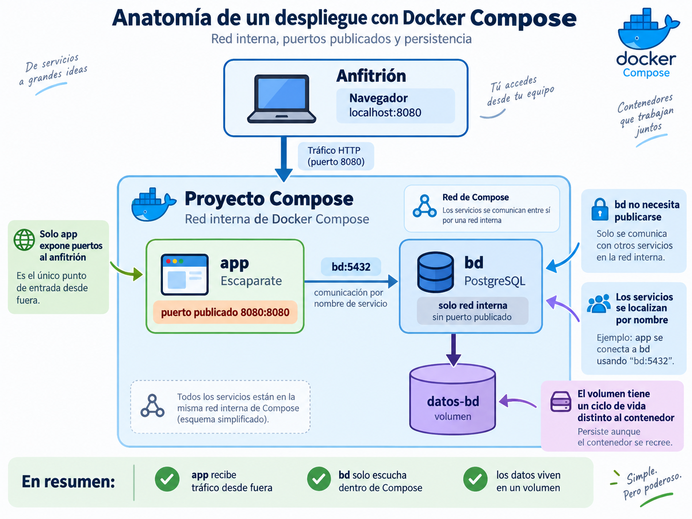

# 🧵 Docker Compose

!!! info "Descarga de diapositivas"
    <!-- [Descarga las diapositivas](diapositivas/docker-compose.pptx){target="_blank" rel="noopener"} -->

---

Hasta ahora has ejecutado Escaparate mediante varios comandos: crear una red, arrancar PostgreSQL, pasar variables y poner en marcha la aplicación.

El problema ya no es saber hacerlo una vez. El problema es que **toda esa información también forma parte del despliegue**. Si solo existe en tu memoria o en el historial del terminal, otra persona tendrá que reconstruir el procedimiento.

Docker Compose permite trasladar esa descripción a un fichero versionado.

!!! abstract "Mapa de la sesión"
    **Declarar → conectar → persistir → configurar → esperar → operar**

    Trabajaremos con dos servicios, `app` y `bd`. El objetivo no es añadir más componentes, sino describir correctamente **cómo deben ejecutarse y relacionarse**.

---

## 🧾 1. De comandos a un estado declarado

Con contenedores sueltos, el despliegue puede terminar convertido en una secuencia como esta:

```bash
docker network create escaparate-red

docker run -d --name bd \
  --network escaparate-red \
  -e POSTGRES_USER=usuario \
  -e POSTGRES_PASSWORD=clave \
  -e POSTGRES_DB=escaparate \
  postgres:18-alpine

docker run -d --name app \
  --network escaparate-red \
  -p 8080:8080 \
  -e DB_HOST=bd \
  mi-aplicacion:1.0.0
```

Funciona, pero la arquitectura está escondida dentro de las órdenes.

Compose permite declarar el mismo conjunto en `compose.yaml`:

```yaml
services:
  bd:
    image: postgres:18-alpine
    environment:
      POSTGRES_USER: usuario
      POSTGRES_PASSWORD: clave
      POSTGRES_DB: escaparate

  app:
    image: mi-aplicacion:1.0.0
    ports:
      - "8080:8080"
    environment:
      DB_HOST: bd
```

Después:

```bash
docker compose up -d
```

La diferencia importante es conceptual:

```text
docker run
→ describes una acción concreta

compose.yaml
→ describes el estado que quieres obtener
```

Compose interpreta esa declaración y crea o actualiza los recursos necesarios.

!!! warning "Sintaxis actual"
    En Compose moderno no necesitas añadir una clave superior `version:`. Además, utilizaremos `docker compose` como subcomando de Docker, no el antiguo ejecutable `docker-compose`.

---

## 🧩 2. Servicios, red y puertos

Un proyecto Compose se organiza alrededor de:

```yaml
services:
```

Cada entrada representa un **servicio**:

```yaml
services:
  app:
    image: mi-aplicacion:1.0.0

  bd:
    image: postgres:18-alpine
```

Los nombres `app` y `bd` identifican los servicios y también sirven para que se localicen dentro de la red del proyecto.

Las claves que utilizarás en esta sesión son:

| Clave | Qué describe |
|---|---|
| `image` | imagen que ejecuta el servicio |
| `ports` | puertos publicados hacia el anfitrión |
| `environment` | variables entregadas al contenedor |
| `volumes` | almacenamiento o ficheros montados |
| `depends_on` | relación de arranque entre servicios |
| `healthcheck` | condición para evaluar el estado del servicio |

La arquitectura base de esta sesión puede resumirse así:



### 2.1. Qué muestra realmente la imagen

La figura resume cuatro ideas que vas a usar continuamente en la práctica:

1. **`app` y `bd` son servicios distintos** dentro del mismo proyecto Compose.
2. **Solo `app` publica un puerto** hacia el anfitrión, en este caso `8080:8080`.
3. **`app` localiza a `bd` por nombre de servicio**, usando `bd:5432`.
4. **Los datos viven en un volumen** con un ciclo de vida distinto al contenedor.

Dicho de otra forma: el navegador entra por `app`, `app` se conecta internamente con `bd`, y `bd` guarda la información en `datos-bd`.

### 2.2. Comunicación interna por nombre

Compose crea normalmente una red propia y conecta a ella los servicios.

Por eso `app` puede utilizar:

```yaml
environment:
  DB_HOST: bd
  DB_PORT: 5432
```

sin conocer una dirección IP concreta.

Las IP pueden cambiar al recrear contenedores. El **nombre de servicio** es la referencia estable dentro de la red de Compose.

!!! tip "Piensa en `bd` como un nombre interno"
    Dentro del proyecto Compose, `bd` funciona como el nombre al que otros servicios pueden dirigirse. Para `app`, conectarse a PostgreSQL significa conectarse a `bd:5432`.

### 2.3. Red interna no significa puerto publicado

Entre servicios de la misma red se utiliza el puerto interno del contenedor:

```text
app → bd:5432
```

Eso no obliga a publicar PostgreSQL hacia el anfitrión.

Para que el navegador llegue a Escaparate sí necesitamos una entrada como:

```yaml
ports:
  - "8080:8080"
```

La diferencia esencial es esta:

- **red interna**: comunicación entre servicios del propio proyecto;
- **puerto publicado**: acceso desde fuera del proyecto, por ejemplo desde el navegador o desde el host.

En este despliegue:

- `app` **sí** publica puerto porque debe recibir tráfico desde fuera;
- `bd` **no necesita** publicar puerto porque solo la usa `app`.

!!! tip "Publica solo lo necesario"
    Cuantos más puertos publiques, más superficie expones hacia el exterior. Si un servicio solo necesita ser consumido por otros contenedores, es preferible dejarlo accesible únicamente en la red interna.

!!! note "`EXPOSE` y `ports` no son equivalentes"
    `EXPOSE` en un Dockerfile documenta un puerto esperado. `ports` en Compose crea realmente una publicación hacia el anfitrión.

---

## 💾 3. Persistencia y montajes

La capa de escritura de un contenedor desaparece cuando ese contenedor se elimina. Compose permite declarar almacenamiento con un ciclo de vida diferente.

### 3.1. Volúmenes con nombre

Para PostgreSQL utilizaremos un volumen:

```yaml
services:
  bd:
    image: postgres:18-alpine
    volumes:
      - datos-bd:/var/lib/postgresql

volumes:
  datos-bd:
```

Hay dos partes:

```text
servicio bd
→ monta datos-bd en una ruta del contenedor

sección volumes
→ declara el volumen que administra Docker
```

!!! info "PostgreSQL 18"
    En la imagen oficial de PostgreSQL 18 el volumen se declara en:

    ```text
    /var/lib/postgresql
    ```

    En versiones 17 y anteriores era habitual montar `/var/lib/postgresql/data`. No reutilices esa ruta automáticamente para PostgreSQL 18.

El volumen no tiene el mismo ciclo de vida que el contenedor:

| Operación | Contenedores | Red | Volumen |
|---|---|---|---|
| `docker compose stop` | se conservan | se conserva | se conserva |
| `docker compose down` | se eliminan | se elimina | se conserva |
| `docker compose down -v` | se eliminan | se elimina | **se elimina** |

!!! danger "`down -v` elimina los datos del volumen"
    Es útil cuando quieres empezar una práctica desde cero. No debe convertirse en un comando que ejecutes automáticamente sin comprobar qué estás destruyendo.

### 3.2. Bind mounts

También puedes hacer visible dentro de un contenedor un fichero o directorio del anfitrión:

```yaml
services:
  bd:
    volumes:
      - ./config/inicial.sql:/docker-entrypoint-initdb.d/00-inicial.sql:ro
```

Aquí:

- `./config/inicial.sql` pertenece al anfitrión;
- `/docker-entrypoint-initdb.d/00-inicial.sql` es la ruta dentro del contenedor;
- `:ro` indica solo lectura.

!!! warning "Un montaje puede ocultar contenido de la imagen"
    Si montas un directorio completo sobre una ruta que ya contiene ficheros, esos ficheros quedan ocultos mientras exista el montaje.

    Si solo necesitas añadir un fichero, monta **ese fichero concreto**.

---

## 🔧 4. Configuración externa y `.env`

`compose.yaml` debe poder versionarse. Los valores locales o sensibles de cada equipo, no.

### 4.1. Interpolación

Compose puede sustituir valores antes de crear los contenedores:

```yaml
services:
  bd:
    environment:
      POSTGRES_USER: ${BD_USUARIO}
      POSTGRES_PASSWORD: ${BD_CLAVE}
      POSTGRES_DB: ${BD_NOMBRE}
```

Junto a `compose.yaml` podemos tener:

```text
.env
→ valores locales
→ no se versiona

.env.example
→ documenta las claves necesarias
→ sí se versiona
```

Por ejemplo:

```text
BD_USUARIO=usuario
BD_CLAVE=cambia-esta-clave
BD_NOMBRE=escaparate
```

!!! warning "`.env` no es un gestor profesional de secretos"
    Aquí lo utilizamos para separar valores locales del YAML y evitar que entren en Git. En infraestructuras reales existen mecanismos específicos para gestionar secretos.

Puedes inspeccionar la configuración final que Compose ha interpretado con:

```bash
docker compose config
```

!!! danger "`docker compose config` puede mostrar valores interpolados"
    Revisa la salida antes de guardarla o capturarla. Puede contener contraseñas.

??? info "Para saber más: exigir una variable"
    Compose permite fallar con un mensaje claro cuando falta una variable:

    ```yaml
    POSTGRES_PASSWORD: ${BD_CLAVE:?define BD_CLAVE en .env}
    ```

    Es útil para evitar que una variable ausente termine sustituida por una cadena vacía.

### 4.2. ¿Quién sustituye cada variable?

Estas dos expresiones no significan exactamente lo mismo:

```text
${VARIABLE}
$$VARIABLE
```

Con:

```yaml
POSTGRES_USER: ${BD_USUARIO}
```

Compose sustituye `${BD_USUARIO}` **antes** de crear el contenedor.

En cambio, `$$` permite conservar un signo `$` literal para que una variable pueda evaluarse después dentro del contenedor.

Esta diferencia aparecerá en el `healthcheck`.

---

## ❤️ 5. Arrancado no significa preparado

Cuando un servicio depende de otro hay dos momentos diferentes:

```text
contenedor arrancado
≠
servicio preparado para trabajar
```

### 5.1. `depends_on` básico

La forma corta:

```yaml
services:
  app:
    depends_on:
      - bd
```

establece una dependencia de arranque: `bd` debe iniciarse antes que `app`.

Pero PostgreSQL puede seguir inicializando el directorio de datos cuando el contenedor ya está arrancado.

Por eso una espera fija como:

```bash
sleep 20
```

es frágil: puede sobrar en una máquina y quedarse corta en otra.

### 5.2. `healthcheck` y `service_healthy`

Podemos declarar una condición real:

```yaml
services:
  bd:
    healthcheck:
      test:
        [
          "CMD-SHELL",
          "pg_isready -h 127.0.0.1 -U $${POSTGRES_USER} -d $${POSTGRES_DB}"
        ]
      interval: 2s
      timeout: 2s
      retries: 15
```

`pg_isready` comprueba si PostgreSQL acepta conexiones.

El uso de:

```text
-h 127.0.0.1
```

es deliberado: durante la inicialización, la imagen oficial de PostgreSQL utiliza temporalmente un servidor que solo escucha mediante socket local. La comprobación TCP no se dará por correcta hasta que termine esa inicialización y arranque el servidor normal.

Después `app` puede esperar a esa condición:

```yaml
services:
  app:
    depends_on:
      bd:
        condition: service_healthy
```

El flujo pasa a ser:

```text
arranca bd
    ↓
PostgreSQL inicializa
    ↓
healthcheck correcto
    ↓
bd = healthy
    ↓
arranca app
```

!!! info "Por qué aparecen dos signos `$`"
    En:

    ```text
    $${POSTGRES_USER}
    ```

    `$$` evita que Compose intente interpolar la variable. La shell del propio contenedor recibirá `$POSTGRES_USER` y consultará allí su valor.

### 5.3. Liveness y readiness

Una comprobación también debe responder a una pregunta concreta.

| Comprobación | Pregunta |
|---|---|
| **Liveness** | ¿el proceso sigue vivo? |
| **Readiness** | ¿puede atender correctamente? |

Por ejemplo:

```text
proceso Java activo
+
PostgreSQL inaccesible
=
liveness OK
readiness NO
```

En Escaparate:

```text
/api/salud/vivo
→ proceso activo

/api/salud/listo
→ aplicación preparada y PostgreSQL disponible
```

`service_healthy` permite coordinar el **arranque entre servicios**. El endpoint de readiness permite comprobar después cuándo la **aplicación completa** está preparada.

---

## 🧰 6. Operar y diagnosticar el conjunto

No necesitas memorizar todas las opciones. Asocia cada comando con una pregunta.

| Pregunta | Comando |
|---|---|
| ¿Cómo creo o actualizo el conjunto? | `docker compose up -d` |
| ¿Qué estado tiene cada servicio? | `docker compose ps` |
| ¿Qué está ocurriendo? | `docker compose logs` |
| ¿Qué dice un servicio concreto? | `docker compose logs <servicio>` |
| ¿Quiero seguir sus logs? | `docker compose logs -f <servicio>` |
| ¿Quiero detener sin eliminar? | `docker compose stop` |
| ¿Quiero volver a arrancar? | `docker compose start` |
| ¿Quiero desmontar el conjunto? | `docker compose down` |
| ¿Quiero borrar también volúmenes? | `docker compose down -v` |
| ¿Qué configuración interpretó Compose? | `docker compose config` |
| ¿Necesito ejecutar algo dentro? | `docker compose exec <servicio> ...` |

Ante un fallo:

```text
1. docker compose ps
        ↓
2. docker compose logs <servicio>
        ↓
3. docker compose config
        ↓
4. inspeccionar red o entrar en el contenedor si hace falta
```

!!! tip "Diagnostica antes de editar"
    No modifiques el YAML al azar. Primero averigua qué estado tiene realmente el conjunto y qué configuración ha interpretado Compose.

---

## ⚖️ 7. Qué resuelve Compose y dónde termina

Compose es especialmente útil para:

- desarrollo y laboratorios;
- integración de varios servicios;
- pruebas;
- despliegues sencillos sobre un único host Docker.

Su frontera es importante: **Compose describe un proyecto sobre un motor Docker; no es un orquestador multinodo**.

No resuelve por sí solo problemas como:

- repartir cargas automáticamente entre varios servidores;
- autoescalar según demanda;
- replanificar una carga si desaparece un nodo;
- coordinar actualizaciones progresivas entre muchas réplicas y nodos.

Eso aparecerá más adelante en el módulo.

!!! note "Construir una vez, desplegar lo construido"
    En un flujo reproducible, el servidor debería recibir una referencia concreta de una imagen ya construida y validada:

    ```text
    código
    → construcción
    → pruebas
    → imagen publicada
    → despliegue
    ```

    Evitar recompilar en cada servidor reduce diferencias entre entornos.

---

## 🎯 Qué debes saber hacer al salir de esta sesión

Al terminar deberías poder:

- describir varios servicios mediante `compose.yaml`;
- utilizar nombres de servicio para la comunicación interna;
- distinguir **red interna** de **puerto publicado**;
- declarar un volumen y explicar la diferencia entre `stop`, `down` y `down -v`;
- distinguir un volumen de un bind mount;
- externalizar valores mediante `.env` y versionar `.env.example`;
- utilizar `docker compose config` para diagnosticar;
- explicar por qué un contenedor iniciado puede no estar preparado;
- declarar un `healthcheck` y esperar a `service_healthy`;
- distinguir liveness de readiness;
- operar y diagnosticar un proyecto Compose mediante estado y logs.

---

## ✅ Ideas clave

??? tip "Abrir resumen"

    - Compose convierte una secuencia de órdenes en una **descripción declarativa** del conjunto.
    - Los nombres de servicio funcionan como referencias de red dentro del proyecto.
    - Un servicio puede comunicarse internamente sin publicar su puerto hacia el anfitrión.
    - El volumen tiene un ciclo de vida distinto al contenedor.
    - `stop` conserva contenedores; `down` los elimina; `down -v` elimina además los volúmenes.
    - `.env` contiene valores locales; `.env.example` documenta la configuración necesaria.
    - `${VARIABLE}` se interpola por Compose; `$$VARIABLE` permite posponer esa evaluación.
    - `depends_on` básico no garantiza que un servicio esté preparado.
    - `healthcheck` + `service_healthy` permiten esperar una condición real.
    - Liveness pregunta si algo vive; readiness, si está preparado.
    - `ps`, `logs` y `config` son las primeras herramientas de diagnóstico.
    - Compose organiza un despliegue sobre un host Docker; no sustituye a un orquestador multinodo.

---

En la actividad convertirás Escaparate en un conjunto reproducible de dos servicios. Al terminar, aplicación, base de datos, persistencia, configuración y dependencia de arranque quedarán descritas en un fichero versionado.

En el siguiente tema añadiremos una nueva pieza delante de `app`: **Nginx**, que pasará a actuar como punto de entrada del despliegue.
