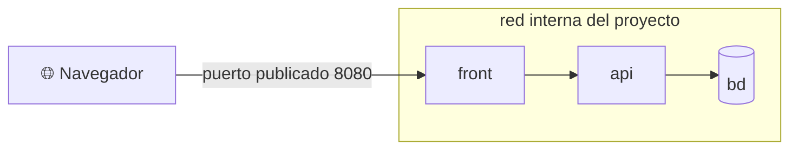

# 🧵 3. Docker Compose

!!!info "Descarga de diapositivas"
    [Descarga las diapositivas](diapositivas/docker-compose.pptx){target="_blank" rel="noopener"}

---

La sesión pasada terminaste con Escaparate empaquetado y publicado, que era el objetivo. Pero para verlo funcionar tuviste que crear una red a mano, arrancar la base de datos con sus variables, arrancar la aplicación con las suyas, acordarte del orden, y escribir dos comandos tan largos que no caben en la pantalla. Y mañana, otra vez.

Ese conocimiento —qué imágenes, con qué variables, en qué red, con qué volúmenes y en qué orden— **es el despliegue**. Ahora mismo vive en tu memoria y en el historial de tu terminal, que son los dos peores sitios donde puede vivir. Hoy lo vas a sacar de ahí y lo vas a escribir en un fichero que se versiona junto al código, y de paso vas a tomar la primera decisión de seguridad real del módulo.

---

## 🧾 Un fichero en lugar de una línea interminable

**Docker Compose** describe en un único fichero `compose.yaml` todos los contenedores que forman una aplicación, con su configuración, sus volúmenes y sus redes. Es **declarativo**: no dice qué pasos dar, dice cómo tiene que quedar el conjunto. Luego un solo comando se encarga de que la realidad se parezca a lo escrito.

Compara. Lo que ayer era esto:

```bash
docker network create escaparate-red
docker run -d --name bd --network escaparate-red \
  -e POSTGRES_USER=escaparate -e POSTGRES_PASSWORD=… -e POSTGRES_DB=escaparate \
  -v datos_bd:/var/lib/postgresql/data ghcr.io/tu-usuario/escaparate-db:1.0.0
```

pasa a ser esto:

```yaml
services:
  bd:
    image: ghcr.io/tu-usuario/escaparate-db:1.0.0
    environment:
      POSTGRES_USER: escaparate
      POSTGRES_PASSWORD: ...
      POSTGRES_DB: escaparate
    volumes:
      - datos_bd:/var/lib/postgresql/data

volumes:
  datos_bd:
```

Cada entrada bajo `services:` es un contenedor, y el nombre que le das —`bd`— es el **nombre del servicio**, que va a resultar mucho más importante de lo que parece. Los volúmenes con nombre se declaran además en una sección global al final. La red no aparece por ninguna parte porque, como verás enseguida, Compose crea una para ti.

!!! warning "Dos cosas que verás en tutoriales antiguos y hoy sobran"
    La primera línea `version: "3.8"`: está obsoleta desde hace años y solo genera avisos. Y el comando con guion, `docker-compose`: la versión actual es un subcomando integrado, `docker compose`, sin guion. Si copias un ejemplo de internet y trae esas dos cosas, probablemente traiga más cosas desactualizadas.

!!! tip "El nombre del proyecto"
    Compose agrupa todo lo que crea —contenedores, red, volúmenes— bajo un nombre de proyecto que, por defecto, es el de la carpeta donde está el fichero. Por eso tus volúmenes aparecerán como `carpeta_datos_bd`. Puedes fijarlo explícitamente con `name:` al principio del fichero, y conviene hacerlo: así el conjunto se llama igual aunque alguien clone el repositorio en una carpeta con otro nombre.

---

## 🕸️ La red que sí resuelve nombres

Aquí se paga la deuda de la sesión 3. Compose crea automáticamente una **red propia** para el proyecto y conecta a ella todos los servicios. Y en una red propia, a diferencia de la red por defecto de Docker, hay resolución de nombres: **cada servicio es alcanzable desde los demás usando su nombre de servicio como si fuera un nombre de máquina**.

Por eso la aplicación puede configurarse así:

```yaml
  api:
    image: ghcr.io/tu-usuario/escaparate:1.0.0
    environment:
      BD_HOST: bd
      BD_PUERTO: 5432
```

`bd` no es una dirección IP ni un nombre inventado: es el nombre del servicio de dos bloques más arriba. Cuando la aplicación intente conectarse a `bd`, un servidor de nombres interno que gestiona Compose le devolverá la dirección que tenga ese contenedor en ese momento —y esa dirección cambia cada vez que se recrea, motivo por el cual **jamás** se escriben direcciones IP en la configuración de un despliegue—.

Fíjate también en el puerto: `5432`, el puerto real en el que escucha PostgreSQL dentro de su contenedor. Dentro de la red interna no existe la publicación de puertos: eso es un asunto entre el anfitrión y el contenedor, y aquí estamos hablando de contenedor con contenedor.

!!! example "Un edificio de oficinas"
    La red del proyecto es el edificio y cada servicio, un despacho con su nombre en la puerta. Dentro, para hablar con contabilidad, basta con decir «contabilidad» y el conserje sabe dónde está. Desde la calle, ese nombre no significa nada: fuera del edificio nadie tiene ese listado, y solo puedes entrar por la puerta principal si está abierta.

---

## 🚪 Qué se publica y qué no: la superficie del despliegue

Esa metáfora lleva directa a la decisión importante del día. Publicar un puerto **abre una puerta desde el exterior hacia un contenedor**. La pregunta que hay que hacerse ante cada servicio es: *¿quién necesita hablar con esto?*

- Con la **base de datos** solo habla la aplicación, que está en la misma red. No necesita puerto publicado.
- Con la **API** solo habla quien sirva la web al usuario. Tampoco lo necesita.
- Con el **front** habla el navegador de una persona, que está fuera. Este sí.



Solo hay una puerta al edificio. Todo lo demás se habla por dentro. Y esto no es una precaución teórica: un puerto publicado es alcanzable desde cualquier máquina de tu red local, y en un servidor con dirección pública, desde internet entero. La base de datos de un proyecto real publicada «solo para poder conectarme con el cliente gráfico» es una de las formas más comunes y más caras de tener un disgusto.

La comprobación de que esto funciona es la parte divertida, y la vas a hacer en la actividad: **desde otro contenedor de la red, la base de datos responde; desde tu propia máquina, no existe**.

!!! info "Un adelanto de la sesión 7 que hoy te damos hecho"
    El front de Escaparate es JavaScript que corre en el navegador de la persona, así que sus llamadas a la API salen desde fuera del edificio. Para que funcionen sin publicar la API, el servidor web que sirve el front reenvía por dentro todo lo que llegue a `/api`. Hoy usarás ese fichero de configuración tal cual, sin entrar en él: en la sesión 7 lo escribirás tú, entenderás cada línea y le añadirás tres réplicas detrás.

---

## 💾 Volúmenes y persistencia de verdad

Ya sabes que la capa de escritura de un contenedor muere con él. Compose declara los volúmenes en dos sitios: dentro del servicio, diciendo qué se monta y dónde, y en la sección global, para que Docker los cree y los gestione.

```yaml
services:
  bd:
    volumes:
      - datos_bd:/var/lib/postgresql/data
  front:
    volumes:
      - ./front:/usr/share/nginx/html:ro

volumes:
  datos_bd:
```

Dos montajes de naturaleza distinta. El primero es un **volumen con nombre**: Docker lo gestiona, sobrevive a la destrucción del contenedor y es donde viven los datos de verdad. El segundo es un **montaje de una carpeta tuya** dentro del contenedor, en modo solo lectura —eso es lo que dice `:ro`—: sirve para meter ficheros desde fuera sin reconstruir la imagen.

Y aquí está la diferencia que hay que tener grabada:

| Comando | Qué hace | Qué pasa con los datos |
|---|---|---|
| `docker compose stop` | Detiene los contenedores | Todo intacto |
| `docker compose down` | Detiene **y elimina** contenedores y red | Los volúmenes con nombre **sobreviven** |
| `docker compose down -v` | Lo anterior, y además elimina los volúmenes | **Los datos desaparecen** |

!!! danger "`down -v` no pregunta"
    No hay confirmación, no hay papelera y no hay vuelta atrás. Es utilísimo cuando quieres empezar de cero —y en la actividad lo usarás a propósito para ver la diferencia—, y es catastrófico cuando lo escribes por costumbre en la máquina equivocada.

---

## 🔧 Variables de entorno y el fichero `.env`

Regla de la primera sesión, tercera vez que aparece: el paquete es idéntico en todos los entornos y la configuración entra desde fuera. Pero si escribes la contraseña de la base de datos dentro del `compose.yaml`, y el `compose.yaml` se versiona con el proyecto, la contraseña acaba en el repositorio. Y eso ya sabes que es para siempre.

La solución es la **interpolación**: el fichero declara qué variables necesita, no cuánto valen.

```yaml
  bd:
    environment:
      POSTGRES_USER: ${BD_USUARIO}
      POSTGRES_PASSWORD: ${BD_CLAVE}
```

Los valores se leen de un fichero `.env` situado junto al `compose.yaml`:

```text
BD_USUARIO=escaparate
BD_CLAVE=una-clave-larga-y-aleatoria
```

Y ese `.env` **no se versiona nunca**: entra directo en el `.gitignore`. Lo que sí se versiona es un `.env.example` con las mismas claves y valores falsos, para que quien clone el proyecto sepa exactamente qué tiene que rellenar. El fichero se comparte; los valores, no.

!!! warning ".env no es un gestor de secretos"
    El fichero .env resuelve aquí un problema concreto: evitar que las credenciales entren en el repositorio y poder cambiar la configuración entre entornos. No es una solución profesional completa para gestionar secretos. En infraestructuras reales existen almacenes y mecanismos específicos para ello; los verás más adelante al trabajar con servicios de nube.

!!! tip "Dos usos parecidos que conviene no confundir"
    `${...}` en el `compose.yaml` es sustitución que hace **Compose** al leer el fichero, antes de arrancar nada. El bloque `environment:` son variables que se le pasan **al contenedor** en el momento de crearlo. Se combinan constantemente, como en el ejemplo de arriba, pero son dos mecanismos distintos: el primero rellena el fichero, el segundo configura el proceso.

---

## ❤️ Orden de arranque: por qué `depends_on` no basta

Escaparate necesita que su base de datos esté lista antes de conectarse. La forma intuitiva de decirlo es:

```yaml
  api:
    depends_on:
      - bd
```

Y es insuficiente, por un motivo que da muchos quebraderos de cabeza: `depends_on` a secas espera a que el contenedor de la base de datos **arranque**, no a que PostgreSQL esté aceptando conexiones. Entre una cosa y la otra pueden pasar varios segundos, y la aplicación, que arranca en menos, se encuentra la puerta cerrada y se cae. Lo peor es que funciona la mitad de las veces: en tu máquina, con las imágenes ya descargadas, suele dar tiempo; en el servidor, en frío, no.

Lo que sí funciona es declarar **cuándo se considera sano** un servicio y esperar a eso:

```yaml
  bd:
    healthcheck:
      test: ["CMD-SHELL", "pg_isready -U ${BD_USUARIO} -d escaparate"]
      interval: 5s
      timeout: 3s
      retries: 10

  api:
    depends_on:
      bd:
        condition: service_healthy
```

Línea a línea: `test` es el comando que se ejecuta **dentro** del contenedor para preguntarle si está listo; si termina bien, está sano. `interval` es cada cuánto se le pregunta, `timeout` cuánto se espera cada respuesta y `retries` cuántos fallos seguidos hacen falta para declararlo enfermo. Con eso, `condition: service_healthy` retiene el arranque de la API hasta que la base de datos responda de verdad.

Apunta esta idea, porque va a reaparecer tres veces más en el curso con otros nombres: **una comprobación de salud es la forma que tiene un sistema de saber si una pieza está viva sin preguntárselo a una persona**. Es lo que usará el balanceador en la sesión 7 para dejar de mandar tráfico a una réplica caída, y lo que usará el orquestador en la sesión 15 para reiniciar sola una aplicación colgada.

---

## 🧬 El mismo proyecto en desarrollo y en producción

Un despliegue de desarrollo y uno de producción comparten casi todo y se diferencian en poco: en desarrollo quieres puertos publicados para trastear y la imagen construida desde el código que tienes delante; en producción quieres la imagen exacta descargada del registro, ningún puerto de más y reinicio automático.

De ahí sale un principio que conviene que te lleves de hoy, aunque no lo apliques todavía:

!!! danger "En el servidor no se compila"
    En producción **nunca se construye la imagen en la máquina de destino**: se descarga el paquete ya construido y verificado. Compilar en el servidor significa que necesitas ahí el código fuente, el compilador y las dependencias, y sobre todo que el resultado depende de qué versión de cada cosa hubiera ese día en esa máquina. Ese principio es el que va a sostener entera la sesión 13.

!!! info "Para saber más: cómo se separan los dos entornos"
    Compose permite **superponer ficheros**: uno base con lo común y otro con las diferencias, que se aplica automáticamente si está presente.

    ```yaml
    # compose.override.yaml — se aplica solo en tu equipo
    services:
      bd:
        ports:
          - "5433:5432"
      api:
        build: ./escaparate
    ```

    Ese fichero añade lo que solo tiene sentido en tu máquina: publicar la base de datos para poder mirarla con un cliente gráfico, y construir la imagen desde el código en lugar de descargarla. Si no está, tienes el despliegue de producción, sin puertos de más. Fíjate en la pareja `build` / `image`: es la que decide si esa pieza se fabrica aquí o se trae hecha.

---

## 🧰 Los comandos que vas a usar

| Comando | Para qué |
|---|---|
| `docker compose up -d` | Levanta el conjunto en segundo plano; crea lo que falte y recrea lo que haya cambiado |
| `docker compose ps` | Estado de cada servicio, incluida su salud |
| `docker compose logs -f <servicio>` | Sigue los logs de un servicio en vivo. **Primera parada ante cualquier fallo** |
| `docker compose exec <servicio> sh` | Abre una shell dentro de un servicio en marcha |
| `docker compose config` | Muestra el fichero final ya interpolado: para ver qué ha entendido Compose de verdad |
| `docker compose down` / `down -v` | Desmonta el conjunto / y borra también los datos |

!!! tip "`config` es el comando que nadie usa y todos deberían"
    Cuando una variable no llega, cuando un valor no es el que esperas o cuando el `.env` no se está leyendo, ese comando te enseña el fichero tal y como Compose lo ha interpretado, con todo sustituido. Diez segundos ahí ahorran media hora de conjeturas.

---

## ⚖️ Hasta dónde llega Compose

Compose es excelente para lo que es: entornos de desarrollo, pruebas automatizadas y despliegues en **una sola máquina**. Ese es también su límite. No reparte servicios entre varios servidores, no repone un contenedor si la máquina se apaga, no actualiza a una versión nueva sin cortar el servicio y no escala automáticamente cuando sube la carga.

Todo eso llega, y llega precisamente por este orden: en la sesión 7 pondrás un punto único de entrada delante de varias réplicas, y en las sesiones 14 a 16 verás qué herramienta se ocupa de reponer, actualizar y escalar sola. Mientras tanto, con lo de hoy ya puedes desplegar el conjunto entero de Escaparate en cualquier máquina que tenga Docker, escribiendo un comando.

---

## 🎯 Qué debes saber hacer al salir de esta sesión

- Describir un despliegue de varios servicios en un fichero: imágenes, puertos, variables, volúmenes y dependencias.
- Conseguir que dos servicios se encuentren por su nombre dentro de la red del conjunto.
- Publicar solo los puertos de lo que recibe tráfico de fuera, y demostrar que el resto sigue funcionando.
- Distinguir qué se destruye con cada forma de desmontar el conjunto, y no escribir `down -v` por costumbre.
- Sacar las credenciales del fichero a un `.env`, dejarlo fuera del repositorio y entregar un `.env.example`.
- Declarar cuándo se considera lista una pieza y hacer que otra espere a esa condición.
- Documentar el procedimiento completo para que otra persona lo repita sin preguntar.

Lo que basta con reconocer: la superposición de ficheros para separar entornos y el detalle de los límites de recursos.

---

## ✅ Ideas clave

??? tip "Abrir resumen"

    - Compose describe en un fichero declarativo todos los contenedores de una aplicación, con sus variables, volúmenes y redes. Ese fichero **es el procedimiento de despliegue**, y se versiona con el proyecto.
    - Compose crea una red propia para el proyecto donde cada servicio se alcanza **por su nombre de servicio**. Dentro de esa red se usa el puerto real del contenedor; nunca se escriben direcciones IP.
    - Publicar un puerto abre una puerta desde fuera. Solo la publica quien recibe visitas del exterior: la base de datos y la API no la necesitan.
    - `stop` conserva todo; `down` elimina contenedores y red pero respeta los volúmenes con nombre; `down -v` borra también los datos, sin preguntar.
    - Un volumen con nombre lo gestiona Docker y guarda datos; un montaje de carpeta del anfitrión sirve para meter configuración desde fuera, mejor si es de solo lectura.
    - El `compose.yaml` declara qué variables necesita, no cuánto valen: los valores viven en un `.env` que no se versiona, junto a un `.env.example` que sí.
    - `depends_on` a secas solo espera a que el contenedor arranque, no a que el servicio esté listo. Para eso hace falta una comprobación de salud y esperar a la condición de servicio sano.
    - Una comprobación de salud es cómo un sistema sabe si una pieza está viva sin preguntárselo a una persona. Reaparecerá en el balanceo y en la orquestación.
    - Desarrollo y producción comparten el fichero base y se diferencian en un fichero superpuesto: puertos de más y construcción local en desarrollo; imagen exacta del registro y superficie mínima en producción. En el servidor nunca se compila.
    - Compose gobierna una sola máquina: no repone, no escala y no actualiza sin cortar. Para eso están las sesiones 7 y 14 a 16.

---

Con esto ya tienes las piezas para la **Actividad 2.3**, que cierra el bloque de contenedores. Empezarás con un conjunto pequeño de dos servicios para ver con tus ojos qué sobrevive a `down` y qué no sobrevive a `down -v`. Y después montarás Escaparate entero —front, API y base de datos— en su red interna, **con la base de datos y la API sin un solo puerto publicado**, comprobando que se alcanzan desde dentro y que desde tu máquina no existen.

Por el camino te vas a encontrar con un fallo de arranque que no es culpa tuya y que tendrás que diagnosticar leyendo los logs. Al terminar tendrás el procedimiento de despliegue completo documentado en el repositorio: un fichero, un comando y una aplicación de tres piezas funcionando en cualquier máquina con Docker.