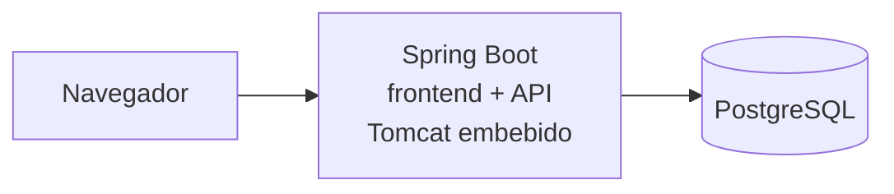
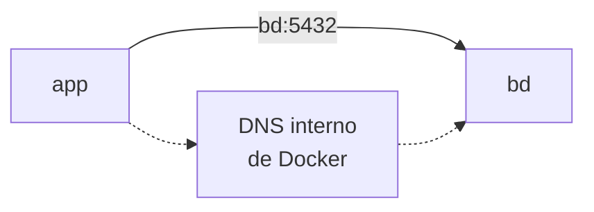

# 🧵 Docker Compose

!!! info "Descarga de diapositivas"
    [Descarga las diapositivas](diapositivas/docker-compose.pptx){target="_blank" rel="noopener"}

---

Hasta ahora has podido levantar varios contenedores mediante órdenes `docker run`, redes y variables de entorno. Pero ese conocimiento, qué imágenes forman el sistema, cómo se conectan, qué configuración reciben y qué datos deben sobrevivir, **también forma parte del despliegue**. Si solo vive en tu memoria o en el historial del terminal, no es reproducible.

Docker Compose permite trasladar esa descripción a un fichero versionado. Para estudiar el patrón utilizaremos una arquitectura muy habitual de dos servicios:



El despliegue tendrá dos servicios: la aplicación y la base de datos. En este punto el navegador entra directamente a la aplicación, cuyo Tomcat embebido atiende HTTP en el puerto 8080.

El objetivo de esta sesión es describir y operar correctamente esa relación, no añadir más piezas. En el siguiente bloque aparecerá Nginx como servidor web y punto de entrada separado; entonces la aplicación seguirá ejecutándose igual, pero dejará de ser necesariamente la pieza expuesta directamente al cliente.

---

## 🧾 1. De varios `docker run` a un despliegue declarado

Con contenedores sueltos, un procedimiento puede acabar convertido en varias órdenes como estas:

```bash
docker network create mi-red

docker run -d --name bd \
  --network mi-red \
  -e POSTGRES_USER=usuario \
  -e POSTGRES_PASSWORD=clave \
  -e POSTGRES_DB=aplicacion \
  postgres:18-alpine

docker run -d --name app \
  --network mi-red \
  -p 8080:8080 \
  -e DB_HOST=bd \
  mi-aplicacion:1.0.0
```

Funciona, pero la infraestructura está escondida dentro de una secuencia de comandos.

**Docker Compose** permite describir ese estado en un fichero `compose.yaml`:

```yaml
services:
  bd:
    image: postgres:18-alpine
    environment:
      POSTGRES_USER: usuario
      POSTGRES_PASSWORD: clave
      POSTGRES_DB: aplicacion

  app:
    image: mi-aplicacion:1.0.0
    ports:
      - "8080:8080"
    environment:
      DB_HOST: bd
```

Después:

```bash
docker compose up -d
```

Compose lee la descripción y crea lo necesario.

La diferencia importante es conceptual:

```text
docker run
→ describes una acción

compose.yaml
→ describes el estado que quieres obtener
```

Por eso decimos que Compose utiliza un enfoque **declarativo**.

!!! warning "Dos formas antiguas que todavía aparecen en tutoriales"
    La clave superior `version: "3.8"` ya no es necesaria en Compose actual. También debes utilizar `docker compose`, como subcomando de Docker, y no el antiguo ejecutable `docker-compose`.

---

## 🧩 2. La estructura de `compose.yaml`

La pieza central es:

```yaml
services:
```

Cada entrada representa un **servicio** que Compose debe ejecutar.

```yaml
services:
  web:
    image: nginx:1.30.4-alpine

  bd:
    image: postgres:18-alpine
```

Los nombres `web` y `bd` no son decorativos. Identifican los servicios dentro del proyecto y, como verás enseguida, también sirven para que se encuentren por red.

Las opciones que utilizarás con más frecuencia son:

| Clave | Qué describe |
|---|---|
| `image` | imagen que debe ejecutar el servicio |
| `ports` | puertos publicados hacia el anfitrión |
| `environment` | variables que recibe el contenedor |
| `volumes` | almacenamiento o ficheros montados |
| `depends_on` | dependencias de arranque |
| `healthcheck` | condición utilizada para comprobar la salud del servicio |

Un fichero Compose no es un script. El orden visual de los servicios en el YAML no determina por sí solo el orden correcto de disponibilidad.

!!! tip "El nombre del proyecto"
    Compose agrupa los contenedores, redes y volúmenes bajo un nombre de proyecto. Por defecto suele derivarlo del directorio del proyecto. También puedes fijarlo explícitamente:

    ```yaml
    name: mi-proyecto
    ```

    Esto ayuda a obtener nombres estables aunque el repositorio se clone en otra carpeta.

---

## 🕸️ 3. La red de Compose y los nombres de servicio

Compose crea normalmente una **red propia para el proyecto** y conecta a ella los servicios.

Dentro de esa red, cada servicio puede localizar a otro mediante su **nombre de servicio**.

```yaml
services:
  bd:
    image: postgres:18-alpine

  app:
    image: mi-aplicacion:1.0.0
    environment:
      DB_HOST: bd
      DB_PORT: 5432
```

La aplicación no necesita conocer la IP de PostgreSQL:



Las direcciones IP pueden cambiar cuando los contenedores se recrean. El nombre de servicio es la referencia estable.

Fíjate además en `5432`. Entre contenedores de la misma red se utiliza el **puerto en el que escucha realmente el servicio dentro del contenedor**.

No hace falta publicarlo en el anfitrión para que otro contenedor pueda utilizarlo.

Una comprobación especialmente útil es esta: si una aplicación se comunica correctamente con su base de datos mediante `bd:5432` mientras la base de datos no publica ningún puerto hacia el anfitrión, ya has demostrado que la comunicación ocurre por la red interna del proyecto.

!!! example "Dentro y fuera son espacios distintos"
    El nombre `bd` puede resolverse desde otro contenedor conectado a la red de Compose, pero tu navegador o tu terminal en el anfitrión no tienen por qué saber qué significa `bd`.

---

## 🚪 4. Publicar solo lo que necesita recibir tráfico externo

Una publicación:

```yaml
ports:
  - "8080:8080"
```

significa:

```text
puerto del anfitrión : puerto del contenedor
```

y crea una entrada desde fuera de la red Docker hacia ese servicio.

Para una aplicación web integrada con base de datos, un esquema razonable es:

```text
Navegador
    │
    │ localhost:8080
    ▼
 app:8080
    │
    │ bd:5432
    ▼
 PostgreSQL
```

Solo `app` necesita publicar un puerto.

La base de datos puede seguir siendo accesible para `app` dentro de la red aunque no tenga ningún bloque `ports:`.

Esto reduce la **superficie expuesta** del despliegue. Un servicio interno no debe publicarse solo por comodidad.

!!! note "`EXPOSE` y `ports` siguen siendo cosas diferentes"
    `EXPOSE` dentro de un Dockerfile documenta un puerto esperado. `ports` en Compose publica realmente un puerto del contenedor hacia el anfitrión.

---

## 💾 5. Volúmenes y montajes

La capa de escritura de un contenedor desaparece cuando el contenedor se elimina. Compose permite declarar almacenamiento que queda fuera de esa capa.

### 5.1. Volúmenes con nombre

Para datos persistentes utilizaremos normalmente un **volumen con nombre**:

```yaml
services:
  bd:
    image: postgres:18-alpine
    volumes:
      - datos-bd:/var/lib/postgresql

volumes:
  datos-bd:
```

Hay dos partes:

```text
dentro del servicio
→ dónde se monta

sección global volumes
→ qué volumen administra Docker
```

En PostgreSQL 18 utilizaremos:

```text
/var/lib/postgresql
```

La imagen oficial de PostgreSQL 18 reorganizó el directorio de datos respecto a versiones anteriores. Para las prácticas del módulo no debes reutilizar automáticamente ejemplos antiguos que monten `/var/lib/postgresql/data`.

El volumen tiene un ciclo de vida distinto al contenedor:

| Operación | Contenedores | Red | Volumen con nombre |
|---|---|---|---|
| `docker compose stop` | se detienen | permanece | permanece |
| `docker compose down` | se eliminan | se elimina | permanece |
| `docker compose down -v` | se eliminan | se elimina | **se elimina** |

!!! danger "`down -v` destruye los datos del volumen"
    Es adecuado para una práctica en la que quieres comenzar desde cero. No debe convertirse en un comando automático que escribes sin pensar.

### 5.2. Montajes de ficheros o directorios del anfitrión

También puedes montar un fichero existente de tu equipo:

```yaml
services:
  bd:
    volumes:
      - ./config/inicial.sql:/docker-entrypoint-initdb.d/00-inicial.sql:ro
```

Aquí no se crea un volumen gestionado por Docker. Se hace visible un fichero del anfitrión dentro del contenedor.

El sufijo:

```text
:ro
```

indica **solo lectura**.

Este mecanismo es útil para introducir configuración o recursos de una práctica sin construir otra imagen.

!!! warning "Montar encima puede ocultar lo que ya contenía la imagen"
    Si montas un directorio completo sobre una ruta que ya contiene ficheros dentro de la imagen, esos ficheros quedan ocultos mientras exista el montaje.

    Si solo necesitas añadir un fichero, monta **ese fichero concreto** en lugar de sustituir todo el directorio.

---

## 🔧 6. Configuración, interpolación y `.env`

El `compose.yaml` se versiona. Las credenciales reales de tu equipo, no.

### 6.1. Interpolar valores sin escribirlos en el YAML

Compose puede sustituir variables:

```yaml
services:
  bd:
    environment:
      POSTGRES_USER: ${BD_USUARIO}
      POSTGRES_PASSWORD: ${BD_CLAVE}
      POSTGRES_DB: ${BD_NOMBRE}
```

En nuestro flujo de trabajo utilizaremos un fichero `.env` junto al `compose.yaml`:

```text
BD_USUARIO=appuser
BD_CLAVE=una-clave-local
BD_NOMBRE=appdb
```

Ese fichero:

```text
.env
→ contiene valores locales
→ no se versiona
```

Y se acompaña de:

```text
.env.example
→ contiene las mismas claves
→ usa valores ficticios o sustituibles
→ sí se versiona
```

Por ejemplo:

```text
BD_USUARIO=usuario
BD_CLAVE=cambia-esta-clave
BD_NOMBRE=aplicacion
```

!!! warning "`.env` no es un gestor profesional de secretos"
    Aquí resuelve dos problemas didácticos importantes: sacar valores locales del YAML y evitar que entren en Git. En infraestructuras reales se utilizan mecanismos específicos de gestión de secretos.

### 6.2. Interpolación de Compose y variables del contenedor

Estas dos cosas se parecen, pero ocurren en momentos diferentes:

```yaml
POSTGRES_USER: ${BD_USUARIO}
```

Primero:

```text
Compose
→ lee ${BD_USUARIO}
→ sustituye el valor
```

Después:

```text
Docker
→ crea el contenedor
→ POSTGRES_USER aparece como variable de entorno dentro
```

Puedes inspeccionar el resultado que Compose ha interpretado con:

```bash
docker compose config
```

Es uno de los comandos más útiles cuando una variable, un puerto o un montaje no tiene el valor esperado.

!!! danger "`docker compose config` puede mostrar secretos"
    El resultado puede contener valores ya interpolados. No publiques ni captures sin revisar una salida que incluya contraseñas reales.

---

## ❤️ 7. Arrancar un contenedor no significa que el servicio esté preparado

Uno de los problemas más habituales aparece cuando un servicio depende de otro.

### 7.1. `depends_on` básico solo ordena el arranque

Puedes escribir:

```yaml
services:
  app:
    depends_on:
      - bd
```

Compose hará que `bd` se inicie antes que `app`.

Pero hay una diferencia:

```text
contenedor bd iniciado
≠
PostgreSQL preparado para aceptar conexiones
```

Un proceso puede necesitar varios segundos para inicializarse después de que Docker haya creado y arrancado su contenedor.

Por eso un sistema puede fallar de forma aparentemente aleatoria:

```text
bd arranca
↓
app arranca inmediatamente
↓
PostgreSQL todavía inicializa datos
↓
app intenta conectar
↓
fallo
```

Esperar siempre con:

```bash
sleep 20
```

no resuelve el problema correctamente. En una máquina rápida sobra tiempo; en otra más lenta puede no ser suficiente.

La solución correcta es **esperar una condición real**.

### 7.2. `healthcheck` y `service_healthy`

Un servicio puede declarar cómo comprobar su estado:

```yaml
services:
  bd:
    image: postgres:18-alpine
    environment:
      POSTGRES_USER: usuario
      POSTGRES_DB: aplicacion

    healthcheck:
      test:
        [
          "CMD-SHELL",
          "pg_isready -h 127.0.0.1 -U $${POSTGRES_USER} -d $${POSTGRES_DB}"
        ]
      interval: 2s
      timeout: 2s
      retries: 15
```

Aquí `pg_isready` comprueba que PostgreSQL está **aceptando conexiones TCP** en el propio contenedor.

La opción:

```text
-h 127.0.0.1
```

hace explícito que estamos comprobando una conexión de red, no únicamente un socket local.

Los demás valores indican:

| Opción | Significado |
|---|---|
| `test` | comando que determina el estado |
| `interval` | tiempo entre comprobaciones |
| `timeout` | cuánto puede tardar cada intento |
| `retries` | fallos consecutivos antes de considerar el servicio no saludable |

Después una dependencia puede esperar a esa condición:

```yaml
services:
  app:
    depends_on:
      bd:
        condition: service_healthy
```

El flujo pasa a ser:

```text
arranca bd
↓
healthcheck falla mientras PostgreSQL inicializa
↓
healthcheck correcto
↓
bd = healthy
↓
arranca app
```

!!! info "Por qué aparecen dos signos `$`"
    En:

    ```text
    $${POSTGRES_USER}
    ```

    `$$` evita que Compose intente sustituir esa variable al leer el YAML.

    El contenedor recibe literalmente:

    ```text
    ${POSTGRES_USER}
    ```

    y es la shell ejecutada por `CMD-SHELL` la que consulta después la variable de entorno del propio contenedor.

    Esta diferencia es importante cuando quieres que una variable sea evaluada **dentro del contenedor** y no por Compose.

### 7.3. Liveness y readiness no preguntan lo mismo

Una comprobación de salud tampoco significa siempre lo mismo.

Una aplicación puede exponer, por ejemplo:

```text
/api/salud/vivo
/api/salud/listo
```

La idea general es:

| Comprobación | Pregunta |
|---|---|
| **Liveness** | ¿el proceso está vivo? |
| **Readiness** | ¿está preparado para atender correctamente? |

Una aplicación puede estar viva pero no preparada:

```text
proceso Java activo
+
PostgreSQL inaccesible
=
liveness OK
readiness NO
```

En el proyecto del módulo, `/api/salud/listo` aplicará precisamente esta idea comprobando también la disponibilidad de PostgreSQL.

Esto explica por qué hay dos momentos diferentes:

```text
bd healthy
→ ya puede empezar app

app responde readiness
→ el sistema ya puede considerarse preparado
```

`service_healthy` resuelve la dependencia de arranque entre servicios. El endpoint de readiness permite comprobar después cuándo la aplicación completa está realmente lista.

---

## 🧰 8. Operar y diagnosticar un proyecto Compose

Los comandos principales de esta sesión son:

| Comando | Para qué sirve |
|---|---|
| `docker compose up -d` | crea o actualiza el conjunto y lo deja en segundo plano |
| `docker compose ps` | muestra estado, puertos y salud de los servicios |
| `docker compose logs` | muestra los logs del conjunto |
| `docker compose logs <servicio>` | muestra los logs de un servicio |
| `docker compose logs -f <servicio>` | sigue los logs en tiempo real |
| `docker compose stop` | detiene servicios sin eliminarlos |
| `docker compose start` | vuelve a arrancar los servicios detenidos |
| `docker compose down` | elimina contenedores y red del proyecto |
| `docker compose down -v` | además elimina los volúmenes |
| `docker compose exec <servicio> sh` | ejecuta una shell dentro de un servicio |
| `docker compose config` | muestra la configuración final interpretada |

Ante un fallo, aplica la misma rutina que con Docker:

```text
1. docker compose ps
2. docker compose logs <servicio>
3. inspeccionar configuración y red
4. entrar en el contenedor solo si hace falta
```

No empieces modificando el YAML al azar. Primero averigua qué estado tiene realmente el sistema.

---

## ⚖️ 9. Qué resuelve Compose y dónde termina

Compose es especialmente útil para:

- desarrollo local;
- prácticas y laboratorios;
- integración de varios servicios;
- pruebas;
- despliegues sencillos sobre un único host Docker.

Su límite principal es precisamente ese: **describe un proyecto sobre un motor Docker, no un clúster de máquinas**.

Docker puede aplicar políticas de reinicio en un mismo host, pero Compose no es un orquestador multinodo capaz de mover automáticamente una carga a otro servidor si una máquina desaparece.

Tampoco proporciona por sí solo estrategias completas de:

- distribución automática entre varios nodos;
- autoescalado;
- rolling updates coordinados entre réplicas;
- replanificación de cargas tras perder un nodo.

Más adelante estudiarás herramientas que resuelven esos problemas.

!!! note "Construir una vez y desplegar lo construido"
    En un flujo de despliegue reproducible, la práctica habitual es construir y validar la imagen antes de llegar al servidor de destino.

    El servidor debería recibir una referencia concreta del artefacto ya construido:

    ```text
    código
    → build
    → pruebas
    → imagen publicada
    → despliegue
    ```

    Evitar recompilar en cada servidor reduce diferencias entre entornos y permite saber exactamente qué se ha desplegado.

---

## 🎯 Qué debes saber hacer al salir de esta sesión

- Describir varios servicios mediante `compose.yaml`.
- Reconocer `image`, `ports`, `environment`, `volumes`, `depends_on` y `healthcheck`.
- Entender que los servicios se localizan por nombre dentro de la red de Compose.
- Distinguir comunicación interna de publicación hacia el anfitrión.
- Utilizar un volumen con nombre para datos que deben sobrevivir al contenedor.
- Distinguir `stop`, `down` y `down -v`.
- Montar un fichero desde el anfitrión sin ocultar accidentalmente un directorio completo de la imagen.
- Sacar valores locales a `.env` y versionar un `.env.example`.
- Utilizar `docker compose config` para comprobar qué configuración ha interpretado Compose.
- Explicar por qué `depends_on` a secas no garantiza que una dependencia esté preparada.
- Crear un `healthcheck` y esperar a `service_healthy`.
- Distinguir conceptualmente liveness de readiness.
- Diagnosticar un conjunto mediante estado y logs.

Lo que basta con reconocer: el nombre de proyecto explícito y los límites de Compose frente a un orquestador multinodo.

---

## ✅ Ideas clave

??? tip "Abrir resumen"

    - Compose sustituye una colección de comandos imperativos por una **descripción declarativa** del conjunto.
    - Cada entrada de `services` representa un servicio y su nombre sirve también como nombre DNS dentro de la red del proyecto.
    - Los contenedores de la misma red se comunican mediante sus puertos internos. Publicar un puerto solo es necesario cuando debe entrar tráfico desde el anfitrión.
    - En una arquitectura `app + bd`, normalmente solo la aplicación necesita publicar el puerto de entrada; la base de datos puede permanecer en la red interna.
    - Para PostgreSQL 18, en estas prácticas el volumen persistente se monta en `/var/lib/postgresql`.
    - `stop` detiene; `down` elimina contenedores y red; `down -v` elimina además los volúmenes.
    - Un montaje de fichero permite introducir contenido desde fuera. Montar un directorio completo encima de otro puede ocultar los ficheros que ya tenía la imagen.
    - `.env` contiene valores locales y no se versiona. `.env.example` documenta las claves necesarias y sí entra en Git.
    - `${VARIABLE}` puede ser interpolada por Compose. `$${VARIABLE}` permite que llegue al contenedor para que se evalúe allí.
    - `depends_on` básico espera al arranque del contenedor, no a la disponibilidad real del servicio.
    - `healthcheck` permite definir una condición real y `service_healthy` esperar a ella.
    - Liveness pregunta si el proceso vive. Readiness pregunta si está preparado para trabajar.
    - `docker compose ps`, `logs` y `config` son las primeras herramientas para diagnosticar un despliegue.
    - Compose es excelente para un conjunto sobre un host Docker, pero no sustituye a un orquestador multinodo.

---

En la actividad aplicarás esta descripción declarativa al proyecto del módulo y comprobarás red interna, persistencia, configuración externa y la diferencia entre **contenedor arrancado** y **servicio preparado**.

Este `compose.yaml` será también la base sobre la que más adelante añadirás una nueva pieza delante de `app`: el servidor web. La aplicación no dejará de ejecutar su propio código ni su servidor embebido; simplemente pasará a recibir el tráfico a través de Nginx.
