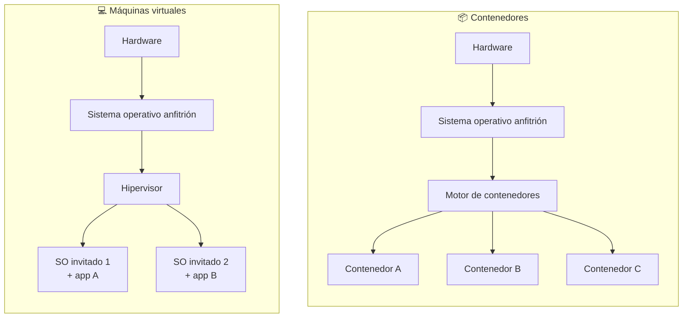
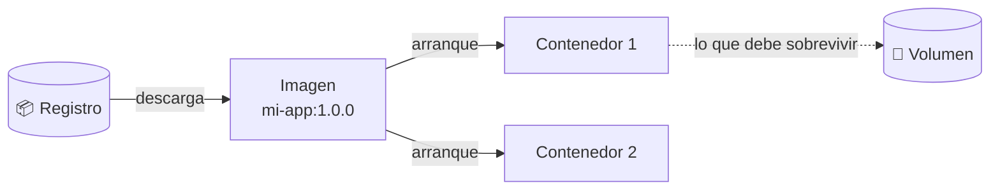
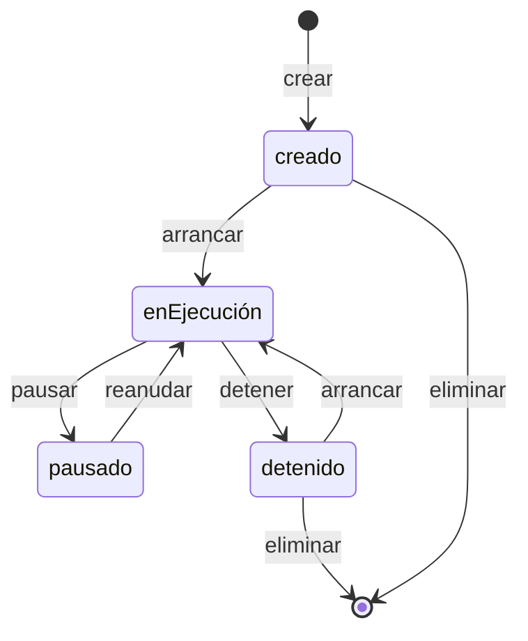
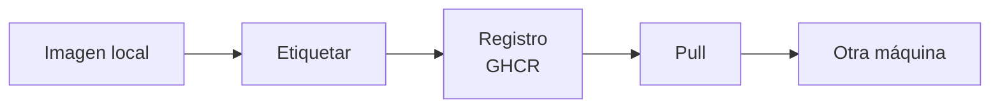

# 📦 Fundamentos de contenedores

!!!info "Descarga de diapositivas"
    <!-- [Descarga las diapositivas](diapositivas/fundamentos-contenedores.pptx){target="_blank" rel="noopener"} -->

---

En las primeras sesiones has separado dos problemas: **versionar el proyecto** y conseguir que pueda ejecutarse de forma reproducible fuera del equipo donde se desarrolló. Git resuelve el primero, pero no instala runtimes, bases de datos, bibliotecas ni prepara por sí solo el entorno de ejecución.

Hoy aparece la herramienta que aborda ese segundo problema: los contenedores. La idea es empaquetar software y dependencias de forma que el mismo artefacto pueda ejecutarse de manera equivalente en distintos entornos.

---

## 🧳 1. Lo que hay que mover no es el código

Vuelve a la tabla de las cinco piezas de la primera sesión y quédate con **artefacto y runtime**. Una aplicación puede necesitar su ejecutable, una versión concreta del runtime, servicios auxiliares, variables de entorno, directorios y permisos. Copiar solo el código no reproduce ese conjunto.

Contenerizar no significa meter todo eso dentro de un único contenedor. Cada pieza puede empaquetarse por separado: una imagen para PostgreSQL, otra para la aplicación y, más adelante, otra para el servidor web que actuará como punto de entrada.

La imagen de una aplicación puede contener a su vez varias piezas internas. En el caso de Escaparate terminarás empaquetando:

```text
imagen de Escaparate
├── runtime de Java
└── aplicación Spring Boot
    └── servidor HTTP embebido
```

Por tanto, **separar servidor web y servidor de aplicaciones no implica necesariamente instalar ambos como servidores independientes**. Más adelante Nginx será una pieza separada delante de Escaparate, mientras la aplicación seguirá llevando dentro el componente que ejecuta y atiende su código dinámico.

Históricamente esto se ha resuelto de tres maneras, y las tres siguen existiendo:

| Enfoque | Cómo funciona | Por qué falla |
|---|---|---|
| **Documento de instalación** | Un README con cuarenta pasos que alguien sigue a mano | Se desactualiza el primer día; dos personas lo interpretan distinto; nadie lo prueba entero nunca |
| **Script de aprovisionamiento** | Un guion que instala y configura todo automáticamente | Mejor, pero depende del sistema operativo de destino y de que los paquetes sigan disponibles con la misma versión |
| **Máquina virtual completa** | Se empaqueta el ordenador entero, sistema operativo incluido | Funciona de verdad, pero pesa gigabytes, tarda minutos en arrancar y no puedes tener veinte a la vez |

El contenedor es el cuarto enfoque: empaqueta de forma reproducible la aplicación y sus dependencias sin tener que llevar un sistema operativo invitado completo. El resultado suele ser mucho más ligero y rápido de crear y arrancar que una máquina virtual.

---

## 🆚 2. Máquina virtual frente a contenedor

La diferencia está en **qué se virtualiza**.



Una **máquina virtual** virtualiza el hardware: el hipervisor presenta un ordenador virtual completo y dentro se instala un sistema operativo invitado con su propio núcleo, servicios y gestión de memoria. El aislamiento es fuerte, pero también aumenta el consumo de recursos y el tiempo de arranque.

Un **contenedor** utiliza el núcleo del sistema anfitrión y aísla procesos, red y sistema de ficheros. La imagen empaqueta las bibliotecas y ficheros que necesita la aplicación por encima de ese núcleo. Por eso un contenedor suele arrancar en segundos o menos y sus imágenes acostumbran a ocupar decenas o centenas de megabytes, no varios gigabytes.

| | Máquina virtual | Contenedor |
|---|---|---|
| **Qué incluye** | Sistema operativo invitado completo | Solo la aplicación y sus dependencias |
| **Tamaño típico** | Gigabytes | Decenas o centenas de megabytes |
| **Tiempo de arranque** | Minutos | Segundos o menos |
| **Cuántos caben en una máquina** | Unos pocos | Decenas |
| **Aislamiento** | Fuerte: núcleos separados | Menor: núcleo compartido |
| **Cuándo elegirla** | Necesitas otro sistema operativo, aislamiento fuerte o control fino de recursos | Necesitas desplegar la misma aplicación muchas veces, rápido y de forma idéntica |

!!! warning "No son alternativas excluyentes"
    La pregunta no es «máquina virtual **o** contenedor». En la práctica se combinan: más adelante vas a ejecutar contenedores **dentro de** una máquina virtual y también mediante servicios administrados en la nube, que es exactamente como funciona casi toda la industria. La máquina virtual da el ordenador; el contenedor, la forma de empaquetar lo que corre dentro.

!!! info "Si algún día lo usas en Windows o macOS"
    Para ejecutar contenedores Linux en Windows o macOS, Docker utiliza por debajo un entorno Linux virtualizado. En los equipos Linux del aula, los contenedores Linux pueden utilizar directamente el núcleo del anfitrión.

---

## 🧩 3. Las cuatro palabras que hay que tener claras

### 3.1. Imagen: el paquete

Una **imagen** es un paquete de solo lectura que contiene el sistema base, el software instalado, tu aplicación y su configuración de fábrica. Es **inmutable**: una vez construida no se modifica; si algo tiene que cambiar, se construye otra.

Aquí está el cambio de mentalidad de este módulo. Puede que hayas visto Docker presentado como «una forma cómoda de tener una base de datos sin instalarla». Eso es cierto y es útil, pero es lo de menos.

En un flujo basado en contenedores, **la imagen es la unidad de despliegue**: se construye una vez, se identifica con una versión y se ejecuta de forma equivalente en desarrollo, pruebas o producción.

Conviene distinguir dos niveles que volverán a aparecer más adelante:

```text
artefacto de aplicación
→ por ejemplo, un WAR o un JAR

imagen de contenedor
→ artefacto de aplicación + runtime + configuración de fábrica
```

Así, un mismo WAR puede formar parte de una imagen autocontenida o desplegarse sobre un servidor de aplicaciones externo. Docker no elimina el concepto de artefacto de aplicación: añade una unidad de despliegue reproducible alrededor.

### 3.2. Contenedor: una instancia de la imagen

Un **contenedor** es una instancia creada a partir de una imagen. Puede estar creado, en ejecución o detenido. Cuando está en ejecución mantiene uno o varios procesos aislados, con su propio sistema de ficheros, configuración y red.

De una misma imagen puedes crear tantos contenedores como quieras. Cada uno tiene su propia capa de escritura y su propio estado, aunque todos partan exactamente del mismo contenido de solo lectura. Esta propiedad permite, por ejemplo, ejecutar varias copias equivalentes de una misma aplicación y repartir tráfico entre ellas.

### 3.3. Registro: dónde viaja

Un **registro** es un servidor donde se publican imágenes para que otras máquinas se las descarguen. Que la imagen viva en un registro es lo que permite que la máquina de producción no necesite tu código, ni Maven, ni Java para compilar: se descarga el paquete ya hecho y lo ejecuta.

Docker Hub es el más conocido y es de donde vas a **descargar** muchas imágenes oficiales, como Nginx o PostgreSQL. Para **publicar** las tuyas este módulo utiliza GitHub Container Registry, `ghcr.io`, porque ya trabajas con una cuenta de GitHub y más adelante los pipelines podrán publicar ahí sin utilizar una credencial personal tuya. Existen muchos otros registros, como AWS ECR, Azure Container Registry o registros privados de empresa.

### 3.4. Etiqueta: qué versión exactamente

El nombre completo de una imagen tiene cuatro partes: `registro/usuario/nombre:etiqueta`. Si no dices el registro, se asume Docker Hub —por eso `nginx` funciona sin más—; las imágenes oficiales tampoco llevan usuario, y si no indicas etiqueta se asume `latest`. Cuando publiques la tuya en el registro de GitHub tendrás que escribir el nombre entero, `ghcr.io/tu-usuario/lo-que-sea:1.0.0`, y ahí se ve bien de dónde sale cada parte.

!!! danger "`latest` no significa «la última»"
    Significa «la que alguien decidió marcar como `latest` la última vez», y puede cambiar bajo tus pies entre dos despliegues. Un despliegue reproducible **siempre** fija la versión: `postgres:18-alpine`, no `postgres`. Este es uno de los errores que más disgustos da en producción, y a partir de hoy no lo vas a cometer.



!!! info "Quién hace realmente el trabajo"
    Cuando escribes un comando de Docker no estás ejecutando nada directamente: estás enviando una orden a un **demonio** que corre en la máquina y que es quien descarga imágenes, crea contenedores y los ejecuta. Cliente y demonio, otra vez el modelo de la primera sesión. Parece un detalle, pero explica dos cosas que te encontrarás: que haga falta pertenecer a un grupo concreto del sistema para poder dar esas órdenes, y que el mismo cliente pueda gobernar el motor de otra máquina.

---

## 🧱 4. Capas: por qué una imagen no se copia entera

Una imagen no es un bloque: es una **pila de capas** de solo lectura, apiladas una encima de otra. La primera suele ser un sistema base mínimo; encima se añade el runtime; encima, la aplicación; encima, la configuración.

Esto tiene dos consecuencias muy prácticas:

- **Las capas se comparten.** Si tienes cinco imágenes construidas sobre el mismo sistema base, esa capa está en disco una sola vez. Y si descargas una versión nueva de una imagen, solo viajan por la red las capas que han cambiado.
- **El contenedor añade una capa más, y es de escritura.** Al arrancar, se coloca sobre la pila una capa fina donde va a parar todo lo que el proceso escriba: ficheros temporales, logs, datos. Esa capa **nace y muere con el contenedor**.

Guarda esa última frase, porque es la que explica la sección de persistencia y la que provoca el 90 % de los sustos de quien empieza. En la sesión 4 volverás a las capas desde el otro lado: cómo se construyen y por qué su orden decide cuánto tarda cada compilación.

---

## ♻️ 5. El ciclo de vida de un contenedor

### 5.1. Estados y operaciones básicas

Un contenedor pasa por unos estados muy concretos, y confundirlos es el origen de casi todas las preguntas del tipo «lo he borrado y sigue ahí» o «lo he parado y he perdido los datos».



- **Creado**: existe, tiene su configuración fijada, pero no hay ningún proceso corriendo.
- **En ejecución**: el proceso principal está vivo. Ojo: si ese proceso termina, el contenedor se detiene. Un contenedor no es una máquina encendida, **es un proceso**.
- **Pausado**: los procesos están congelados en memoria. Poco frecuente.
- **Detenido**: el proceso ha terminado, pero el contenedor sigue existiendo **con su capa de escritura intacta**. Puedes volver a arrancarlo y encontrarás tus ficheros.
- **Eliminado**: se borra el contenedor y, con él, su capa de escritura. Aquí es donde desaparecen los datos.

Estos son los comandos que vas a usar hoy. No hace falta memorizarlos: hace falta saber qué preguntas responden.

| Comando | Qué hace | Para qué lo quieres |
|---|---|---|
| `docker pull <imagen>` | Descarga una imagen del registro | Traerte el paquete antes de ejecutarlo |
| `docker run <imagen>` | Crea **y** arranca un contenedor | El atajo que usarás el 90 % de las veces |
| `docker ps` / `docker ps -a` | Lista lo que corre / también lo detenido | Saber qué tienes vivo y qué se te ha quedado por ahí |
| `docker logs <contenedor>` | Muestra su salida | **Primera parada cuando algo no funciona** |
| `docker exec -it <contenedor> sh` | Abre una shell dentro | Mirar por dentro sin apagar nada |
| `docker inspect <contenedor>` | Vuelca toda su configuración real | Comprobar puertos, volúmenes y red cuando no cuadran |
| `docker stop` / `docker start` | Detiene / rearranca | Parar sin perder la capa de escritura |
| `docker rm` / `docker rmi` | Elimina contenedor / imagen | Limpiar |
| `docker system df` | Cuánto disco ocupa todo esto | Enterarte antes de quedarte sin espacio |

### 5.2. Construir un `docker run` sin memorizar una línea entera

`docker run` combina varias decisiones. La forma general que utilizarás es:

```text
docker run [opciones] <imagen>
```

Por ejemplo:

```bash
docker run -d --name web-demo -p 8088:80 nginx:1.30.4-alpine
```

Se lee así:

| Parte | Significado |
|---|---|
| `-d` | ejecuta el contenedor en segundo plano |
| `--name web-demo` | asigna un nombre reconocible |
| `-p 8088:80` | publica `anfitrión:contenedor` |
| `nginx:1.30.4-alpine` | imagen y etiqueta concretas |

Después puedes comprobarlo con:

```bash
docker ps
docker logs web-demo
```

y entrar dentro con:

```bash
docker exec -it web-demo sh
```

No todas las imágenes incluyen `bash`; las variantes mínimas suelen disponer de `sh`. Una vez dentro, comandos normales de Linux como estos te permiten inspeccionar qué estás ejecutando:

```bash
cat /etc/os-release
pwd
ls
```

En un servidor como Nginx también puedes consultar su configuración para averiguar desde qué directorio sirve los ficheros:

```bash
nginx -T 2>/dev/null | grep -E 'root|index'
```

Puedes recorrer parte del ciclo de vida con:

```bash
docker stop web-demo
docker start web-demo
docker stop web-demo
docker rm web-demo
```

Recuerda la diferencia: `stop` detiene el proceso pero conserva el contenedor; `rm` elimina el contenedor y su capa de escritura.

!!! tip "El reflejo que te va a salvar el curso"
    Cuando algo no arranque, la secuencia es siempre la misma: mirar si el contenedor está vivo, leer sus logs y, si hace falta, entrar dentro. En ese orden. La inmensa mayoría de los fallos que verás este curso están escritos, con todas sus letras, en la salida del segundo comando.

---

## 🔌 6. Puertos: aislado por defecto, expuesto a propósito

Un contenedor tiene su propia red y, por defecto, **nada de fuera puede entrar**. Si arrancas un servidor web dentro de un contenedor y no haces nada más, tu navegador no lo verá.

Para llegar a él se **publica un puerto**: se asocia un puerto de la máquina anfitriona con el puerto en el que escucha el proceso dentro. La notación es siempre `anfitrión:contenedor`, en ese orden, y el error clásico es invertirla.

Lo importante no es la sintaxis, es la decisión: **publicar un puerto es abrir una puerta**. Hoy publicarás todo lo que quieras ver, porque estás en tu máquina experimentando. Pero apunta la pregunta para dentro de dos sesiones: si el único que tiene que hablar con la base de datos es la aplicación, y la aplicación está en la misma máquina, ¿para qué abrir el puerto de la base de datos al exterior? En la sesión 5 montarás el conjunto entero con la base de datos **sin ningún puerto publicado**, y esa será la primera decisión de seguridad real que tomes en el módulo.

---

## 💾 7. Qué sobrevive cuando el contenedor muere

Ya sabes la respuesta: la capa de escritura se va con el contenedor. Si arrancas una base de datos sin más y luego eliminas el contenedor, los datos **no están en ninguna parte**. No hay papelera.

!!! info "Hoy necesitas entender el problema"
    En esta sesión no vas a configurar todavía persistencia real. Lo importante es comprobar que los datos que viven únicamente dentro del contenedor desaparecen cuando ese contenedor se sustituye.

    Más adelante utilizarás volúmenes y montajes para resolver este problema.

Docker ofrece dos formas habituales de sacar datos de esa capa de escritura:

| | Volumen | Montaje de directorio del anfitrión |
|---|---|---|
| **Quién lo gestiona** | Docker, en una zona propia del sistema | Tú: es una carpeta tuya que eliges |
| **Dónde está** | Donde Docker decida; se referencia por nombre | En la ruta exacta que indiques |
| **Uso típico** | Datos de una base de datos, contenido que la aplicación genera | Ficheros de configuración, código durante el desarrollo |
| **Portabilidad** | Alta: no depende de la estructura de carpetas de la máquina | Baja: la ruta tiene que existir en cada máquina |
| **Se comparte entre contenedores** | Sí, montando el mismo volumen | Sí, pero atado a esa máquina |

Como orientación inicial, un **volumen** suele utilizarse para datos que deben sobrevivir al contenedor, mientras que un **montaje de carpeta** permite introducir o compartir ficheros del anfitrión. No necesitas configurar ninguno de los dos en la actividad de hoy.

!!! info "Conexión con Escaparate"
    Más adelante observarás este problema con los ficheros subidos por la aplicación. Por ahora basta con recordar que **contenedor y dato persistente tienen ciclos de vida distintos**.

---

## 🕸️ 8. Para situarnos: cómo se comunicarán varios contenedores

Cuando Docker arranca, crea una red por defecto a la que se conectan todos los contenedores que no digan otra cosa. Ahí dentro se ven entre ellos por dirección IP, pero **no por nombre**: si tu aplicación busca un servidor llamado `basededatos`, no lo va a encontrar.

Se pueden crear redes propias, y en ellas Docker sí resuelve el nombre de cada contenedor automáticamente. Es la forma correcta de conectar varios contenedores entre sí, y también aísla: dos contenedores en redes distintas no se hablan.

Hoy vas a ejecutar contenedores sueltos y no vas a necesitar nada de esto. Pero fíjate en el precio que estás pagando: cada arranque exige recordar la imagen exacta, los puertos, las variables, los volúmenes y la red, todo escrito a mano en una sola línea larguísima que nadie va a recordar mañana. Ese es exactamente el problema que resuelve la sesión 5, y conviene que lo sufras un poco antes de que llegue el remedio.

---

## 🔧 9. La configuración entra desde fuera. Siempre

Última pieza, y es la regla de la primera sesión puesta en práctica por primera vez: **el paquete es idéntico en todos los entornos; lo que cambia es lo que le inyectas al arrancarlo**.

Las imágenes bien hechas se configuran con **variables de entorno** que se les pasan en el momento de ejecutarlas: qué usuario y contraseña debe tener la base de datos, en qué dirección está el servidor, en qué modo arrancar. La misma imagen de PostgreSQL vale para tu máquina y para producción; lo único distinto son los valores que recibe.

Con `docker run` se utiliza `-e` una vez por cada variable:

```bash
docker run -d --name ejemplo-bd \
  -e POSTGRES_USER=usuario_demo \
  -e POSTGRES_PASSWORD=clave_demo \
  -e POSTGRES_DB=tienda_demo \
  postgres:18-alpine
```

La sintaxis importante es:

```text
-e NOMBRE=valor
```

En estas primeras prácticas escribirás valores de prueba directamente para entender el mecanismo. Eso no convierte la línea de comandos en un gestor de secretos: una credencial real requiere mecanismos adecuados y no debe acabar en el repositorio, en una imagen ni en una captura.

Puedes comprobar qué variables recibió un contenedor con:

```bash
docker inspect ejemplo-bd
```

!!! danger "Los secretos no se incorporan a una imagen"
    Si un secreto entra en una imagen publicada, debe considerarse comprometido. Eliminarlo después no garantiza que desaparezca de las capas anteriores de esa imagen y, además, las versiones que ya se hayan distribuido pueden seguir conteniéndolo.

    Las credenciales se proporcionan al ejecutar el contenedor mediante mecanismos de configuración adecuados; no se escriben en el `Dockerfile` ni se versionan.

---

## 🧾 10. Tu primera imagen: un Dockerfile mínimo

### 10.1. Las instrucciones `FROM` y `COPY`

Hasta ahora has ejecutado imágenes creadas por otras personas. Para crear una propia necesitas un **Dockerfile**, un fichero de texto que describe cómo construirla.

Hoy solo necesitas conocer dos instrucciones:

| Instrucción | Función |
|---|---|
| `FROM` | indica la imagen de la que partes |
| `COPY` | copia ficheros desde el contexto de construcción a la nueva imagen |

Ejemplo genérico:

```dockerfile
FROM alpine:3.22
COPY material/ /datos/
```

La primera línea dice "parte de esta imagen existente". La segunda añade contenido propio.

### 10.2. El contexto de construcción

`COPY` no puede leer cualquier ruta de tu ordenador. Solo puede acceder a ficheros incluidos en el **contexto de construcción**, que es la ruta que aparece al final de `docker build`.

Imagina:

```text
repositorio/
├── material/
│   └── ejemplo.txt
└── docker/
└── demo/
    └── Dockerfile
```

Si te sitúas en `repositorio/`, puedes construir con:

```bash
docker build \
  -f docker/demo/Dockerfile \
  -t ejemplo:1.0.0 \
  .
```

Cada parte tiene una función:

| Parte | Significado |
|---|---|
| `-f .../Dockerfile` | indica dónde está el Dockerfile |
| `-t ejemplo:1.0.0` | asigna nombre y etiqueta a la imagen |
| `.` | utiliza el directorio actual como contexto de construcción |

Después puedes comprobar que existe:

```bash
docker image ls ejemplo:1.0.0
```

!!! warning "El contexto no es la carpeta del Dockerfile"
    Son dos decisiones diferentes. El Dockerfile puede estar en `practicas/` y el contexto ser la raíz del repositorio si necesita copiar ficheros que están en otras carpetas. En la próxima sesión estudiarás este mecanismo con más detalle y aprenderás a reducir el contexto con `.dockerignore`.

---

## 📤 11. Etiquetar y publicar una imagen

Una imagen local como:

```text
ejemplo:1.0.0
```

todavía no tiene el nombre completo que necesita GitHub Container Registry. Puedes añadir otra referencia a la misma imagen con:

```bash
docker tag ejemplo:1.0.0 ghcr.io/<usuario>/ejemplo:1.0.0
```

Para publicar necesitas que **Docker** esté autenticado contra `ghcr.io`:

```bash
docker login ghcr.io -u <usuario>
```

Cuando solicite la contraseña, utiliza la credencial que ya preparaste para el curso. En el itinerario simplificado será el PAT `DAW - Curso`; si elegiste la alternativa de mínimo privilegio, utiliza el PAT específico de GHCR.

Esto es independiente de la autenticación que utiliza Git contra `github.com`.

Publica:

```bash
docker push ghcr.io/<usuario>/ejemplo:1.0.0
```

Otra máquina podrá obtenerla con:

```bash
docker pull ghcr.io/<usuario>/ejemplo:1.0.0
```

Si el paquete es público, esa descarga no necesita autenticación. Para comprobarlo de forma limpia puedes cerrar antes la sesión del registro:

```bash
docker logout ghcr.io
```

El flujo completo es:



---

## 🎯 Qué debes saber hacer al salir de esta sesión

- Explicar la diferencia entre imagen y contenedor, y por qué dos contenedores de la misma imagen son independientes.
- Construir un `docker run` combinando nombre, segundo plano, puertos y variables de entorno.
- Diagnosticar siguiendo la rutina: comprobar si está vivo, leer sus logs y entrar dentro.
- Saber qué desaparece al eliminar un contenedor y qué sobrevive, y por qué.
- Pasar configuración desde fuera en lugar de escribirla dentro de la imagen.
- Escribir un Dockerfile mínimo con `FROM` y `COPY` y construirlo eligiendo correctamente Dockerfile y contexto.
- Etiquetar una imagen, publicarla en GHCR y volver a descargarla sin depender de la copia local.
- Limpiar: no dejar contenedores corriendo ni imágenes que no vayas a usar.

Lo que basta con reconocer: el detalle de cómo se apilan las capas, el papel del demonio y qué cambia cuando Docker corre sobre Windows o macOS. La optimización de Dockerfiles, la caché y la construcción multietapa llegan en la próxima sesión.

---

## ✅ Ideas clave

??? tip "Abrir resumen"

    - El repositorio guarda el código; el contenedor empaqueta el entorno donde ese código funciona. Son dos problemas distintos y hacen falta los dos.
    - Una máquina virtual lleva un sistema operativo invitado con su propio núcleo; un contenedor comparte el núcleo del anfitrión y aísla procesos, red y sistema de ficheros. Por eso suele ser mucho más ligero y rápido de crear y arrancar.
    - No compiten: lo habitual es ejecutar contenedores dentro de máquinas virtuales alquiladas en la nube.
    - **Imagen** es el paquete de solo lectura, **contenedor** es una instancia creada a partir de ella, **registro** es el servidor donde se publica y **etiqueta** identifica una referencia de esa imagen. En un flujo containerizado, la imagen actúa como unidad de despliegue y puede contener dentro un artefacto de aplicación como un WAR.
    - `latest` no significa «la última»: significa «la que alguien marcó así». Un despliegue reproducible fija siempre la versión.
    - Una imagen es una pila de capas de solo lectura que se comparten entre imágenes y entre contenedores; al arrancar se añade encima una capa de escritura que nace y muere con el contenedor.
    - Un contenedor puede estar creado, ejecutándose o detenido. Cuando se ejecuta, su proceso principal determina su ciclo de vida: si termina, el contenedor se detiene. Detenido conserva su capa de escritura; eliminado, no.
    - Ante un fallo: comprobar si está vivo, leer los logs y entrar dentro. En ese orden.
    - Por defecto un contenedor está aislado de la red; publicar un puerto es abrir una puerta deliberadamente, y la notación es `anfitrión:contenedor`.
    - Para que un dato sobreviva hay que sacarlo de la capa de escritura: volumen gestionado por Docker para los datos, montaje de una carpeta del anfitrión para meter configuración.
    - En la red por defecto los contenedores no se resuelven por nombre; para eso hacen falta redes propias.
    - La configuración se puede pasar con `-e NOMBRE=valor` al ejecutar. Las credenciales nunca se escriben dentro de la imagen: quedarían incorporadas al paquete.
    - Un Dockerfile mínimo puede partir de una imagen con `FROM` y añadir ficheros con `COPY`. `docker build` distingue entre la ruta del Dockerfile (`-f`) y el contexto de construcción.
    - Publicar en GHCR sigue el patrón `docker tag` → `docker login` → `docker push`. La autenticación de Docker contra `ghcr.io` es independiente de la autenticación de Git contra `github.com`.

---


En la actividad aplicarás estos conceptos al ciclo de vida, almacenamiento, construcción mínima y publicación de imágenes. La sesión siguiente profundizará en cómo construir una imagen de aplicación de forma eficiente y segura.
