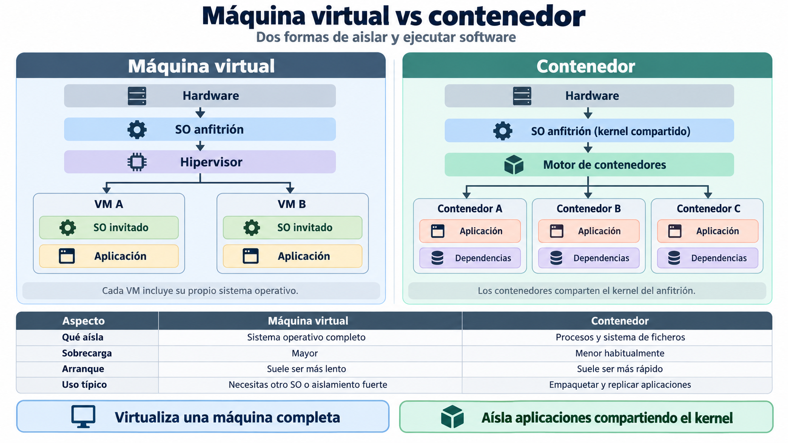
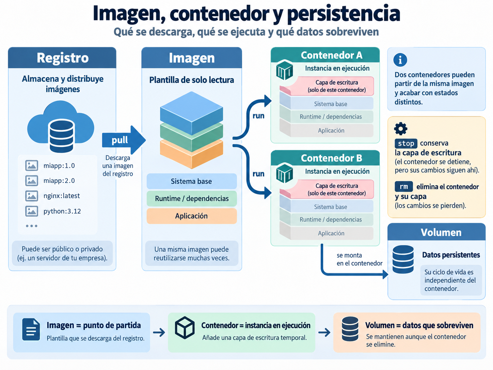
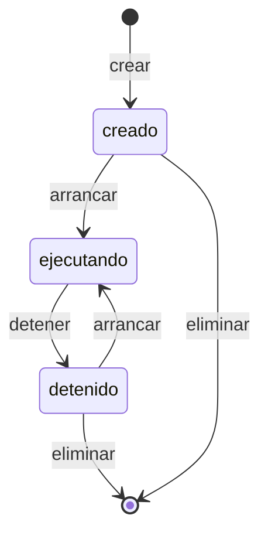
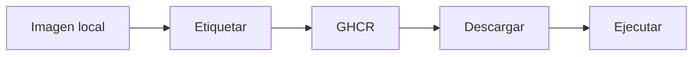

# 📦 Fundamentos de contenedores

!!! info "Descarga de diapositivas"
    [Descarga las diapositivas](diapositivas/fundamentos-contenedores.pdf){target="_blank" rel="noopener"}

---

En el Tema 1 preparaste una **fuente de verdad**: el repositorio contiene el código, la configuración versionable y la documentación necesaria para entender un estado del proyecto.

Pero Git no instala Java, PostgreSQL ni las bibliotecas que necesita una aplicación. Tampoco garantiza que dos máquinas tengan exactamente el mismo entorno de ejecución.

En esta sesión aparece el segundo gran problema del módulo: **cómo empaquetar y ejecutar software de forma reproducible**.

!!! abstract "Mapa de la sesión"
    **Entorno reproducible → imagen → contenedor → ejecución → persistencia → construcción → publicación**

    Hoy no necesitas dominar Docker. El objetivo es comprender sus piezas básicas y utilizarlas sobre contenedores reales antes de aplicar estas ideas al proyecto Escaparate.

---

## 🧳 1. Del código al entorno reproducible

Copiar el código de una aplicación no basta para reproducir su ejecución. También pueden importar:

- el artefacto construido;
- el runtime y sus versiones;
- bibliotecas y herramientas necesarias;
- configuración externa;
- servicios auxiliares;
- directorios, permisos y puertos.

En una aplicación web Java, por ejemplo, la imagen de la aplicación podría contener:

```text
imagen de la aplicación
├── runtime de Java
└── aplicación Spring Boot
    └── servidor HTTP embebido
```

Eso no significa que todo el sistema deba vivir en un único contenedor. La aplicación, la base de datos y un posible proxy o servidor web pueden ser **piezas desplegables distintas**.

Antes de los contenedores ya existían otras formas de intentar reproducir entornos, y siguen siendo útiles:

| Enfoque | Qué aporta | Limitación habitual |
|---|---|---|
| **Documentación de instalación** | Explica cómo preparar el entorno | Depende de que los pasos se mantengan actualizados y se ejecuten correctamente |
| **Scripts de aprovisionamiento** | Automatizan gran parte de la preparación | Siguen dependiendo del sistema de destino y de sus paquetes |
| **Máquina virtual** | Empaqueta un sistema operativo completo | Tiene más sobrecarga y suele necesitar más recursos |
| **Contenedor** | Empaqueta aplicación y dependencias sobre un entorno aislado | Comparte el núcleo del anfitrión y necesita un motor de contenedores |

Los contenedores tampoco son únicamente una tecnología de producción. Su capacidad para crear entornos **aislados, reproducibles y desechables** resulta útil en distintas fases del ciclo de vida del software.

| Fase | Qué pueden aportar los contenedores |
|---|---|
| **Diseño y experimentación** | Probar tecnologías o arquitecturas sin realizar instalaciones permanentes en el equipo |
| **Desarrollo** | Compartir entornos coherentes, aislar proyectos y reducir diferencias entre equipos |
| **Pruebas e integración** | Crear entornos temporales y repetibles para ejecutar pruebas y comprobaciones |
| **Construcción** | Controlar las herramientas y dependencias utilizadas para generar el artefacto |
| **Seguridad y calidad** | Analizar y endurecer la unidad que posteriormente se ejecutará |
| **Distribución** | Empaquetar y versionar conjuntamente aplicación y entorno de ejecución |
| **Despliegue y operación** | Ejecutar la misma unidad en diferentes entornos, sustituir versiones y crear nuevas réplicas |

!!! tip "Una misma idea en distintas fases"
    Un contenedor puede utilizarse durante meses para ejecutar una aplicación o existir únicamente durante unos segundos para realizar una prueba. Su valor está en poder **crear de forma predecible el entorno que necesita un proceso y sustituirlo cuando deja de ser necesario**.

El valor del contenedor no es simplemente «instalar cosas sin ensuciar el ordenador». Su ventaja principal para despliegue es poder **crear una unidad reproducible que se ejecuta de forma equivalente en distintos entornos compatibles**.

---

## 🆚 2. Máquina virtual y contenedor

Máquinas virtuales y contenedores permiten ejecutar software en **entornos aislados**, pero lo hacen a niveles diferentes.



*Figura 1. Diferencias básicas entre una máquina virtual y un contenedor. Elaboración propia.*

En una **máquina virtual**, el hipervisor proporciona hardware virtual sobre el que se ejecuta un **sistema operativo invitado completo**. Cada VM dispone de su propio núcleo, servicios y entorno de ejecución.

Un **contenedor Linux**, en cambio, aísla procesos, red y sistema de ficheros, pero **comparte el núcleo Linux del entorno anfitrión**. El contenedor incorpora la aplicación y las dependencias que necesita, pero no otro kernel ni un sistema operativo invitado completo.

Esta diferencia explica por qué los contenedores suelen requerir **menos recursos y arrancar más rápido**, mientras que una máquina virtual proporciona un aislamiento más completo y permite ejecutar sistemas operativos diferentes.

!!! warning "No son alternativas excluyentes"
    Es muy habitual ejecutar **contenedores dentro de máquinas virtuales**. En este módulo harás precisamente eso cuando despliegues contenedores sobre una instancia en la nube: la máquina virtual proporciona el entorno Linux y Docker ejecuta los contenedores dentro de ella.

!!! info "Windows y macOS"
    Los contenedores Linux necesitan un **núcleo Linux**. Por eso, en Windows o macOS, Docker utiliza normalmente un entorno Linux virtualizado por debajo. En los equipos Linux del aula pueden utilizar directamente el núcleo del propio sistema.

---

## 🧩 3. Imagen, contenedor y persistencia

En Docker aparecen constantemente varias ideas relacionadas, pero no equivalentes:

- **registro**: lugar donde se almacenan y distribuyen imágenes;
- **imagen**: plantilla de solo lectura a partir de la cual se crean contenedores;
- **contenedor**: instancia creada desde una imagen;
- **volumen**: almacenamiento con un ciclo de vida independiente del contenedor.



*Figura 2. Relación entre registro, imagen, contenedor y volumen. Elaboración propia.*

La secuencia general es sencilla: una imagen se descarga desde un registro, sirve como punto de partida para crear uno o varios contenedores y cada contenedor incorpora su propia capa de escritura. Si ciertos datos deben sobrevivir aunque el contenedor desaparezca, se almacenan fuera de esa capa.

### 3.1. Registro, imagen y etiqueta

Un **registro** almacena y distribuye imágenes. Docker Hub contiene muchas imágenes públicas que utilizarás durante el curso; para publicar las tuyas utilizaremos GitHub Container Registry, `ghcr.io`.

Una referencia de imagen suele tener esta forma:

```text
registro/propietario/imagen:etiqueta
```

Por ejemplo:

```text
ghcr.io/ana/mi-app:1.0.0
```

| Parte | Valor |
|---|---|
| Registro | `ghcr.io` |
| Propietario | `ana` |
| Imagen | `mi-app` |
| Etiqueta | `1.0.0` |

Una **imagen** es una plantilla preparada para ejecutarse. Suele incluir:

- un sistema base mínimo;
- el runtime o las dependencias necesarias;
- la aplicación;
- ciertos ficheros de configuración de partida.

!!! warning "`latest` es solo una etiqueta"
    `latest` no significa automáticamente «la versión más reciente». Es simplemente una etiqueta y puede apuntar a contenidos distintos con el tiempo.

    En este módulo trabajaremos preferentemente con **etiquetas explícitas**, como `1.0.0`.

??? info "Más precisión: etiquetas y digests"
    Las etiquetas también pueden reasignarse. Cuando necesitas identificar de forma exacta el contenido de una imagen, Docker permite referenciarla mediante su **digest**.

    No necesitas trabajar con digests en esta sesión.

### 3.2. Imagen y contenedor

Una imagen **no es una ejecución concreta**. Lo que Docker crea a partir de ella es un **contenedor**.

Eso significa que una misma imagen puede reutilizarse muchas veces:

```text
una imagen
   ├── contenedor A
   ├── contenedor B
   └── contenedor C
```

Todos parten del mismo contenido de solo lectura, pero cada contenedor añade una **capa de escritura propia**. Por eso dos contenedores creados desde la misma imagen pueden acabar teniendo ficheros diferentes.

!!! info "La idea importante"
    **Imagen** y **contenedor** no son lo mismo: la imagen es el punto de partida reproducible; el contenedor es una instancia concreta creada a partir de ella.

### 3.3. Detener, eliminar y recrear

La capa de escritura pertenece al contenedor, no a la imagen.

Por eso:

- `docker stop` detiene el proceso, pero el contenedor sigue existiendo y conserva sus cambios;
- `docker start` vuelve a ejecutar ese mismo contenedor;
- `docker rm` elimina el contenedor y su capa de escritura;
- crear otro contenedor desde la misma imagen vuelve a partir del estado definido por la imagen.

Este comportamiento será uno de los experimentos principales de la actividad: modificarás un contenedor y comprobarás que **la imagen original no ha cambiado**.

### 3.4. Cuándo hace falta persistencia

Algunos datos no deberían depender de la vida de un contenedor. Por ejemplo:

- datos de una base de datos;
- ficheros subidos por usuarios;
- información que debe mantenerse aunque el contenedor se sustituya.

Para esos casos se utilizan mecanismos de almacenamiento externos, como los **volúmenes**.

!!! tip "Regla práctica"
    Si un dato debe sobrevivir a `docker rm`, no debería quedarse únicamente en la capa de escritura del contenedor.

En esta sesión necesitas entender el problema. Más adelante configurarás estos mecanismos de forma explícita.

### 3.5. Artefacto de aplicación e imagen

Docker no elimina el concepto de artefacto de aplicación. Añade una unidad reproducible alrededor de él.

```text
artefacto de aplicación
→ por ejemplo, un WAR o JAR

imagen de contenedor
→ artefacto + runtime + ficheros necesarios para ejecutarlo
```

Un mismo WAR podría formar parte de una imagen autocontenida o desplegarse de otra forma sobre un servidor de aplicaciones externo.

### 3.6. Cliente y motor

Cuando escribes un comando como:

```bash
docker run ...
```

el comando `docker` actúa como **cliente**. Las operaciones reales —descargar imágenes, crear contenedores, arrancar procesos o montar volúmenes— las realiza el **motor de Docker** que se ejecuta en la máquina.

---

## 🔄 4. Ciclo de vida de un contenedor

Una vez creado, un contenedor puede pasar por distintos estados:



- **Creado**: el contenedor existe, pero todavía no está ejecutándose.
- **Ejecutando**: su proceso principal está activo.
- **Detenido**: el proceso ha terminado, pero el contenedor sigue existiendo.
- **Eliminado**: desaparece el contenedor y también su capa de escritura.

!!! tip "Contenedor no significa máquina"
    Un contenedor en ejecución depende de su **proceso principal**. Si ese proceso termina, el contenedor pasa a estar detenido.

---

## ▶️ 5. Ejecutar, observar y diagnosticar

No necesitas memorizar todos los comandos. Lo importante es asociar cada uno con una pregunta.

| Pregunta | Comando habitual |
|---|---|
| ¿Qué contenedores están ejecutándose? | `docker ps` |
| ¿Qué contenedores existen, también detenidos? | `docker ps -a` |
| ¿Qué ha escrito el proceso? | `docker logs <contenedor>` |
| ¿Qué hay dentro? | `docker exec -it <contenedor> sh` |
| ¿Con qué configuración arrancó? | `docker inspect <contenedor>` |
| ¿Quiero detenerlo sin eliminarlo? | `docker stop <contenedor>` |
| ¿Quiero arrancarlo de nuevo? | `docker start <contenedor>` |
| ¿Quiero eliminarlo? | `docker rm <contenedor>` |

### 5.1. Construir un `docker run`

La forma general es:

```text
docker run [opciones] <imagen>
```

Por ejemplo:

```bash
docker run -d --name web-demo -p 8088:80 nginx:1.30.4-alpine
```

Se lee así:

| Parte | Significado |
|---|---|
| `-d` | ejecuta en segundo plano |
| `--name web-demo` | asigna un nombre reconocible |
| `-p 8088:80` | publica `anfitrión:contenedor` |
| `nginx:1.30.4-alpine` | imagen y etiqueta |

Puedes comprobarlo con:

```bash
docker ps
docker logs web-demo
```

y entrar dentro con:

```bash
docker exec -it web-demo sh
```

Las imágenes mínimas no siempre incluyen `bash`, por eso utilizaremos normalmente `sh`.

### 5.2. Una rutina de diagnóstico

Cuando algo no funcione, empieza siempre por estas tres preguntas:

```text
1. ¿Está ejecutándose?
        ↓
2. ¿Qué dicen los logs?
        ↓
3. ¿Necesito inspeccionarlo por dentro?
```

En comandos:

```bash
docker ps -a
docker logs <contenedor>
docker exec -it <contenedor> sh
```

!!! tip "El reflejo que te interesa adquirir"
    No empieces recreando contenedores al azar. Primero comprueba **estado → logs → interior**. La mayoría de los errores dejan alguna pista antes de que necesites modificar nada.

---

## 🔌 6. Puertos y configuración externa

Un contenedor conectado a una red de Docker no publica automáticamente sus servicios hacia la máquina anfitriona.

Para acceder desde fuera se puede **publicar un puerto**:

```text
-p anfitrión:contenedor
```

Por ejemplo:

```text
-p 8080:80
```

significa:

```text
navegador → localhost:8080 → puerto 80 del contenedor
```

!!! warning "Publicar es una decisión"
    Un servicio no debe exponer al anfitrión todos sus puertos por costumbre. Más adelante verás que una base de datos utilizada únicamente por la aplicación puede mantenerse accesible solo dentro de la red del despliegue.

La otra decisión importante es la **configuración**. La imagen debe poder reutilizarse con valores distintos según el entorno.

Con `docker run` puedes pasar variables mediante:

```text
-e NOMBRE=valor
```

Por ejemplo:

```bash
docker run -d --name ejemplo-bd \
  -e POSTGRES_USER=usuario_demo \
  -e POSTGRES_PASSWORD=clave_demo \
  -e POSTGRES_DB=tienda_demo \
  postgres:18-alpine
```

La misma imagen puede arrancar después con otros valores sin necesidad de reconstruirse.

!!! danger "Un secreto no debe quedar incorporado a la imagen"
    En las prácticas utilizarás credenciales de prueba para comprender el mecanismo. Las credenciales reales requieren mecanismos adecuados y no deben escribirse en el Dockerfile, versionarse ni aparecer en capturas.

---

## 💾 7. Montajes y redes

La imagen anterior ha introducido la idea de volumen. Aquí distinguimos brevemente los dos mecanismos de montaje que aparecerán más adelante y situamos cómo se comunicarán varios contenedores.

### 7.1. Volumen y bind mount

Cuando un dato debe sobrevivir al contenedor se puede almacenar fuera de su capa de escritura.

| | Volumen | Bind mount |
|---|---|---|
| **Quién decide la ubicación** | Docker | Tú |
| **Referencia** | Nombre del volumen | Ruta del anfitrión |
| **Uso habitual** | Datos persistentes | Configuración o ficheros del anfitrión |
| **Dependencia de rutas locales** | Baja | Mayor |

Un **volumen** suele encajar bien con datos gestionados por una aplicación, como los de una base de datos. Un **bind mount** permite montar en el contenedor una ruta concreta del anfitrión.

No utilizarás todavía estos mecanismos en la actividad de hoy. Primero comprobarás qué ocurre cuando los datos permanecen únicamente dentro del contenedor.

### 7.2. Redes entre contenedores

Los contenedores conectados al **bridge por defecto** pueden comunicarse por IP, pero no disponen del descubrimiento automático por nombre que ofrecen las redes bridge creadas por el usuario.

Más adelante crearás una red propia y podrás trabajar con nombres como:

```text
app → bd
```

en lugar de depender de direcciones IP concretas.

Por ahora basta con distinguir:

- **publicar un puerto** permite acceder desde el anfitrión;
- una **red de Docker** permite comunicar contenedores entre sí.

---

## 🧾 8. Construir una imagen: Dockerfile y contexto

Hasta ahora has ejecutado imágenes creadas por otras personas. Para construir una propia necesitas un **Dockerfile**.

### 8.1. `FROM` y `COPY`

En esta sesión solo necesitas dos instrucciones:

| Instrucción | Función |
|---|---|
| `FROM` | indica la imagen de partida |
| `COPY` | incorpora ficheros desde el contexto de construcción |

Ejemplo:

```dockerfile
FROM alpine:3.24
COPY material/ /datos/
```

### 8.2. El contexto de construcción

`COPY` no puede leer cualquier fichero del equipo. Solo puede utilizar rutas incluidas en el **contexto de construcción**.

Imagina:

```text
repositorio/
├── material/
│   └── ejemplo.txt
└── practicas/
    └── docker/
        └── demo/
            └── Dockerfile
```

Desde la raíz del repositorio puedes ejecutar:

```bash
docker build \
  -f practicas/docker/demo/Dockerfile \
  -t ejemplo:1.0.0 \
  .
```

| Parte | Significado |
|---|---|
| `-f .../Dockerfile` | ubicación del Dockerfile |
| `-t ejemplo:1.0.0` | nombre y etiqueta de la imagen |
| `.` | contexto de construcción |

!!! warning "Dockerfile y contexto son decisiones distintas"
    El Dockerfile puede estar dentro de `practicas/`, mientras el contexto puede ser la raíz del repositorio si necesitas copiar ficheros que se encuentran en otras carpetas.

    En la próxima sesión estudiarás cómo reducir ese contexto mediante `.dockerignore` y cómo aprovechar mejor la caché de construcción.

---

## 📤 9. Publicar una imagen

Una imagen local:

```text
mi-app:1.0.0
```

puede recibir otra referencia preparada para GHCR:

```bash
docker tag mi-app:1.0.0 \
  ghcr.io/<usuario>/mi-app:1.0.0
```

Después Docker debe autenticarse contra `ghcr.io`:

```bash
docker login ghcr.io -u <usuario>
```

Cuando solicite la contraseña, utiliza el PAT preparado para el curso. La autenticación de Docker contra `ghcr.io` es independiente de la autenticación de Git contra `github.com`.

Publica:

```bash
docker push ghcr.io/<usuario>/mi-app:1.0.0
```

Otra máquina podrá descargarla con:

```bash
docker pull ghcr.io/<usuario>/mi-app:1.0.0
```

El recorrido es:



!!! tip "La idea importante"
    Publicar una imagen separa **construcción** y **ejecución**. La máquina que la ejecuta no necesita disponer de tu código fuente ni repetir el proceso de construcción.

---

## 🎯 Qué debes saber hacer al salir de esta sesión

Al terminar deberías poder:

- distinguir **imagen, contenedor, registro y etiqueta**;
- explicar por qué detener un contenedor no equivale a eliminarlo;
- ejecutar un contenedor combinando nombre, puertos y variables de entorno;
- diagnosticar siguiendo la secuencia **estado → logs → interior**;
- explicar por qué los datos de la capa de escritura desaparecen al eliminar el contenedor;
- escribir un Dockerfile mínimo con `FROM` y `COPY` y elegir correctamente el contexto de construcción;
- etiquetar, publicar y volver a descargar una imagen desde GHCR.

---

## ✅ Ideas clave

??? tip "Abrir resumen"

    - Git versiona el proyecto; una **imagen** empaqueta el entorno necesario para ejecutarlo.
    - Los contenedores pueden aportar reproducibilidad durante **desarrollo, pruebas, construcción, distribución y despliegue**, no solo en producción.
    - Una VM incluye un sistema operativo invitado; un contenedor Linux comparte el núcleo del entorno anfitrión.
    - **Imagen** es el punto de partida; **contenedor** es una instancia creada desde ella.
    - Cada contenedor tiene su propia capa de escritura: detenerlo la conserva; eliminarlo la destruye.
    - `latest` es una etiqueta, no una garantía de «última versión».
    - Publicar un puerto es una decisión explícita: `anfitrión:contenedor`.
    - La configuración puede cambiar al arrancar sin reconstruir la imagen.
    - Los datos persistentes necesitan un ciclo de vida independiente del contenedor.
    - Dockerfile y contexto de construcción no son lo mismo.
    - Un registro permite construir una imagen en un lugar y ejecutarla en otro.

---

En la actividad aplicarás estas ideas al proyecto Escaparate mediante Nginx y PostgreSQL: ejecutarás e inspeccionarás contenedores, comprobarás qué ocurre con su estado, construirás una imagen mínima y la publicarás en GHCR.
