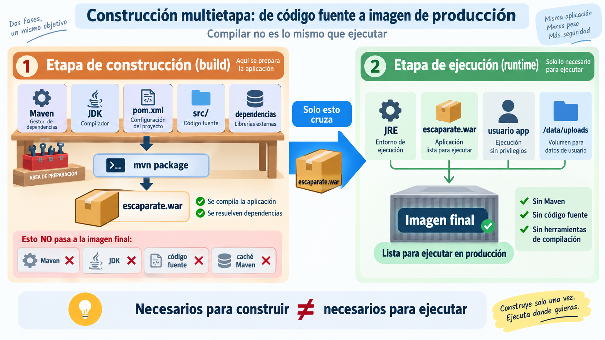

# 🏗️ Imágenes de contenedores

!!! info "Descarga de diapositivas"
    <!-- [Descarga las diapositivas](diapositivas/imagenes-contenedores.pptx){target="_blank" rel="noopener"} -->

---

En la sesión anterior construiste una imagen muy sencilla: elegiste una base con `FROM` y añadiste contenido con `COPY`.

Empaquetar una aplicación que antes debe **compilarse** introduce nuevos problemas. Ahora no basta con conseguir que la imagen funcione: también interesa que pueda reconstruirse con rapidez, que no incluya material innecesario y que ejecute la aplicación con los privilegios mínimos necesarios.

!!! abstract "Mapa de la sesión"
    **Dockerfile → contexto → caché → multietapa → runtime → publicación**

    Partirás de una imagen funcional y la irás mejorando. Cada cambio resolverá un problema distinto: **qué enviamos al builder, qué podemos reutilizar, qué debe llegar a producción y con qué privilegios se ejecuta**.

---

## 🧾 1. El Dockerfile describe la construcción

Un **Dockerfile** es un fichero de texto que indica cómo construir una imagen y cómo debe arrancar después el contenedor.

En esta sesión utilizarás sobre todo estas instrucciones:

| Instrucción | Función |
|---|---|
| `FROM` | elige una imagen de partida |
| `WORKDIR` | fija el directorio de trabajo |
| `COPY` | incorpora ficheros desde el contexto |
| `RUN` | ejecuta órdenes durante la construcción |
| `USER` | selecciona el usuario que ejecutará el proceso |
| `EXPOSE` | documenta el puerto esperado |
| `ENTRYPOINT` / `CMD` | indican qué se ejecuta al arrancar |

!!! info "Construcción y ejecución no son lo mismo"
    `RUN` se ejecuta **mientras se construye la imagen**. `ENTRYPOINT` y `CMD` describen qué ocurrirá **cuando se cree un contenedor** a partir de ella.

Otras instrucciones, como `ENV`, `ARG` o `LABEL`, también son habituales, pero no necesitas dominarlas todas hoy.

Una primera versión para una aplicación Java/Maven podría ser:

```dockerfile
FROM maven:3.9.16-eclipse-temurin-21-alpine
WORKDIR /app

COPY . .
RUN mvn -B package -DskipTests

ENTRYPOINT ["java", "-jar", "target/<artefacto>.war"]
```

Esta imagen puede funcionar, pero mezcla dos necesidades distintas:

```text
compilar
→ Maven + JDK + código fuente

ejecutar
→ Java + artefacto construido
```

El objetivo de la sesión será separar ambas.

!!! info "Por qué aquí aparece `-DskipTests`"
    En esta sesión aislamos el problema de **construcción de la imagen**. Las pruebas se incorporarán explícitamente al proceso cuando trabajes con integración continua.

---

## 📤 2. Dockerfile, contexto y `.dockerignore`

Cuando ejecutas:

```bash
docker build -t mi-app:prueba .
```

el último argumento (`.`) indica el **contexto de construcción**: los ficheros que Docker puede utilizar durante el build.

El Dockerfile puede encontrarse en otro lugar.

### 2.1. El Dockerfile no tiene que estar dentro del contexto

Por ejemplo:

```bash
docker build \
  -f practicas/docker/app/Dockerfile \
  -t mi-app:prueba \
  escaparate/
```

Aquí:

```text
Dockerfile
→ practicas/docker/app/Dockerfile

contexto
→ escaparate/
```

Por tanto, una instrucción:

```dockerfile
COPY pom.xml .
```

buscará `pom.xml` dentro de `escaparate/`, no junto al Dockerfile.

Esto permite mantener los ficheros técnicos de despliegue en `practicas/` sin alterar qué contenido puede utilizar la construcción.

### 2.2. `.dockerignore`: qué no debe entrar

No todo lo que existe dentro del contexto debe enviarse al builder.

Un `.dockerignore` colocado en la raíz del contexto puede excluir, por ejemplo:

```dockerignore
target/
.idea/
.vscode/
*.iml

.env
.env.*

uploads/
```

Esto ayuda a:

- reducir el contexto;
- evitar invalidaciones de caché por ficheros irrelevantes;
- disminuir el riesgo de incorporar accidentalmente contenido local o sensible.

!!! warning "`.gitignore` y `.dockerignore` no son lo mismo"
    `.gitignore` decide qué queda fuera del **historial Git**. `.dockerignore` decide qué queda fuera del **contexto de construcción**.

---

## 🧊 3. Caché: evitar trabajo repetido

Docker intenta reutilizar resultados de builds anteriores. Para aprovechar esa caché, interesa separar las partes que cambian poco de las que cambian constantemente.

Un Dockerfile como este:

```dockerfile
COPY . .
RUN mvn -B package -DskipTests
```

depende de todo el contexto. Un cambio mínimo en una clase Java puede obligar a repetir pasos costosos.

Una organización más útil es:

```dockerfile
COPY pom.xml .
RUN mvn -B dependency:go-offline

COPY src ./src
RUN mvn -B package -DskipTests
```

La idea es:

```text
pom.xml
cambia poco
   ↓
resolver dependencias
   ↓
resultado reutilizable

src/
cambia mucho
   ↓
compilar de nuevo
```

!!! tip "Regla práctica"
    Coloca antes los pasos que dependen de ficheros **menos volátiles** y después los que dependen de contenido que cambia con frecuencia.

`dependency:go-offline` ayuda a anticipar muchas descargas de Maven, aunque algún plugin o dependencia adicional todavía podría resolverse durante la compilación.

### 3.1. Medir correctamente

En esta sesión compararás dos métricas distintas:

1. **tiempo de construcción**;
2. **tamaño de la imagen**.

En Linux puedes medir:

```bash
time docker build ...
```

y consultar después:

```bash
docker image ls escaparate:ingenua
docker image ls escaparate:optimizada
```

La columna `SIZE` representa el tamaño acumulado de la imagen y sus capas padre y permite comparar ambas si utilizas la misma métrica en todos los casos.

!!! info "Tamaño de imagen y uso total de disco no responden a la misma pregunta"
    `docker image ls` permite comparar imágenes concretas. `docker system df` muestra cuánto espacio utiliza Docker en conjunto y puede verse afectado por cachés, capas compartidas y otros objetos.

!!! warning "Caché y tamaño final son problemas distintos"
    Ordenar bien las instrucciones puede acelerar reconstrucciones. Eso **no elimina automáticamente Maven, el JDK o el código fuente de la imagen final**.

---

## 🪆 4. Construcción multietapa: compilar no es ejecutar

Para **construir** Escaparate hacen falta Maven, el JDK, el código fuente y las dependencias necesarias para generar el artefacto.

Para **ejecutarlo** necesitamos mucho menos:

```text
JRE
+ WAR ejecutable
```

El WAR de Escaparate es ejecutable: al arrancarlo, Spring Boot inicia su **Tomcat embebido** en el puerto 8080. No hace falta instalar un Tomcat externo dentro de la imagen.



*Figura 1. En una construcción multietapa, las herramientas necesarias para compilar no tienen por qué formar parte de la imagen final. Elaboración propia.*

La figura resume el principio fundamental: la primera etapa dispone de todas las herramientas necesarias para **fabricar** la aplicación; la segunda recibe únicamente el resultado que necesita para **ejecutarla**.

En nuestro caso, `mvn package` genera `escaparate.war` y ese artefacto es lo único que necesitamos trasladar desde la etapa de construcción a la de ejecución.

> La figura anticipa además dos decisiones que veremos en el apartado siguiente: ejecutar con un **usuario sin privilegios** y preparar una **ruta escribible** para los ficheros generados por la aplicación.

Un Dockerfile multietapa puede expresar ese proceso así:

```dockerfile
# Etapa 1: construcción
FROM maven:3.9.16-eclipse-temurin-21-alpine AS build
WORKDIR /app

COPY pom.xml .
RUN mvn -B dependency:go-offline

COPY src ./src
RUN mvn -B package -DskipTests \
    && cp target/*.war /tmp/app.war

# Etapa 2: ejecución
FROM eclipse-temurin:21.0.12_8-jre-alpine-3.24
WORKDIR /app

COPY --from=build /tmp/app.war /app/app.war

EXPOSE 8080
ENTRYPOINT ["java", "-jar", "/app/app.war"]
```

El segundo `FROM` inicia una **nueva etapa**. La imagen final no hereda automáticamente todo lo que había en la etapa anterior: solo recibe aquello que copiamos explícitamente con `COPY --from=build`.

Por eso la imagen de ejecución ya no necesita contener:

- Maven;
- el JDK completo utilizado para compilar;
- el código fuente;
- la caché y otros materiales de construcción.

!!! info "Dos niveles de empaquetado"
    Conviene distinguir:

    ```text
    WAR
    → artefacto de la aplicación Java

    imagen
    → unidad de despliegue con JRE + WAR
    ```

!!! note "Las dependencias necesarias no desaparecen"
    Las bibliotecas Java requeridas para ejecutar la aplicación siguen dentro del artefacto. Lo que dejamos atrás son **herramientas y materiales de construcción** que producción no necesita.

!!! tip "No confundas las dos optimizaciones"
    La construcción multietapa reduce principalmente **qué termina dentro de la imagen final**. La mejora del tiempo de reconstrucción procede sobre todo de la **caché** estudiada en el apartado anterior.

??? info "Para saber más: una etapa puede producir otros resultados"
    Una construcción puede incluir etapas destinadas a generar informes u otros artefactos sin incorporarlos a la imagen final.

    Docker permite incluso construir una etapa concreta mediante `--target`. No necesitas utilizarlo en esta sesión.

---

## 🛡️ 5. Una imagen preparada para ejecutar

Reducir el tamaño no es la única mejora. La imagen final debe ejecutar la aplicación con los recursos y privilegios que realmente necesita.

### 5.1. Usuario sin privilegios

Si no se configura otro usuario, muchos contenedores terminan ejecutando su proceso como `root`.

Para una aplicación web es preferible crear un usuario específico:

```dockerfile
RUN addgroup -S app \
    && adduser -S app -G app

USER app
```

Pero quitar privilegios tiene una consecuencia: la aplicación ya no podrá escribir en cualquier ruta.

Escaparate almacena ficheros durante la ejecución, así que debemos preparar explícitamente un directorio:

```dockerfile
RUN addgroup -S app \
    && adduser -S app -G app \
    && mkdir -p /data/uploads \
    && chown -R app:app /data

ENV APP_STORAGE_PATH=/data/uploads

USER app
```

Aquí cada decisión tiene una función:

| Elemento | Función |
|---|---|
| `/data/uploads` | ruta disponible para escritura |
| `chown` | entrega esa ruta al usuario de la aplicación |
| `APP_STORAGE_PATH` | indica a Escaparate dónde almacenar |
| `USER app` | evita ejecutar el proceso como `root` |

!!! warning "`USER` no es solo añadir una línea"
    Si la aplicación necesita escribir en runtime, debes preparar antes los directorios y permisos necesarios.

### 5.2. Runtime ajustado

La etapa final debe incluir únicamente lo necesario para ejecutar y diagnosticar razonablemente la aplicación.

| Base | Ventaja | Limitación |
|---|---|---|
| Imagen completa | más herramientas disponibles | más software innecesario |
| Variante mínima (`alpine`, `slim`) | menor tamaño habitual | pueden faltar herramientas o bibliotecas |
| Distroless | superficie muy reducida | diagnóstico interactivo más difícil |

En este módulo utilizaremos variantes mínimas que todavía permitan inspeccionar el contenedor cuando sea necesario.

!!! info "Una imagen también envejece"
    Aunque tu código no cambie, la imagen base y sus paquetes pueden recibir correcciones de seguridad. Por eso una estrategia real de mantenimiento incluye reconstruir y actualizar las imágenes periódicamente.

### 5.3. Cada optimización resuelve un problema diferente

Una imagen preparada para desplegar combina varias decisiones:

| Mejora | Problema que resuelve |
|---|---|
| `.dockerignore` | contexto innecesario o sensible |
| ordenar capas | reconstrucciones costosas |
| multietapa | herramientas de build en producción |
| runtime mínimo | tamaño y superficie de software |
| usuario sin privilegios | permisos excesivos |
| rutas escribibles controladas | escritura segura durante la ejecución |

No todas las mejoras persiguen lo mismo. Conviene decir siempre si estamos intentando reducir **tiempo**, **tamaño**, **privilegios** o **superficie de ataque**.

---

## 🏷️ 6. Identificar y publicar la imagen

Una misma imagen puede tener varias referencias:

```text
ghcr.io/usuario/escaparate:sesion-04
ghcr.io/usuario/escaparate:latest
```

La primera puede tratarse como **estable por convención** para identificar el resultado de una sesión. `latest`, en cambio, es una etiqueta móvil que puede apuntar a otra imagen en el futuro.

!!! warning "Una etiqueta no es técnicamente inmutable"
    Aunque decidamos no reutilizar `sesion-04`, un registro permite reasignar una etiqueta. El **digest** (`sha256:...`) es la referencia ligada al contenido exacto.

Para publicar:

```bash
docker login ghcr.io -u <usuario>

docker tag escaparate:optimizada \
  ghcr.io/<usuario>/escaparate:sesion-04

docker push ghcr.io/<usuario>/escaparate:sesion-04
```

La misma imagen puede recibir además `latest` sin duplicar su contenido:

```bash
docker tag escaparate:optimizada \
  ghcr.io/<usuario>/escaparate:latest

docker push ghcr.io/<usuario>/escaparate:latest
```

Mientras ambas referencias apunten al mismo digest, identifican el mismo contenido.

---

## 🎯 Qué debes saber hacer al salir de esta sesión

Al terminar deberías poder:

- distinguir el **Dockerfile** del contexto de construcción;
- utilizar `.dockerignore` para reducir el contexto;
- ordenar instrucciones para aprovechar mejor la caché;
- diferenciar una mejora de **tiempo de reconstrucción** de una reducción de **tamaño final**;
- construir una imagen multietapa;
- explicar qué atraviesa la frontera entre etapa de build y etapa de runtime;
- ejecutar la aplicación con un usuario sin privilegios y una ruta escribible preparada;
- comparar de forma consistente tiempo y tamaño;
- publicar una imagen con una referencia estable por convención y otra móvil.

---

## ✅ Ideas clave

??? tip "Abrir resumen"

    - El Dockerfile describe la construcción; el **contexto** determina qué ficheros pueden utilizar sus `COPY`.
    - `.dockerignore` reduce lo que Docker recibe durante la construcción.
    - La caché funciona mejor cuando colocamos primero lo que cambia menos.
    - **Caché** y **multietapa** resuelven problemas distintos: una reduce trabajo repetido; la otra reduce lo que llega a producción.
    - Escaparate puede compilarse con Maven + JDK y ejecutarse después únicamente con **JRE + WAR**.
    - El segundo `FROM` marca una nueva etapa; solo pasa a ella lo que copiamos explícitamente.
    - Ejecutar como usuario sin privilegios requiere preparar las rutas que la aplicación necesita escribir.
    - Una imagen más pequeña no es automáticamente «mejor»: cada optimización debe responder a un objetivo concreto.
    - `latest` es una etiqueta móvil; un digest identifica contenido exacto.

---

En la actividad partirás de una imagen funcional de Escaparate y la transformarás en una imagen más adecuada para despliegue, comparando con datos reales qué mejora cada decisión.
