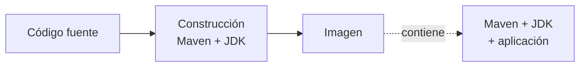
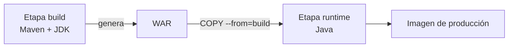

# 🏗️ Imágenes de contenedores

!!!info "Descarga de diapositivas"
    [Descarga las diapositivas](diapositivas/imagenes-contenedores.pptx){target="_blank" rel="noopener"}

---

En la sesión anterior construiste una primera imagen con un `Dockerfile` mínimo: `FROM` para elegir una base y `COPY` para añadir contenido propio. Eso era suficiente porque la imagen base ya contenía el software principal.

Empaquetar una aplicación que debe **compilarse** añade nuevas decisiones. Hay que fabricar el artefacto, aprovechar la caché, evitar contenido innecesario y dejar en la imagen final solo lo necesario para ejecutar. Hoy estudiarás esos patrones con una aplicación Java/Maven.

---

## 🧾 1. El Dockerfile es la receta

Un **Dockerfile** es un fichero de texto que describe cómo construir una imagen. Algunas instrucciones modifican el sistema de ficheros y generan capas reutilizables; otras añaden metadatos sobre cómo debe ejecutarse la imagen.

| Instrucción | Qué hace | Lo que conviene saber |
|---|---|---|
| `FROM` | Fija la imagen base | Usa una referencia concreta, no `latest` |
| `WORKDIR` | Establece el directorio de trabajo | Lo crea si no existe |
| `COPY` | Copia ficheros desde el contexto de construcción | Solo puede ver rutas incluidas en ese contexto |
| `RUN` | Ejecuta un comando **durante la construcción** | Su resultado queda incorporado a la imagen |
| `ENV` | Define variables disponibles al ejecutar | Útil para valores por defecto no sensibles |
| `ARG` | Define valores disponibles durante la construcción | No debe utilizarse para secretos |
| `USER` | Define el usuario del proceso | Evita ejecutar la aplicación como `root` |
| `EXPOSE` | Documenta el puerto esperado | No publica ningún puerto |
| `CMD` | Define el comando o argumentos por defecto | Puede sustituirse al ejecutar |
| `ENTRYPOINT` | Define el proceso principal por defecto | Suele fijar el ejecutable de la aplicación |
| `LABEL` | Añade metadatos | Puede indicar versión, autoría o repositorio |

Un primer intento de empaquetar una aplicación Java podría ser:

```dockerfile
FROM maven:3.9.16-eclipse-temurin-21-alpine
WORKDIR /app
COPY . .
RUN mvn -B package -DskipTests
CMD ["java", "-jar", "target/<artefacto>.war"]
```

Sustituye `<artefacto>` por el nombre real generado por Maven, que puedes identificar en el proyecto.

La idea es sencilla:



Este enfoque puede funcionar, pero tiene varios problemas: envía demasiado contenido al motor, invalida la caché con facilidad y deja dentro de la imagen final herramientas que solo eran necesarias para compilar.

!!! info "Por qué aquí aparece `-DskipTests`"
    En esta sesión queremos aislar el problema de **construir y empaquetar** la aplicación. Más adelante, cuando trabajes con integración continua, las pruebas formarán parte explícita del proceso antes de publicar una imagen.

---

## 📤 2. El Dockerfile y el contexto de construcción son cosas distintas

En un comando como:

```bash
docker build -t mi-app:prueba .
```

el último argumento no indica dónde está el Dockerfile. Indica el **contexto de construcción**: el conjunto de ficheros que Docker puede utilizar durante la construcción.

El punto final significa:

```text
contexto = directorio actual
```

Las instrucciones `COPY` solo pueden acceder a ficheros que estén dentro de ese contexto.

### 2.1. Un Dockerfile puede estar en otro sitio

La opción `-f` permite indicar la ruta del Dockerfile:

```bash
docker build \
  -f docker/Dockerfile.ingenuo \
  -t mi-app:ingenua \
  app/
```

Si ejecutas este comando desde la raíz de `daw-despliegue`:

```text
Dockerfile
→ docker/Dockerfile.ingenuo

contexto
→ app/
```

Por tanto, dentro del Dockerfile:

```dockerfile
COPY pom.xml .
COPY src ./src
```

esas rutas se buscan en `app/`, **no** junto al Dockerfile.

Esta separación permite mantener los ficheros técnicos de despliegue fuera del código de la aplicación sin cambiar qué ficheros puede utilizar `COPY`.

---

### 2.2. `.dockerignore`: decidir qué ni siquiera entra en el contexto

Si el contexto contiene compilaciones anteriores, configuración del IDE, ficheros locales o credenciales, no queremos enviarlos al motor.

Para eso existe `.dockerignore`, situado en la raíz del contexto. En nuestro caso:

```text
app/
└── .dockerignore
```

Un ejemplo razonable sería:

```dockerignore
.git
target/
.idea/
.vscode/
*.iml
.env
.env.*
uploads/
```

Sus efectos principales son:

- **menos transferencia** al motor de Docker;
- **menos invalidaciones** de caché por ficheros irrelevantes;
- **menos riesgo** de copiar accidentalmente contenido local o sensible.

!!! warning "`.gitignore` y `.dockerignore` resuelven problemas distintos"
    `.gitignore` decide qué no entra en el historial Git. `.dockerignore` decide qué no entra en el contexto de construcción. Pueden compartir reglas, pero no son el mismo fichero ni tienen el mismo objetivo.

---

## 🧊 3. Capas y caché: por qué el orden lo cambia todo

### 3.1. Cómo se aprovecha la caché

Docker intenta reutilizar resultados de construcciones anteriores. Si una instrucción puede resolverse exactamente igual que antes, su resultado puede recuperarse de caché.

El problema aparece cuando escribes:

```dockerfile
COPY . .
RUN mvn -B package -DskipTests
```

Un cambio mínimo en cualquier fichero copiado invalida ese `COPY`. La compilación posterior también debe repetirse y Maven puede necesitar resolver otra vez dependencias que no han cambiado.

La estrategia habitual consiste en separar **lo estable** de **lo que cambia con frecuencia**:

```dockerfile
COPY pom.xml .
RUN mvn -B dependency:go-offline

COPY src ./src
RUN mvn -B package -DskipTests
```

El razonamiento es:

```text
pom.xml cambia poco
        ↓
resolver dependencias
        ↓
capa reutilizable

código cambia mucho
        ↓
copiar src
        ↓
compilar
```

Si solo cambia una clase Java, Docker puede reutilizar la parte relacionada con las dependencias y repetir únicamente lo que depende del código.

!!! tip "La regla práctica"
    Coloca antes las instrucciones que dependen de ficheros **menos volátiles** y después las que dependen de ficheros que cambian con frecuencia.

!!! warning "Caché de construcción y tamaño final son problemas distintos"
    Ordenar bien las capas puede hacer que una reconstrucción sea mucho más rápida, pero no elimina automáticamente Maven, el JDK o el código fuente de la imagen final. Para reducir el contenido de producción necesitamos otra técnica: la construcción multietapa.

---

### 3.2. Medir antes de afirmar que algo mejora

Para evaluar una mejora conviene comparar dos cosas distintas:

1. **tiempo de construcción**;
2. **tamaño lógico de la imagen**.

En Linux puedes medir una construcción con:

```bash
time docker build ...
```

Y consultar después la imagen con:

```bash
docker image ls mi-app:ingenua
```

o:

```bash
docker image ls mi-app:optimizada
```

Utiliza siempre el mismo procedimiento para que las mediciones sean comparables.

!!! info "Content Size y uso de disco no son lo mismo"
    Para comparar las imágenes nos interesa el tamaño del contenido de cada imagen, que Docker muestra como `SIZE` en `docker image ls` y como **Content Size** en algunas interfaces gráficas.

    `docker system df`, en cambio, responde a otra pregunta: cuánto espacio ocupa Docker en conjunto en tu equipo. Puede verse afectado por capas compartidas, cachés y otros objetos, así que no utilizaremos esa cifra para comparar la imagen ingenua con la optimizada.

---

## 🪆 4. Construcción multietapa: compilar no es ejecutar

Para **compilar** una aplicación Java/Maven hacen falta Maven, el JDK, el código fuente y las dependencias de construcción.

Para **ejecutarlo** necesitamos mucho menos:

```text
runtime de Java
+
WAR de la aplicación
```

Una construcción multietapa permite utilizar una imagen completa para fabricar el artefacto y una segunda imagen más pequeña para ejecutarlo.

```dockerfile
# Etapa 1: construcción
FROM maven:3.9.16-eclipse-temurin-21-alpine AS build
WORKDIR /app

COPY pom.xml .
RUN mvn -B dependency:go-offline

COPY src ./src
RUN mvn -B package -DskipTests \
    && cp target/*.war /tmp/app.war

# Etapa 2: ejecución
FROM eclipse-temurin:21.0.12_8-jre-alpine-3.24
WORKDIR /app

COPY --from=build /tmp/app.war /app/app.war

EXPOSE 8080
ENTRYPOINT ["java", "-jar", "/app/app.war"]
```

La frontera importante está en el segundo `FROM`:



`COPY --from=build` copia únicamente el artefacto que queremos conservar.

La imagen final ya no contiene Maven, el compilador, el código fuente ni el repositorio local utilizado durante la construcción.

!!! note "Las dependencias de ejecución no desaparecen"
    Las bibliotecas que la aplicación necesita para funcionar siguen formando parte del artefacto generado. Lo que eliminamos de la imagen final son las **herramientas y materiales de construcción** que no son necesarios en producción.

Este cambio explica la reducción de tamaño. La mejora de tiempo al reconstruir después de tocar código procede principalmente de la **caché** del apartado anterior. Son dos optimizaciones relacionadas, pero no son la misma.

---

## 🎯 Para saber más: etapas que no acaban en la imagen final

Una etapa intermedia también puede servir para producir informes, documentación u otros artefactos sin incorporarlos a la imagen de producción.

Por ejemplo, una construcción podría generar `target/site/` y extraerlo después:

```dockerfile
FROM scratch AS informes
COPY --from=build /app/target/site ./
```

```bash
docker build --target informes --output type=local,dest=./informes .
```

No necesitas utilizar esta técnica para dominar el patrón principal. Quédate con la idea: **una construcción puede producir varios resultados y no todos tienen que viajar dentro de la imagen que ejecuta la aplicación**.

---

## 🛡️ 5. Usuario sin privilegios y directorios escribibles

### 5.1. Ejecutar como usuario sin privilegios

Si no declaras otro usuario, el proceso del contenedor suele ejecutarse como `root`. Para una aplicación expuesta a peticiones externas es una mala elección: una vulnerabilidad en la aplicación tendría más permisos dentro del contenedor de los necesarios.

El patrón básico es:

```dockerfile
RUN addgroup -S app \
    && adduser -S app -G app

USER app
```

Pero quitar privilegios introduce una consecuencia importante: **la aplicación deja de poder escribir en cualquier sitio**.

Si una aplicación necesita escribir ficheros en runtime, la imagen debe preparar explícitamente una ruta escribible y comunicar a la aplicación dónde está.

Un patrón sería:

```dockerfile
RUN addgroup -S app \
    && adduser -S app -G app \
    && mkdir -p /data/uploads \
    && chown -R app:app /data

ENV APP_STORAGE_PATH=/data/uploads

USER app
```

Ahora las responsabilidades quedan claras:

```text
imagen
→ crea /data/uploads
→ asigna propietario

APP_STORAGE_PATH
→ informa a la aplicación de dónde escribir

USER app
→ impide escribir fuera de los lugares permitidos
```

Puedes comprobarlo al ejecutar la imagen:

```bash
docker exec <contenedor> id
```

y:

```bash
docker exec <contenedor> sh -c \
  'printf "%s\n" "$APP_STORAGE_PATH"; test -w "$APP_STORAGE_PATH" && echo "writable"'
```

!!! warning "`USER` no sirve si la aplicación necesita escribir donde no tiene permiso"
    Ejecutar como usuario sin privilegios no consiste únicamente en añadir una línea al final del Dockerfile. Hay que identificar qué directorios necesita escribir el proceso y preparar sus permisos durante la construcción.

---

### 5.2. Elegir una base mínima

La etapa final también debe contener solo lo necesario.

| Base | Ventaja | Coste |
|---|---|---|
| Distribución completa | Muchas herramientas disponibles | Más tamaño y más software instalado |
| Variante mínima (`-slim`, `alpine`) | Menos tamaño y superficie | Puede faltar alguna herramienta o biblioteca |
| `distroless` / `scratch` | Superficie mínima | Diagnóstico más difícil; normalmente no hay shell |

En este módulo utilizaremos variantes mínimas que todavía permitan inspeccionar el contenedor cuando algo falle.

### 5.3. De una imagen funcional a una imagen preparada para desplegar

Una imagen puede arrancar correctamente y, aun así, ser una mala imagen de despliegue. La mejora completa no consiste en una única técnica, sino en combinar varias decisiones:

| Aspecto | Primera versión sencilla | Versión preparada para desplegar |
|---|---|---|
| **Contexto** | copia todo lo disponible | excluye contenido innecesario con `.dockerignore` |
| **Caché** | un cambio pequeño invalida gran parte de la construcción | separa lo estable de lo que cambia con frecuencia |
| **Construcción** | Maven, JDK y código quedan en la imagen | una etapa compila y otra conserva solo el resultado |
| **Runtime** | contiene herramientas que producción no necesita | contiene el runtime y el artefacto ejecutable |
| **Usuario** | puede terminar ejecutándose como `root` | utiliza un usuario sin privilegios |
| **Escritura** | la aplicación escribe donde pueda | prepara explícitamente las rutas que necesita |

```text
imagen funcional
    ↓
contexto limpio
    ↓
caché aprovechable
    ↓
construcción multietapa
    ↓
runtime mínimo
    ↓
usuario sin privilegios
    ↓
rutas de escritura controladas
    ↓
imagen preparada para desplegar
```

No todas estas mejoras persiguen lo mismo. Algunas reducen **tiempo de construcción**, otras reducen **tamaño** y otras disminuyen **privilegios o superficie de ataque**. La comparación debe indicar siempre qué problema está resolviendo cada decisión.

---

## 🔍 6. Una imagen también envejece

Una imagen puede funcionar perfectamente y contener software con vulnerabilidades conocidas. La imagen base, las bibliotecas del sistema y las dependencias de la aplicación evolucionan aunque tu código no cambie.

Por eso conviene:

- partir de bases mantenidas y razonablemente pequeñas;
- reconstruir periódicamente;
- analizar las imágenes con herramientas de escaneo;
- actualizar cuando aparezcan correcciones relevantes.

En la sesión de seguridad volverás sobre este problema con más detalle. Hoy basta con entender que **reducir software innecesario también reduce superficie de ataque**.

---

## 🏷️ 7. Etiquetas fijas, etiquetas móviles y publicación

### 7.1. Etiquetas fijas, móviles y digest

Una misma imagen puede tener varias etiquetas.

Por ejemplo:

```text
ghcr.io/usuario/mi-app:1.0.0
ghcr.io/usuario/mi-app:latest
```

Conviene distinguir dos ideas:

- una **etiqueta fija por convención**, como `1.0.0`, que no debería reutilizarse para otro resultado;
- una **etiqueta móvil**, como `latest`, que puede moverse a una imagen distinta.

!!! warning "Una etiqueta no es técnicamente inmutable"
    Aunque decidamos no reutilizar `1.0.0`, un registro permite volver a publicar otra imagen con el mismo nombre de etiqueta. La referencia realmente ligada al contenido es el **digest**, por ejemplo `sha256:...`.

Esto explica por qué un procedimiento reproducible debe evitar depender únicamente de etiquetas móviles:

```text
latest
→ puede cambiar

1.0.0
→ estable por convención

digest
→ identifica contenido exacto
```

Una etiqueta fija como `1.0.0` identifica una versión concreta por convención; una etiqueta móvil como `latest` puede cambiar de destino. Cuando necesites identificar contenido exacto, el digest es la referencia más precisa.

### 7.2. Publicar en GHCR

Ya utilizaste GitHub Container Registry en la sesión anterior. Si Docker no sigue autenticado:

```bash
docker login ghcr.io -u <tu-usuario>
```

Utiliza la credencial configurada para GHCR, no tu contraseña normal de GitHub.

Después, publicar consiste en etiquetar la imagen con su nombre completo y enviarla al registro:

```bash
docker tag mi-app:1.0.0 \
  ghcr.io/<tu-usuario>/mi-app:1.0.0

docker push ghcr.io/<tu-usuario>/mi-app:1.0.0
```

La misma imagen puede recibir además otra etiqueta:

```bash
docker tag mi-app:1.0.0 \
  ghcr.io/<tu-usuario>/mi-app:latest

docker push ghcr.io/<tu-usuario>/mi-app:latest
```

La imagen no se duplica conceptualmente por tener dos nombres: son dos referencias al mismo contenido mientras ambas etiquetas apunten al mismo digest.

---

## 🎯 Qué debes saber hacer al salir de esta sesión

- Escribir un `Dockerfile` que compile una aplicación Java y deje únicamente lo necesario para ejecutarla.
- Distinguir la ruta del Dockerfile del **contexto de construcción** y utilizar `-f` cuando estén separados.
- Utilizar `.dockerignore` para evitar contenido innecesario en el contexto.
- Ordenar instrucciones para aprovechar la caché y explicar qué se invalida cuando cambia el código.
- Distinguir la mejora de **tiempo de reconstrucción** de la reducción del **tamaño final**.
- Construir una imagen multietapa.
- Ejecutar una aplicación con un usuario sin privilegios y preparar las rutas que necesite escribir.
- Medir de forma consistente tiempo y tamaño.
- Publicar una misma imagen con una etiqueta fija por convención y una etiqueta móvil.

Lo que basta con reconocer: extracción de artefactos con `--target`, bases sin distribución, digest y escaneo de vulnerabilidades.

---

## ✅ Ideas clave

??? tip "Abrir resumen"

    - El Dockerfile describe cómo se construye la imagen; el **contexto de construcción** determina qué ficheros pueden utilizar sus `COPY`.
    - `-f` permite mantener el Dockerfile en una carpeta distinta del contexto.
    - `.gitignore` controla el historial Git; `.dockerignore` controla lo que Docker recibe durante la construcción.
    - La caché mejora las reconstrucciones: copia primero lo estable, como `pom.xml`, y después lo volátil, como `src/`.
    - Caché y multietapa resuelven problemas distintos: la primera reduce trabajo repetido; la segunda reduce lo que termina en producción.
    - Una construcción multietapa puede compilar con Maven y JDK y ejecutar después únicamente con JRE + WAR.
    - Las dependencias Java necesarias para ejecutar siguen dentro del artefacto; lo que desaparece son herramientas y materiales de construcción.
    - Ejecutar como usuario sin privilegios obliga a preparar explícitamente los directorios que la aplicación necesita escribir.
    - Si una aplicación escribe en runtime, esas rutas deben pertenecer o ser escribibles por el usuario no privilegiado.
    - Compara imágenes siempre con la misma métrica: tiempo de construcción y tamaño del contenido, no uso global de disco.
    - `latest` es móvil. Una etiqueta como `1.0.0` puede tratarse como fija por convención, pero solo el digest identifica técnicamente un contenido exacto.

---


En la actividad aplicarás estos patrones al proyecto del módulo: partirás de una imagen funcional y la mejorarás combinando contexto limpio, caché, construcción multietapa, un runtime más ajustado y un usuario sin privilegios.
