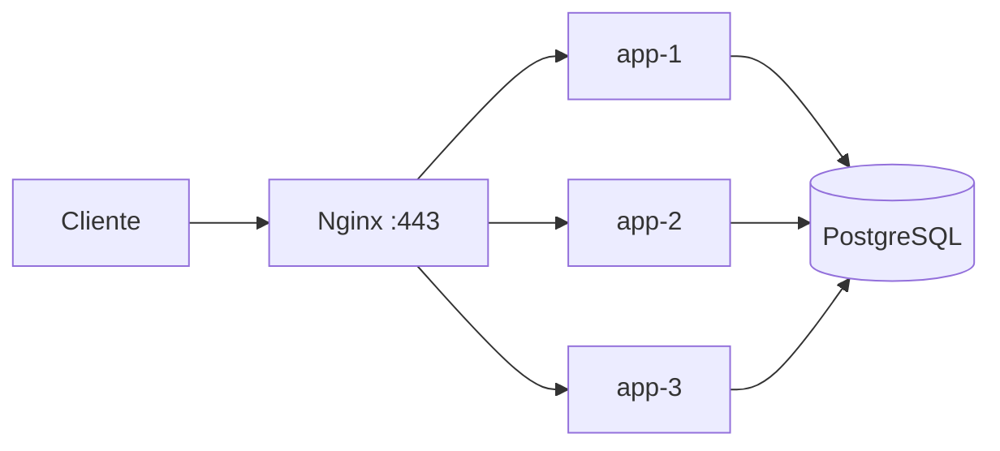
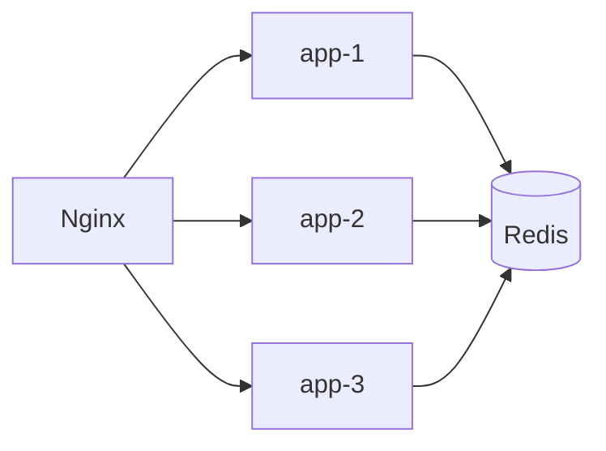
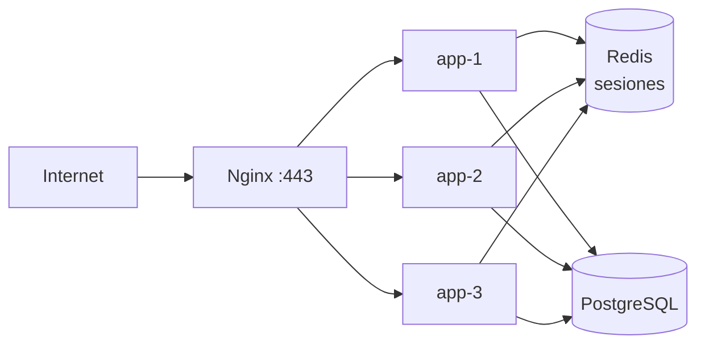
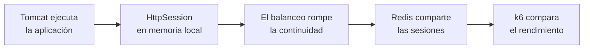

# 🧪 Actividad 3.5 — El backend por dentro

## Contexto

Escaparate ya está publicado en una instancia EC2. Nginx recibe las peticiones HTTPS y reparte `/api/` entre tres copias de la aplicación:



Hasta ahora hemos utilizado las tres aplicaciones como si fueran cajas negras. En esta actividad vamos a mirar qué ocurre **dentro del servidor de aplicaciones**.

Vamos a demostrar cuatro ideas:

1. un mismo WAR puede ejecutarse con el Tomcat embebido de Spring Boot o desplegarse en un Tomcat externo;
2. una `HttpSession` guardada en memoria pertenece a una réplica concreta;
3. Redis permite compartir esa sesión entre todas las réplicas;
4. tener tres réplicas no significa automáticamente tener tres veces más rendimiento.

> Esta actividad es deliberadamente guiada. No se evalúa que descubras por ensayo y error cómo configurar Spring Session, Redis o Tomcat. Se evalúa que seas capaz de **desplegar, comprobar e interpretar** lo que ocurre.

---

## Cómo vamos a trabajar

Para no mezclar entornos, utilizaremos siempre esta regla:

| Lugar | Para qué lo utilizamos |
|---|---|
| **Equipo del aula (LliureX/Linux)** | editar el proyecto, trabajar con Git y ejecutar k6 |
| **EC2 / Amazon Linux** | construir y ejecutar contenedores, Nginx, Tomcat y Redis |

Cuando cambie el lugar de trabajo aparecerá indicado expresamente.

### Estado inicial esperado

Antes de comenzar deben estar funcionando:

- Nginx con HTTPS;
- `app-1`, `app-2` y `app-3`;
- PostgreSQL;
- el stack de observabilidad de la sesión anterior.

En EC2 puedes comprobarlo con:

Desde cualquier carpeta situada dentro del repositorio:

```bash
cd "$(git rev-parse --show-toplevel)/practicas/compose"
docker compose ps
```

> La ruta de tu repositorio puede ser diferente. Lo importante es situarte en `practicas/compose/`.

---

# Paso 1. Preparar una sesión que podamos observar

**Objetivo:** añadir dos endpoints muy pequeños para crear una sesión y comprobar después si la réplica que recibe la petición la conoce.

## 1.1. Crear la rama

📍 **EQUIPO DEL AULA — LliureX/Linux (Bash)**

Desde la raíz del repositorio:

```bash
git switch main
git pull --ff-only
git switch -c sesion-10
```

## 1.2. Añadir el controlador

Crea:

```text
escaparate/src/main/java/es/escaparate/infraestructura/SesionDemoController.java
```

y copia exactamente:

```java
package es.escaparate.infraestructura;

import jakarta.servlet.http.HttpServletRequest;
import jakarta.servlet.http.HttpSession;
import org.springframework.http.ResponseEntity;
import org.springframework.web.bind.annotation.GetMapping;
import org.springframework.web.bind.annotation.PostMapping;
import org.springframework.web.bind.annotation.RequestMapping;
import org.springframework.web.bind.annotation.RequestParam;
import org.springframework.web.bind.annotation.RestController;

import java.util.Map;

@RestController
@RequestMapping("/api/sesion")
public class SesionDemoController {

    @PostMapping("/abrir")
    public Map<String, String> abrir(
            @RequestParam(defaultValue = "demo") String usuario,
            HttpServletRequest request) {

        HttpSession session = request.getSession(true);
        session.setAttribute("usuario", usuario);

        return Map.of(
                "usuario", usuario,
                "sesion", session.getId()
        );
    }

    @GetMapping("/estado")
    public ResponseEntity<Map<String, String>> estado(
            HttpServletRequest request) {

        HttpSession session = request.getSession(false);

        if (session == null || session.getAttribute("usuario") == null) {
            return ResponseEntity.status(401)
                    .body(Map.of("estado", "sesion-no-encontrada"));
        }

        return ResponseEntity.ok(Map.of(
                "estado", "sesion-encontrada",
                "usuario", session.getAttribute("usuario").toString(),
                "sesion", session.getId()
        ));
    }
}
```

Solo necesitas comprender estas dos líneas:

```java
request.getSession(true)
```

crea una sesión si no existe.

```java
request.getSession(false)
```

busca una sesión existente, pero **no crea una nueva**.

Esto nos permitirá distinguir claramente entre:

```text
200 → esta réplica conoce la sesión
401 → esta réplica no conoce la sesión
```

## 1.3. Publicar el cambio en la rama

```bash
git add escaparate/src/main/java/es/escaparate/infraestructura/SesionDemoController.java
git commit -m "feat: añade demostracion de sesiones"
git push -u origin sesion-10
```

---

# Paso 2. Construir la versión con sesión local

**Objetivo:** ejecutar exactamente la misma aplicación en las tres réplicas, pero manteniendo todavía `HttpSession` en la memoria de cada JVM.

No vamos a instalar Java ni Maven en EC2. El `Dockerfile` se encargará de construir la aplicación dentro del proceso de creación de la imagen.

📍 **EC2 — Bash**

Actualiza la rama:

```bash
cd "$(git rev-parse --show-toplevel)"

git fetch origin
git switch sesion-10
git pull --ff-only
```

Construye la imagen:

```bash
docker build \
  -f practicas/docker/app/Dockerfile \
  -t ghcr.io/<usuario>/escaparate:sesion-10-local \
  escaparate
```

> Sustituye `<usuario>` por tu usuario de GitHub.

En:

```text
practicas/compose/compose.yaml
```

cambia **solo** la imagen de `app-1`, `app-2` y `app-3` a:

```yaml
image: ghcr.io/<usuario>/escaparate:sesion-10-local
```

Sitúate en Compose:

```bash
cd practicas/compose
```

Valida el fichero:

```bash
docker compose config >/dev/null && echo "Compose OK"
```

Recrea solo las aplicaciones:

```bash
docker compose up -d app-1 app-2 app-3
```

Comprueba:

```bash
docker ps --format 'table {{.Names}}\t{{.Image}}\t{{.Status}}'
```

Las tres aplicaciones deben utilizar:

```text
sesion-10-local
```

---

# Paso 3. Desplegar el mismo WAR en un Tomcat externo

**Objetivo:** comprobar que la aplicación no depende obligatoriamente del Tomcat embebido de Spring Boot.

Este Tomcat será solo un **laboratorio temporal**. Al terminar volveremos a la arquitectura habitual.

## 3.1. Extraer el WAR de la imagen

📍 **EC2 — Bash**

Desde la raíz del repositorio:

```bash
cd "$(git rev-parse --show-toplevel)"

mkdir -p practicas/aplicaciones/tomcat

CID=$(docker create ghcr.io/<usuario>/escaparate:sesion-10-local)

docker cp \
  "$CID:/app/app.war" \
  practicas/aplicaciones/tomcat/escaparate.war

docker rm "$CID"
```

Comprueba:

```bash
ls -lh practicas/aplicaciones/tomcat/escaparate.war
```

Aquí tenemos dos artefactos diferentes:

```text
imagen Docker
└── contiene app.war

escaparate.war
└── aplicación web desplegable en un servidor compatible
```

## 3.2. Crear el Tomcat de laboratorio

Crea:

```text
practicas/compose/compose.sesion10-lab.yaml
```

con este contenido:

```yaml
services:

  tomcat-lab:
    image: tomcat:11.0.25-jre21-temurin-noble

    environment:
      DB_HOST: bd
      DB_PORT: 5432
      DB_NAME: ${DB_NAME}
      DB_USER: ${DB_USER}
      DB_PASSWORD: ${DB_PASSWORD}

      APP_STORAGE_TYPE: filesystem
      APP_STORAGE_PATH: /tmp/uploads

    volumes:
      - ../aplicaciones/tomcat/escaparate.war:/usr/local/tomcat/webapps/escaparate.war:ro

    depends_on:
      bd:
        condition: service_healthy
```

Desde `practicas/compose/` valida:

```bash
docker compose \
  -f compose.yaml \
  -f compose.sesion10-lab.yaml \
  config >/dev/null \
  && echo "Compose laboratorio OK"
```

Levanta Tomcat:

```bash
docker compose \
  -f compose.yaml \
  -f compose.sesion10-lab.yaml \
  up -d tomcat-lab
```

Observa el arranque:

```bash
docker compose \
  -f compose.yaml \
  -f compose.sesion10-lab.yaml \
  logs --tail=100 tomcat-lab
```

No continúes hasta encontrar un mensaje similar a:

```text
Started EscaparateApplication
```

## 3.3. Comprobar el contexto del WAR

Como el fichero se llama:

```text
escaparate.war
```

Tomcat lo publica bajo:

```text
/escaparate
```

Compruébalo desde el contenedor de Nginx:

```bash
docker compose \
  -f compose.yaml \
  -f compose.sesion10-lab.yaml \
  exec web \
  wget -S -O /dev/null \
  http://tomcat-lab:8080/escaparate/api/salud/listo \
  2>&1 | grep 'HTTP/'
```

Esperado:

```text
HTTP/1.1 200
```

Ahora prueba sin `/escaparate`:

```bash
docker compose \
  -f compose.yaml \
  -f compose.sesion10-lab.yaml \
  exec web \
  wget -S -O /dev/null \
  http://tomcat-lab:8080/api/salud/listo \
  2>&1 | grep 'HTTP/'
```

Esperado:

```text
HTTP/1.1 404
```

## 3.4. Convertir el WAR en aplicación raíz

Edita en `compose.sesion10-lab.yaml` una única línea:

```yaml
- ../aplicaciones/tomcat/escaparate.war:/usr/local/tomcat/webapps/ROOT.war:ro
```

Recrea Tomcat:

```bash
docker compose \
  -f compose.yaml \
  -f compose.sesion10-lab.yaml \
  up -d --force-recreate tomcat-lab
```

Mira el log hasta que termine el despliegue:

```bash
docker compose \
  -f compose.yaml \
  -f compose.sesion10-lab.yaml \
  logs --tail=60 tomcat-lab
```

Ahora:

```bash
docker compose \
  -f compose.yaml \
  -f compose.sesion10-lab.yaml \
  exec web \
  wget -S -O /dev/null \
  http://tomcat-lab:8080/api/salud/listo \
  2>&1 | grep 'HTTP/'
```

debe devolver:

```text
HTTP/1.1 200
```

La conclusión es:

```text
escaparate.war → /escaparate
ROOT.war       → /
```

📸 **Captura 1:** guarda una evidencia de esta comparación.

Detén el laboratorio:

```bash
docker compose \
  -f compose.yaml \
  -f compose.sesion10-lab.yaml \
  stop tomcat-lab
```

A partir de aquí volvemos a trabajar con las tres aplicaciones Spring Boot y su Tomcat embebido.

---

# Paso 4. Demostrar el problema de una sesión local

**Objetivo:** comprobar que una sesión guardada dentro de una JVM deja de estar disponible cuando Nginx envía la siguiente petición a otra réplica.

📍 **EC2 — Bash**

## 4.1. Hacer visible qué backend responde

En:

```text
practicas/nginx/conf.d/sitios.conf
```

dentro de `location /api/`, añade temporalmente:

```nginx
add_header X-Destino $upstream_addr always;
```

Valida:

```bash
docker compose exec web nginx -t
```

Recarga:

```bash
docker compose exec web nginx -s reload
```

Define la URL de tu despliegue:

```bash
URL="https://escaparate.<IP-PUBLICA>.nip.io"
```

Por ejemplo:

```bash
URL="https://escaparate.52.207.112.46.nip.io"
```

## 4.2. Crear una sesión

Elimina cualquier cookie anterior:

```bash
rm -f /tmp/sesion.txt
```

Crea una sesión:

```bash
curl -i \
  -c /tmp/sesion.txt \
  -X POST \
  "$URL/api/sesion/abrir?usuario=demo"

echo
```

Debes ver:

```text
HTTP/1.1 200
Set-Cookie: JSESSIONID=...
```

## 4.3. Repetir la misma petición con la misma cookie

Copia y ejecuta:

```bash
for i in $(seq 1 12); do
  echo "Petición $i"

  curl -s \
    -b /tmp/sesion.txt \
    -o /dev/null \
    -D - \
    "$URL/api/sesion/estado" \
    | grep -iE '^HTTP/|^X-Destino'

  echo
done
```

El resultado esperado es parecido a:

```text
HTTP/1.1 401
X-Destino: ...:8080

HTTP/1.1 401
X-Destino: ...:8080

HTTP/1.1 200
X-Destino: ...:8080
```

No importa qué réplica devuelve `200`.

Lo importante es comprobar que:

```text
la cookie es siempre la misma
+
Nginx cambia de réplica
+
solo la réplica que creó la sesión la conoce
```

📸 **Captura 2:** guarda varias peticiones donde aparezcan destinos diferentes y una mezcla de `200` y `401`.

> Relación con la sesión 7: antes comprobaste que un fichero local podía existir solo en una réplica. Ahora ocurre exactamente lo mismo con el estado de una sesión.

---

# Paso 5. Compartir las sesiones mediante Redis

**Objetivo:** mantener el mismo código Java, pero sacar el estado de sesión fuera de las JVM para que las tres réplicas puedan consultarlo.

Vamos a pasar de:

```text
HttpSession
→ memoria de una réplica
```

a:

```text
HttpSession
→ Spring Session
→ Redis
→ estado compartido
```

## 5.1. Añadir Spring Session Redis

📍 **EQUIPO DEL AULA — LliureX/Linux (Bash)**

Abre:

```text
escaparate/pom.xml
```

y añade dentro de `<dependencies>`:

```xml
<!-- Externaliza HttpSession para compartirla entre réplicas. -->
<dependency>
    <groupId>org.springframework.boot</groupId>
    <artifactId>spring-boot-starter-session-data-redis</artifactId>
</dependency>
```

No añadas una versión.

Spring Boot gestionará una versión compatible.

## 5.2. Añadir Redis al despliegue

En:

```text
practicas/compose/compose.yaml
```

añade el servicio:

```yaml
redis:
  image: redis:8-alpine

  healthcheck:
    test: ["CMD", "redis-cli", "ping"]
    interval: 2s
    timeout: 2s
    retries: 15
```

No publiques el puerto `6379`. Redis solo debe ser accesible desde la red interna de Docker.

Ahora modifica `app-1`, `app-2` y `app-3`.

### Cambio 1 — imagen

```yaml
image: ghcr.io/<usuario>/escaparate:sesion-10
```

### Cambio 2 — variables Redis

Añade dentro de `environment`:

```yaml
SPRING_DATA_REDIS_HOST: redis
SPRING_DATA_REDIS_PORT: 6379
```

### Cambio 3 — dependencia de arranque

Añade Redis a `depends_on`:

```yaml
depends_on:
  bd:
    condition: service_healthy
  redis:
    condition: service_healthy
```

No elimines las demás variables, volúmenes o configuraciones existentes de cada réplica.

Publica estos cambios:

```bash
git add escaparate/pom.xml practicas/compose/compose.yaml
git commit -m "feat: comparte sesiones mediante redis"
git push
```

## 5.3. Construir y desplegar la versión final

📍 **EC2 — Bash**

Actualiza el repositorio:

```bash
cd "$(git rev-parse --show-toplevel)"

git pull --ff-only
```

Construye la nueva imagen:

```bash
docker build \
  -f practicas/docker/app/Dockerfile \
  -t ghcr.io/<usuario>/escaparate:sesion-10 \
  escaparate
```

Vuelve a Compose:

```bash
cd practicas/compose
```

Valida:

```bash
docker compose config >/dev/null && echo "Compose OK"
```

Levanta Redis y recrea las tres aplicaciones:

```bash
docker compose up -d redis app-1 app-2 app-3
```

Comprueba Redis:

```bash
docker compose exec redis redis-cli ping
```

Esperado:

```text
PONG
```

### Esperar a que la aplicación esté realmente lista

Las JVM pueden tardar varios segundos en arrancar. No lances todavía la prueba de sesión.

Ejecuta:

```bash
until curl -fsS "$URL/api/salud/listo" >/dev/null; do
  echo "Esperando a Escaparate..."
  sleep 2
done

echo "Escaparate listo"
```

No continúes hasta ver:

```text
Escaparate listo
```

## 5.4. Crear una nueva sesión

Borra la cookie anterior:

```bash
rm -f /tmp/sesion.txt
```

Crea otra sesión:

```bash
curl -i \
  -c /tmp/sesion.txt \
  -X POST \
  "$URL/api/sesion/abrir?usuario=demo"

echo
```

Comprueba que Redis contiene información de Spring Session:

```bash
docker compose exec redis \
  redis-cli --scan --pattern 'spring:session*'
```

Deben aparecer claves que comiencen por:

```text
spring:session
```

## 5.5. Repetir la prueba entre réplicas

Ejecuta exactamente la misma prueba anterior:

```bash
for i in $(seq 1 12); do
  echo "Petición $i"

  curl -s \
    -b /tmp/sesion.txt \
    -o /dev/null \
    -D - \
    "$URL/api/sesion/estado" \
    | grep -iE '^HTTP/|^X-Destino'

  echo
done
```

Ahora deben ocurrir simultáneamente dos cosas:

```text
X-Destino → cambia
HTTP      → siempre 200
```

La sesión ya no pertenece a una JVM concreta.



📸 **Captura 3:** destinos diferentes, respuestas `200` y claves `spring:session...` en Redis.

---

# Paso 6. Comparar una y tres réplicas con k6

**Objetivo:** comprobar experimentalmente si ejecutar tres JVM en la misma EC2 aumenta necesariamente el rendimiento.

No buscamos una cifra concreta. Buscamos **comparar dos configuraciones bajo exactamente la misma carga**.

## 6.1. Crear el script

📍 **EQUIPO DEL AULA — LliureX/Linux (Bash)**

Desde la raíz de tu repositorio crea:

```text
practicas/aplicaciones/prueba-carga.js
```

con:

```javascript
import http from 'k6/http';
import { check } from 'k6';

export default function () {
    const respuesta = http.get(
        `${__ENV.URL}/api/carga?ms=50`
    );

    check(respuesta, {
        'estado 200': (r) => r.status === 200,
    });
}
```

Define la URL:

```bash
URL="https://escaparate.<IP-PUBLICA>.nip.io"
```

## 6.2. Medir las tres réplicas

Ejecuta:

```bash
docker run --rm -i \
  -e URL="$URL" \
  -v "$PWD/practicas/aplicaciones/prueba-carga.js:/scripts/prueba-carga.js:ro" \
  grafana/k6 run \
  --vus 20 \
  --duration 30s \
  /scripts/prueba-carga.js
```

Anota únicamente:

```text
http_reqs/s
http_req_duration p(95)
http_req_failed
```

Completa:

| Configuración | req/s | p95 | errores |
|---|---:|---:|---:|
| 3 réplicas | | | |

## 6.3. Dejar una sola réplica

📍 **EC2 — Bash**

Primero guarda una copia de la configuración actual de Nginx:

```bash
cp ../nginx/conf.d/sitios.conf /tmp/sitios-tres.conf
```

Edita el `upstream` de `sitios.conf` y deja únicamente:

```nginx
server app-1:8080 resolve;
```

Detén las otras dos aplicaciones:

```bash
docker compose stop app-2 app-3
```

Valida y recarga Nginx:

```bash
docker compose exec web nginx -t
docker compose exec web nginx -s reload
```

Comprueba que solo responde `app-1`:

```bash
for i in $(seq 1 3); do
  curl -s "$URL/api/instancia"
  echo
done
```

## 6.4. Repetir exactamente la misma carga

📍 **EQUIPO DEL AULA — LliureX/Linux (Bash)**

No cambies VUs ni duración.

Ejecuta otra vez:

```bash
docker run --rm -i \
  -e URL="$URL" \
  -v "$PWD/practicas/aplicaciones/prueba-carga.js:/scripts/prueba-carga.js:ro" \
  grafana/k6 run \
  --vus 20 \
  --duration 30s \
  /scripts/prueba-carga.js
```

Completa:

| Configuración | req/s | p95 | errores |
|---|---:|---:|---:|
| 3 réplicas | | | |
| 1 réplica | | | |

### Interpreta

Responde brevemente:

1. ¿Tres réplicas han triplicado las peticiones por segundo?
2. ¿Qué recursos físicos comparten las tres JVM?
3. Aunque no sean más rápidas, ¿qué ventajas aportan varias réplicas?

> No concluyas automáticamente que «una réplica es mejor». Las tres réplicas se están ejecutando en **la misma EC2** y compiten por la misma CPU y memoria. Replicar procesos no equivale a añadir recursos físicos.

---

# Paso 7. Restaurar el despliegue final

**Objetivo:** dejar Escaparate preparado para continuar el proyecto.

📍 **EC2 — Bash**

Restaura Nginx:

```bash
cp /tmp/sitios-tres.conf ../nginx/conf.d/sitios.conf
```

Arranca las otras dos aplicaciones:

```bash
docker compose start app-2 app-3
```

Elimina de `sitios.conf` la cabecera temporal:

```nginx
add_header X-Destino $upstream_addr always;
```

Valida y recarga:

```bash
docker compose exec web nginx -t
docker compose exec web nginx -s reload
```

Comprueba:

```bash
docker compose ps
```

Al finalizar deben estar funcionando:

```text
Nginx
├── app-1
├── app-2
└── app-3
     │
     ├── PostgreSQL
     └── Redis
```

El `tomcat-lab` debe quedar detenido.

---

# Paso 8. Completar la memoria

📍 **EQUIPO DEL AULA — LliureX/Linux**

Abre:

```text
entregas/tema3/memoria-publicacion-ejecucion.md
```

Añade:

```markdown
## Ejecución, sesiones y rendimiento
```

Con unas **150–200 palabras** responde a estas cuestiones:

1. ¿qué Tomcat ejecutan normalmente las tres réplicas?;
2. ¿qué comprobaste al desplegar el WAR en un Tomcat externo?;
3. ¿dónde se almacenaba inicialmente `HttpSession`?;
4. ¿por qué aparecían respuestas `200` y `401` con la misma cookie?;
5. ¿qué cambió al introducir Spring Session + Redis?;
6. ¿qué conclusión obtienes de la prueba con una y tres réplicas?

Incluye esta tabla:

```markdown
| Prueba | Resultado |
|---|---|
| WAR como `escaparate.war` | |
| WAR como `ROOT.war` | |
| sesión local | |
| sesión con Redis | |
| 1 vs. 3 réplicas | |
```

Y actualiza la arquitectura final:



El Tomcat externo no aparece porque solo se utilizó como laboratorio.

---

# Paso 9. Git y entrega

Antes de subir nada, comprueba:

```bash
git status
```

Deben quedar como cambios permanentes:

```text
SesionDemoController.java
pom.xml
compose.yaml
compose.sesion10-lab.yaml
prueba-carga.js
memoria-publicacion-ejecucion.md
```

No deben versionarse:

```text
escaparate.war
/tmp/sesion.txt
credenciales
certificados privados
la cabecera X-Destino
la configuración temporal de una sola réplica
```

Añade los ficheros correctos:

```bash
git add escaparate \
  practicas/compose/compose.yaml \
  practicas/compose/compose.sesion10-lab.yaml \
  practicas/aplicaciones/prueba-carga.js \
  entregas/tema3
```

Comprueba de nuevo:

```bash
git status
```

Cuando estés seguro:

```bash
git commit -m "feat: completa administracion de sesiones y pruebas de carga"
git push
```

Abre la Pull Request:

```text
sesion-10 → main
```

y fusiónala cuando los checks sean correctos.

---

# Qué debes entregar

- **Captura 1:** mismo WAR desplegado como `/escaparate` y como `/`.
- **Captura 2:** sesión local con destinos distintos y mezcla de `200` / `401`.
- **Captura 3:** sesión compartida con destinos distintos y siempre `200`, junto con las claves de Redis.
- Tabla k6 con **1 y 3 réplicas**.
- Apartado `Ejecución, sesiones y rendimiento` de la memoria.
- Pull Request fusionada.

---

# Qué has demostrado

Al terminar la actividad debes poder explicar esta evolución:



La idea fundamental es:

> **cuando una aplicación se replica, el estado que deba sobrevivir al cambio de réplica no puede depender exclusivamente de la memoria de una JVM.**

Redis resuelve aquí el problema de las sesiones compartidas. Las tres réplicas aportan balanceo y tolerancia ante la caída de una instancia, pero no implican por sí solas más capacidad si todas comparten los mismos recursos físicos.
