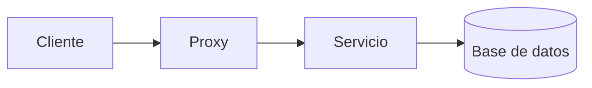
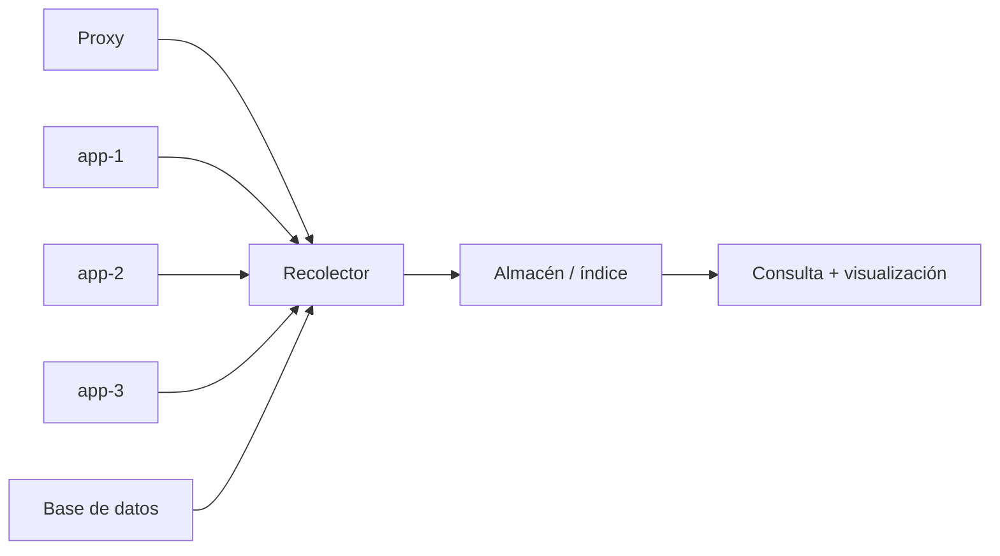

# 👁️ Observabilidad: logs, métricas y alertas

!!! info "Descarga de diapositivas"
    <!-- [Descarga las diapositivas](diapositivas/servidores-web-dns.pptx){target="_blank" rel="noopener"} -->

---

Un servicio puede estar correctamente desplegado y, aun así, ser difícil de administrar si no sabemos qué está ocurriendo.

Decir:

> “La web va mal.”

aporta poco.

Una descripción observable sería más útil:

> “`/api/productos` devuelve más errores `5xx` y el p95 de latencia ha aumentado.”

La **observabilidad** es la capacidad de comprender el estado interno de un sistema a partir de las señales que emite.

---

## 📡 1. Las señales de un sistema

Tradicionalmente se habla de tres grandes tipos:

| Señal | Qué aporta | Pregunta típica |
|---|---|---|
| **Logs** | sucesos concretos con contexto | ¿qué ocurrió? |
| **Métricas** | valores numéricos a lo largo del tiempo | ¿cómo evoluciona? |
| **Trazas** | recorrido de una petición | ¿dónde se consume el tiempo? |

### 1.1. Logs

Ejemplo:

```text
GET /api/productos
estado=500
duracion=1.84s
```

Un log permite investigar un caso y conservar contexto.

### 1.2. Métricas

Ejemplos:

- peticiones por segundo;
- porcentaje de errores;
- latencia;
- CPU;
- memoria.

Son útiles para tendencias, paneles y alertas.

### 1.3. Trazas

Una traza sigue una petición entre varios componentes:



En esta sesión basta con **reconocer** su utilidad. La práctica se centrará principalmente en logs y en agregaciones calculadas a partir de ellos.

!!! warning "Log agregado no es lo mismo que sistema de métricas"
    Podemos contar errores o calcular latencias a partir de logs. Eso no significa que hayamos desplegado un sistema completo que mida periódicamente CPU, memoria, disco o colas.

---

## 🧾 2. Qué registra un servidor web

Un servidor como Nginx suele producir dos tipos de registro especialmente útiles.

### 2.1. Access log

Normalmente registra una entrada por petición con campos como:

- cliente;
- método;
- ruta;
- estado;
- tamaño;
- duración.

Por ejemplo:

```text
GET /api/productos
200
42 ms
```

Permite responder preguntas como:

- **¿Qué ruta se utilizó?**
- **¿Qué código recibió el cliente?**
- **¿Cuánto tardó?**

### 2.2. Error log

Registra problemas del propio servidor, por ejemplo:

- upstream no disponible;
- problemas de permisos;
- configuración incorrecta;
- fichero no encontrado.

Una misma incidencia puede verse desde dos perspectivas:

| Registro | Qué muestra |
|---|---|
| `access log` | `/api/productos → 502` |
| `error log` | fallo al conectar con el upstream |

---

## 🧱 3. Del texto libre al log estructurado

Un texto pensado para personas puede ser incómodo de analizar automáticamente.

Comparar:

```text
192.0.2.24 GET /api/productos 200 0.042
```

con:

```json
{
  "ip": "192.0.2.24",
  "metodo": "GET",
  "ruta": "/api/productos",
  "estado": 200,
  "duracion": 0.042
}
```

En el segundo caso cada dato tiene un nombre.

Eso permite:

- filtrar;
- agrupar;
- contar;
- calcular medias;
- calcular percentiles.

### 3.1. Registrar el backend utilizado

Cuando un proxy reparte tráfico, también puede ser útil conservar el campo **destino**, es decir, la dirección del backend que respondió.

Así podemos comprobar desde los logs si varias réplicas están recibiendo peticiones.

### 3.2. Escapar correctamente

Si se genera JSON, una petición con caracteres especiales no debe romper el formato.

Nginx permite:

```nginx
escape=json
```

al definir un `log_format`.

### 3.3. No todo debe entrar en los logs

Evita registrar información sensible innecesaria:

- contraseñas;
- tokens;
- cookies de sesión;
- datos bancarios;
- datos personales no necesarios.

Un log suele copiarse, centralizarse y conservarse. Por eso debe tratarse como información potencialmente sensible.

---

## 🗃️ 4. Centralizar registros

Con una sola pieza puede bastar:

```bash
docker compose logs
```

Pero en un sistema con proxy, varias réplicas y base de datos la investigación se complica.

El patrón general es:



| Pieza | Responsabilidad |
|---|---|
| **Recolector** | recibe, transforma o etiqueta |
| **Almacén** | conserva e indexa |
| **Visualización** | permite buscar, agregar y representar |

Las herramientas concretas pueden cambiar. El patrón es más importante que una marca concreta.

En entornos de contenedores es habitual que los procesos escriban en **`stdout` y `stderr`**, y que la plataforma recoja esas salidas.

**Retención.**

Los logs crecen.

Todo sistema debe decidir:

- qué guardar;
- durante cuánto tiempo;
- qué eliminar.

Guardar todo indefinidamente no es una estrategia.

---

## 🎯 5. Qué merece nuestra atención

Una referencia muy conocida son las **cuatro señales de oro**:

| Señal | Qué mide |
|---|---|
| **Latencia** | cuánto tarda una operación |
| **Tráfico** | cuánta demanda recibe el sistema |
| **Errores** | cuántas operaciones fallan |
| **Saturación** | cuánto margen queda antes del límite |

En una práctica basada en access logs podemos observar especialmente **latencia, tráfico y errores**.

La saturación de CPU, memoria, disco o conexiones requiere normalmente señales específicas de infraestructura.

### 5.1. RED para un servicio web

Para servicios y APIs resulta útil pensar en **RED: Rate, Errors y Duration**.

| Elemento | Pregunta |
|---|---|
| **Rate** | ¿cuántas peticiones llegan? |
| **Errors** | ¿cuántas fallan? |
| **Duration** | ¿cuánto tardan? |

RED encaja muy bien con lo que puede observarse desde un access log.

!!! info "USE"
    Para recursos de infraestructura existe otra regla útil: **Utilization, Saturation, Errors**. Basta con reconocerla en esta sesión; no vamos a instrumentar recursos de infraestructura siguiendo USE.

---

## 📊 6. La media puede ocultar problemas

### 6.1. La media

Supón:

| Petición | Latencia |
|---|---:|
| 1 | 50 ms |
| 2 | 50 ms |
| 3 | 55 ms |
| 4 | 60 ms |
| 5 | 800 ms |

La mayoría de peticiones son rápidas, pero existe una claramente lenta.

Una media resume todos los valores y puede ocultar la cola.

Por eso se utilizan **percentiles**.

### 6.2. p95

Una interpretación suficiente es:

> **p95** es el tiempo que el 95 % de las peticiones no supera.

Por ejemplo:

| Medida | Valor |
|---|---:|
| media | 90 ms |
| p95 | 420 ms |

El comportamiento promedio parece bueno, pero una parte del tráfico experimenta latencias mucho mayores.

No necesitas calcular manualmente el percentil. Debes saber **interpretarlo**.

---

## 📈 7. Un dashboard debe responder preguntas

Un panel no es mejor por tener más gráficos.

!!! warning "Mal criterio"
    Diseñar un dashboard para **mostrar todo lo posible**.

Un criterio mejor es partir de una pregunta:

> **¿Qué necesito saber para decidir si el servicio funciona bien?**

Por ejemplo:

- ¿qué rutas acumulan errores?;
- ¿qué rutas tienen peor latencia?;
- ¿están respondiendo varias réplicas?

Cada visualización debería existir porque ayuda a responder una pregunta.

---

## 🚨 8. Alertas: cuándo merece la pena avisar

Un panel necesita que alguien lo mire.

Una alerta evalúa una condición y avisa cuando esa condición merece una actuación.

Una alerta útil necesita cuatro decisiones:

| Elemento | Pregunta |
|---|---|
| **Umbral** | ¿a partir de qué valor preocupa? |
| **Ventana** | ¿durante cuánto tiempo? |
| **Destinatario** | ¿quién debe recibirla? |
| **Acción** | ¿qué debería comprobar o hacer? |

Ejemplo:

| Elemento | Decisión |
|---|---|
| Condición | más de 10 respuestas `5xx` |
| Ventana | durante 2 minutos |
| Destinatario | responsable del servicio |
| Acción | comprobar aplicación y dependencias |

**Fatiga de alertas.** Una alerta que se dispara continuamente y no exige actuación termina siendo ignorada.

> **Más alertas ≠ mejor observabilidad.**

Suele ser más útil alertar sobre un **síntoma que afecta al servicio** que sobre una posible causa aislada.

---

## 💾 9. Observar también tiene coste

La observabilidad también consume recursos y trabajo:

- CPU;
- memoria;
- disco y almacenamiento;
- índices;
- mantenimiento.

Por eso hay que elegir qué recoger y cuánto conservar.

No se trata de almacenar todo, sino de conservar información que ayude a **detectar, explicar o resolver** problemas.

---

## 🎯 Qué debes saber hacer al salir de esta sesión

Al terminar, deberías poder:

- Explicar qué significa observabilidad.
- Distinguir logs, métricas y trazas.
- Diferenciar access log y error log.
- Explicar por qué un log estructurado facilita consultas y agregaciones.
- Identificar información que no debería registrarse.
- Explicar el patrón recolector → almacén → visualización.
- Reconocer latencia, tráfico, errores y saturación.
- Aplicar RED a un servicio web.
- Interpretar una media y un p95.
- Explicar qué pregunta debe responder una visualización.
- Diseñar una alerta con umbral, ventana, destinatario y acción.
- Explicar qué es la fatiga de alertas.
- Reconocer que la observabilidad también consume recursos.

Lo que basta con **reconocer**:

- trazas distribuidas;
- identificadores de petición;
- USE para recursos;
- sistemas específicos de métricas de infraestructura;
- políticas avanzadas de retención;
- plataformas APM.

---

## ✅ Ideas clave

??? tip "Abrir resumen"

    - La observabilidad permite comprender un sistema a partir de las señales que emite.
    - Logs, métricas y trazas responden preguntas distintas y complementarias.
    - Un access log puede registrar ruta, estado, duración y backend utilizado.
    - Un log estructurado convierte texto en campos que pueden filtrarse y agregarse.
    - Los registros de varias piezas pueden centralizarse mediante recolector → almacén → visualización.
    - Latencia, tráfico, errores y saturación son señales útiles de salud.
    - RED ayuda a observar servicios: tasa, errores y duración.
    - La media puede ocultar peticiones lentas; p95 ayuda a observar la cola.
    - Un dashboard debe responder preguntas, no acumular gráficos.
    - Una alerta útil necesita umbral, ventana, destinatario y acción.
    - Alertar demasiado produce fatiga y reduce el valor de los avisos.
    - Recoger y conservar observabilidad también tiene coste.

---

En la actividad aplicarás estos patrones a un despliegue con varias réplicas: centralizarás logs, estructurarás el registro de acceso, comprobarás qué backend atiende cada petición, compararás media y p95 y utilizarás incidencias controladas para razonar sobre alertas.

La sesión siguiente cambiará el punto de vista: después de observar la entrada y el tráfico, miraremos **dentro del backend** para entender qué ejecuta cada réplica, dónde vive su estado y cómo interpretar una prueba sencilla de rendimiento.
