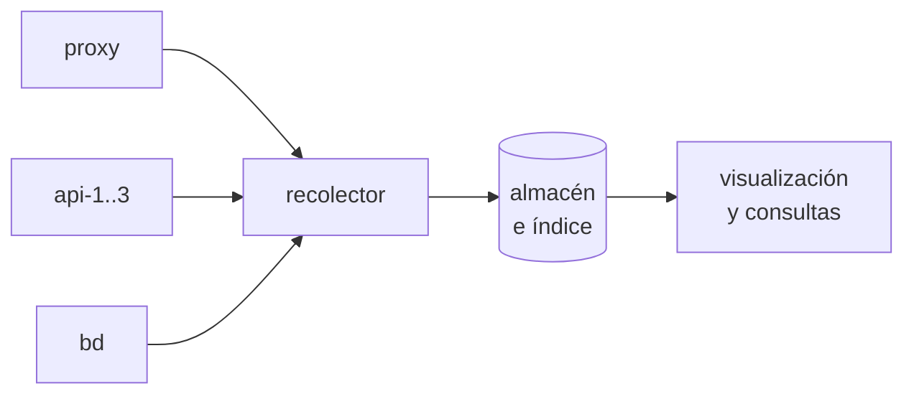

# 📊 4. Observabilidad: logs, métricas y alertas

!!!info "Descarga de diapositivas"
    [Descarga las diapositivas](diapositivas/observabilidad.pptx){target="_blank" rel="noopener"}

---

Después de la semana pasada tienes un servicio que se puede enseñar sin vergüenza: publicado en internet, repartido entre tres copias, con una zona privada y cifrado con un certificado de verdad cuya renovación has dejado automatizada. Está bien montado.

Y ahora contesta a esto sin mirar: ¿cuántas peticiones ha atendido tu catálogo desde ayer? ¿Qué ruta es la que más falla? ¿Estuvo caído el martes por la noche? ¿Hay alguien probando contraseñas contra la zona que protegiste? ¿Y si la renovación del certificado falla dentro de tres meses, quién se entera? No lo sabes, y no es porque falte información: **es que la información existe y no la está mirando nadie**. Cada contenedor escribe lo que le pasa, cada uno en su rincón. Hoy vas a recoger eso en un solo sitio, convertirlo en preguntas que se pueden responder, y decidir qué debería hacer saltar una alarma. Con esto se cierra el tema.

---

## 🔭 Saber que algo falla no es saber por qué

**Observabilidad** es la capacidad de entender qué está ocurriendo dentro de un sistema mirándolo solo desde fuera. No es un producto que se instala: es una propiedad que el sistema tiene o no tiene, según lo que emita y según lo que hayas hecho con lo que emite.

La distinción que hay que fijar hoy es entre dos tipos de señal que responden preguntas distintas y no se sustituyen:

| | Logs | Métricas |
|---|---|---|
| Qué son | Sucesos, uno por línea, con su contexto | Números medidos cada cierto tiempo |
| Qué pregunta responden | **Qué pasó exactamente** en esta petición | **Cómo va** el sistema en conjunto |
| Coste de almacenar | Alto: crece con el tráfico | Bajo: crece con el tiempo |
| Sirven para | Diagnosticar un caso concreto | Detectar, alertar, ver tendencias |

Un ejemplo con tu propio servicio. Una métrica te dice que el porcentaje de errores ha pasado del 0,1 % al 4 % a las 18:20. Eso es lo que dispara la alerta y lo que ves en el panel, pero no te dice qué arreglar. El log te dice que a las 18:20 empezaron a llegar peticiones a `/api/productos` que terminan en `500` con un fallo de conexión a la base de datos. **La métrica te avisa; el log te explica.** Montar solo una de las dos deja el trabajo a medias: con métricas sabes que algo va mal y no por qué; con logs solo tienes la respuesta si a alguien se le ocurre ir a buscarla.

!!! warning "Qué vas a montar hoy exactamente"
    Hoy despliegas una pila de **logs centralizados**, y los números que saques —recuentos, agrupaciones, percentiles— los obtendrás **agregando esos logs**. Eso no es lo mismo que desplegar un sistema de métricas: nadie va a estar midiendo cada quince segundos la memoria, el disco o las conexiones abiertas de tus máquinas. Las métricas de infraestructura y las alarmas que envían avisos de verdad llegan con el servicio de monitorización gestionado del módulo de nube. Aquí interesa que sepas qué preguntas responde cada cosa y cómo se obtienen respuestas de lo que tu propio servicio ya está escribiendo.

!!! info "Para saber más: la tercera señal"
    Se habla de tres pilares, y el tercero son las **trazas**: el recorrido completo de una petición a través de todos los servicios que la atienden, con el tiempo que ha gastado en cada uno. Es la herramienta imprescindible cuando la petición pasa por diez servicios y hay que saber cuál de ellos se está comiendo el tiempo. Con tres piezas como las tuyas, logs y métricas llegan de sobra.

---

## 📄 Lo que ya escribe tu servidor web

No hace falta añadir nada para empezar: Nginx lleva escribiendo desde la sesión 5. Escribe dos registros distintos, y confundirlos es el error clásico.

El **registro de acceso** anota una línea por petición atendida. En su formato habitual: quién la hizo, cuándo, qué pidió, qué código de estado se devolvió y cuántos bytes. El **registro de error** anota los problemas del propio servidor —configuración, ficheros que no encuentra, destinos que no responden— y a diferencia del anterior tiene **niveles**:

| Nivel | Qué significa | Qué haces con él |
|---|---|---|
| `error`, `crit` | Algo ha fallado de verdad | Mirarlo hoy |
| `warn` | Algo raro que no ha roto nada | Revisar de vez en cuando |
| `info`, `notice` | Sucesos normales del servicio | Contexto |
| `debug` | Todo, con detalle | Solo mientras diagnosticas, nunca en producción fijo |

Los dos registros pueden aportar información complementaria sobre una misma incidencia. El registro de acceso indica qué petición recibió el cliente y con qué código terminó; el registro de error añade información cuando Nginx encuentra un problema propio —por ejemplo, un fichero inexistente, una configuración problemática o un fallo al comunicarse con un destino—. Un `502` puede aparecer en el acceso como respuesta recibida por el visitante y venir acompañado en el registro de error por la causa concreta del fallo con el upstream.

En nuestro despliegue Nginx recibe directamente las conexiones de Internet, por lo que `$remote_addr` contiene la dirección del cliente que se ha conectado al proxy. Las cabeceras `X-Forwarded-*` que configuraste en la sesión 7 cumplen otra función: **trasladar esa información desde Nginx hasta la aplicación que hay detrás**. Si en el futuro Nginx estuviera detrás de otro proxy o de un balanceador gestionado, entonces sí habría que configurar expresamente qué intermediarios son de confianza para recuperar correctamente la dirección original.

---

## 🧾 Registros que se pueden consultar: formato estructurado

Una línea de registro clásica es un texto pensado para que lo lea una persona. Con mil líneas al día se sobrevive con `grep`; con un millón, no. Y responder «cuántos `5xx` ha habido en la última hora en la ruta de productos» sobre texto libre exige inventarse una expresión regular por pregunta.

La solución es escribir **cada línea como un objeto JSON**, con un campo por dato:

```json
{"hora":"2026-11-13T18:20:04+01:00","ip":"84.12.3.9","metodo":"GET",
 "ruta":"/api/productos","estado":500,"duracion":2.031,"destino":"172.20.0.5:8080"}
```

Cada clave es un campo con nombre y tipo, y eso cambia lo que se puede hacer: filtrar por `estado`, agrupar por `ruta`, calcular percentiles de `duracion` o contar por `destino` se convierten en consultas, no en malabarismos con texto.

Fíjate en ese último campo, porque es tuyo: **qué copia atendió la petición**. La semana pasada solo podías comprobar el reparto pidiendo el identificador de instancia varias veces; hoy pasa a ser una consulta sobre todo el tráfico. Y ojo con el formato, que sorprende la primera vez: la variable que Nginx usa para esto registra **la dirección y el puerto del destino**, no el nombre del servicio. Verás `172.20.0.5:8080` y no `api-2`, y está bien: tres valores distintos demuestran el reparto exactamente igual.

Dos detalles al escribir el formato:

- Hay que decirle a Nginx que **escape los valores como JSON**. Si no, el día que llegue una URL con comillas o un carácter raro, la línea deja de ser JSON válido y el recolector la descarta sin avisar. Es una palabra en la declaración del formato y evita un fallo silencioso y muy difícil de ver.
- Falta un campo que en un sistema de varias piezas vale oro: un **identificador de petición**. El proxy genera un valor único para cada petición que entra, lo escribe en su registro y lo reenvía al backend en una cabecera; la aplicación lo incluye en las líneas que escribe. Resultado: dada una queja concreta de un usuario, se puede seguir **esa petición** por todas las piezas que la atendieron. Sin él, lo que tienes son dos montones de líneas y la esperanza de que las marcas de tiempo cuadren.

!!! warning "Lo que nunca se escribe en un registro"
    Contraseñas, tokens, cookies de sesión, números de tarjeta y datos personales que no necesites. Un registro se copia, se envía a un sistema central, lo lee mucha gente y se conserva meses: es exactamente el peor sitio donde puede acabar un dato sensible. Y ojo con lo que se cuela solo: los parámetros de la URL se registran enteros, así que un formulario mal hecho que mande credenciales por la barra de direcciones las deja escritas en tu registro de acceso para siempre.

---

## 🌊 Por qué no pueden quedarse donde nacen

Con una máquina y un servicio, los registros viven en un fichero y se rotan: cuando crecen, se comprimen, se guardan unos días y se borran los antiguos. Funciona porque el fichero se queda quieto en un sitio conocido.

Tu despliegue rompe esa suposición por tres sitios a la vez:

- **Están repartidos.** Una misma petición deja rastro en el proxy y en una de las tres copias. Para reconstruir qué pasó hay que mirar en cuatro sitios y cruzar horas a mano.
- **Son locales y poco duraderos.** El motor de contenedores puede conservar en la máquina lo que cada contenedor escribe, con su propia rotación, pero esos registros siguen atados a ese runtime y a esa máquina. En cuanto eliminas o recreas recursos, o necesitas mirar tres copias a la vez, confiar solo en ellos se queda corto. Y el momento en que más falta hacen es justo después de un incidente, que es justo cuando algo se ha reiniciado.
- **La máquina también es efímera.** Tu instancia se apaga entre sesiones. Con ella se va todo lo que hubiera quedado en su disco.

De ahí sale el patrón estándar, que son tres piezas con tres papeles bien separados:



El **recolector** lee lo que cada contenedor escribe por su salida estándar, lo etiqueta con quién lo ha escrito y lo manda; el **almacén** lo guarda e indexa para poder buscarlo; la **visualización** permite consultar, agrupar y pintar paneles. Los nombres de producto cambian —hay varias pilas populares y todas hacen esto— pero los tres papeles son siempre los mismos.

Y esto explica una práctica que llevas cumpliendo desde la sesión 3 sin que te dijéramos del todo por qué: en contenedores, lo habitual es que la aplicación escriba sus registros por **la salida estándar** y deje que el runtime y la plataforma decidan cómo recogerlos, rotarlos y enviarlos. Escribir a un fichero dentro del contenedor no es imposible, pero te obliga a resolver tú el transporte, la rotación y el acceso, y a montar volúmenes solo para poder leer lo que ya estaba a la vista.

!!! danger "Los registros ocupan, y ocupan mucho"
    Un servicio con tráfico serio genera gigabytes al día, y un almacén de registros sin límites llena el disco de la máquina y tumba todo lo demás. Hay que decidir siempre **cuánto tiempo se conserva** y qué se descarta antes: es la razón principal por la que las métricas se guardan durante meses y los registros durante días o semanas.

---

## 🥇 Las cuatro señales de oro

Los registros están para investigar. Para vigilar hacen falta números, y la pregunta es cuáles. La respuesta más útil que existe son cuatro, y valen para cualquier servicio que atienda peticiones:

| Señal | Qué mide | Qué te está diciendo |
|---|---|---|
| **Latencia** | Cuánto tarda en responder | La experiencia real de quien lo usa |
| **Tráfico** | Cuántas peticiones llegan | Cuánta demanda tienes, y si algo raro pasa |
| **Errores** | Qué proporción falla | Si el servicio está haciendo su trabajo |
| **Saturación** | Cómo de lleno está el recurso limitante | Cuánto margen queda antes de romperse |

Dos matices que separan un panel útil de uno decorativo.

**La media por sí sola no basta para entender la latencia.** Puede ocultar precisamente las peticiones lentas que peor experiencia producen: si de cien peticiones noventa tardan 50 ms y diez tardan cuatro segundos, la media dice 445 ms y no describe a nadie. Por eso se complementa con **percentiles**: el p50 es el usuario típico, y el p95 o el p99 son los que se están llevando la mala experiencia —los que se quejan y los que se van—. Además conviene mirar aparte la latencia de las peticiones **con error**: un servicio que falla rapidísimo tiene unos tiempos estupendos y no funciona.

**La saturación es especialmente útil para anticipar problemas de capacidad.** Memoria, disco, conexiones a la base de datos o cola de trabajo pueden enseñar que el margen se está agotando antes de que aparezca ningún error visible. Un disco al 95 % no ha roto nada todavía, y va a romperlo todo esta noche.

De estas cuatro, hoy vas a poder calcular tres desde tus propios registros de acceso: latencia por percentiles, volumen de tráfico y proporción de errores. La saturación necesita medir la máquina, y eso ya es un sistema de métricas.

!!! example "El salpicadero"
    Las cuatro señales son la velocidad, las revoluciones, el testigo de avería y el nivel de gasolina. Con esas cuatro se conduce cualquier coche sin saber nada de mecánica. Los registros son abrir el capó: donde se va cuando el testigo se enciende, no lo que se mira mientras se conduce.

---

## 🔔 Alertas: que avisen ellas

Un panel solo funciona si hay alguien mirándolo, y a las tres de la madrugada no hay nadie. Una **alerta** es una condición evaluada de forma continua que, al cumplirse, avisa a una persona.

Toda alerta bien escrita tiene tres partes, y las tres importan:

- **Un umbral**: a partir de qué valor se considera un problema.
- **Una ventana**: cuánto tiempo tiene que mantenerse para avisar. Sin ventana, cualquier pico de dos segundos dispara un aviso a las cuatro de la mañana por algo que ya se arregló solo.
- **Un destinatario**: quién recibe el aviso y **qué se supone que tiene que hacer** con él.

Ese tercer punto es el que decide si el sistema sirve. La **fatiga de alerta** es el fracaso más común de toda la observabilidad: cuando llegan veinte avisos al día y diecinueve no requieren hacer nada, el equipo deja de leerlos, y el día que llega el importante también se ignora. Un sistema con cien alertas que nadie mira es peor que uno con tres que se leen, porque además da una falsa sensación de control.

De ahí la regla de oficio: **se alerta sobre síntomas, no sobre causas**. «El porcentaje de errores del catálogo supera el 5 % durante cinco minutos» es un síntoma: le está pasando algo al usuario y hay que actuar. «La CPU está al 90 %» es una causa posible, y puede ser perfectamente normal. Si cada alerta que suena obliga a hacer algo, el sistema se lee; si la mitad son informativas, no se lee ninguna.

Hoy vas a **diseñar** dos alertas y a demostrar con tus propios datos que la condición que has elegido se habría cumplido. Montar la infraestructura que envía el aviso —el correo, el mensaje, la guardia— es un problema distinto, y lo resuelve el servicio gestionado que verás en el módulo de nube. Lo difícil, y lo que se aprende hoy, no es enviar el mensaje: es decidir qué merece uno.

---

## 🧰 Lo que esto te ha costado

Vale la pena que te fijes en lo que hay que montar para tener esto: un recolector en cada máquina, un almacén que hay que dimensionar y vigilar, un sistema de visualización, unas políticas de retención, y alguien que mantenga las tres cosas actualizadas. La pila de observabilidad de un sistema suele ser **más compleja que el sistema que observa**, y consume recursos de la misma máquina que está vigilando —lo que tiene el problema evidente de que si la máquina cae, se lleva por delante la herramienta que tenía que avisarte—.

Nada de esto es un argumento para no hacerlo. Es un argumento para saber qué estás decidiendo, y para que cuando veas la alternativa gestionada sepas exactamente qué te ahorra, qué te cuesta y qué control pierdes a cambio. Apunta hoy el tiempo que has tardado y los recursos que consume: te van a hacer falta para comparar.

---

## 🎯 Qué debes saber hacer al salir de esta sesión

- Distinguir qué pregunta responde un log y cuál una métrica, y decidir a cuál acudir ante un problema concreto.
- Leer los dos registros de Nginx —acceso y error— y explicar qué añade cada uno sobre una misma petición fallida.
- Configurar el registro de acceso en **formato estructurado**, con los campos que necesitas, incluido el destino que atendió la petición.
- Levantar una pila de recolección, almacenamiento y visualización junto a tu despliegue, y comprobar que llegan registros de todas las piezas.
- Construir consultas que respondan preguntas concretas sobre el tráfico real: qué ruta falla más, cuántos errores en la última hora, qué rutas van más lentas y cómo se reparte el trabajo.
- **Diseñar** una alerta con su umbral, su ventana y su destinatario, y demostrar con datos que la condición se habría cumplido.

Lo que basta con reconocer: las trazas distribuidas, el identificador de petición, el detalle interno de la pila utilizada y las políticas de retención más allá de su existencia.

---

## ✅ Ideas clave

??? tip "Abrir resumen"

    - Los logs cuentan qué pasó en un caso concreto; las métricas cuentan cómo va el conjunto. La métrica avisa, el log explica: hacen falta las dos.
    - Agregar registros da recuentos y percentiles muy útiles, pero no es lo mismo que desplegar un sistema de métricas de infraestructura.
    - Nginx escribe dos registros distintos: el de acceso, una línea por petición, y el de error, con niveles. Una petición fallida deja información distinta en cada uno.
    - Sin las cabeceras de reenvío, el registro de acceso dice que todo el tráfico viene del proxy y no sirve para nada.
    - Un registro en formato estructurado convierte el texto en campos, y las preguntas en consultas en lugar de expresiones regulares. Hay que pedirle a Nginx que escape los valores como JSON, o una URL con comillas rompe la línea sin avisar.
    - El campo del destino registra dirección y puerto, no el nombre del servicio: tres valores distintos ya demuestran el reparto.
    - En un registro no se escriben nunca credenciales, tokens ni datos personales innecesarios: se copian, se centralizan y se conservan meses.
    - Los registros de un contenedor son locales y poco duraderos: viven atados a ese runtime y a esa máquina, y la máquina también se apaga. Por eso se recogen fuera: recolector, almacén e índice, y visualización.
    - En contenedores, la práctica habitual es escribir por la salida estándar y dejar que la plataforma decida cómo recoger, rotar y enviar.
    - Las cuatro señales de oro son latencia, tráfico, errores y saturación. Las tres primeras salen de tus registros de acceso; la saturación necesita medir la máquina.
    - La media oculta las peticiones lentas: la latencia se mira con percentiles, y la de las peticiones con error, aparte.
    - Una alerta necesita umbral, ventana y destinatario que sepa qué hacer. Se alerta sobre síntomas, no sobre causas.
    - La fatiga de alerta es el fracaso más común: veinte avisos diarios que no requieren acción hacen que nadie lea el que sí.
    - Una pila de observabilidad suele ser más compleja que el sistema que observa, y consume recursos de la máquina a la que vigila.

---

Con esto ya tienes las piezas para la **Actividad 3.4**, que cierra el tema.

Vas a levantar la pila de observabilidad junto a tu despliegue, pasar el registro de acceso a formato estructurado y generar tráfico y errores a propósito con un guion que se te entrega, para tener algo real que consultar. Después construirás un panel que responda a cuatro preguntas concretas: qué ruta falla más, cuántos errores de servidor ha habido en la última hora, qué rutas van más lentas mirando el percentil 95, y cómo se ha repartido el trabajo entre las tres copias. Esa última la intuiste la semana pasada pidiendo el identificador de instancia; hoy la demuestras sobre todo el tráfico. Y terminarás diseñando dos alertas y provocando las condiciones que las habrían disparado.

La entrega es además la memoria de configuración y administración segura del servidor web: cuatro sesiones de trabajo recogidas en un documento, desde el servidor que servía dos sitios hasta el servicio publicado, repartido, cifrado y observable que tienes ahora. Con ella se cierra el bloque de administración de servidores web, y la semana que viene empieza otra cosa: qué diferencia hay entre el servidor web que llevas cuatro semanas configurando y un servidor de aplicaciones de verdad —y qué le pasa a la sesión de un usuario cuando hay tres copias detrás, que es el problema que dejamos aparcado en la sesión 7 con fecha puesta—.