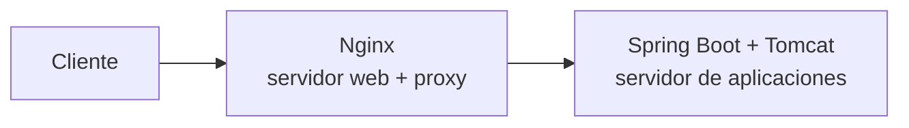
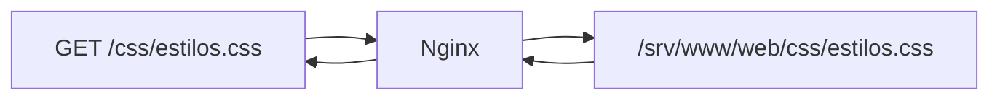
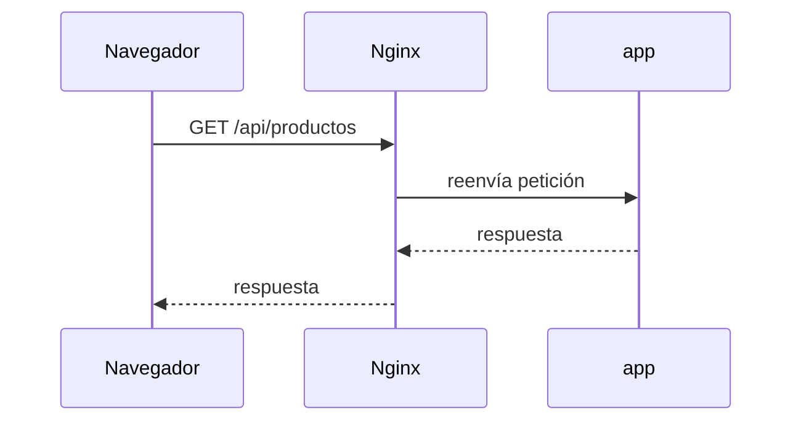
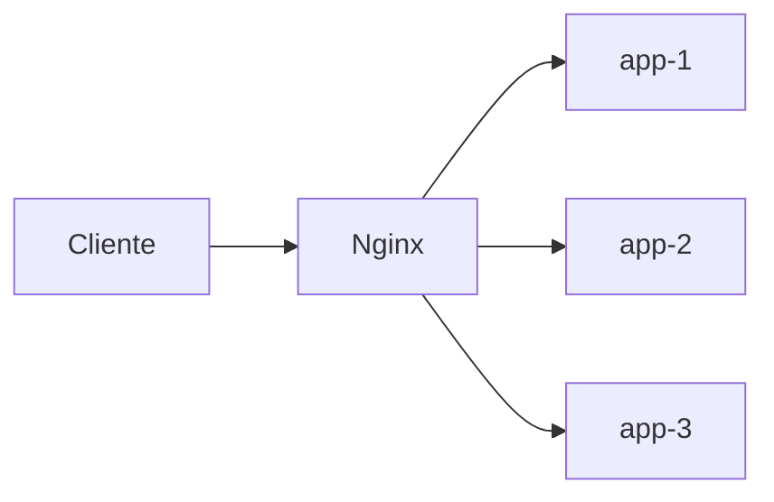
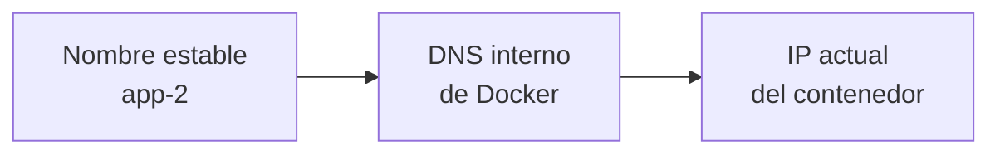
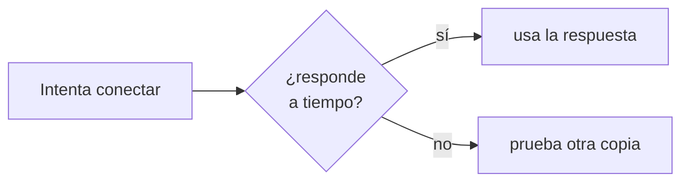
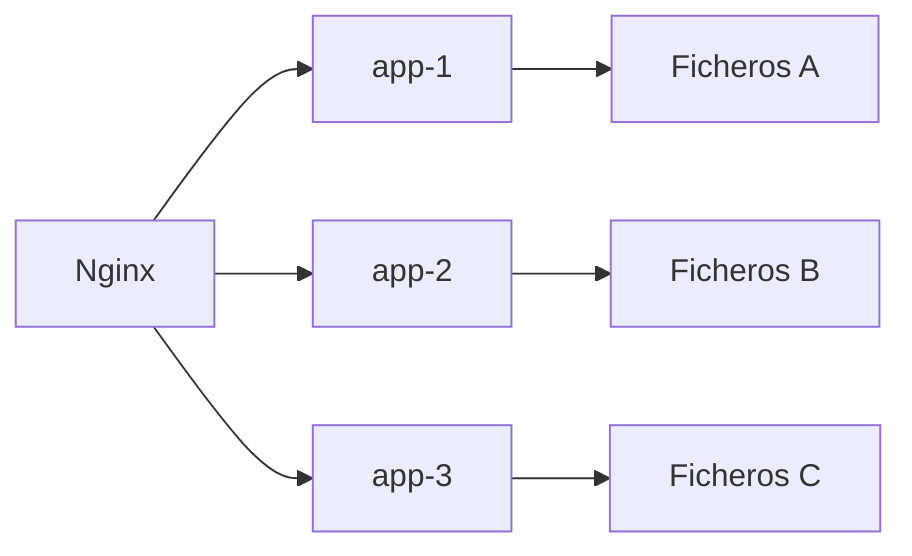
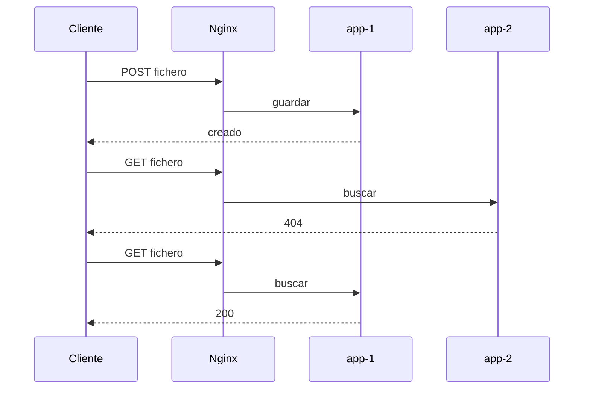
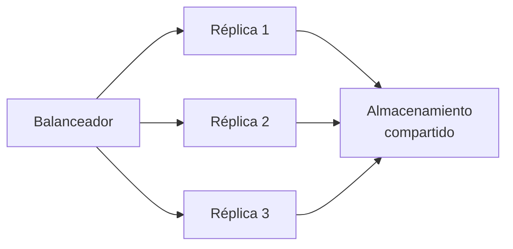
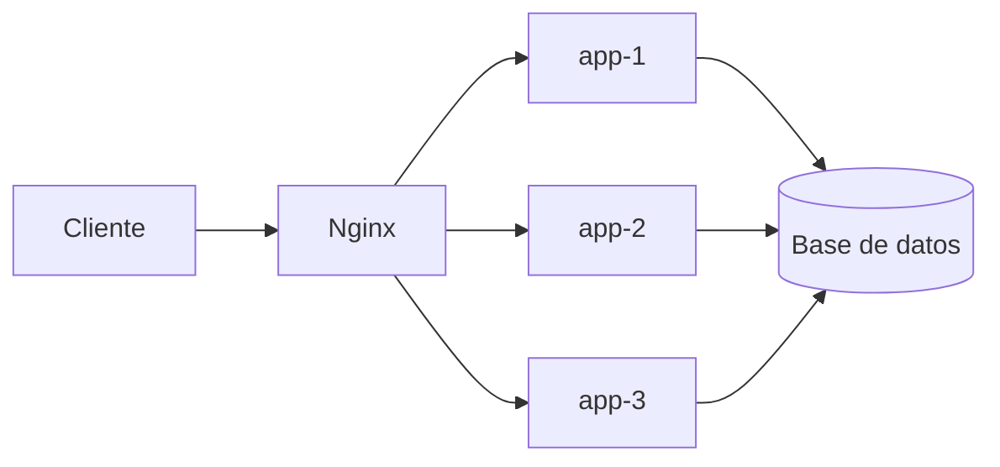

# 🔀 Proxy inverso y balanceo

!!! info "Descarga de diapositivas"
    <!-- [Descarga las diapositivas](diapositivas/proxy-inverso-balanceo.pptx){target="_blank" rel="noopener"} -->

---

En la sesión anterior Nginx actuó como servidor web y puerta de entrada. Ahora añadiremos un segundo papel: **reenviar peticiones a aplicaciones internas**. Cuando un servidor recibe tráfico y lo dirige hacia uno o varios backends hablamos de proxy inverso.

En nuestro despliegue esos backends no son “otro Nginx”: cada `app-*` contiene Escaparate y su **Tomcat embebido**. Desde esta sesión ya existe de forma explícita la cooperación:



Si existen varias copias equivalentes del backend, el mismo punto de entrada puede repartir entre ellas las peticiones. Esto introduce dos problemas que estudiaremos juntos: qué ocurre cuando una copia deja de responder y qué pasa si una réplica guarda localmente datos que después necesita cualquiera de las demás.

---

## 🔁 1. Proxy inverso

### 1.1. Servir y reenviar son trabajos diferentes

Cuando Nginx sirve un fichero estático, él mismo produce la respuesta:



Un **proxy inverso** hace algo distinto. Recibe una petición, selecciona otro servidor, se la reenvía, espera la respuesta y después la devuelve al cliente:



Para el navegador sigue existiendo un único origen. No necesita saber el nombre interno de la aplicación ni el puerto 8080.

Conviene reconocer la diferencia:

| | Proxy directo | Proxy inverso |
|---|---|---|
| Se coloca | del lado del cliente | delante de los servidores |
| Representa | al cliente | al servicio publicado |
| Ejemplo | proxy de salida de una organización | Nginx delante de una aplicación |

En esta sesión trabajaremos únicamente con **proxy inverso**.

### 1.2. Una sola puerta permite separar responsabilidades

Con un proxy inverso podemos decidir qué hacer según la petición:

| Ruta | Destino |
|---|---|
| `/` | ficheros del frontend |
| `/css/...` | ficheros del frontend |
| `/api/...` | aplicación |

Esto aporta varias ventajas que iremos utilizando durante el módulo:

- una sola entrada pública;
- componentes internos sin puertos publicados;
- reparto entre varias copias;
- un único punto para TLS;
- un lugar común donde registrar el tráfico.

---

## 🔍 2. `location` y `proxy_pass`

### 2.1. La ruta que llega al backend

El bloque mínimo utilizado en la sesión 6 era:

```nginx
location /api/ {
    proxy_pass http://backend:8080;
}
```

`location` selecciona las URL que empiezan por `/api/`. `proxy_pass` indica a qué destino deben enviarse.

Hay un detalle pequeño con consecuencias importantes: **la URI escrita en `proxy_pass` modifica cómo Nginx construye la ruta del destino**.

| `location` | `proxy_pass` | El cliente pide | El backend recibe |
|---|---|---|---|
| `/api/` | `http://backend:8080` | `/api/salud` | `/api/salud` |
| `/api/` | `http://backend:8080/` | `/api/salud` | `/salud` |

Si el backend publica realmente sus endpoints bajo `/api`, debemos conservar esa parte de la ruta:

```nginx
proxy_pass http://backend:8080;
```

Un `404` que solo aparece al atravesar el proxy es una señal clara para revisar esta diferencia.

### 2.2. El backend ya no habla con el cliente

Al introducir un proxy, la conexión que recibe el backend procede de Nginx. Si no hacemos nada, la aplicación pierde información sobre la petición original.

Por eso Nginx puede reenviar información sobre el host, la dirección observada y el protocolo externo. En esta sesión basta con comprender qué problema resuelven esas cabeceras; el detalle interno de Spring Boot/Tomcat se estudiará cuando abramos el backend.

| Información original | Sin reenviarla, el backend ve | Cabecera habitual |
|---|---|---|
| nombre solicitado | el destino interno | `Host` |
| IP del visitante | la IP del proxy | `X-Forwarded-For` |
| protocolo externo | la conexión interna | `X-Forwarded-Proto` |

Una configuración habitual cuando Nginx es **la primera y única puerta de confianza** es:

```nginx
proxy_set_header Host              $host;
proxy_set_header X-Forwarded-For   $remote_addr;
proxy_set_header X-Forwarded-Proto $scheme;
```

`$remote_addr` es la dirección desde la que Nginx ha recibido realmente la conexión.

!!! danger "No confíes en una cabecera porque venga escrita"
    Un cliente puede enviar por sí mismo `X-Forwarded-For: 1.2.3.4`. Si Nginx es la primera puerta de confianza, puede sobrescribir ese dato con la dirección que él mismo ha observado. En arquitecturas con varios proxies de confianza se conserva una cadena de direcciones, pero para hacerlo correctamente hay que saber qué intermediarios son fiables.

`Host` es una cabecera estándar de HTTP. Las cabeceras `X-Forwarded-*` son convenciones ampliamente utilizadas; existe también la cabecera estándar `Forwarded`.

---

## ⚖️ 3. Varias copias detrás de Nginx

### 3.1. Un nombre para las tres copias

En lugar de reenviar `/api/` a una única aplicación, vamos a crear un grupo llamado `backend_pool`.

La configuración que utilizaremos es:

```nginx
upstream backend_pool {
    zone backend_pool 64k;
    resolver 127.0.0.11 valid=5s ipv6=off;

    server app-1:8080 resolve;
    server app-2:8080 resolve;
    server app-3:8080 resolve;
}
```

La parte importante se puede leer así:



`upstream` simplemente da un nombre al grupo. Si no indicamos otro método, Nginx reparte las peticiones por turnos entre sus miembros.

Para observar el reparto, una aplicación puede exponer un endpoint como:

```text
/api/instancia
```

para poder ver qué copia ha respondido.

### 3.2. Por qué aparecen `zone`, `resolver` y `resolve`

Docker Compose nos permite hablar de `app-1`, `app-2` y `app-3` por nombre. Esos nombres son estables, pero la dirección IP interna de un contenedor puede cambiar cuando se detiene o se recrea.

Queremos que Nginx siga los **nombres**, no una dirección antigua.

Las tres piezas necesarias son:

| Directiva | Idea sencilla |
|---|---|
| `resolver 127.0.0.11` | pregunta al DNS interno de Docker |
| `resolve` | vuelve a consultar el nombre si cambia |
| `zone` | permite que Nginx mantenga actualizado el estado del grupo |

`valid=5s` hace que la información DNS se renueve con frecuencia en este laboratorio. `ipv6=off` evita consultas IPv6 que aquí no necesitamos.

No hace falta memorizar estas directivas. Lo importante es entender el problema que resuelven:



### 3.3. El proxy completo

El bloque de `/api/` queda:

```nginx
location /api/ {
    proxy_pass http://backend_pool;

    proxy_connect_timeout 2s;
    proxy_next_upstream error timeout;
    proxy_next_upstream_tries 3;

    proxy_set_header Host              $host;
    proxy_set_header X-Forwarded-For   $remote_addr;
    proxy_set_header X-Forwarded-Proto $scheme;
}
```

Las tres directivas nuevas tienen un único objetivo: **que una copia caída no bloquee una petición durante demasiado tiempo**.



`proxy_next_upstream_tries 3` limita el intento a las tres copias existentes.

---

## ❤️ 4. Qué ocurre cuando una copia falla

Nginx utiliza aquí una comprobación **pasiva**: no pregunta continuamente si las copias están sanas. Descubre un problema cuando intenta enviarles tráfico.

Si `app-2` se detiene:

| Réplica | Estado |
|---|---|
| `app-1` | ✅ disponible |
| `app-2` | ❌ caída |
| `app-3` | ✅ disponible |

una petición puede intentar primero `app-2`. Como hemos reducido el tiempo de conexión, Nginx no espera un minuto: abandona ese intento rápidamente y puede probar otra copia.

Las peticiones siguientes se siguen repartiendo entre los destinos disponibles.

Cuando `app-2` vuelve, `resolver` + `resolve` permiten que Nginx vuelva a localizarla por su nombre y la reincorpore al grupo sin tener que reiniciar el proxy.

**No es lo mismo que el `healthcheck` de Compose.**

Ya utilizaste un `healthcheck` con PostgreSQL. Se parecen, pero hacen trabajos diferentes:

| | Compose | Nginx |
|---|---|---|
| Para qué lo usamos | coordinar el arranque | repartir peticiones |
| Cómo detecta el problema | ejecuta una comprobación definida | falla una conexión real |
| Quién decide el destino HTTP | no lo hace | Nginx |

La idea importante es sencilla:

> Compose controla el estado de sus servicios; Nginx decide a qué copia envía cada petición.

Las comprobaciones activas periódicas existen en otros balanceadores y servicios cloud. Aquí basta con entender el comportamiento pasivo que acabamos de configurar.

---

## 🧺 5. El problema del estado local

### 5.1. Tres copias no comparten su sistema de ficheros

Supón una aplicación que permite subir ficheros y los guarda en el filesystem. Cada réplica podría utilizar:

```text
STORAGE_TYPE=filesystem
STORAGE_PATH=/data/uploads
```

Sin un volumen compartido, `/data/uploads` pertenece a cada contenedor:



La base de datos puede ser común y registrar la referencia al fichero, pero eso no hace que el fichero físico aparezca automáticamente en los discos de las demás réplicas.

Así puede ocurrir:



No es aleatorio: es una consecuencia directa del reparto.

### 5.2. Estado compartido en un único host

Mientras las tres copias viven en el mismo host Docker, podemos montar un **volumen nombrado común**:

```yaml
services:
  app-1:
    volumes:
      - uploads-compartidos:/data/uploads

  app-2:
    volumes:
      - uploads-compartidos:/data/uploads

  app-3:
    volumes:
      - uploads-compartidos:/data/uploads

volumes:
  uploads-compartidos:
```

Ahora:



Las tres copias ven los mismos ficheros.

La regla general es:

> Si varias copias deben ser intercambiables, el estado que todas necesiten recuperar no debe vivir únicamente dentro de una de ellas.

Este volumen resuelve el problema **porque las tres réplicas están en la misma máquina**. Cuando las copias vivan en hosts diferentes necesitaremos otro tipo de almacenamiento compartido, como un sistema de ficheros de red o almacenamiento de objetos.

---

## 🚪 6. Una sola puerta facilita el siguiente paso

El proxy inverso concentra el tráfico de entrada en un único componente:



Los servicios internos no necesitan publicar sus puertos hacia el anfitrión para comunicarse dentro de la red de Docker.

Esta concentración tendrá una consecuencia importante en la siguiente sesión: cuando el sistema se despliegue en una máquina accesible desde Internet, podremos aplicar **HTTPS y control de acceso en Nginx** sin configurar esas responsabilidades de forma independiente en cada réplica.

El principio general es:

> **Una sola puerta pública permite aplicar una política común de entrada.**

---

## 🎯 Qué debes saber hacer al salir de esta sesión

Al terminar, deberías poder:

- Explicar la diferencia entre servir contenido y actuar como proxy inverso.
- Predecir qué ruta recibirá el backend según la forma de `proxy_pass`.
- Explicar por qué el backend necesita recibir información de la petición original mediante cabeceras reenviadas.
- Declarar un `upstream` con varias copias y comprobar el reparto mediante un endpoint que identifique la réplica.
- Explicar por qué Nginx debe poder volver a resolver los nombres de los contenedores.
- Comprobar qué ocurre cuando una réplica deja de responder y cómo el proxy puede probar otra.
- Diferenciar el `healthcheck` de Compose de la detección pasiva de fallos del proxy.
- Diagnosticar por qué un fichero local puede aparecer y desaparecer cuando varias réplicas atienden peticiones.
- Resolver ese problema compartiendo almacenamiento entre réplicas del mismo host.
- Explicar por qué un volumen Docker compartido deja de ser suficiente si las réplicas viven en máquinas distintas.
- Mantener una única puerta publicada hacia el anfitrión.

Lo que basta con **reconocer**:

- la diferencia general entre proxy directo y proxy inverso;
- que existen otros algoritmos de balanceo;
- que existen comprobaciones activas de salud;
- que un sistema distribuido entre varios hosts necesita soluciones de almacenamiento compartido distintas de un volumen local de Docker;
- los detalles de `zone`, `resolver`, `resolve` y las directivas de reintento.

---

## ✅ Ideas clave

??? tip "Abrir resumen"

    - Un proxy inverso recibe peticiones del cliente y las reenvía hacia aplicaciones internas.
    - `location` decide qué peticiones se reenvían y `proxy_pass` determina el destino.
    - Una `/` final en `proxy_pass` puede modificar la URI que recibe el backend.
    - El backend habla directamente con Nginx, no con el navegador; por eso pueden reenviarse `Host`, la IP observada y el protocolo original.
    - Un `upstream` agrupa varias réplicas detrás de un único nombre.
    - Si no se indica otro algoritmo, Nginx reparte las peticiones entre los miembros del grupo.
    - Los nombres de los servicios son estables, pero las IP internas de los contenedores pueden cambiar; por eso interesa resolver de nuevo esos nombres.
    - La detección de fallos usada aquí es pasiva: Nginx descubre que una réplica falla al intentar utilizarla.
    - Un timeout corto y el reintento permiten probar otra copia sin bloquear demasiado tiempo la petición.
    - Varias réplicas no comparten automáticamente su filesystem.
    - Si cualquier réplica debe poder recuperar un dato, ese dato no puede vivir únicamente dentro de una de ellas.
    - Un volumen común resuelve el problema mientras las réplicas comparten host.
    - Nginx sigue siendo la única puerta publicada; las réplicas y la base de datos permanecen en la red interna.


---

En la actividad aplicarás este patrón general al proyecto del módulo: varias réplicas de Spring Boot/Tomcat detrás de Nginx, detección pasiva de fallos y almacenamiento compartido entre copias del mismo host. El despliegue en una máquina pública se reserva para la siguiente sesión, donde esa nueva situación será necesaria para trabajar HTTPS y certificados.
