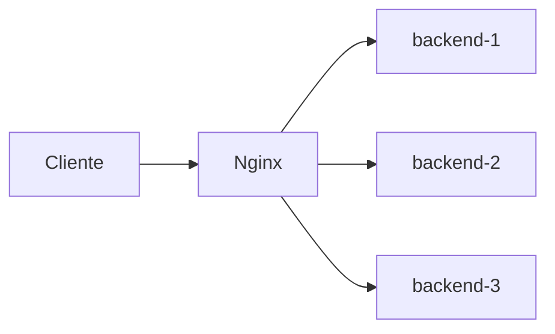
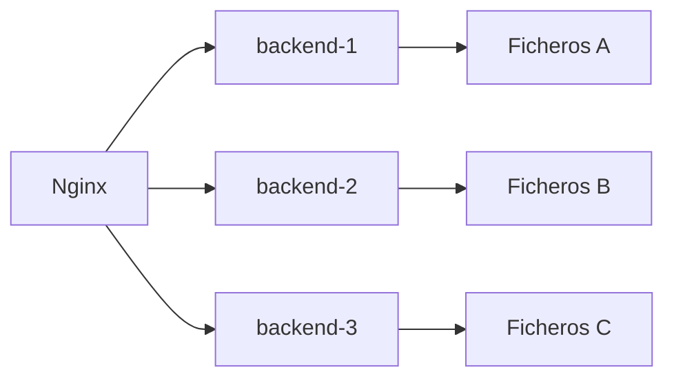
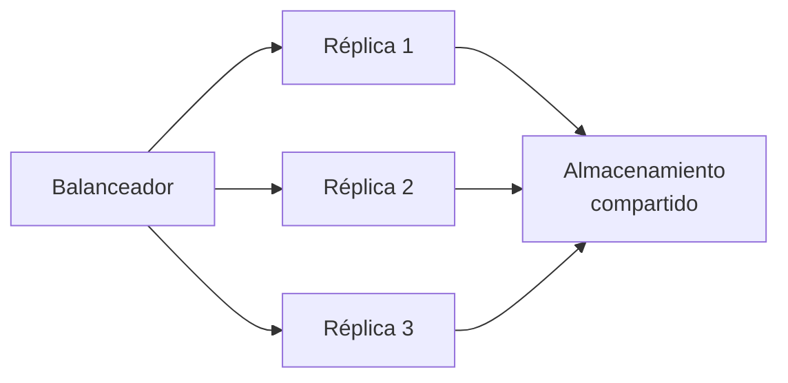

# 🔀 Proxy inverso y balanceo

!!! info "Descarga de diapositivas"
    [Descarga las diapositivas](diapositivas/proxy-inverso-balanceo.pptx){target="_blank" rel="noopener"}

---

En la sesión anterior Nginx actuó como servidor web y puerta de entrada. Ahora añadiremos un segundo papel: **reenviar peticiones a aplicaciones internas**. Cuando un servidor recibe tráfico público y lo dirige hacia uno o varios backends hablamos de proxy inverso.

Si existen varias copias equivalentes del backend, el mismo punto de entrada puede repartir entre ellas las peticiones. Esto introduce dos problemas que estudiaremos juntos: detectar copias que dejan de responder y evitar que datos necesarios queden encerrados en el almacenamiento local de una sola réplica.

---

## 🔁 1. Proxy inverso

### 1.1. Servir y reenviar son trabajos diferentes

Cuando Nginx sirve un fichero estático, él mismo produce la respuesta:

```text
GET /css/estilos.css
        ↓
      Nginx
        ↓
/srv/www/web/css/estilos.css
```

Un **proxy inverso** hace algo distinto. Recibe una petición, selecciona otro servidor, se la reenvía, espera la respuesta y después la devuelve al cliente:

```text
GET /api/productos
        ↓
      Nginx
        ↓
       app
        ↓
      Nginx
        ↓
    navegador
```

Para el navegador sigue existiendo un único origen. No necesita saber el nombre interno de la aplicación ni el puerto 8080.

Conviene distinguirlo de un proxy directo:

| | Proxy directo | Proxy inverso |
|---|---|---|
| Lo utiliza | el cliente o su organización | quien publica el servicio |
| Representa | al cliente | al servidor |
| Oculta | quién navega | qué infraestructura hay detrás |
| Ejemplo | filtro de salida de una organización | Nginx delante de una aplicación |

### 1.2. Una sola puerta permite separar responsabilidades

Con un proxy inverso podemos decidir qué hacer según la petición:

```text
/                 → ficheros del frontend
/css/...          → ficheros del frontend
/api/...          → aplicación
```

Esto aporta varias ventajas que iremos utilizando durante el módulo:

- una sola entrada pública;
- componentes internos sin puertos publicados;
- reparto entre varias copias;
- un único punto para TLS;
- un lugar común donde registrar el tráfico.

---

## 🔍 2. `location` y `proxy_pass`

### 2.1. La ruta que llega al backend

El bloque mínimo utilizado en la sesión 6 era:

```nginx
location /api/ {
    proxy_pass http://backend:8080;
}
```

`location` selecciona las URL que empiezan por `/api/`. `proxy_pass` indica a qué destino deben enviarse.

Hay un detalle pequeño con consecuencias importantes: **la URI escrita en `proxy_pass` modifica cómo Nginx construye la ruta del destino**.

| `location` | `proxy_pass` | El cliente pide | El backend recibe |
|---|---|---|---|
| `/api/` | `http://backend:8080` | `/api/salud` | `/api/salud` |
| `/api/` | `http://backend:8080/` | `/api/salud` | `/salud` |

Si el backend publica realmente sus endpoints bajo `/api`, debemos conservar esa parte de la ruta:

```nginx
proxy_pass http://backend:8080;
```

Un `404` que solo aparece al atravesar el proxy es una señal clara para revisar esta diferencia.

### 2.2. El backend ya no habla con el cliente

Al introducir un proxy, la conexión que recibe el backend procede de Nginx. Si no hacemos nada, la aplicación pierde información sobre la petición original.

| Información original | Sin reenviarla, el backend ve | Cabecera habitual |
|---|---|---|
| nombre solicitado | el destino interno | `Host` |
| IP del visitante | la IP del proxy | `X-Forwarded-For` |
| protocolo externo | la conexión interna | `X-Forwarded-Proto` |

Una configuración habitual cuando Nginx es **la primera y única puerta de confianza** es:

```nginx
proxy_set_header Host              $host;
proxy_set_header X-Forwarded-For   $remote_addr;
proxy_set_header X-Forwarded-Proto $scheme;
```

`$remote_addr` es la dirección desde la que Nginx ha recibido realmente la conexión.

!!! danger "No confíes en una cabecera porque venga escrita"
    Un cliente puede enviar por sí mismo `X-Forwarded-For: 1.2.3.4`. Si Nginx es la primera puerta de confianza, puede sobrescribir ese dato con la dirección que él mismo ha observado. En arquitecturas con varios proxies de confianza se conserva una cadena de direcciones, pero para hacerlo correctamente hay que saber qué intermediarios son fiables.

`Host` es una cabecera estándar de HTTP. Las cabeceras `X-Forwarded-*` son convenciones ampliamente utilizadas; existe también la cabecera estándar `Forwarded`.

---

## ⚖️ 3. Varias copias detrás de Nginx

### 3.1. Un nombre para las tres copias

En lugar de reenviar `/api/` a una única aplicación, vamos a crear un grupo llamado `backend_pool`.

La configuración que utilizaremos es:

```nginx
upstream backend_pool {
    zone backend_pool 64k;
    resolver 127.0.0.11 valid=5s ipv6=off;

    server backend-1:8080 resolve;
    server backend-2:8080 resolve;
    server backend-3:8080 resolve;
}
```

La parte importante se puede leer así:



`upstream` simplemente da un nombre al grupo. Si no indicamos otro método, Nginx reparte las peticiones por turnos entre sus miembros.

Para observar el reparto, una aplicación puede exponer un endpoint como:

```text
/api/instancia
```

para poder ver qué copia ha respondido.

### 3.2. Por qué aparecen `zone`, `resolver` y `resolve`

Docker Compose nos permite hablar de `backend-1`, `backend-2` y `backend-3` por nombre. Esos nombres son estables, pero la dirección IP interna de un contenedor puede cambiar cuando se detiene o se recrea.

Queremos que Nginx siga los **nombres**, no una dirección antigua.

Las tres piezas necesarias son:

| Directiva | Idea sencilla |
|---|---|
| `resolver 127.0.0.11` | pregunta al DNS interno de Docker |
| `resolve` | vuelve a consultar el nombre si cambia |
| `zone` | permite que Nginx mantenga actualizado el estado del grupo |

`valid=5s` hace que la información DNS se renueve con frecuencia en este laboratorio. `ipv6=off` evita consultas IPv6 que aquí no necesitamos.

No hace falta memorizar estas directivas. Lo importante es entender el problema que resuelven:

```text
nombre estable de servicio
        ↓
DNS interno de Docker
        ↓
IP actual del contenedor
```

### 3.3. El proxy completo

El bloque de `/api/` queda:

```nginx
location /api/ {
    proxy_pass http://backend_pool;

    proxy_connect_timeout 2s;
    proxy_next_upstream error timeout;
    proxy_next_upstream_tries 3;

    proxy_set_header Host              $host;
    proxy_set_header X-Forwarded-For   $remote_addr;
    proxy_set_header X-Forwarded-Proto $scheme;
}
```

Las tres directivas nuevas tienen un único objetivo: **que una copia caída no bloquee una petición durante demasiado tiempo**.

```text
intenta conectar
      ↓
en 2 s no responde
      ↓
prueba otra copia
```

`proxy_next_upstream_tries 3` limita el intento a las tres copias existentes.

---

## ❤️ 4. Qué ocurre cuando una copia falla

Nginx utiliza aquí una comprobación **pasiva**: no pregunta continuamente si las copias están sanas. Descubre un problema cuando intenta enviarles tráfico.

Si `backend-2` se detiene:

```text
backend-1  ✅
backend-2  ❌
backend-3  ✅
```

una petición puede intentar primero `backend-2`. Como hemos reducido el tiempo de conexión, Nginx no espera un minuto: abandona ese intento rápidamente y puede probar otra copia.

Las peticiones siguientes se siguen repartiendo entre los destinos disponibles.

Cuando `backend-2` vuelve, `resolver` + `resolve` permiten que Nginx vuelva a localizarla por su nombre y la reincorpore al grupo sin tener que reiniciar el proxy.

### 4.1. No es lo mismo que el `healthcheck` de Compose

Ya utilizaste un `healthcheck` con PostgreSQL. Se parecen, pero hacen trabajos diferentes:

| | Compose | Nginx |
|---|---|---|
| Para qué lo usamos | coordinar el arranque | repartir peticiones |
| Cómo detecta el problema | ejecuta una comprobación definida | falla una conexión real |
| Quién decide el destino HTTP | no lo hace | Nginx |

La idea importante es sencilla:

> Compose controla el estado de sus servicios; Nginx decide a qué copia envía cada petición.

Las comprobaciones activas periódicas existen en otros balanceadores y servicios cloud. Aquí basta con entender el comportamiento pasivo que acabamos de configurar.

---

## 🧺 5. El problema del estado local

### 5.1. Tres copias no comparten su sistema de ficheros

Supón una aplicación que permite subir ficheros y los guarda en el filesystem. Cada réplica podría utilizar:

```text
STORAGE_TYPE=filesystem
STORAGE_PATH=/data/uploads
```

Sin un volumen compartido, `/data/uploads` pertenece a cada contenedor:



La base de datos puede ser común y registrar la referencia al fichero, pero eso no hace que el fichero físico aparezca automáticamente en los discos de las demás réplicas.

Así puede ocurrir:

```text
POST fichero
→ backend-1
→ fichero guardado en backend-1

GET fichero
→ backend-2
→ 404

GET fichero
→ backend-1
→ 200
```

No es aleatorio: es una consecuencia directa del reparto.

### 5.2. Estado compartido en un único host

Mientras las tres copias viven en el mismo host Docker, podemos montar un **volumen nombrado común**:

```yaml
services:
  backend-1:
    volumes:
      - uploads-compartidos:/data/uploads

  backend-2:
    volumes:
      - uploads-compartidos:/data/uploads

  backend-3:
    volumes:
      - uploads-compartidos:/data/uploads

volumes:
  uploads-compartidos:
```

Ahora:



Las tres copias ven los mismos ficheros.

La regla general es:

> Si varias copias deben ser intercambiables, el estado que todas necesiten recuperar no debe vivir únicamente dentro de una de ellas.

Este volumen resuelve el problema **porque las tres réplicas están en la misma máquina**. Cuando las copias vivan en hosts diferentes necesitaremos otro tipo de almacenamiento compartido, como un sistema de ficheros de red o almacenamiento de objetos.

---

## ☁️ 6. El mismo despliegue en una instancia remota

### 6.1. En producción no compilamos en el servidor

El servidor de destino no necesita las herramientas de compilación ni el código fuente para ejecutar una imagen ya construida.

El flujo es:

```text
equipo de desarrollo
    ↓
construye imagen
    ↓
registro de contenedores
    ↓
servidor remoto
    ↓
docker compose pull / up
```

El servidor descarga del registro una imagen ya construida y ejecuta exactamente ese artefacto. La compilación queda fuera del servidor de producción.

El repositorio sigue siendo necesario porque contiene la **descripción reproducible del despliegue**: Compose, configuración del proxy y documentación operativa. Código, configuración de despliegue e imágenes publicadas cumplen funciones distintas.

### 6.2. Una puerta pública significa una superficie real

En local:

```text
80:80
```

solo exponía Nginx hacia tu equipo y tu red.

En una máquina con IP pública, ese mismo puerto puede quedar accesible desde Internet. Por eso el resultado debe seguir siendo:

```text
Internet
   │
   │ 80
   ▼
 Nginx
   │
   ├── backend-1:8080
   ├── backend-2:8080
   ├── backend-3:8080
   └── bd:5432

solo Nginx publica puerto
```

Los puertos internos no necesitan publicarse para que los servicios se comuniquen mediante la red de Compose.

---

## 🌐 7. Nombres que sobreviven al cambio de IP

La instancia del laboratorio puede recibir una dirección pública diferente en otra sesión. `nip.io` permite construir nombres a partir de la dirección actual:

```text
web.203.0.113.25.nip.io
docs.203.0.113.25.nip.io
```

Si escribiéramos esa dirección dentro de `server_name`, tendríamos que modificar la configuración cada vez.

Nginx admite nombres comodín al final. Podemos aprovecharlo:

```nginx
server_name web.*;
```

y:

```nginx
server_name docs.*;
```

El mismo bloque acepta así:

```text
web.127.0.0.1.nip.io
web.203.0.113.25.nip.io
web.<otra-ip>.nip.io
```

Esto no cambia el DNS. `nip.io` sigue siendo quien convierte cada nombre en su dirección. El comodín solo evita que Nginx tenga que conocer por adelantado el fragmento variable del nombre.

El servidor por defecto configurado en la sesión anterior continúa siendo útil para cualquier nombre que no encaje en los dos patrones previstos.

---

## 🎯 Qué debes saber hacer al salir de esta sesión

- Explicar la diferencia entre servir contenido y actuar como proxy inverso.
- Predecir qué ruta recibirá el backend según la forma de `proxy_pass`.
- Reenviar correctamente nombre, IP y protocolo originales.
- Declarar un `upstream` con tres copias y demostrar el reparto mediante `/api/instancia`.
- Explicar por qué Nginx debe volver a resolver los nombres de los contenedores.
- Explicar qué ocurre cuando una réplica deja de responder y cómo el proxy prueba otra.
- Diferenciar el `healthcheck` de Compose de la detección de fallos del proxy.
- Diagnosticar por qué un fichero local aparece y desaparece al balancear.
- Resolver ese estado compartiendo un volumen entre réplicas del mismo host.
- Desplegar desde imágenes públicas y configuración versionada sin compilar en el servidor.
- Mantener una única puerta pública.
- Utilizar nombres `nip.io` variables sin incrustar cada IP nueva en la configuración de Nginx.

Lo que basta con reconocer: existen otros algoritmos de balanceo, comprobaciones activas y soluciones de almacenamiento compartido entre hosts.

---

## ✅ Ideas clave

??? tip "Abrir resumen"

    - En la sesión 6 Nginx ya reenviaba `/api/`, pero el bloque era una caja negra. Ahora entiendes y escribes `proxy_pass` y las cabeceras reenviadas.
    - Sin URI final en `proxy_pass`, una ruta como `/api/...` puede conservarse completa; añadir una URI al destino puede modificar lo que recibe el backend.
    - El backend habla directamente con el proxy, no con el navegador. Por eso Nginx debe reconstruir información de la petición original.
    - Un `upstream` permite dar un único nombre a `backend-1`, `backend-2` y `backend-3`.
    - `/api/instancia` permite observar qué réplica ha procesado cada petición.
    - `resolver` y `resolve` permiten seguir utilizando el nombre de un contenedor aunque cambie su IP interna.
    - Un tiempo de conexión corto y el reintento sobre otra copia evitan esperas largas cuando una réplica cae.
    - El `healthcheck` de Compose y la detección del proxy tienen objetivos distintos.
    - Tres contenedores no comparten su filesystem. Una clave guardada en la base de datos puede apuntar a un fichero que solo existe en una réplica.
    - Un volumen común resuelve ese problema mientras las réplicas viven en el mismo host.
    - En el servidor de destino no se recompila la aplicación: se descargan imágenes ya construidas desde un registro.
    - Solo Nginx debe publicar un puerto al exterior.
    - Un `server_name` con comodín puede evitar reescribir la configuración cuando cambia la parte variable de un nombre `nip.io`.

---

En la actividad aplicarás este patrón general al proyecto del módulo: varias réplicas detrás de Nginx, detección pasiva de fallos, resolución de nombres de Docker y almacenamiento compartido entre copias del mismo host.
