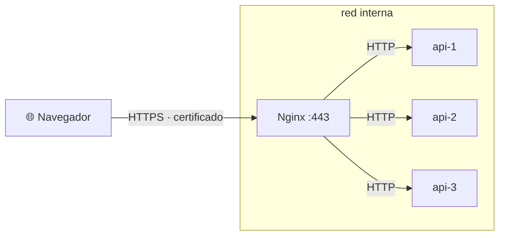

# 🔒 3. Seguridad web y HTTPS

!!!info "Descarga de diapositivas"
    [Descarga las diapositivas](diapositivas/seguridad-web-https.pptx){target="_blank" rel="noopener"}

---

Desde la semana pasada tienes un servicio de verdad: publicado en internet, con una sola puerta, tres copias de la aplicación repartiéndose el trabajo y capaz de aguantar la caída de una de ellas. Funciona, y cualquiera puede llegar a él escribiendo un nombre.

Ese «cualquiera» es justo el problema de hoy. Tu servicio no distingue entre quien tiene que entrar y quien no, y los informes de pruebas que publicaste en la sesión 6 están abiertos al mundo entero. Y lo más grave no se ve: **todo lo que va y viene viaja en texto plano**. Cada petición, cada respuesta y cada cosa que alguien escriba en un formulario puede leerla, y modificarla, quien esté en cualquier punto del camino. Hoy vas a cerrar las dos cosas, y en este orden: primero decides quién entra, después demuestras por qué HTTP no basta, y al final conviertes el servicio en un despliegue cifrado que se mantiene solo.

---

## 🚧 Lo barato primero: quién entra y quién no

Antes del cifrado hay una pregunta más simple: **¿toda tu web tiene que ser pública?** Casi nunca. Los informes de pruebas, un panel de administración o una zona interna no lo son, y para eso no hace falta programar nada: el propio servidor web puede exigir credenciales en una ruta concreta.

La **autenticación básica** funciona así: cuando llega una petición a una zona protegida, el servidor responde con un `401` y una cabecera diciendo que ahí hace falta identificarse; el cliente reenvía entonces la petición con la cabecera `Authorization`, que contiene el usuario y la contraseña separados por dos puntos y codificados en `Base64`. Y `Base64` **no es cifrado**: es una codificación reversible que cualquiera deshace en un segundo, cosa que vas a comprobar tú mismo dentro de un rato.

De ahí sale la regla práctica, que es corta:

> Autenticación básica **sobre HTTPS**. Nunca sin él.

Las contraseñas no se guardan en claro en ningún fichero: se genera un fichero de credenciales donde cada línea lleva el usuario y el resumen de su contraseña, y ese fichero no se versiona, igual que el `.env`.

!!! warning "Proteger la ruta, no el fichero"
    Si proteges `/informes/` pero el mismo contenido es alcanzable por otra ruta —un alias, un enlace simbólico, una barra final distinta—, la protección no sirve de nada. Después de configurar cualquier restricción, la comprobación obligatoria es intentar entrar: sin credenciales debe dar `401`, con credenciales malas también, y solo con las buenas debe dar `200`.

!!! info "Para saber más: otros controles de acceso"
    Existe la **autenticación digest**, que en lugar de mandar la contraseña envía un resumen calculado con un valor aleatorio del servidor. Hoy no se usa: obliga al servidor a guardar las contraseñas de forma poco robusta y resuelve un problema que TLS resuelve entero y mejor.

    La otra herramienta es la **restricción por origen**: permitir o denegar por dirección IP, útil para zonas que solo deben verse desde la red de la empresa. Tiene una trampa que ya conoces: detrás de un proxy, todas las peticiones parecen venir del proxy, así que sin la cabecera con la dirección original cualquier filtro por IP es un adorno. Las dos se pueden combinar exigiendo **ambas** condiciones o dando por buena **cualquiera** de las dos, y elegir mal ahí es la forma silenciosa de dejar una puerta abierta.

---

## 🕵️ Lo que se ve en el cable

Aquí es donde se entiende TLS, y no se entiende leyendo: se entiende mirando. Si capturas el tráfico de tu propio servicio mientras alguien se identifica en esa zona protegida, verás la petición entera en texto legible, con su cabecera `Authorization`, y descodificar ese valor es cuestión de un comando.

Esto no es una demostración de laboratorio. Cualquiera que comparta camino con el tráfico —la red del local en el que estás, un equipo intermedio, el proveedor— puede hacer lo mismo. Y no solo leer: puede **modificar** la respuesta antes de que llegue, insertando lo que le apetezca en una página que el visitante cree tuya.

Esa es la razón de que hoy el navegador marque como «no seguro» todo lo que no vaya cifrado, de que ciertas funciones del navegador directamente no existan sin HTTPS, y de que el cifrado haya pasado de ser una opción para el formulario de pago a ser el suelo mínimo de cualquier sitio publicado.

---

## 🔐 Qué garantiza TLS y qué no

**TLS** es el protocolo que envuelve la conexión HTTP. Cuando HTTP viaja dentro de TLS lo llamamos HTTPS, y ese envoltorio da tres garantías, ni una más:

| Garantía | Qué significa |
|---|---|
| **Confidencialidad** | Quien esté en medio ve bytes ilegibles, no el contenido |
| **Integridad** | Si alguien modifica algo por el camino, se detecta y la conexión se corta |
| **Autenticidad del servidor** | Tienes una prueba de estar hablando con quien dice el nombre, no con un impostor |

Y ahora lo que **no** garantiza, que es igual de importante y se confunde constantemente:

- **No dice que el sitio sea honesto.** Una página fraudulenta puede tener un certificado perfectamente válido: el candado dice «estás hablando con el dueño de este nombre», no «este señor es de fiar».
- **No protege tu aplicación.** Un fallo de programación se explota igual de bien por HTTPS.
- **No protege los datos en destino.** Cifra el trayecto; lo que pase al llegar es otro asunto.
- **No esconde con quién hablas.** La dirección IP de destino y el nombre del sitio que pides son visibles para quien observe la conexión, igual que el volumen y el ritmo del tráfico. Lo que se oculta es el contenido.

!!! example "El sobre cerrado"
    TLS es meter la carta en un sobre opaco y precintado en lugar de mandar una postal. Nadie puede leerla ni cambiarla sin que se note, y el remite está verificado. Pero el cartero sigue sabiendo a qué dirección va, cuántas cartas mandas y con qué frecuencia. Y que el sobre esté bien cerrado no dice absolutamente nada sobre si lo que va dentro es verdad.

---

## 📜 Certificados y cadena de confianza

Para que el cifrado sirva de algo hay que resolver antes un problema: cómo sabes que la clave pública que te está dando el servidor es realmente la del dueño de ese nombre, y no la de quien se ha puesto en medio.

La respuesta es un **certificado**: un fichero que asocia un nombre de dominio con una clave pública, y que está **firmado** por una autoridad de certificación. Tu sistema operativo y tu navegador vienen con una lista de autoridades en las que confían de fábrica —el almacén de confianza—, y la validación consiste en comprobar que la firma del certificado encadena hasta una de ellas.

Rara vez es una firma directa. Lo normal es una cadena: tu certificado lo firma un certificado **intermedio**, y a este lo firma el **raíz** que está en el almacén. Por eso el servidor no envía solo tu certificado, sino tu certificado **y los intermedios**: si te olvidas de estos últimos, funcionará en tu navegador —que a lo mejor ya los tenía guardados— y fallará en otros clientes, que es de los errores más molestos que hay porque parece intermitente.

Tres formas de conseguir un certificado, con tres usos distintos:

| Cómo se obtiene | Quién lo firma | Qué ocurre en el navegador | Para qué sirve |
|---|---|---|---|
| **Autofirmado** | Tú mismo | Aviso a pantalla completa | Entender el mecanismo, pruebas internas |
| **CA comercial** | Una autoridad de pago | Candado normal | Certificados con validación de organización o extendida |
| **ACME** (Let's Encrypt) | Una autoridad gratuita y automatizada | Candado normal | Prácticamente todo lo demás, hoy |

Un certificado autofirmado **cifra exactamente igual de bien**: la conexión es igual de confidencial e igual de íntegra. Lo único que falta es la tercera garantía, la autenticidad, porque nadie en quien el navegador confíe respalda que ese nombre sea tuyo. Verás uno en clase, emitido en directo, con su aviso a pantalla completa y su emisor apuntándose a sí mismo. Fíjate bien en esa pantalla, porque explica de golpe por qué existen las autoridades de certificación: acostumbrar a los usuarios a saltarse ese aviso es exactamente lo contrario de lo que se pretende, y por eso un certificado autofirmado sirve para aprender y para tráfico interno, pero nunca para un servicio público.

---

## 🤖 ACME: certificados que se piden y se renuevan solos

**ACME** es el protocolo que convirtió la emisión de certificados en algo automático y gratuito. La idea es que la autoridad no necesita conocerte: le basta con comprobar que **controlas el nombre** para el que pides el certificado.

El proceso, tal como lo vas a vivir hoy:

1. Tu cliente ACME genera un par de claves y pide un certificado para tu subdominio.
2. La autoridad le devuelve un **desafío**: pon este contenido concreto en esta ruta concreta de ese nombre.
3. El cliente coloca el fichero y avisa. La autoridad **entra desde internet por el puerto 80** y comprueba que está.
4. Si lo encuentra, emite el certificado. El cliente lo guarda junto a su clave privada.

De aquí salen dos consecuencias prácticas que explican decisiones de configuración que si no parecen arbitrarias. La primera: **el puerto 80 tiene que seguir abierto** aunque redirijas todo a HTTPS, porque la validación empieza siempre por ahí. En nuestro despliegue, además, dejaremos la ruta del desafío accesible directamente por HTTP en lugar de redirigirla, para que el procedimiento sea sencillo y explícito —la autoridad puede seguir ciertas redirecciones, pero no complicamos algo que no lo necesita—. La segunda: tu nombre tiene que resolver **a esta máquina** desde internet en el momento de pedirlo, así que el registro DNS es un requisito previo, no un detalle posterior.

Los certificados públicos suelen tener una **validez limitada**, y la tendencia actual es reducirla. Let's Encrypt emite hoy por defecto certificados de noventa días, y esa duración va camino de acortarse todavía más. El dato que hay que retener no es el número: es que un plazo corto **obliga a automatizar la renovación**, y una renovación automatizada es una renovación que no se olvida el día que la persona que la hacía a mano está de vacaciones.

Y aquí conviene separar dos cosas que se confunden constantemente, porque hacen falta las dos:

| | Qué demuestra | Qué no demuestra |
|---|---|---|
| **Ejecución en seco** de la renovación | Que el procedimiento se completaría sin errores: el nombre resuelve, el desafío es alcanzable y el cliente sabe escribir el certificado | Que alguien vaya a ejecutarlo |
| **Mecanismo periódico** que lanza la renovación | Que se intentará a tiempo, sin que nadie se acuerde | Que vaya a funcionar el día que toque |

Tener solo lo primero es tener un procedimiento correcto que nadie ejecuta; tener solo lo segundo es tener un reloj que ejecuta algo roto. La combinación de ambas es lo que permite escribir en un procedimiento de despliegue la frase «para renovar el certificado: nada», y que sea verdad. Un despliegue con HTTPS que caduca sin que nadie se entere es un incidente con fecha programada.

!!! danger "Empieza siempre por el entorno de pruebas"
    Las autoridades de certificación aplican **límites de emisión y de validaciones fallidas** para evitar errores automatizados y abuso. Por eso se depura siempre contra el **entorno de pruebas**, que emite certificados no válidos para el navegador pero por lo demás idénticos y con límites mucho más permisivos, y solo cuando el proceso completo funciona se repite contra el de producción. Si una validación falla, diagnostica la causa antes de volver a intentarlo: reintentar a ciegas es la forma más rápida de quedarte sin poder emitir.

!!! info "Para saber más: el desafío por DNS"
    Existe otra forma de demostrar el control del nombre: publicar un registro `TXT` con el valor que te dan. Es más lenta —hay que esperar a la propagación— pero no necesita que el servidor sea alcanzable desde internet, y es la única que permite certificados **comodín**, válidos para todos los subdominios de un nivel. Es lo que se usa en máquinas internas que no publican nada.

---

## 🚪 Dónde se cifra: terminación TLS en el proxy

El certificado no se instala en las tres copias de Escaparate. Se instala **en el proxy**, que es la única pieza que habla con el exterior:

Esto se llama **terminación TLS**: el cifrado se deshace en el proxy y de ahí para dentro el tráfico va en claro, por una red que no sale de la máquina. Las ventajas son grandes: un solo certificado que renovar, un solo sitio donde configurar, y los backends sin saber nada de criptografía. El peaje también hay que nombrarlo: todo lo que esté dentro de esa red ve el tráfico sin cifrar. Aceptable cuando la red es interna y de confianza; inaceptable cuando esas copias están en máquinas distintas y el tráfico cruza una red que no controlas, y ahí se cifra también por dentro.

Con el cifrado en el proxy, dos cosas encajan por fin:

- La cabecera `X-Forwarded-Proto` que pusiste la semana pasada **ahora sirve de algo**: la aplicación recibe peticiones en claro y esa cabecera es lo único que le dice que el visitante venía por HTTPS.
- La **redirección de 80 a 443** deja de ser opcional. Quien escriba el nombre sin protocolo llegará al 80, y ahí lo único que debe recibir es una redirección permanente al puerto seguro. Con la excepción, ya dicha, de la ruta del desafío.

---

## 🧱 Cabeceras de seguridad y HSTS

Con el candado puesto queda un flanco: **la petición que sale en claro** porque alguien ha tecleado el nombre sin protocolo. Esa conexión puede ser interceptada antes de que la redirección llegue a aplicarse.

**HSTS** evita que esa situación se repita **una vez que el navegador ha visitado correctamente el sitio por HTTPS**. Es una cabecera con la que el servidor le dice: *para este nombre, durante este tiempo, no vuelvas a conectarte por HTTP ni aunque te lo pidan*. A partir de ahí el navegador convierte las peticiones a HTTPS antes de salir a la red.

Ojo con el matiz, porque es donde casi todo el mundo se equivoca: **la primerísima visita a un nombre que el navegador no conoce sigue dependiendo de la redirección**, porque todavía no ha recibido la política. Existen mecanismos de precarga en los propios navegadores para cubrir también ese primer contacto, pero quedan fuera de esta sesión.

Las cabeceras que conviene conocer, con lo que resuelve cada una:

| Cabecera | Qué problema resuelve |
|---|---|
| `Strict-Transport-Security` | Que las conexiones posteriores vuelvan a salir por HTTP, una vez aprendida la política |
| `X-Content-Type-Options` | Que el navegador adivine el tipo de un fichero e interprete como código lo que no lo es |
| `Referrer-Policy` | Que se filtren rutas internas al enlazar a sitios de fuera |
| `Content-Security-Policy` | Que se ejecute código de orígenes que tú no has autorizado |
| `X-Frame-Options` | Que tu página se incruste en otra para engañar al usuario |

Las tres primeras son las que vas a poner hoy, y las tres se resuelven con una línea cada una. Las dos últimas conviene reconocerlas: la política de contenidos es la más potente de todas y también la más delicada, porque depende de qué scripts, estilos e imágenes cargue exactamente tu front, y escrita a ciegas rompe la página. Su efecto se comprueba con las mismas herramientas de la sesión 6: pedir las cabeceras antes y después. Hay además servicios públicos que analizan un sitio y devuelven una calificación, muy útiles para ver de un vistazo qué falta.

!!! danger "HSTS es difícil de deshacer"
    Cuando un navegador se ha guardado esa instrucción, **no hay forma de que tú se la retires**: la respetará hasta que expire el plazo que anunciaste, y si tu HTTPS deja de funcionar en ese tiempo, ese visitante no puede acceder a tu sitio ni volviendo a HTTP. Por eso se empieza con un plazo corto, se sube cuando el certificado y su renovación llevan semanas funcionando, y no se activa nunca en un nombre en el que no vayas a mantener HTTPS.

---

## 🛡️ Lo que el cifrado no cubre

Conviene cerrar con lo que hoy **no** queda resuelto, porque el candado da una falsa sensación de haber terminado. HTTPS protege el transporte y la autenticación básica protege una ruta. Ninguna de las dos cosas dice nada sobre **el software que estás ejecutando**.

Dos de las tres defensas del artefacto ya las tienes desde la sesión 4, aunque entonces no las llamamos seguridad: la aplicación no corre como administrador y la imagen parte de una base mínima. La tercera es el **escaneo de vulnerabilidades**: herramientas que analizan una imagen y listan los fallos conocidos de todo lo que hay dentro —base, bibliotecas del sistema y dependencias de tu proyecto—, cada uno con su identificador público, su gravedad y la versión donde se corrigió. Ante cada hallazgo solo hay tres respuestas posibles: actualizar, sustituir, o aceptar **documentando por qué**.

Ese trabajo tiene su sitio natural y no es hoy: llega en la sesión 12, cuando el pipeline construya y publique la imagen por ti, porque ahí el escaneo deja de ser una comprobación manual y pasa a ser un paso automático que puede bloquear una publicación. Quédate hoy con las dos ideas que condicionan el resto: la inmensa mayoría de los hallazgos no vienen de tu código sino de la base, y **una imagen no se vuelve más segura con el tiempo, sino menos**, porque cada semana se descubren fallos en software que ya estaba dentro.

---

## 🎯 Qué debes saber hacer al salir de esta sesión

- Proteger una zona del sitio con credenciales y demostrar los tres casos: sin credenciales, con credenciales incorrectas y con las correctas.
- Enseñar, capturando el tráfico, que esas credenciales viajan legibles sin cifrado, y explicar por qué `Base64` no es cifrado.
- Conseguir un certificado real por ACME para tu subdominio y terminarlo en el proxy, sabiendo qué comprobó la autoridad antes de emitirlo.
- **Dejar automatizada** la renovación y comprobar con una ejecución en seco que el procedimiento se completa, distinguiendo qué demuestra cada una de las dos cosas.
- Redirigir el tráfico del puerto 80 al seguro sin dejar sin acceso la ruta del desafío, y añadir HSTS y dos cabeceras más, midiendo el antes y el después.
- Explicar qué garantiza TLS y qué no, y qué le falta a un certificado autofirmado respecto de uno emitido por una autoridad.

Lo que basta con reconocer: la autenticación digest, la restricción por IP, el desafío por DNS, los certificados comodín, la política de contenidos y el escaneo de imágenes.

---

## ✅ Ideas clave

??? tip "Abrir resumen"

    - Antes de cifrar hay una pregunta más simple: qué partes del sitio no deberían ser públicas. El servidor web puede exigir credenciales por ruta sin tocar la aplicación.
    - La autenticación básica manda las credenciales en `Base64`, que es codificación reversible, no cifrado. Solo es aceptable sobre HTTPS.
    - TLS garantiza confidencialidad, integridad y autenticidad del servidor. No garantiza que el sitio sea honesto, ni que la aplicación esté bien hecha, ni oculta con quién hablas.
    - Un certificado asocia un nombre con una clave pública y lo firma una autoridad. La validación encadena hasta una raíz del almacén de confianza, y hay que servir también los intermedios.
    - Un certificado autofirmado cifra igual de bien; lo que le falta es que alguien de confianza respalde el nombre. Vale para aprender y para tráfico interno, no para un servicio público.
    - ACME emite certificados comprobando que controlas el nombre: coloca un desafío y lo verifica desde internet empezando por el puerto 80, que por eso no se cierra.
    - Los certificados públicos tienen una validez limitada y cada vez más corta, así que la renovación debe estar automatizada.
    - Automatizar la renovación son dos cosas distintas: un **mecanismo periódico** que la intente a tiempo y una **ejecución en seco** que demuestre que el procedimiento se completaría. Con una sola de las dos, el certificado sigue siendo una bomba de relojería.
    - La terminación TLS se hace en el proxy: un solo certificado que renovar y backends que no saben de cifrado, a cambio de que el tráfico interno vaya en claro.
    - HSTS impide que las conexiones **posteriores** salgan por HTTP, una vez que el navegador ha aprendido la política. La primera visita sigue dependiendo de la redirección.
    - HSTS es difícil de deshacer: plazo corto al principio, plazo largo cuando lleve semanas funcionando.
    - El cifrado protege el transporte, no el artefacto. La seguridad de la imagen se trabaja con el pipeline, en la sesión 12.

---

Con esto ya tienes las piezas para la **Actividad 3.3**, que cierra la entrega conjunta con el módulo de nube pública.

Vas a empezar protegiendo con credenciales la zona de informes que publicaste en la sesión 6 y **capturando tu propio tráfico** para ver esas credenciales legibles: esa captura es el argumento de todo lo que viene después. Después emitirás un certificado de verdad por ACME para el subdominio de tu equipo, primero contra el entorno de pruebas y luego contra el bueno, lo terminarás en el proxy y montarás encima la redirección y las cabeceras. Y cerrarás mirando **quién va a renovar ese certificado cuando tú no estés**, que es lo que separa un despliegue que dura de uno que caduca.

Al terminar tendrás un servicio publicado, repartido, cifrado con un certificado en el que confía cualquier navegador y con una zona privada de verdad. Lo que no tendrás es la menor idea de qué está pasando dentro: cuántas peticiones llegan, cuáles fallan, cuál de las tres copias las atiende o si alguien está probando esa zona protegida contraseña a contraseña. Esa es la última sesión del tema.