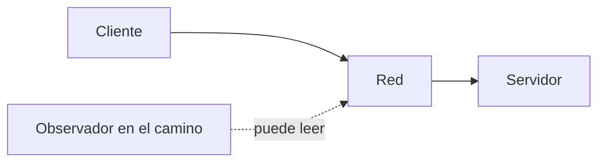
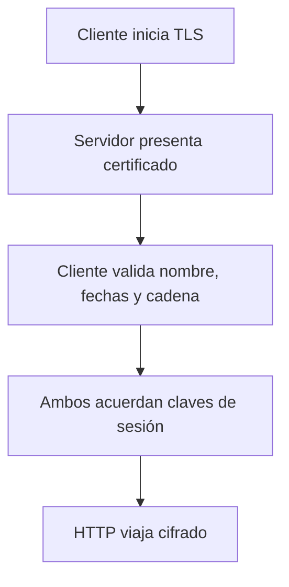
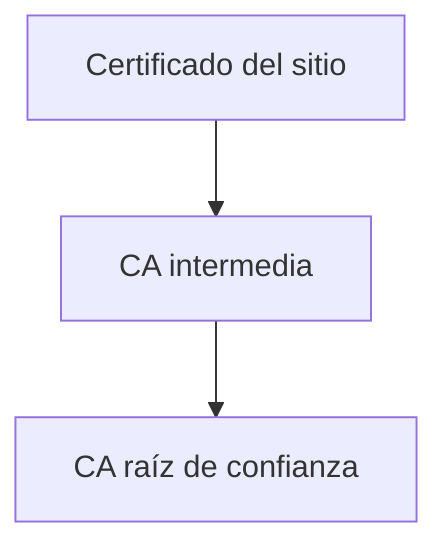
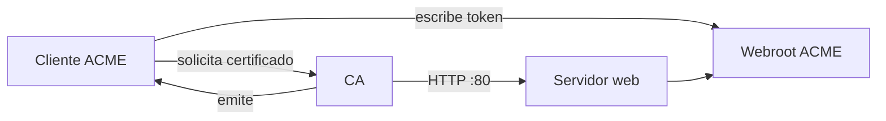
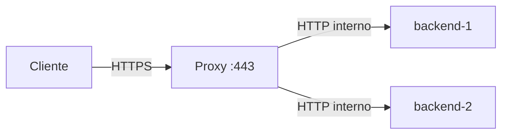

# 🔒 Seguridad web y HTTPS

!!! info "Descarga de diapositivas"
    [Descarga las diapositivas](diapositivas/seguridad-web-https.pptx){target="_blank" rel="noopener"}

---

Publicar una aplicación no consiste solo en conseguir que responda desde Internet. En cuanto existe una entrada pública aparecen dos preguntas nuevas: **quién puede acceder a cada recurso** y **qué puede observar o modificar alguien que se encuentre entre el cliente y el servidor**.

En esta sesión estudiaremos esas dos capas por separado. Primero limitaremos el acceso a una zona desde el propio servidor web. Después veremos por qué esa autenticación no es suficiente mientras el transporte siga siendo HTTP. A partir de ahí introduciremos TLS, certificados, ACME, terminación TLS en un proxy y algunas cabeceras que endurecen la entrega HTTP.

---

## 1. Control de acceso en el servidor web

### 1.1. Autenticación básica

Un servidor web puede proteger una ruta sin modificar la aplicación que hay detrás. Una de las formas más sencillas es **HTTP Basic Authentication**.

El intercambio básico es:

```text
cliente pide /privado/
        ↓
servidor responde 401
+ WWW-Authenticate
        ↓
cliente reintenta
+ Authorization: Basic ...
```

La cabecera `Authorization` contiene una representación en Base64 de:

```text
usuario:contraseña
```

Base64 **no cifra**. Solo transforma bytes a una representación textual que puede revertirse inmediatamente.

Los tres casos que conviene saber reconocer son:

| Petición | Resultado habitual |
|---|---|
| Sin credenciales | `401 Unauthorized` |
| Credenciales incorrectas | `401 Unauthorized` |
| Credenciales correctas | la petición continúa y puede terminar en `200` |

En Nginx, el patrón general es:

```nginx
location /privado/ {
    auth_basic "Zona restringida";
    auth_basic_user_file /etc/nginx/auth/usuarios.htpasswd;
}
```

El primer parámetro define el *realm* que verá el cliente. El segundo indica dónde está el fichero que contiene los usuarios y los resúmenes de sus contraseñas.

### 1.2. El fichero de credenciales también es un secreto

Nginx admite ficheros con este formato:

```text
usuario:resumen-de-la-contraseña
```

No necesitamos guardar la contraseña en claro. Por ejemplo, `openssl passwd` puede generar un resumen compatible con este mecanismo:

```bash
openssl passwd -apr1
```

La contraseña se introduce de forma interactiva y el comando devuelve únicamente el resumen.

Aunque el fichero no contenga la contraseña en claro, **no debe versionarse**. Facilita ataques offline contra las contraseñas y forma parte de la configuración sensible del servicio.

!!! warning "Autenticar no sustituye a cifrar"
    La autenticación básica permite decidir quién entra, pero no protege la cabecera `Authorization` mientras viaje por HTTP. Por eso Basic Authentication solo debe utilizarse sobre HTTPS.

---

## 2. Qué puede ocurrir cuando usamos HTTP

HTTP por sí solo no aporta confidencialidad ni integridad al transporte.

Si alguien puede observar el tráfico en un punto situado entre cliente y servidor, puede leer peticiones y respuestas:



En una petición HTTP pueden aparecer:

```text
rutas
cabeceras
cookies
credenciales Basic
cuerpo de formularios
respuestas del servidor
```

El problema no se limita a **leer**. Un intermediario activo también puede modificar tráfico sin que HTTP proporcione al cliente una prueba criptográfica de que la respuesta recibida es exactamente la que envió el servidor.

Esto es lo que suele resumirse como un ataque de **man-in-the-middle (MITM)**: alguien situado en el camino puede observar y, si controla suficientemente ese punto, alterar la comunicación.

No hace falta explotar ningún fallo de la aplicación para demostrarlo. Capturar tráfico propio de laboratorio es suficiente para ver una cabecera Basic y descodificarla.

---

## 3. HTTPS: HTTP protegido por TLS

**TLS** protege una conexión entre dos extremos. Cuando HTTP circula dentro de TLS hablamos de **HTTPS**.

Las tres garantías principales son:

| Garantía | Qué aporta |
|---|---|
| **Confidencialidad** | El contenido viaja cifrado y no puede leerse directamente desde la red |
| **Integridad** | Una modificación del tráfico se detecta |
| **Autenticidad del servidor** | El cliente puede comprobar que el certificado presentado es válido para el nombre al que se conecta |

### 3.1. Qué ocurre al iniciar una conexión TLS

Sin entrar en los detalles criptográficos, el proceso puede entenderse así:



En TLS moderno el certificado **no se utiliza para cifrar cada petición HTTP con la clave pública del servidor**. El certificado permite autenticar al servidor durante el establecimiento de la conexión y el protocolo acuerda claves simétricas de sesión, mucho más eficientes, para proteger después el tráfico.

La clave privada asociada al certificado permanece en el servidor y debe mantenerse secreta.

### 3.2. Lo que HTTPS no garantiza

Un candado válido no significa que una aplicación sea segura ni que su propietario sea honesto.

HTTPS no evita:

- vulnerabilidades de programación;
- contraseñas débiles;
- una autorización mal diseñada;
- dependencias vulnerables;
- que un servidor comprometido lea los datos una vez descifrados;
- que un usuario entregue voluntariamente datos a un sitio fraudulento cuyo dominio tenga un certificado válido.

El certificado demuestra una relación entre una clave y un **nombre**, no una valoración moral del sitio.

---

## 4. Certificados y cadena de confianza

Un certificado X.509 contiene, entre otros datos:

- uno o varios nombres para los que es válido;
- una clave pública;
- fechas de validez;
- información del emisor;
- una firma criptográfica del emisor.

Un mismo certificado puede ser válido para varios nombres DNS. Esos nombres aparecen normalmente en la extensión **Subject Alternative Name (SAN)**.

```text
certificado
├── web.ejemplo.test
└── docs.ejemplo.test
```

La **clave privada no forma parte del certificado público**. Debe permanecer únicamente en los sistemas que terminan TLS.

### 4.1. Por qué el navegador confía

Los sistemas operativos y navegadores mantienen un almacén de autoridades raíz de confianza. Lo habitual es que el certificado del sitio no esté firmado directamente por una raíz, sino por una autoridad intermedia.



El servidor entrega su certificado y los intermedios necesarios. El cliente comprueba que puede construir una cadena válida hasta una raíz que ya confía, además de verificar el nombre solicitado y las fechas.

### 4.2. Autofirmado frente a certificado de una CA pública

Un certificado **autofirmado** puede proteger la confidencialidad y la integridad del tráfico, pero el navegador no tiene una autoridad externa que respalde la asociación entre esa clave y ese nombre. Por eso muestra una advertencia salvo que incorporemos explícitamente ese certificado o su CA al almacén de confianza.

Un certificado emitido por una **CA pública** reconocida puede validarse sin instalar confianza adicional en cada cliente.

!!! info "ACME no es una autoridad de certificación"
    ACME es un protocolo para automatizar la validación, emisión y renovación. Let's Encrypt es una CA pública que utiliza ACME. Otras autoridades también pueden ofrecer ACME.

---

## 5. ACME y el desafío HTTP-01

Para emitir un certificado público no basta con pedirlo. La autoridad necesita comprobar que quien lo solicita **controla el nombre**.

Con el desafío **HTTP-01**, el proceso general es:



El cliente ACME coloca un token bajo una ruta de este tipo:

```text
/.well-known/acme-challenge/<token>
```

La CA resuelve públicamente el nombre y realiza una petición al **puerto 80**. Si recupera el contenido correcto, considera demostrado el control del nombre y puede emitir el certificado.

Por eso HTTP-01 necesita:

```text
DNS público correcto
+
puerto 80 alcanzable
+
ruta del desafío servida correctamente
```

Un DNS que solo exista dentro de una red privada no basta: la CA valida desde Internet.

### 5.1. HTTP y HTTPS pueden convivir durante la validación

Un sitio puede redirigir sus visitas normales de HTTP a HTTPS y mantener una excepción explícita para el desafío:

```nginx
location ^~ /.well-known/acme-challenge/ {
    root /var/www/acme;
}

location / {
    return 301 https://$host$request_uri;
}
```

Let's Encrypt puede seguir determinadas redirecciones durante HTTP-01, pero mantener la ruta del desafío explícita hace el flujo más fácil de observar y diagnosticar.

### 5.2. Probar antes de emitir

Las autoridades aplican límites de emisión y de validaciones fallidas. Los clientes ACME permiten utilizar un **entorno de pruebas** para comprobar el flujo sin consumir una emisión de producción.

Con Certbot, una ejecución de `certonly` con `--dry-run` utiliza el entorno de pruebas y no guarda un certificado de producción.

La regla operativa es:

```text
probar validación
      ↓
corregir errores
      ↓
emitir en producción una sola vez
```

### 5.3. Renovar también forma parte del despliegue

Los certificados tienen una validez limitada. Por eso una configuración correcta no termina al conseguir el primer certificado.

Hay que distinguir dos cosas:

| Comprobación | Qué demuestra |
|---|---|
| **Ejecución en seco** de `renew` | El procedimiento de renovación puede completarse |
| **Planificador periódico** | Alguien intentará renovarlo sin intervención manual |

Además, un proxy que ya tiene el certificado cargado debe **recargar su configuración** después de que los ficheros hayan cambiado.

```text
renovar certificado
        ↓
ficheros nuevos en disco
        ↓
recargar proxy
        ↓
certificado nuevo servido
```

Tener solo el `dry-run` no programa nada. Tener solo el planificador no demuestra que la renovación vaya a funcionar.

!!! info "Otros desafíos"
    DNS-01 demuestra el control publicando un registro DNS `TXT`. Permite certificados comodín y funciona aunque el servidor web no sea accesible desde Internet, pero requiere poder automatizar cambios en el DNS. En esta sesión basta con reconocerlo.

---

## 6. Terminación TLS en un proxy inverso

Cuando existe un único proxy público, una estrategia habitual consiste en terminar TLS en esa pieza.



El proxy:

1. presenta el certificado;
2. descifra la conexión exterior;
3. selecciona un backend;
4. reenvía internamente la petición.

Los backends no necesitan gestionar certificados.

Un bloque TLS mínimo en Nginx tiene esta forma:

```nginx
server {
    listen 443 ssl;
    server_name web.ejemplo.test;

    ssl_certificate     /etc/letsencrypt/live/mi-cert/fullchain.pem;
    ssl_certificate_key /etc/letsencrypt/live/mi-cert/privkey.pem;
    ssl_protocols       TLSv1.2 TLSv1.3;

    # contenido o proxy
}
```

Esta arquitectura presupone que la red entre proxy y backend es **interna y de confianza**. Si ese tráfico atraviesa redes o máquinas que no controlamos, puede ser necesario cifrar también la comunicación interna.

La cabecera `X-Forwarded-Proto` cobra aquí especial importancia. El backend recibe HTTP desde el proxy, pero puede necesitar saber que el cliente original llegó por HTTPS.

---

## 7. Redirección a HTTPS y cabeceras de seguridad

### 7.1. Redirigir HTTP a HTTPS

Una vez disponible HTTPS, el puerto 80 puede quedar como puerta de transición:

```text
http://web.ejemplo.test/recurso
        ↓ 301
https://web.ejemplo.test/recurso
```

Mantener el puerto 80 abierto y responder con una redirección es preferible a dejar simplemente una conexión rechazada para un sitio web público. Si utilizamos HTTP-01, la ruta del desafío debe seguir siendo alcanzable.

### 7.2. HSTS

**HTTP Strict Transport Security (HSTS)** permite que un servidor HTTPS indique al navegador que, durante un tiempo, ese nombre debe utilizar exclusivamente HTTPS.

```http
Strict-Transport-Security: max-age=300
```

El primer contacto con un nombre que el navegador todavía no conoce sigue dependiendo de HTTPS o de una redirección HTTP. HSTS empieza a proteger **después de que el navegador haya recibido correctamente la política por HTTPS**.

Durante pruebas conviene utilizar un `max-age` corto. Cuando la infraestructura y la renovación llevan tiempo validadas puede aumentarse.

HSTS puede retirarse enviando:

```http
Strict-Transport-Security: max-age=0
```

pero esa instrucción debe llegar mediante una conexión HTTPS válida. Si HTTPS ya está roto, no podemos utilizar HTTP para anular de forma segura la política que el navegador conserva.

### 7.3. Otras cabeceras útiles

Tres cabeceras sencillas que podemos aplicar desde el servidor web son:

```nginx
add_header Strict-Transport-Security "max-age=300" always;
add_header X-Content-Type-Options "nosniff" always;
add_header Referrer-Policy "strict-origin-when-cross-origin" always;
```

| Cabecera | Objetivo |
|---|---|
| `Strict-Transport-Security` | Evitar conexiones HTTP posteriores mientras la política esté vigente |
| `X-Content-Type-Options: nosniff` | Evitar que el navegador intente adivinar tipos de contenido distintos al declarado |
| `Referrer-Policy` | Controlar cuánta información del URL de origen se envía al navegar hacia otro sitio |

Existen políticas más potentes como **Content-Security-Policy**, pero requieren conocer con detalle qué scripts, estilos, imágenes y orígenes necesita cada frontend. Aplicarlas a ciegas puede romper la aplicación.

---

## 8. Qué queda fuera de HTTPS

HTTPS protege el **transporte**. Una estrategia de seguridad completa tiene más capas:

```text
transporte       → TLS
acceso           → autenticación y autorización
secreto          → gestión de credenciales y claves
aplicación       → validación y programación segura
artefacto        → dependencias y vulnerabilidades
infraestructura  → puertos, permisos y actualizaciones
```

Una imagen de contenedor puede contener vulnerabilidades conocidas aunque viaje por HTTPS. Las herramientas de escaneo permiten detectar esos componentes y encajan especialmente bien en un pipeline de integración continua, donde la comprobación puede automatizarse antes de publicar una imagen.

---

## 🎯 Qué debes saber hacer al salir de esta sesión

- Explicar qué hace HTTP Basic Authentication y por qué `Base64` no es cifrado.
- Proteger una ruta con `auth_basic` y mantener el fichero de credenciales fuera del repositorio.
- Explicar qué puede leer o modificar un intermediario cuando el tráfico utiliza HTTP.
- Distinguir confidencialidad, integridad y autenticidad del servidor como garantías de TLS.
- Explicar de forma general cómo se valida un certificado y una cadena de confianza.
- Distinguir un certificado autofirmado de uno emitido por una CA pública.
- Explicar qué es ACME y cómo funciona el desafío HTTP-01.
- Entender por qué HTTP-01 necesita DNS público y el puerto 80 accesible.
- Distinguir una prueba de renovación de un mecanismo que la ejecute periódicamente.
- Configurar conceptualmente la terminación TLS en un proxy inverso.
- Redirigir HTTP a HTTPS manteniendo accesible el desafío ACME.
- Explicar el objetivo y las precauciones de HSTS, `nosniff` y `Referrer-Policy`.

Lo que basta con reconocer: DNS-01, certificados comodín, Content-Security-Policy y escaneo de vulnerabilidades de imágenes.

---

## ✅ Ideas clave

??? tip "Abrir resumen"

    - Basic Authentication decide quién accede a una ruta, pero sus credenciales son reversibles desde `Base64`; necesita HTTPS.
    - HTTP no proporciona confidencialidad ni integridad frente a alguien situado en el camino.
    - TLS aporta confidencialidad, integridad y autenticidad del servidor.
    - El certificado vincula nombres y una clave pública; la clave privada debe permanecer secreta.
    - La confianza se construye desde el certificado del sitio, pasando por intermedios, hasta una raíz confiada por el cliente.
    - ACME automatiza la validación, emisión y renovación; Let's Encrypt es una CA que implementa ese protocolo.
    - HTTP-01 valida desde Internet a través del puerto 80 y necesita un nombre públicamente resoluble.
    - Probar una renovación y programarla periódicamente son controles diferentes y hacen falta los dos.
    - Terminar TLS en el proxy centraliza certificados, pero deja el tráfico interno sin cifrar si no se añade otra capa.
    - HSTS solo se aprende después de una respuesta HTTPS válida y debe probarse inicialmente con un plazo corto.
    - HTTPS protege el trayecto, no corrige vulnerabilidades de aplicación ni de las imágenes desplegadas.

---

En la actividad aplicarás estos patrones al despliegue del proyecto: protegerás una zona concreta, observarás el riesgo de HTTP, obtendrás un certificado público para los nombres del servicio, terminarás TLS en Nginx y dejarás preparada su renovación.
