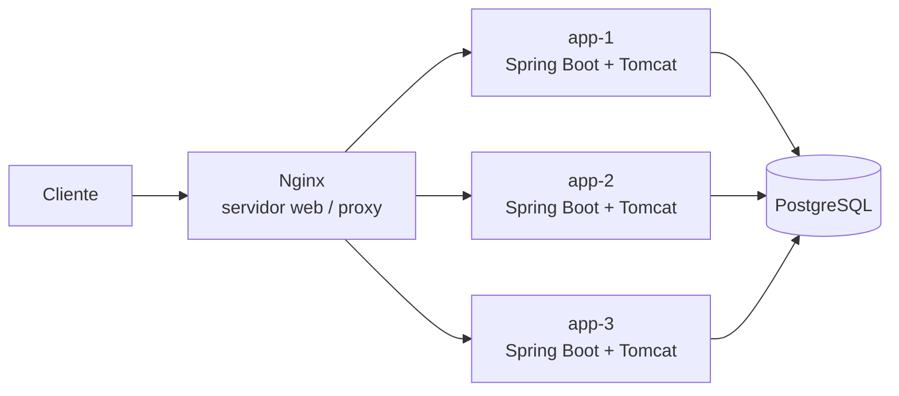
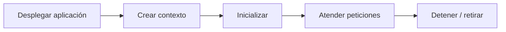
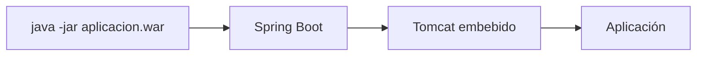
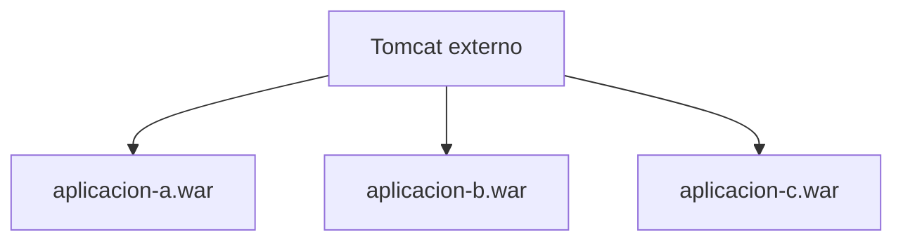
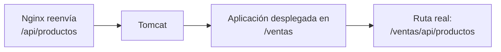
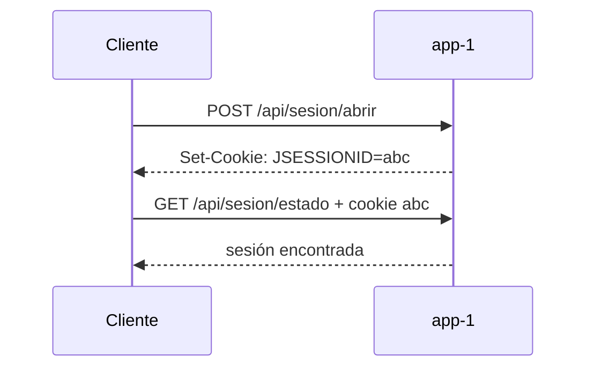
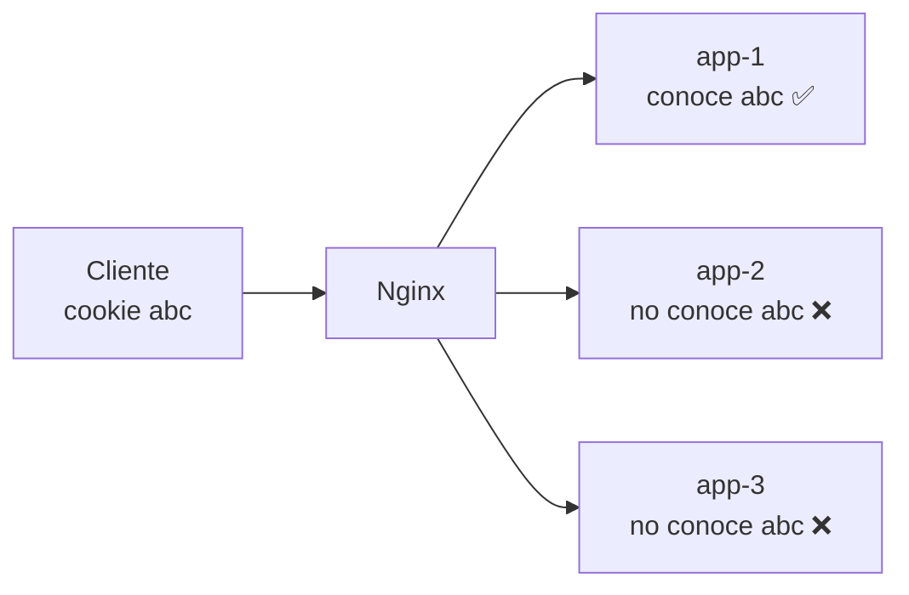
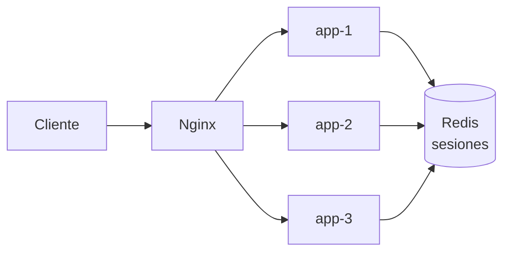
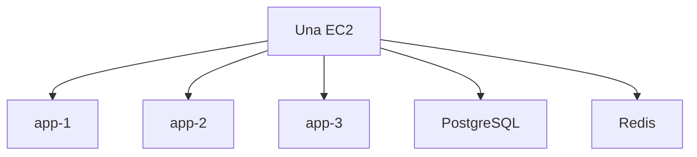

# 🧩 Servidor de aplicaciones: ejecución, estado y rendimiento

Hasta ahora hemos observado sobre todo **qué ocurre delante de la aplicación**: Nginx recibe tráfico, publica sitios, termina HTTPS, balancea y registra peticiones. En esta sesión cambiaremos el punto de vista y abriremos el backend.



La sesión responde a dos preguntas:

- **¿Dónde vive el estado de un usuario cuando existen varias réplicas?**
- **¿Tener tres copias significa disponer de tres veces más capacidad?**

Para responderlas veremos primero qué papel desempeña Tomcat y por qué el mismo artefacto puede ejecutarse de dos formas distintas.

---

## 1. 🌐 Servidor web y servidor de aplicaciones

Las dos piezas cooperan, pero cumplen responsabilidades diferentes.

| Pieza | Responsabilidad principal | En nuestro proyecto |
|---|---|---|
| **Servidor web** | recibir HTTP, servir estáticos, aplicar políticas de entrada y reenviar tráfico | Nginx |
| **Servidor de aplicaciones** | proporcionar el entorno donde se ejecuta la lógica dinámica | Spring Boot + Tomcat |

Una petición dinámica recorre, de forma simplificada:

```text
cliente
  ↓
Nginx
  ↓
Tomcat
  ↓
controladores / servicios
  ↓
PostgreSQL
```

Tomcat es, con más precisión, un **contenedor de servlets**. Entre otras tareas:

- recibe peticiones HTTP destinadas a la aplicación;
- crea y administra el contexto web;
- gestiona el ciclo de vida de la aplicación;
- mantiene recursos para atender peticiones concurrentes;
- puede gestionar sesiones HTTP.

Otros productos, como WildFly o Payara, añaden más servicios de la plataforma Jakarta EE. Para esta sesión basta con reconocer esa diferencia.

---

## 2. ⚙️ Qué aporta un contenedor de servlets

La palabra **contenedor** aquí no significa contenedor Docker.

Un contenedor de servlets rodea a la aplicación y administra su ejecución:



Cuando llegan varias peticiones, el servidor no crea una máquina ni una JVM nueva para cada una. Utiliza recursos ya preparados, entre ellos un conjunto de hilos.

```text
petición 1 ──► hilo disponible
petición 2 ──► hilo disponible
petición 3 ──► hilo disponible
...
```

Si todos los recursos están ocupados, las nuevas peticiones pueden tener que esperar.

!!! important "Primera idea de rendimiento"
    Más peticiones concurrentes **no crean más CPU**. Solo aumentan el trabajo que compite por los mismos recursos.

---

## 3. 📦 Un WAR, dos modelos de ejecución

En el Tema 2 distinguimos dos niveles:

```text
WAR
→ artefacto de aplicación Java

imagen
→ unidad de despliegue con runtime + artefacto
```

Una aplicación Spring Boot basada en servlets puede prepararse como WAR y utilizarse de dos formas.

### 3.1. Modelo embebido



La aplicación arranca su propio Tomcat.

Esto facilita que cada servicio viaje como una unidad autónoma:

```text
imagen
├── JRE
└── aplicacion.war
    └── Tomcat embebido
```

Es el modelo que conserva Escaparate.

### 3.2. Modelo externo



Tomcat existe antes que las aplicaciones y se administra como una pieza independiente.

Aquí se separan:

```text
administrar servidor
+
desplegar aplicaciones
```

### 3.3. Comparación

| Aspecto | Tomcat embebido | Tomcat externo |
|---|---|---|
| Unidad habitual | aplicación autónoma | servidor + aplicaciones |
| Versión de Tomcat | ligada a la aplicación | administrada por separado |
| Actualización | sustituir proceso o imagen | desplegar/reemplazar WAR |
| Varias aplicaciones | normalmente procesos separados | pueden compartir servidor |
| Encaje con contenedores | muy natural | posible, pero menos necesario para una sola app |

No existe una regla universal de que un modelo sea siempre correcto y el otro incorrecto.

Para nuestro proyecto:

```text
modelo externo
→ laboratorio para comprender el mecanismo

modelo embebido
→ arquitectura de referencia
```

---

## 4. 🗂️ Qué conviene identificar en Tomcat

No necesitas memorizar todos sus ficheros ni aprender a administrar una instalación completa.

Sí debes reconocer las piezas principales:

```text
tomcat/
├── conf/
│   ├── server.xml
│   ├── context.xml
│   └── tomcat-users.xml
├── lib/
└── webapps/
    ├── ROOT/
    └── otra-aplicacion/
```

| Elemento | Función |
|---|---|
| `conf/server.xml` | conectores, puertos y estructura principal |
| `conf/context.xml` | configuración común de contextos |
| `conf/tomcat-users.xml` | usuarios y roles en configuraciones sencillas |
| `lib/` | bibliotecas compartidas por el servidor |
| `webapps/` | aplicaciones desplegadas |

Las bibliotecas compartidas pueden reducir duplicación, pero también acoplar aplicaciones:

```text
app A necesita biblioteca v1
app B necesita biblioteca v2
        ↓
biblioteca común
        ↓
posible conflicto
```

En aplicaciones autónomas suele ser preferible que cada unidad declare y lleve sus propias dependencias.

---

## 5. 🛣️ WAR, contexto y URL publicada

En un Tomcat externo, el nombre del WAR puede determinar la **ruta de contexto**.

```text
ventas.war
→ /ventas

ROOT.war
→ /
```

Por eso un proxy y un servidor de aplicaciones pueden estar funcionando correctamente y, aun así, devolver `404`.



El problema es:

```text
ruta esperada por el proxy
≠
ruta publicada por Tomcat
```

Cambiar el despliegue de:

```text
escaparate.war
→ /escaparate
```

a:

```text
ROOT.war
→ /
```

permite publicar la misma aplicación en el contexto raíz **sin cambiar su código**.

---

## 6. 🧠 Administración de sesiones

La **administración de sesiones** forma parte del trabajo de un servidor de aplicaciones. Una sesión permite conservar información entre varias peticiones de un mismo cliente aunque HTTP, por sí solo, no recuerde peticiones anteriores.

En una única instancia el mecanismo es sencillo. El problema aparece cuando la aplicación se replica.

### 6.1. HttpSession y estado local

Una sesión típica funciona así:



La cookie contiene un **identificador**, no todo el contenido de la sesión.

En el modelo habitual de Tomcat, si no se configura otro almacén:

```text
JSESSIONID=abc
        ↓
app-1
        ↓
memoria de la JVM
        ↓
sesión abc
```

Por tanto, el estado pertenece al proceso que lo creó.

### 6.2. Qué cambia al replicar la aplicación

Supón ahora tres copias detrás de Nginx:



La misma cookie puede producir respuestas distintas según qué backend atienda la petición.

Esto no es un fallo de la cookie ni del balanceador. Es una consecuencia de haber situado el estado en memoria local.

La situación es muy parecida a la que ya vimos con los ficheros:

| Estado local | Consecuencia |
|---|---|
| imagen guardada solo en `app-1` | otra réplica puede devolver `404` |
| sesión guardada solo en `app-1` | otra réplica no reconoce al usuario |

La regla vuelve a ser la misma:

> Si cualquier réplica debe poder recuperar un dato, ese dato no debería vivir únicamente dentro de una de ellas.

### 6.3. Estrategias de administración de sesiones

Existen varias estrategias.

| Estrategia | Idea | Principal limitación |
|---|---|---|
| **Afinidad o sticky session** | el usuario vuelve a la misma réplica | si esa réplica desaparece, su sesión puede perderse |
| **Replicación de sesiones** | los servidores intercambian el estado | aumenta complejidad y tráfico entre réplicas |
| **Almacén externo** | todas las réplicas consultan un estado común | añade una dependencia compartida |

No existe una única solución válida para todos los sistemas. La elección depende de requisitos, tecnología y arquitectura.

### 6.4. Spring Session y Redis

En nuestro laboratorio utilizaremos un **almacén externo**.



**Spring Session** permite que la aplicación continúe utilizando `HttpSession` mientras cambia el lugar donde se conserva el estado.

Conceptualmente:

```text
código
request.getSession()
        ↓
Spring Session
        ↓
Redis
```

El controlador no necesita saber qué réplica creó originalmente la sesión.

La transformación importante es:

| Antes | Después |
|---|---|
| la sesión vive en una JVM | la sesión vive en Redis |
| una réplica conoce el estado | todas pueden recuperarlo |
| cambiar de réplica puede perder la sesión | cambiar de réplica mantiene la sesión |

!!! info "Qué debes aprender y qué no"
    El objetivo no es aprender la API de Redis ni programar Spring Session desde cero. Debes comprender **qué estado administra el servidor de aplicaciones, por qué el estado local dificulta la replicación y qué consigue externalizarlo**.

---

## 7. 📈 Rendimiento: tres magnitudes distintas

No debemos utilizar “rendimiento” como una sola cifra.

### 7.1. Latencia

Es el tiempo que tarda una petición en completarse.

```text
petición
→ 180 ms
```

Pregunta a la que responde:

> **¿Cuánto espera un usuario por una respuesta?**

### 7.2. Throughput

Es la cantidad de trabajo completado por unidad de tiempo.

```text
150 peticiones/s
```

Pregunta a la que responde:

> **¿Cuánto trabajo termina el sistema cada segundo?**

### 7.3. Concurrencia

Es la cantidad de peticiones que permanecen dentro del sistema al mismo tiempo.

```text
40 peticiones simultáneas
```

Pregunta a la que responde:

> **¿Cuánto trabajo está activo a la vez?**

Una intuición útil en condiciones estables es:

```text
concurrencia ≈ throughput × latencia
```

| Magnitud | Ejemplo | Describe |
|---|---:|---|
| Latencia | 180 ms | tiempo de respuesta |
| Throughput | 150 req/s | trabajo completado |
| Concurrencia | 40 | trabajo simultáneo |

---

## 8. 📊 Media, percentiles y p95

### 8.1. Por qué la media puede engañar

Considera cinco peticiones:

| Petición | Tiempo |
|---|---:|
| 1 | 50 ms |
| 2 | 55 ms |
| 3 | 60 ms |
| 4 | 65 ms |
| 5 | 800 ms |

La mayoría son rápidas, pero existe una petición claramente lenta.

Una media resume el conjunto, pero puede esconder esa cola de respuestas lentas.

### 8.2. Qué nos dice el p95

El percentil 95 responde a:

> **¿Qué tiempo no supera el 95 % de las peticiones?**

Interpretación:

```text
p95 = 420 ms
```

significa:

```text
95 % de las peticiones
→ 420 ms o menos

5 % de las peticiones
→ más de 420 ms
```

En nuestra prueba observaremos conjuntamente:

```text
peticiones/s
+
p95
+
errores
```

Ninguna de esas cifras, por sí sola, describe todo el comportamiento.

---

## 9. 🖥️ Tres réplicas no son tres máquinas

En nuestro laboratorio:



Las tres aplicaciones siguen compartiendo:

- CPU;
- memoria;
- red;
- disco;
- PostgreSQL;
- Redis.

Por eso:

```text
3 procesos
≠
3 veces más recursos físicos
```

Las réplicas sí pueden aportar otras propiedades:

| Aportan | No garantizan |
|---|---|
| continuidad si falla una copia | sobrevivir a la caída del host |
| reparto entre procesos | triplicar capacidad |
| reemplazo progresivo | triplicar CPU o memoria |

Esta distinción será importante al interpretar la prueba de carga.

---

## 10. 🧪 Una comparación pequeña y reproducible

No intentaremos averiguar la capacidad absoluta de producción.

Compararemos:

```text
1 réplica
vs.
3 réplicas
```

### 10.1. Qué debe permanecer constante

Para que la comparación tenga sentido mantendremos igual:

- endpoint;
- EC2;
- duración;
- número de usuarios virtuales;
- herramienta generadora;
- versión de la aplicación.

Y cambiaremos una sola variable:

```text
número de réplicas
```

Mediremos:

| Métrica | Qué observamos |
|---|---|
| peticiones/s | trabajo completado |
| p95 | cola de latencia |
| errores | peticiones que no terminan correctamente |

### 10.2. Qué no demuestra el laboratorio

k6 se ejecutará desde otro equipo y accederá a la EC2 por Internet.

Esto evita que el generador consuma la CPU de la máquina medida, pero introduce otra variable:

```text
red entre generador y EC2
```

Además, una y tres réplicas siguen compartiendo la misma infraestructura.

Por tanto, el experimento permite afirmar:

```text
"en estas condiciones,
una y tres réplicas se comportan de esta manera"
```

pero no:

```text
"Escaparate soporta X usuarios en producción"
```

---

## 🎯 Qué debes saber hacer al salir de esta sesión

- Diferenciar servidor web y servidor de aplicaciones.
- Describir qué aporta un contenedor de servlets.
- Explicar Tomcat embebido frente a Tomcat externo.
- Distinguir WAR e imagen de contenedor.
- Identificar los principales directorios y ficheros de Tomcat.
- Relacionar nombre del WAR y contexto publicado.
- Explicar cómo funciona una `HttpSession` y dónde se almacena por defecto.
- Explicar por qué una sesión local falla al balancear entre réplicas.
- Comparar afinidad, replicación y almacén externo.
- Explicar qué aporta Spring Session + Redis a la administración de sesiones.
- Diferenciar latencia, throughput y concurrencia.
- Interpretar un p95.
- Explicar por qué varias réplicas en el mismo host no equivalen a varias máquinas.
- Interpretar una comparación sencilla de carga.

Lo que basta con **reconocer**:

- servidores Jakarta EE completos;
- detalles internos de `server.xml`;
- classloading y bibliotecas compartidas;
- replicación nativa de sesiones;
- p99;
- pruebas de estrés, pico y resistencia.

---

## ✅ Ideas clave

??? tip "Abrir resumen"

    - Nginx publica y enruta; Tomcat ejecuta la aplicación.
    - Escaparate utiliza Tomcat embebido como arquitectura de referencia.
    - Un mismo WAR puede ejecutarse de forma autónoma o desplegarse en Tomcat externo.
    - El nombre del WAR puede determinar el contexto publicado.
    - Administrar sesiones implica decidir dónde vive el estado asociado a cada cliente.
    - Una `HttpSession` en memoria pertenece a una réplica concreta.
    - Spring Session + Redis permite sacar ese estado fuera de las copias.
    - Latencia, throughput y concurrencia responden preguntas diferentes.
    - p95 muestra una parte del comportamiento que la media puede ocultar.
    - Tres procesos en una EC2 siguen compartiendo la misma máquina.
    - Una prueba de carga solo demuestra lo que permiten sus condiciones.

---

En la actividad comprobarás primero el mismo WAR en Tomcat embebido y externo. Después reproducirás una sesión que se pierde entre réplicas, externalizarás ese estado a Redis y compararás una y tres copias bajo la misma carga.
