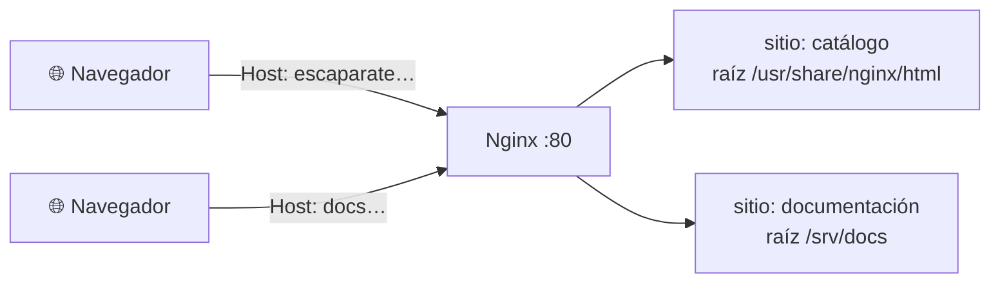

# 🌐 1. Servidores web y DNS

!!!info "Descarga de diapositivas"
    [Descarga las diapositivas](diapositivas/servidores-web-dns.pptx){target="_blank" rel="noopener"}

---

Cerraste la sesión anterior con Escaparate entero funcionando: tres piezas descritas en un fichero, dos de ellas sin una sola puerta abierta al exterior, y un comando que lo levanta todo en cualquier máquina con Docker. Es un despliegue de verdad.

Pero mira cómo se llega hasta él: `http://localhost:8080`. Una dirección que solo existe en tu ordenador y un puerto que no es el de la web. Nadie escribe eso en un navegador. Y hay más: los ficheros del front se están sirviendo de cualquier manera, sin comprimir, sin decirle al navegador qué puede guardar en caché, y con un fichero de configuración que has usado sin abrir. Hoy toca la pieza que faltaba: **qué hace exactamente el programa que atiende las peticiones**, cómo consigue servir dos sitios distintos desde una sola máquina, y cómo se llega hasta él escribiendo un nombre.

---

## 🗂️ Qué hace exactamente un servidor web

Un servidor web es un programa que escucha en un puerto, recibe peticiones HTTP y devuelve respuestas HTTP. Su trabajo principal, el que hace millones de veces al día, es **traducir una URL en un recurso** y entregarlo con las cabeceras correctas.

Esa traducción no es magia. Hay una carpeta del disco designada como **raíz de documentos**, y todo lo que llega se busca dentro de ella:

| El navegador pide | El servidor busca | Y si no está |
|---|---|---|
| `/` | el fichero índice de la raíz | `403` si no hay índice y no se permite listar |
| `/estilos.css` | `<raíz>/estilos.css` | `404` |
| `/img/logo.png` | `<raíz>/img/logo.png` | `404` |

La raíz de documentos marca **el punto desde el que el servidor busca lo que puede servir**. Eso no significa que todo lo que haya dentro tenga que ser accesible —las reglas de configuración y los permisos pueden restringir rutas concretas, y en la sesión 8 vas a proteger una—, pero sí que todo lo que esté ahí es candidato a servirse. La consecuencia práctica la vas a aplicar hoy: en la raíz de documentos no se deja nada que no quieras publicar —copias de seguridad, `.env`, ficheros `.sql`, notas—, porque lo único que separa ese fichero del mundo es que nadie haya probado esa URL.

Y ahora lo que **no** hace: un servidor web no ejecuta la lógica de tu aplicación. No sabe qué es un producto ni cómo se consulta una base de datos. Entrega ficheros tal cual están en el disco. Cuando la respuesta hay que calcularla, el servidor web se la pide a otro programa y se limita a llevar y traer, que es justamente la sesión que viene.

!!! tip "Estático y dinámico, otra vez"
    En la primera sesión distinguiste contenido estático de contenido dinámico. Aquí se ve la consecuencia arquitectónica: el front de Escaparate —HTML, CSS, JavaScript e imágenes— lo sirve el servidor web directamente desde el disco, rapidísimo y sin gastar casi nada. Lo dinámico lo produce la API. Que sean dos cosas separadas no es un capricho de diseño: es lo que permite servir cada una con la herramienta adecuada.

---

## ⚙️ Apache y Nginx

**Apache** y **Nginx** son los dos servidores web maduros que se reparten la mayor parte de la web. Los dos sirven contenido estático, los dos pueden hacer de proxy y los dos funcionan perfectamente en producción.

La diferencia de origen está en cómo atienden a muchos visitantes a la vez. Apache es extremadamente modular y admite **distintos modelos de procesamiento** —sus MPM: `prefork`, `worker` y `event`—, de modo que se puede configurar desde un proceso por conexión hasta un modelo asíncrono. Nginx nació directamente con una arquitectura **orientada a eventos**: unos pocos procesos trabajadores que atienden miles de conexiones simultáneas sin bloquearse esperando a ninguna. Es la razón por la que se popularizó sirviendo estáticos y como pieza de entrada delante de otros servidores.

En este módulo trabajarás con **Nginx**, y no por ser mejor: es el que ya forma parte de tu despliegue, y usando una sola herramienta cubres el contenido estático de hoy, los hosts virtuales, el proxy inverso de la sesión que viene y el cifrado de la siguiente. Administrar dos servidores en paralelo costaría el doble sin enseñar nada nuevo. De Apache interesa reconocerlo cuando te lo encuentres —que te lo vas a encontrar— y saber en qué se diferencia.

!!! info "Para saber más: en qué se notan las diferencias"
    | | Apache | Nginx |
    |---|---|---|
    | Procesamiento | Configurable mediante MPM, incluido uno asíncrono | Orientado a eventos desde el diseño |
    | Configuración | Central y además por directorio, con `.htaccess` | Solo central |
    | Módulos | Catálogo muy amplio, cargables en caliente | Menos módulos, compilados o dinámicos |
    | Se le suele ver | Detrás, ejecutando aplicaciones | Delante, sirviendo estáticos y repartiendo |

    El `.htaccess` es la diferencia más visible en el día a día: permite que cada carpeta lleve su propia configuración, algo imprescindible cuando alojas cien clientes que no pueden tocar la configuración global. El precio es que el servidor comprueba en **cada petición** si hay un `.htaccess` en cada nivel de la ruta. Nginx no ofrece nada equivalente, y esa ausencia es deliberada.

---

## 🧾 Tipos MIME, índices y permisos

Tres detalles que parecen menores y que provocan la mitad de las incidencias de esta sesión.

**El tipo MIME** es la cabecera `Content-Type` con la que el servidor anuncia qué está enviando: `text/html`, `text/css`, `application/javascript`, `image/png`. El navegador se guía por ella, no por la extensión. Si un `.css` llega anunciado como `text/plain`, el navegador puede interpretarlo mal o directamente rechazarlo, y la página aparece sin estilos; la pestaña de red y la consola del navegador te enseñan qué `Content-Type` ha llegado y por qué se ha descartado el recurso. Nginx deduce el tipo con una tabla de extensiones y aplica un valor por defecto cuando no conoce la extensión.

**El índice** es el fichero que se sirve cuando la URL apunta a un directorio, normalmente `index.html`. Si no existe, hay dos comportamientos posibles: devolver un `403` o **listar el contenido de la carpeta**. Ese listado automático es utilísimo para publicar informes generados —hoy lo vas a usar— y es un problema serio en cualquier otro sitio: enseña nombres de fichero que nadie debería conocer.

**Los permisos** son la tercera pata. El proceso trabajador de Nginx no corre como administrador: usa un usuario sin privilegios, exactamente por lo mismo que en la sesión 4 le quitaste privilegios a Escaparate. Ese usuario tiene que poder **leer** los ficheros y **atravesar** los directorios que los contienen. Cuando montas una carpeta de tu equipo dentro del contenedor, los permisos que viajan son los del anfitrión, y un `403` en un fichero que existe y se ve perfectamente en tu editor casi siempre es esto.

!!! warning "Los tres errores del día, y cómo se distinguen"
    - **`403` con el fichero existiendo**: permisos, o directorio sin índice y sin listado permitido.
    - **`404` con el fichero existiendo**: la raíz de documentos no es la que crees, o el montaje no ha llegado donde pensabas. Compruébalo desde dentro del contenedor.
    - **Página en crudo o sin estilos**: tipo MIME. Mira la consola y la pestaña de red del navegador.

---

## 🗜️ Entregar bien: comprimir y cachear

Un servidor web hace más que entregar ficheros, y lo hace mediante módulos. Dos de ellos resuelven problemas que ya tienes.

**Compresión.** El HTML, el CSS y el JavaScript son texto, y el texto se comprime muchísimo: reducciones del setenta u ochenta por ciento son normales. Si el navegador anuncia que la acepta con `Accept-Encoding`, el servidor comprime al vuelo y responde con `Content-Encoding: gzip`. Se activa con dos o tres líneas y es probablemente la mejora de rendimiento más barata que existe. Ojo con lo que **no** hay que comprimir: las imágenes JPEG o PNG ya vienen comprimidas y volver a hacerlo solo gasta procesador.

**Cabeceras de caché.** Cada vez que alguien vuelve a tu sitio, el navegador pide otra vez todos los ficheros. Con `Cache-Control` le dices durante cuánto tiempo puede reutilizar lo que ya tiene sin preguntar. El criterio es la volatilidad: el HTML cambia a menudo y se cachea poco o nada; los estilos, los scripts y las imágenes cambian con cada versión y se pueden cachear mucho tiempo. El peaje aparece cuando despliegas: si dijiste que el CSS valía un año, quien lo tenga guardado seguirá viendo el antiguo. La solución habitual es cambiar el nombre del fichero en cada versión, y de eso se encargan las herramientas de construcción del front.

Todo esto se comprueba, no se supone, y hay que usar la herramienta adecuada para cada cosa. Para ver **qué cabeceras** devuelve el servidor:

```bash
curl -I -H "Accept-Encoding: gzip" http://escaparate.127.0.0.1.nip.io/estilos.css
```

`-I` pide únicamente la cabecera de respuesta. `-H` añade una cabecera a la petición: aquí anunciamos que aceptamos contenido comprimido, porque si no lo anunciamos el servidor no comprimirá y parecerá que la configuración no funciona. En la respuesta hay que buscar el código de estado, el `Content-Type`, el `Content-Encoding` y el `Cache-Control`.

Ahora bien, `-I` envía un `HEAD`: **pide las cabeceras y no descarga el cuerpo**, así que no sirve para medir cuántos bytes viajan. Para eso hay que pedir el recurso entero dos veces, cambiando lo que se anuncia:

```bash
curl -s -H "Accept-Encoding: identity" -o /dev/null \
  -w "sin comprimir: %{size_download} bytes\n" http://escaparate.127.0.0.1.nip.io/estilos.css

curl -s -H "Accept-Encoding: gzip" -o /dev/null \
  -w "comprimido:   %{size_download} bytes\n" http://escaparate.127.0.0.1.nip.io/estilos.css
```

`-s` calla el indicador de progreso, `-o /dev/null` tira el contenido porque no queremos verlo, y `-w` imprime un dato concreto de la transferencia: `%{size_download}` son los bytes del cuerpo que han llegado de verdad. `identity` significa «no me comprimas nada». La diferencia entre las dos cifras es el ahorro real.

!!! info "Para saber más: reescritura de URL"
    El navegador pide `/productos/42` y en el disco no hay ninguna carpeta `productos` ni ningún fichero `42`. La **reescritura** traduce la URL que ve el usuario a la ruta real, y es lo que permite tener direcciones legibles y compartibles sin que la estructura del disco tenga que parecerse a ellas. En Nginx el mecanismo cotidiano es `try_files`: prueba varias rutas en orden y se queda con la primera que exista, lo que resuelve de una línea el caso de un front que gestiona su propia navegación. No es exigible hoy, pero lo tienes propuesto como ampliación en la actividad.

---

## 🏠 Hosts virtuales: varios sitios en una máquina

Ahora la pieza central del día. Una sola máquina, una sola dirección IP, un solo puerto 80, y **dos sitios web completamente distintos**.

Esto funciona gracias a algo que ya conoces desde la primera sesión: la cabecera `Host`. Cuando escribes una dirección en el navegador, el nombre se convierte en una IP y la conexión se abre contra esa IP, pero el nombre **viaja también dentro de la petición**:

```text
GET /informes/ HTTP/1.1
Host: docs.127.0.0.1.nip.io
```

El servidor lee esa cabecera y decide con ella qué configuración aplicar. Cada configuración de ese tipo es un **host virtual por nombre**: su propio nombre, su propia raíz de documentos, sus propios logs y sus propias reglas.



En Nginx cada sitio es un bloque `server` con su `server_name`:

```nginx
server {
    listen 80;
    server_name docs.127.0.0.1.nip.io;
    root /srv/docs;

    location /informes/ {
        autoindex on;
    }
}
```

`listen 80` dice en qué puerto atiende este bloque. `server_name` es el nombre con el que se selecciona: si la cabecera `Host` de la petición coincide, manda este bloque. `root` fija la raíz de documentos del sitio. Y `location /informes/` abre un bloque de reglas que solo se aplican a las URL que empiezan por esa ruta; dentro, `autoindex on` permite el listado automático de la carpeta.

Dos detalles que hay que conocer antes de empezar:

- Si ningún `server_name` coincide, Nginx no devuelve un error: responde con el **servidor por defecto**, que es el primero declarado salvo que marques otro con `default_server`. Por eso, cuando un host virtual «no funciona», lo que sueles estar viendo es el otro sitio.
- Un mismo bloque puede responder a varios nombres y también admite comodines. Lo que debes evitar es declarar **el mismo nombre de forma conflictiva para la misma dirección y puerto**, porque una de las configuraciones no se utilizará como esperas.

---

## 🧭 Veinte minutos de nombres: A, CNAME y TTL

Los hosts virtuales van por nombre, así que hace falta que ese nombre lleve a alguna parte. Vamos a lo justo para trabajar; en la sesión 8 volverá con el certificado.

Cuando una aplicación necesita convertir un nombre en una dirección, no pregunta al DNS directamente: se lo pide al **resolutor del sistema operativo**, que puede consultar varias fuentes. En un Linux habitual, la primera de ellas es el fichero `/etc/hosts`: si el nombre está ahí, se resuelve localmente y no se consulta a nadie más. Si no está, el resolutor pregunta al servidor DNS configurado, que buscará la respuesta y la devolverá.

Ese fichero local es un atajo potente y peligroso a la vez: sirve para probar un sitio antes de publicarlo, y también para que un equipo entero vea una cosa distinta que el resto del mundo. Si algo resuelve donde no debe, es el primer sitio donde mirar.

Y aquí hay que separar bien dos herramientas que se confunden constantemente: **`dig` pregunta directamente a un servidor DNS y no consulta `/etc/hosts`**. Por eso un nombre añadido solo al fichero de hosts funciona en el navegador y `dig` te dirá que no existe. No es un fallo: es que cada uno está mirando en un sitio distinto.

Los registros que vas a manejar son dos:

| Registro | Qué contiene | Cuándo se usa |
|---|---|---|
| **A** | Una dirección IP (`AAAA` para IPv6) | El nombre apunta directamente a una máquina |
| **CNAME** | Otro nombre | El nombre es un alias de otro que ya existe |

La diferencia básica es sencilla: un registro **A relaciona un nombre con una dirección IPv4**, mientras que un **CNAME convierte un nombre en alias de otro nombre**. El alias resulta especialmente útil al apuntar a servicios gestionados —un balanceador, una CDN— que proporcionan un nombre estable aunque las direcciones que haya detrás cambien: mientras el nombre siga siendo el mismo, tú no tienes que tocar nada.

El **TTL** es el tiempo que un resolutor puede guardar la respuesta antes de volver a preguntar. Es el compromiso de siempre: un TTL alto reduce consultas y acelera; un TTL bajo permite cambiar rápido. Y de ahí sale una norma de oficio que se aprende cara: **antes de una migración se baja el TTL con antelación**, porque bajarlo el mismo día no sirve de nada —los resolutores siguen usando la copia que se llevaron con el TTL antiguo—.

La herramienta para mirar todo esto es `dig`:

```bash
dig escaparate.127.0.0.1.nip.io
dig +short escaparate.127.0.0.1.nip.io
```

La primera forma devuelve la respuesta completa: la sección de pregunta, la de respuesta con el tipo de registro y su TTL, y quién ha contestado. La segunda devuelve solo el valor, que es lo cómodo para comprobaciones rápidas. En la salida completa, fíjate en el número que aparece antes del tipo de registro: ese es el TTL. Si el servidor al que preguntas está reutilizando una respuesta guardada, verás cómo el TTL restante disminuye entre consultas; lo importante es entender qué representa, no que siempre baje en pantalla.

!!! tip "Nombres reales sin registrar nada: `nip.io`"
    `nip.io` es un servicio DNS comodín: cualquier nombre que **contenga una IP** resuelve a esa IP. Así, `escaparate.127.0.0.1.nip.io` devuelve `127.0.0.1` y `docs.127.0.0.1.nip.io` también. No hay que registrar nada ni editar ningún fichero, y —esto es lo importante para hoy— **es DNS de verdad**: `dig` te enseñará un registro A auténtico con su TTL. Cuando en la sesión 7 el servicio salga a una instancia en la nube, el mismo truco funcionará con su IP pública, que cambia cada semana.

!!! info "Para saber más: otros registros y delegación"
    Una zona DNS contiene bastante más: `MX` para el correo, `TXT` para verificaciones y políticas, `NS` para decir qué servidores son autoritativos de un subdominio. Esa última es la que permite **delegar** un trozo del dominio a otro responsable, y es exactamente lo que hay detrás del subdominio con el que emitirás tu certificado en la sesión 8.

---

## 🧱 Dónde encaja todo esto en tu despliegue

Nada de lo anterior es un servidor nuevo: es el que ya tienes. En tu `compose.yaml`, el servicio `front` es un Nginx que hasta hoy has usado con la configuración que se te dio. A partir de esta sesión, esa configuración es tuya: la escribes, la montas en el contenedor y la versionas con el proyecto, igual que el resto del despliegue.

Dos consecuencias prácticas:

- La configuración se monta **de solo lectura**. Es configuración, no datos: el contenedor no tiene por qué poder modificarla, y así un cambio siempre pasa por el repositorio.
- Nginx puede **recargar** su configuración sin cortar las conexiones en curso. Es la diferencia entre aplicar un cambio y reiniciar el servicio, y en un servidor con visitas no es un matiz. Antes de recargar, conviene pedirle que **valide** el fichero: un error de sintaxis detectado antes de aplicar vale por diez minutos de incidencia.

Y una advertencia sobre lo que hoy **no** se toca. En ese fichero hay un bloque `location /api` con una directiva `proxy_pass` que hace que el front alcance a la API sin que la API publique ningún puerto. Sigue siendo caja negra una semana más: déjalo tal cual, funciona. La sesión que viene se abre entero, y para entonces tendrá tres réplicas detrás.

---

## 🎯 Qué debes saber hacer al salir de esta sesión

- Servir un directorio de ficheros con Nginx, fijando su raíz de documentos y comprobando qué se sirve desde dónde.
- Configurar **dos hosts virtuales por nombre** en el mismo servidor, cada uno con su raíz, y demostrar que el nombre es lo que decide cuál responde.
- Permitir el listado automático de un directorio cuando interesa, y saber por qué no interesa en el resto.
- Activar compresión y cabeceras de caché, **comprobar con `curl -I` que están activas** y **medir aparte** cuántos bytes se ahorran.
- Resolver un nombre con `dig`, identificar su tipo de registro y su TTL, y explicar por qué `dig` puede no ver un nombre que sí funciona en el navegador.
- Diagnosticar un `403`, un `404` y una página sin estilos distinguiendo permisos, raíz de documentos y tipo MIME.

Lo que basta con reconocer: las diferencias internas entre Apache y Nginx, la reescritura de URL, y el resto de tipos de registro DNS.

---

## ✅ Ideas clave

??? tip "Abrir resumen"

    - Un servidor web traduce una URL en un fichero dentro de la **raíz de documentos** y lo entrega con sus cabeceras. Que algo esté dentro no lo hace forzosamente accesible, pero sí lo convierte en candidato: ahí no se deja nada que no quieras publicar.
    - Apache es muy modular y admite varios modelos de procesamiento, incluido uno asíncrono; Nginx nació orientado a eventos. Usamos Nginx porque con una sola herramienta cubrimos estáticos, hosts virtuales, proxy y TLS.
    - El `Content-Type` lo decide el servidor y el navegador se guía por él: un tipo MIME equivocado hace que el recurso se interprete mal o se rechace, y eso se ve en la consola del navegador.
    - Sin fichero índice, un directorio devuelve `403` o se lista entero. El listado es útil para publicar informes y un riesgo en cualquier otro sitio.
    - El proceso de Nginx no corre como administrador: necesita permiso de lectura sobre los ficheros y de paso sobre sus directorios. Es la causa habitual del `403` sobre un fichero que existe.
    - La compresión de texto es la mejora de rendimiento más barata que hay; `Cache-Control` decide cuánto puede reutilizar el navegador sin preguntar, según lo volátil que sea cada tipo de fichero.
    - `curl -I` enseña las cabeceras pero **no descarga el cuerpo**: para medir el ahorro real de la compresión hay que pedir el recurso entero y comparar los bytes transferidos.
    - Un **host virtual por nombre** se selecciona con la cabecera `Host` de la petición. Varios sitios, una IP, un puerto. Si ningún nombre coincide, responde el servidor por defecto.
    - Un registro **A** relaciona un nombre con una dirección IPv4; un **CNAME** lo convierte en alias de otro nombre, que es lo habitual al apuntar a servicios gestionados.
    - El **TTL** es cuánto tiempo se guarda una respuesta DNS. Se baja **antes** de una migración, no durante: quien ya se llevó la respuesta antigua seguirá usándola.
    - El resolutor del sistema puede responder desde `/etc/hosts` antes de preguntar al DNS. `dig` pregunta al DNS directamente y no mira ese fichero: por eso un nombre puede funcionar en el navegador y no aparecer en `dig`.
    - La configuración del servidor web es parte del despliegue: se versiona con el proyecto, se monta de solo lectura y se valida antes de recargar.

---

Con esto ya tienes las piezas para la **Actividad 3.1**. Vas a convertir el Nginx que arrastras desde la sesión 5 en un servidor con dos sitios: el catálogo de Escaparate en un nombre, y en otro distinto la documentación y los informes de pruebas que se generaron al compilar la aplicación y que hasta ahora no habían tenido dónde vivir. Los dos, en la misma máquina y en el mismo puerto.

Por el camino dejarás de escribir `localhost:8080` para escribir un nombre, comprobarás con `dig` qué hay detrás de ese nombre, y verás por las cabeceras que la compresión está activa antes de medir aparte cuántos bytes te ahorra. Al terminar, tu despliegue se parecerá bastante más a algo publicable: un nombre, el puerto de la web, y la configuración del servidor versionada junto al código.

Lo que todavía no tendrás es capacidad de aguantar una avería. Hay una sola copia de la aplicación, y si se para, se acabó. La semana que viene ese mismo servidor, además de servir los ficheros del front, pasará a **repartir** las peticiones de la API entre varias copias —y de paso, el stack se muda del portátil a una máquina de verdad—.