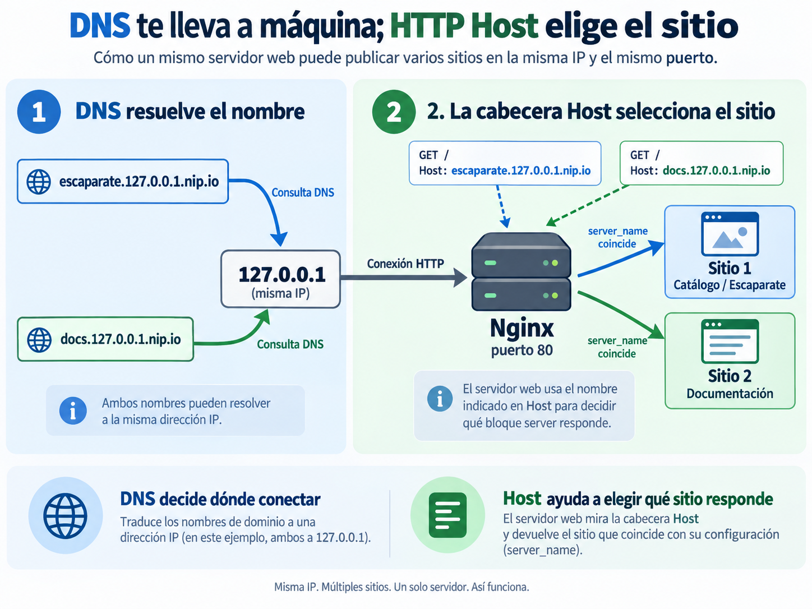

# 🌐 Servidores web y DNS

!!! info "Descarga de diapositivas"
    <!-- [Descarga las diapositivas](diapositivas/servidores-web-dns.pptx){target="_blank" rel="noopener"} -->

---

En el Tema 2 conseguiste levantar Escaparate como un conjunto reproducible formado por `app` y `bd`. Hasta ahora, el navegador accedía directamente a Spring Boot mediante el puerto publicado de la aplicación.

En este tema aparece una nueva capa: **Nginx se convierte en la puerta de entrada HTTP**. Servirá directamente los recursos estáticos y permitirá que la aplicación Java quede detrás, dentro de la red del despliegue.

!!! abstract "Mapa de la sesión"
    **Separar → publicar → nombrar → diagnosticar → optimizar**

    Hoy estudiaremos la entrega de contenido estático, los hosts virtuales, la relación entre DNS y HTTP y algunas políticas que un servidor web puede aplicar a los recursos que sirve.

---

## 🗂️ 1. Qué aporta un servidor web

Un **servidor web** escucha peticiones HTTP y devuelve respuestas HTTP. Cuando sirve contenido estático, relaciona una URL con un fichero y lo entrega con las cabeceras apropiadas.

Por ejemplo, si la raíz del sitio es:

```text
/srv/www/escaparate
```

una petición a:

```text
/css/app.css
```

puede terminar leyendo:

```text
/srv/www/escaparate/css/app.css
```

La raíz de documentos marca desde dónde se buscan los recursos públicos. Por eso no deben aparecer accidentalmente dentro de ella secretos, copias de seguridad, scripts SQL o ficheros internos.

### 1.1. Estático y dinámico

Un servidor web y una aplicación no cumplen exactamente la misma función:

| Petición | Quién produce la respuesta |
|---|---|
| HTML, CSS, JavaScript e imágenes | Nginx lee y entrega el fichero |
| `/api/...` | Spring Boot ejecuta lógica y genera la respuesta |

En nuestro despliegue, Nginx podrá recibir ambas peticiones, pero no las resolverá de la misma forma:

```text
recurso estático
→ Nginx lo sirve directamente

/api/...
→ Nginx lo reenvía a la aplicación
→ Spring Boot genera la respuesta
```

El reenvío dinámico aparecerá hoy únicamente como conexión con el backend. En la siguiente sesión estudiarás el **proxy inverso** con detalle.

### 1.2. Apache y Nginx

Apache HTTP Server y Nginx son servidores web maduros capaces de servir estáticos y actuar como proxy. No existe una regla general que convierta a uno en «mejor» que al otro.

En este módulo utilizaremos **Nginx** porque la misma herramienta nos permitirá estudiar progresivamente:

- contenido estático y hosts virtuales;
- proxy inverso y balanceo;
- HTTPS y control de acceso;
- logs y observabilidad.

??? info "Diferencias habituales"
    | | Apache | Nginx |
    |---|---|---|
    | Procesamiento | configurable mediante distintos MPM | arquitectura orientada a eventos |
    | Configuración | central y, si se habilita, por directorio con `.htaccess` | central |
    | Ecosistema | muy amplio | ampliamente utilizado como servidor web y proxy |
    | Uso frecuente | hosting y servidor web general | estáticos, proxy y punto de entrada |

---

## 🧱 2. Nginx como nueva puerta de entrada

Nginx no sustituye a Escaparate. La aplicación sigue ejecutándose mediante **Spring Boot + Tomcat embebido**. Lo que cambia es qué pieza recibe primero las conexiones públicas.

La arquitectura evoluciona desde:

```text
navegador → app → bd
```

hacia:

```text
                 ┌→ frontend estático
navegador → web ─┤
                 └→ /api/ → app → bd
```

Además, en esta sesión `web` servirá un segundo sitio dedicado a documentación.

### 2.1. Servicio, configuración y contenido

En Compose añadiremos un servicio similar a:

```yaml
services:
  web:
    image: nginx:1.30.4-alpine
    ports:
      - "80:80"
    volumes:
      - ../nginx/conf.d:/etc/nginx/conf.d:ro
      - ../nginx/sitio-escaparate/escaparate:/srv/www/escaparate:ro
      - ../nginx/sitio-docs:/srv/www/docs:ro
```

La idea es separar tres cosas:

| Elemento | De dónde procede |
|---|---|
| **Nginx** | imagen oficial |
| **Configuración** | fichero versionado montado desde el repositorio |
| **Contenido estático** | directorios versionados montados en modo de solo lectura |

La imagen oficial utiliza `/usr/share/nginx/html` como ubicación web predeterminada, pero no estamos obligados a usarla. Cada bloque `server` puede declarar su propia raíz mediante `root`.

`app` continúa dentro del proyecto Compose, pero **deja de publicar su puerto 8080 al anfitrión**. También `bd` permanece sin publicar. La única entrada pública será el puerto 80 de `web`.

!!! info "Dos copias del frontend durante esta transición"
    La imagen de `app` todavía contiene el frontend integrado de sesiones anteriores. No desaparece físicamente, pero el navegador deja de utilizar esa copia: desde ahora Nginx sirve la distribución estática montada en `web`.

### 2.2. Validar antes de recargar

La configuración de Nginx forma parte de la infraestructura. Antes de aplicarla conviene comprobar su sintaxis:

```bash
docker compose exec web nginx -t
```

Si es correcta, puedes recargarla sin recrear el contenedor:

```bash
docker compose exec web nginx -s reload
```

La rutina es:

```text
editar
  ↓
validar
  ↓
recargar
  ↓
comprobar
```

!!! tip "Primero valida"
    Reiniciar el contenedor después de cada cambio puede funcionar, pero oculta una capacidad útil del servidor: **recargar una configuración válida sin sustituir el contenedor**.

---

## 🏠 3. De un nombre al sitio correcto

Dos sitios pueden compartir **la misma dirección IP y el mismo puerto**. Para entender cómo es posible hay que separar dos decisiones:

1. **DNS** lleva el nombre hasta una dirección IP.
2. **HTTP**, mediante la cabecera `Host`, ayuda a Nginx a decidir qué sitio debe responder.

La idea queda resumida en la siguiente figura:



*Figura 1. Resolución DNS y selección del sitio mediante la cabecera HTTP `Host`. Elaboración propia.*

La clave es sencilla:

- `escaparate.127.0.0.1.nip.io` y `docs.127.0.0.1.nip.io` pueden resolver a la **misma IP**;
- ambos nombres pueden llegar al **mismo Nginx** por el puerto 80;
- la cabecera `Host` permite que Nginx sepa si debe responder con el **sitio del catálogo** o con el **sitio de documentación**.

### 3.1. DNS resuelve el nombre

Cuando escribes:

```text
http://docs.127.0.0.1.nip.io/
```

el sistema necesita obtener primero una dirección IP.

Un registro `A` relaciona un nombre con una IPv4:

| Registro | Contiene | Ejemplo de uso |
|---|---|---|
| `A` | dirección IPv4 | nombre que apunta directamente a una máquina |
| `CNAME` | otro nombre | alias de otro nombre DNS |

En esta sesión configurarás únicamente el comportamiento asociado a registros `A`; de `CNAME` basta con reconocer su función.

El **TTL** indica durante cuánto tiempo puede mantenerse una respuesta DNS en caché antes de consultarla de nuevo.

Puedes observar una respuesta con:

```bash
dig web.127.0.0.1.nip.io
dig +short web.127.0.0.1.nip.io
```

Para el laboratorio utilizaremos `nip.io`, que devuelve la dirección IP incluida dentro del propio nombre. Así:

```text
escaparate.127.0.0.1.nip.io
docs.127.0.0.1.nip.io
```

pueden resolver ambos a:

```text
127.0.0.1
```

sin registrar un dominio propio.

!!! info "`/etc/hosts` y DNS no son la misma fuente"
    El navegador utiliza el resolutor del sistema, que puede consultar `/etc/hosts`. `dig`, en cambio, realiza una consulta DNS y no utiliza ese fichero para resolver el nombre solicitado.

    Por eso un nombre puede funcionar en el navegador mediante `/etc/hosts` y no existir en DNS.

### 3.2. `Host` selecciona el sitio

Después de resolver el nombre, la petición HTTP conserva el nombre solicitado:

```http
GET / HTTP/1.1
Host: docs.127.0.0.1.nip.io
```

Nginx puede seleccionar un bloque `server` mediante `server_name`:

```nginx
server {
    listen 80;
    server_name docs.127.0.0.1.nip.io;

    root /srv/www/docs;
    index index.html;

    location /informes/ {
        autoindex on;
    }
}
```

Las directivas principales son:

| Directiva | Función |
|---|---|
| `listen` | puerto en el que atiende el bloque |
| `server_name` | nombre o nombres que seleccionan el sitio |
| `root` | raíz de documentos |
| `index` | fichero utilizado al solicitar un directorio |
| `location` | reglas para determinadas rutas |
| `autoindex on` | permite listar un directorio sin índice |

Así, una sola instancia de Nginx puede servir:

```text
escaparate.127.0.0.1.nip.io
→ catálogo

docs.127.0.0.1.nip.io
→ documentación
```

aunque ambos nombres lleguen a la misma dirección y al puerto 80.

!!! tip "La frase que debes recordar"
    **DNS decide dónde conectar; `Host` ayuda a elegir qué sitio responde.**

### 3.3. Nombres desconocidos

Si ningún `server_name` coincide, Nginx utiliza un servidor por defecto. Es mejor declarar explícitamente qué debe ocurrir:

```nginx
server {
    listen 80 default_server;
    server_name _;
    return 404;
}
```

De esta forma, un nombre no reconocido no termina mostrando accidentalmente otro sitio configurado.

---

## 🧾 4. Diagnóstico al servir contenido estático

Cuando un sitio no se muestra como esperas, evita cambiar varias cosas a la vez. Algunos síntomas ofrecen pistas bastante directas.

| Síntoma | Primeras comprobaciones |
|---|---|
| `404` | `root`, URL solicitada y montaje del fichero |
| `403` al pedir un directorio | permisos, `index` o `autoindex` |
| página sin estilos | URL del CSS y `Content-Type` |
| Nginx no arranca o no recarga | `nginx -t` y logs |

### 4.1. Raíz, índice y permisos

Cuando se solicita un directorio, Nginx busca normalmente un fichero `index.html`. Si no existe y el listado no está permitido, la petición puede terminar en `403`.

Nginx necesita además:

- permiso de lectura sobre los ficheros;
- permiso para atravesar los directorios;
- una ruta `root` que coincida con la ubicación real dentro del contenedor.

### 4.2. Tipos MIME

El navegador interpreta cada recurso a partir de `Content-Type`.

Ejemplos:

```text
text/html
text/css
application/javascript
image/png
```

Un fichero puede existir y descargarse, pero no funcionar correctamente en el navegador si el servidor lo entrega con un tipo inesperado.

!!! tip "Diagnóstico corto"
    Antes de editar configuración al azar, comprueba **estado → logs → ruta → cabeceras**.

---

## 🗜️ 5. Entregar mejor los recursos estáticos

Separar la entrega de ficheros de la lógica de aplicación permite aplicar políticas específicas a los recursos estáticos sin modificar Escaparate.

### 5.1. Compresión gzip

HTML, CSS, JavaScript o JSON suelen comprimirse bien.

Nginx puede comprimir la respuesta durante la entrega:

```nginx
gzip on;
gzip_vary on;
gzip_types text/css application/javascript application/json;
```

El cliente anuncia:

```http
Accept-Encoding: gzip
```

y, si Nginx comprime la respuesta, recibe:

```http
Content-Encoding: gzip
Vary: Accept-Encoding
```

`text/html` ya está contemplado por el módulo gzip aunque no aparezca en `gzip_types`.

El fichero almacenado en disco **no cambia**. Nginx comprime la respuesta y el navegador la descomprime automáticamente.

No suele aportar nada volver a comprimir formatos como JPEG o PNG, que ya almacenan su contenido comprimido.

Para comprobar cabeceras:

```bash
curl -I -H "Accept-Encoding: gzip" \
  http://escaparate.127.0.0.1.nip.io/css/app.css
```

Para comparar bytes reales hay que realizar una petición completa:

```bash
curl -s -H "Accept-Encoding: identity" -o /dev/null \
  -w "sin comprimir: %{size_download} bytes\n" \
  http://escaparate.127.0.0.1.nip.io/css/app.css

curl -s -H "Accept-Encoding: gzip" -o /dev/null \
  -w "comprimido:   %{size_download} bytes\n" \
  http://escaparate.127.0.0.1.nip.io/css/app.css
```

### 5.2. Caché del navegador

La cabecera `Cache-Control` permite indicar durante cuánto tiempo puede reutilizarse una respuesta.

No todos los recursos cambian con la misma frecuencia:

| Recurso | Política habitual |
|---|---|
| HTML | caché corta o revalidación |
| CSS, JS e imágenes versionadas | caché más larga |
| respuesta de API | depende del significado y volatilidad del dato |

Para ciertos recursos estáticos podemos utilizar:

```nginx
location ~* \.(css|js|png|jpg|jpeg|svg|webp)$ {
    expires 7d;
}
```

Una caché larga tiene un coste: si publicas contenido distinto con el **mismo nombre de fichero**, un navegador puede seguir reutilizando la copia antigua. Por eso las aplicaciones reales suelen versionar o incorporar una huella al nombre de sus recursos.

### 5.3. Estático y dinámico no significan «cacheable» y «no cacheable»

La separación correcta es:

| Respuesta | Política |
|---|---|
| recurso estático poco cambiante | buen candidato a caché prolongada |
| HTML que cambia con frecuencia | política más corta |
| respuesta dinámica | debe decidirse según el dato |

!!! warning "Dinámico no significa nunca cacheable"
    Una API también puede utilizar caché. Lo importante es **no aplicar automáticamente a todas sus respuestas la misma política que a un CSS o una imagen versionada**.

---

## 🎯 Qué debes saber hacer al salir de esta sesión

Al terminar deberías poder:

- explicar la diferencia entre servir un fichero y ejecutar lógica de aplicación;
- incorporar Nginx como única puerta de entrada pública;
- configurar raíces de documentos y varios hosts virtuales;
- validar y recargar Nginx de forma controlada;
- explicar la secuencia **DNS → dirección → `Host` → sitio**;
- declarar un servidor por defecto para nombres desconocidos;
- interpretar síntomas básicos relacionados con `404`, `403`, rutas y tipos MIME;
- activar y comprobar gzip sobre contenido textual;
- aplicar una política de caché a recursos estáticos y justificar por qué no debe trasladarse automáticamente a cualquier respuesta dinámica;
- utilizar `dig` para reconocer una respuesta `A` y su TTL.

---

## ✅ Ideas clave

??? tip "Abrir resumen"

    - Nginx puede actuar como **puerta de entrada HTTP** y servir directamente contenido estático.
    - Spring Boot continúa ejecutando la lógica dinámica mediante su Tomcat embebido.
    - Solo Nginx necesita publicar puerto; `app` y `bd` pueden permanecer en la red interna.
    - `root`, `index` y los montajes determinan qué ficheros puede servir cada sitio.
    - La configuración se valida con `nginx -t` antes de recargarla.
    - **DNS lleva el nombre a una dirección; `Host` permite seleccionar el sitio**.
    - Un `default_server` explícito evita responder con el sitio equivocado ante nombres desconocidos.
    - Gzip reduce bytes transferidos en contenido textual sin modificar el fichero original.
    - La caché debe adaptarse a la volatilidad de cada recurso.
    - `/etc/hosts` puede afectar al resolutor del sistema, mientras `dig` consulta DNS directamente.

---

En la actividad añadirás Nginx al despliegue de Escaparate, publicarás dos sitios sobre el mismo puerto y comprobarás cómo cooperan **DNS, HTTP y el servidor web**. El bloque `/api/` funcionará todavía como una caja negra; en la siguiente sesión estudiarás el proxy inverso.
