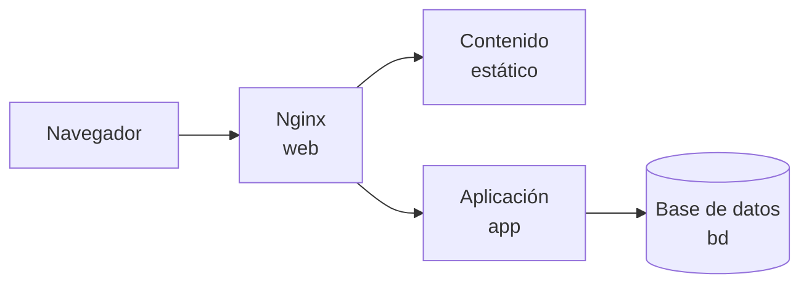

# 🌐 Servidores web y DNS

!!! info "Descarga de diapositivas"
    [Descarga las diapositivas](diapositivas/servidores-web-dns.pptx){target="_blank" rel="noopener"}

---

Un servidor web puede asumir la entrada HTTP de un sistema y servir directamente recursos estáticos. Esto permite separar el trabajo de **entregar ficheros** del trabajo de **ejecutar lógica de aplicación**.

En esta sesión incorporaremos Nginx delante de una aplicación web y utilizaremos dos sitios distintos para estudiar raíces de documentos, hosts virtuales, compresión, caché y resolución de nombres. El reenvío de peticiones dinámicas aparecerá únicamente como conexión con el backend; su funcionamiento se estudiará en la siguiente sesión.

---

## 🗂️ 1. Qué hace un servidor web

Un **servidor web** es un programa que escucha peticiones HTTP y devuelve respuestas HTTP. Cuando sirve contenido estático, su trabajo fundamental consiste en relacionar una URL con un recurso del sistema de ficheros y entregarlo con las cabeceras adecuadas.

Una configuración suele definir una **raíz de documentos**:

| El navegador pide | El servidor busca | Si no está |
|---|---|---|
| `/` | el fichero índice de la raíz | normalmente `403` si no hay índice y no se permite listar |
| `/css/estilos.css` | `<raíz>/css/estilos.css` | `404` |
| `/img/logo.png` | `<raíz>/img/logo.png` | `404` |

La raíz marca el punto desde el que el servidor busca los recursos que puede publicar. Eso no significa que absolutamente todo su contenido tenga que ser accesible, porque las reglas pueden restringir rutas concretas, pero sí convierte esos ficheros en candidatos a ser servidos.

Por eso no deben aparecer accidentalmente en una raíz pública:

```text
.env
copias de seguridad
scripts SQL
credenciales
notas internas
```

Un servidor web tampoco sustituye a la aplicación. Nginx no ejecuta por sí mismo la lógica de negocio de una aplicación. Para contenido dinámico necesita reenviar la petición al proceso que sí puede generarlo.

En esta sesión la separación será:

```text
HTML, CSS, JS, imágenes
→ Nginx los lee del disco

/api/...
→ la aplicación genera la respuesta
```

---

## ⚙️ 2. Apache y Nginx

**Apache HTTP Server** y **Nginx** son dos servidores web maduros capaces de servir contenido estático, aplicar reglas HTTP y actuar como proxy.

Su diseño histórico es diferente. Apache es muy modular y admite varios modelos de procesamiento mediante sus MPM. Nginx nació con una arquitectura orientada a eventos y se popularizó especialmente como servidor de estáticos y como punto de entrada delante de otras aplicaciones.

En este módulo trabajaremos con **Nginx** porque una sola herramienta nos permitirá estudiar progresivamente:

```text
sesión 6 → contenido estático y hosts virtuales
sesión 7 → proxy inverso y balanceo
sesión 8 → HTTPS y control de acceso
sesión 9 → registro del tráfico
```

No se trata de afirmar que Nginx sea universalmente mejor. Apache sigue siendo una opción perfectamente válida y muy extendida.

!!! info "Para saber más: diferencias habituales"
    | | Apache | Nginx |
    |---|---|---|
    | Procesamiento | Configurable mediante varios MPM | Orientado a eventos desde el diseño |
    | Configuración | Central y, si se habilita, por directorio con `.htaccess` | Central |
    | Módulos | Ecosistema muy amplio | Módulos integrados o dinámicos |
    | Uso frecuente | Hosting, aplicaciones, servidor general | Estáticos, proxy y punto de entrada |

---

## 🧱 3. Incorporar Nginx al despliegue

Nginx no estaba en el despliegue del Tema 2. En esta sesión lo añadiremos como un nuevo servicio de Compose.

### 3.1. Servicio, configuración y contenido

Un esquema simplificado será:

```yaml
services:
  web:
    image: nginx:1.30.4-alpine
    ports:
      - "80:80"
    volumes:
      - <configuracion>:/etc/nginx/conf.d:ro
      - <sitio-web>:/srv/www/web:ro
      - <documentacion>:/srv/www/docs:ro
```

Hay tres ideas importantes:

- **La imagen de Nginx es genérica.** No necesitamos construir una nueva para cambiar un sitio durante esta sesión.
- **La configuración entra desde fuera** mediante un montaje de solo lectura.
- **El contenido estático también puede montarse desde fuera**, de forma que Nginx se limite a servirlo.

!!! info "La raíz predeterminada de la imagen oficial"
    La imagen oficial de Nginx trae preparado `/usr/share/nginx/html` como directorio web predeterminado. Es una convención de la imagen, no una ruta obligatoria. Podemos utilizar raíces propias como `/srv/www/web` y `/srv/www/docs`; la directiva `root` de cada bloque `server` decide qué contenido sirve cada sitio.

La aplicación `app` continúa existiendo, pero deja de publicar su puerto 8080 hacia el anfitrión. El único puerto público del conjunto será el 80 de `web`.



El frontend integrado que todavía contiene la imagen de `app` no desaparece físicamente, pero deja de ser la copia que recibe el navegador. Desde esta sesión, los ficheros públicos los sirve Nginx.

### 3.2. Validar y recargar antes de aplicar

La configuración de un servidor web es código de infraestructura. Un error de sintaxis puede impedir que el servicio arranque o que una recarga se aplique.

Nginx puede validar su configuración:

```bash
nginx -t
```

En un contenedor Compose:

```bash
docker compose exec web nginx -t
```

Si la validación es correcta, se puede pedir a Nginx que recargue la configuración:

```bash
docker compose exec web nginx -s reload
```

La secuencia profesional es:

```text
editar
↓
validar
↓
recargar
↓
comprobar
```

Reiniciar el contenedor entero para aplicar cada cambio funciona, pero oculta una capacidad importante del servidor: **puede recargar su configuración sin sustituir el proceso por un despliegue completamente nuevo**.

---

## 🧾 4. Tipos MIME, índices y permisos

Tres detalles pequeños explican muchos fallos al servir ficheros.

**Tipo MIME.** La respuesta incluye una cabecera `Content-Type`, por ejemplo:

```text
text/html
text/css
application/javascript
image/png
```

El navegador utiliza ese tipo para decidir cómo interpretar el contenido. Si un fichero CSS llega con un tipo incorrecto, la página puede aparecer sin estilos aunque el fichero exista.

**Índice.** Cuando se pide un directorio, el servidor suele buscar un fichero como `index.html`. Si no existe, puede devolver `403` o, si se configura expresamente, mostrar un listado de los ficheros mediante `autoindex`.

**Permisos.** Nginx no necesita ejecutar como administrador para servir un sitio. Su proceso debe poder:

```text
leer los ficheros
+
atravesar los directorios que los contienen
```

Esto es especialmente importante con montajes del anfitrión.

!!! warning "Tres síntomas que conviene distinguir"
    - `403` con el recurso existente: revisa permisos o si has pedido un directorio sin índice ni listado habilitado.
    - `404` con el recurso existente: revisa la raíz configurada y el montaje dentro del contenedor.
    - Página sin estilos o recurso rechazado: revisa `Content-Type` en las herramientas del navegador.

---

## 🏠 5. Hosts virtuales por nombre

Una misma dirección IP y un mismo puerto pueden servir varios sitios diferentes.

### 5.1. La cabecera `Host` decide qué sitio responde

Cuando escribes:

```text
http://docs.ejemplo.test/informes/
```

primero el nombre se resuelve a una dirección IP. Después el nombre también viaja dentro de la petición HTTP:

```http
GET /informes/ HTTP/1.1
Host: docs.ejemplo.test
```

Nginx puede utilizar `Host` para escoger un bloque `server`:

```nginx
server {
    listen 80;
    server_name docs.ejemplo.test;

    root /srv/www/docs;
    index index.html;

    location /informes/ {
        autoindex on;
    }
}
```

Las directivas principales son:

| Directiva | Función |
|---|---|
| `listen 80` | puerto en el que atiende el bloque |
| `server_name` | nombre o nombres que seleccionan el sitio |
| `root` | raíz de documentos |
| `index` | fichero que se busca al pedir un directorio |
| `location` | reglas aplicadas a determinadas rutas |
| `autoindex on` | permite listar un directorio sin índice |

Así pueden coexistir:

```text
web.ejemplo.test
→ sitio principal

docs.ejemplo.test
→ documentación e informes
```

Los dos nombres pueden apuntar a la misma dirección IP, utilizar el puerto 80 y terminar en el mismo servidor Nginx.

### 5.2. Qué ocurre cuando ningún nombre coincide

Si ningún `server_name` coincide, Nginx utiliza un servidor por defecto. Si no se declara explícitamente, el comportamiento puede sorprender porque uno de los sitios configurados termina respondiendo a nombres que no eran suyos.

Es preferible expresar la decisión:

```nginx
server {
    listen 80 default_server;
    server_name _;
    return 404;
}
```

Ahora la política es clara:

```text
nombre conocido
→ sitio correspondiente

nombre desconocido
→ 404
```

---

## 🗜️ 6. Compresión y caché de contenido estático

Un servidor web también puede optimizar cómo entrega los ficheros.

### 6.1. Compresión

HTML, CSS y JavaScript son texto y suelen comprimirse muy bien.

El cliente anuncia qué codificaciones acepta:

```http
Accept-Encoding: gzip
```

Si Nginx decide comprimir la respuesta, devuelve:

```http
Content-Encoding: gzip
```

La compresión se realiza **al servir la respuesta**. El fichero guardado en disco no cambia. El navegador recibe los bytes comprimidos y los descomprime automáticamente.

No tiene sentido aplicar gzip indiscriminadamente a formatos como JPEG o PNG, que ya están comprimidos.

Para inspeccionar cabeceras:

```bash
curl -I -H "Accept-Encoding: gzip" \
  http://web.ejemplo.test/css/estilos.css
```

Pero `-I` realiza una petición `HEAD`, por lo que no descarga el cuerpo. Para medir bytes reales necesitas una petición completa:

```bash
curl -s -H "Accept-Encoding: identity" -o /dev/null \
  -w "sin comprimir: %{size_download} bytes\n" \
  http://web.ejemplo.test/css/estilos.css

curl -s -H "Accept-Encoding: gzip" -o /dev/null \
  -w "comprimido:   %{size_download} bytes\n" \
  http://web.ejemplo.test/css/estilos.css
```

### 6.2. Caché del navegador

`Cache-Control` indica durante cuánto tiempo puede reutilizar el navegador una respuesta.

No todos los recursos tienen la misma volatilidad:

```text
HTML
→ cambia con frecuencia
→ caché corta o revalidación

CSS, JS, imágenes versionadas
→ cambian menos
→ caché más larga
```

En Nginx una configuración puede aplicar reglas por extensión. Por ejemplo:

```nginx
location ~* \.(css|js|png|jpg|jpeg|svg|webp)$ {
    expires 7d;
}
```

La directiva `expires` genera cabeceras de expiración y una política `Cache-Control` coherente con el plazo indicado.

El inconveniente de una caché larga aparece al publicar una versión nueva. Si un fichero mantiene el mismo nombre, un navegador podría conservar la copia anterior. Por eso en frontends reales es habitual generar nombres versionados o con huellas de contenido.

---

## 🧭 7. DNS: convertir nombres en direcciones

Los hosts virtuales funcionan por nombre, pero antes ese nombre debe conducir a la máquina correcta.

### 7.1. Resolución del sistema y `dig`

Una aplicación normal pregunta al **resolutor del sistema operativo**. Este puede consultar varias fuentes. En Linux, `/etc/hosts` puede proporcionar una respuesta local antes de acudir al DNS configurado.

Por eso esta línea:

```text
127.0.0.1 ejemplo.local
```

puede hacer que el navegador encuentre `ejemplo.local` sin que exista ningún registro DNS real.

`dig` funciona de otra forma: consulta DNS directamente. No utiliza `/etc/hosts` para resolver el nombre solicitado.

Así pueden darse simultáneamente estas dos situaciones:

```text
navegador
→ nombre funciona por /etc/hosts

dig
→ el DNS dice que ese nombre no existe
```

No hay contradicción. Están consultando fuentes diferentes.

### 7.2. Registros A, CNAME, TTL y `nip.io`

Los dos registros que necesitas reconocer ahora son:

| Registro | Contiene | Uso típico |
|---|---|---|
| `A` | una dirección IPv4 | nombre que apunta directamente a una dirección |
| `CNAME` | otro nombre | alias de un nombre existente |

El **TTL** indica durante cuánto tiempo puede conservarse una respuesta DNS en caché antes de volver a consultarla.

Un TTL alto reduce consultas, pero hace más lenta una migración. Por eso, si se sabe que un nombre va a cambiar de destino, el TTL se reduce **antes** de la migración, con tiempo suficiente para que caduquen las respuestas antiguas.

Puedes inspeccionar una respuesta con:

```bash
dig web.127.0.0.1.nip.io
dig +short web.127.0.0.1.nip.io
```

Para el laboratorio utilizaremos `nip.io`, un servicio DNS comodín que permite codificar una dirección IP dentro de un nombre. Así:

```text
web.127.0.0.1.nip.io
docs.127.0.0.1.nip.io
```

pueden resolver a `127.0.0.1` sin registrar un dominio propio.

Esto nos permite practicar simultáneamente:

```text
DNS real
+
hosts virtuales por nombre
+
una sola máquina
```

En la siguiente sesión aplicarás la misma idea sobre la dirección pública de una instancia remota.

---

## 🎯 Qué debes saber hacer al salir de esta sesión

- Explicar qué responsabilidad tiene un servidor web y qué sigue perteneciendo a la aplicación.
- Incorporar Nginx como servidor web delante de una aplicación.
- Servir un directorio de contenido estático mediante una raíz de documentos.
- Montar configuración y contenido de Nginx desde Compose en modo de solo lectura.
- Validar la configuración antes de recargarla.
- Configurar dos hosts virtuales por nombre sobre una misma dirección y puerto.
- Declarar un servidor por defecto que no publique accidentalmente otro sitio.
- Permitir el listado de un directorio cuando interesa y reconocer los riesgos de hacerlo.
- Diagnosticar problemas de permisos, raíz de documentos y tipos MIME.
- Activar compresión y demostrar su efecto midiendo los bytes transferidos.
- Aplicar políticas distintas de caché según el tipo de recurso.
- Resolver un nombre con `dig`, reconocer un registro A y un CNAME y explicar qué representa el TTL.
- Explicar por qué `/etc/hosts` puede afectar al navegador sin afectar a una consulta `dig`.

Lo que basta con reconocer: los detalles internos de los MPM de Apache, otros tipos de registros DNS y técnicas avanzadas de reescritura de URL.

---

## ✅ Ideas clave

??? tip "Abrir resumen"

    - Nginx puede convertirse en la puerta HTTP del sistema y servir directamente recursos estáticos.
    - Nginx puede servir directamente contenido estático y reenviar las rutas dinámicas hacia un backend interno.
    - El servidor web puede ser la única puerta publicada, mientras aplicación y base de datos permanecen accesibles solo dentro de la red interna.
    - Un servidor web relaciona URL, raíz de documentos y cabeceras HTTP. Un `404`, un `403` y un tipo MIME incorrecto apuntan a problemas diferentes.
    - La configuración se versiona y se monta de solo lectura. Antes de aplicarla se valida con `nginx -t` y después se recarga.
    - Un host virtual por nombre se selecciona mediante la cabecera `Host`. Varios sitios pueden compartir dirección IP y puerto.
    - Un servidor `default_server` explícito evita que un nombre desconocido termine mostrando por accidente uno de los sitios reales.
    - Gzip reduce los bytes enviados para contenido textual. `curl -I` permite inspeccionar cabeceras, pero para medir bytes hay que descargar el cuerpo.
    - La caché debe adaptarse a la volatilidad del recurso. Una política larga sobre un nombre de fichero estable puede dejar clientes usando una versión antigua.
    - Un registro A relaciona nombre e IPv4; un CNAME crea un alias. El TTL determina cuánto puede reutilizarse una respuesta DNS.
    - El resolutor del sistema puede consultar `/etc/hosts`. `dig` consulta DNS directamente, por lo que ambos pueden mostrar resultados diferentes.

---

En la actividad aplicarás estos patrones al proyecto del módulo: dos sitios sobre un mismo Nginx, nombres distintos, servidor por defecto y políticas de entrega de contenido estático. El reenvío de `/api/` se mantendrá como una caja negra hasta la siguiente sesión.
