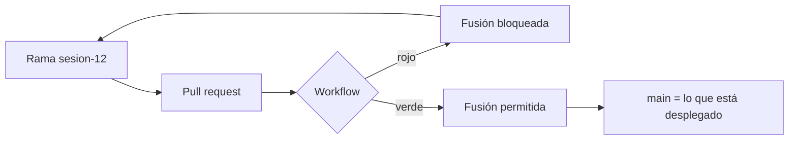

# 🧩 1. Integración continua

!!!info "Descarga de diapositivas"
    [Descarga las diapositivas](diapositivas/integracion-continua.pptx){target="_blank" rel="noopener"}

---

La semana pasada cerraste el bloque de rendimiento con un informe que decía, con números, cuánta carga aguanta tu servicio y dónde está el límite. Con eso terminaste de construir: llevas once viernes levantando piezas —contenedores, proxy, TLS, logs, servidor de aplicaciones— y todas funcionan. Pero fíjate en cómo funcionan: cada una la montaste **tú**, a mano, un viernes concreto, y cada viernes siguiente empiezas rearrancando el laboratorio y levantando el stack a mano otra vez. Nada de lo que has construido se comprueba solo, se construye solo ni se despliega solo.

Eso tiene una consecuencia que hasta hoy has podido ignorar. Desde septiembre trabajas con una norma: `main` es lo que está desplegado. Es un buen acuerdo. El problema es que **es solo un acuerdo**: nada, absolutamente nada, impide que fusiones en `main` algo que no compila. Llevas once pull requests fusionados y ni uno solo ha sido revisado por una máquina antes de entrar. Hoy pones esa máquina en medio.

---

## 🔁 Lo que dejaste abierto en septiembre

En la sesión 2 montaste el andamiaje de trabajo del curso y desde entonces lo has usado sin volver a pensarlo. Antes de añadir nada encima, mira en qué estado está de verdad:

| Lo que dejaste en la S2 | Dónde lo has usado desde entonces | Qué le pasa hoy |
|---|---|---|
| Rama corta por sesión, `sesion-NN` | Once ramas abiertas y fusionadas | Nada. Funciona y no se toca |
| Pull request hacia `main` | Once PR fusionados | Se fusiona porque toca. Nadie ha comprobado nunca nada antes de pulsar el botón |
| `main` significa «lo que está desplegado» | Cada viernes arrancas el stack desde `main` | Es una promesa verbal: si fusionas algo roto, lo descubres al levantar el viernes siguiente |
| Versionado semántico y etiquetas | `v0.1.0`, e imágenes etiquetadas en GHCR desde la S4 | Las etiquetas las pones **a mano, después de haber probado a mano** |
| Secretos fuera del repositorio | `.env`, credenciales de Nginx, `tomcat-users.xml` | Aguanta mientras el único que despliega seas tú. Hoy aparece un tercero que también necesita credenciales |
| Documentación y tests que trae el proyecto | Publicados en la S6 desde la etapa intermedia de la imagen | Se generan cuando te acuerdas |

Las dos últimas filas son las que abren la sesión. Escaparate trae tests desde el primer día y su `pom.xml` trae, desde antes de la S2, una regla de cobertura escrita y **desactivada**. Llevas tres meses arrastrando un control de calidad que nunca ha dicho que no. Hoy le das voz.

---

## 🤖 Qué es exactamente un pipeline

Un *pipeline* de integración continua es un programa que vive en tu repositorio y que la plataforma ejecuta por ti cuando ocurre algo. No es un servicio que instalas ni una máquina que administras: es un fichero de texto versionado junto al código, que sigue las mismas reglas que el código —se revisa en un pull request, se etiqueta, se revierte—.

Nosotros usaremos **GitHub Actions**, porque tu repositorio ya está ahí, tus imágenes ya están en GHCR y tus pull requests ya son el punto de paso obligatorio. Cambian los nombres según la plataforma, pero las piezas son siempre las mismas seis:

| Pieza | Qué es | En Escaparate |
|---|---|---|
| **Disparador** | El suceso que arranca la ejecución | Abrir o actualizar un pull request hacia `main` |
| **Workflow** | El fichero completo que describe qué hacer | `.github/workflows/ci.yml` |
| **Job** | Un bloque de trabajo con su propia máquina | «construir y probar», «construir y escanear la imagen» |
| **Ejecutor** (*runner*) | La máquina donde corre el job | Una máquina Linux limpia que presta GitHub |
| **Paso** (*step*) | Una orden concreta dentro del job | Descargar el código, instalar Java, `mvn verify` |
| **Artefacto** | Un fichero que sobrevive al job y te puedes descargar | El informe de cobertura, el informe del escáner |

La pieza que más cuesta interiorizar es el **ejecutor**. Cada vez que se dispara el workflow, la plataforma te da una máquina virtual nueva y efímera: **sin tu repositorio, sin tus dependencias descargadas, sin tus variables y sin tu configuración**. La imagen que GitHub usa trae bastante herramienta preinstalada —Git, Docker, incluso Maven—, pero apoyarse en eso es apoyarse en la casualidad: lo que hoy viene puede no venir dentro de seis meses, y la versión que traiga no tiene por qué ser la tuya. Por eso el workflow **declara explícitamente las versiones críticas de su entorno**, empezando por Java 21. Cuando el job termina, la máquina se destruye con todo lo que hubiera dentro.

!!! example "La máquina que no te conoce"
    Piensa en el ejecutor como en un compañero nuevo al que le pides que compile el proyecto: tendrá sus herramientas, pero no tiene tu ordenador, ni tus variables de entorno, ni «esa carpeta que yo ya tenía». Si el proyecto solo compila en tu máquina, en la suya no compilará. El pipeline convierte en error visible lo que hasta ahora era «pues a mí me funciona».

Esto no te pilla desprevenido, aunque no te lo dijera entonces: la construcción multietapa de la sesión 4 ya obligaba a que el proyecto se compilara dentro de un contenedor limpio, sin nada tuyo. Aquel Dockerfile ya era, sin saberlo, un ensayo de esto.

Un workflow mínimo tiene esta forma:

```yaml
name: CI
on:
  pull_request:
    branches: [main]

permissions:
  contents: read

jobs:
  construir-y-probar:
    runs-on: ubuntu-latest
    steps:
      - uses: actions/checkout@v4
      - uses: actions/setup-java@v4
        with:
          java-version: '21'
          distribution: 'temurin'
          cache: maven
      - run: ./mvnw --batch-mode verify
      - uses: actions/upload-artifact@v4
        if: always()
        with:
          name: informes
          path: target/site/jacoco/
```

Léelo de arriba abajo:

- `on: pull_request` es el disparador: solo se ejecuta cuando alguien propone entrar en `main`. No se ejecuta al hacer *commit* en tu rama, y eso es deliberado: la puerta está en la fusión, no en cada guardado.
- `permissions: contents: read` declara qué puede hacer el pipeline con tu repositorio: leer y nada más. Volveremos a esta línea cuando hablemos de seguridad.
- `runs-on: ubuntu-latest` pide una máquina Linux de las que presta la plataforma.
- `actions/checkout` suele ser de los primeros pasos, porque sin él la máquina no tiene tu código; si un job no necesita el repositorio, no hace falta.
- `setup-java` instala el JDK 21 —la versión que tú decides, no la que traiga el ejecutor— y, con `cache: maven`, guarda las dependencias descargadas entre ejecuciones para que la segunda vez tarde menos.
- `./mvnw verify` es el paso que decide. `verify` ejecuta la fase de tests y, después, las comprobaciones enganchadas a esa fase —entre ellas la de cobertura—. Si algo falla, el paso devuelve un código de salida distinto de cero, el job se marca en rojo y los pasos siguientes no se ejecutan.
- `upload-artifact` con `if: always()` guarda los informes **incluso cuando el job ha fallado**, que es justo cuando los necesitas para saber por qué.

!!! warning "El orden de los pasos es el orden de los fallos"
    Un job se detiene en el primer paso que falla. Si pones el escaneo de la imagen antes de los tests, un test roto no llegará ni a mirarse. Coloca primero lo más barato y lo que más te enseña: compilar, después probar, después construir la imagen, y al final escanearla.

---

## 🚪 La calidad como puerta, no como informe

Aquí está la idea central de la sesión, y no es técnica. Herramientas de calidad tienes desde hace meses: los tests estaban ahí, la cobertura estaba medida, el escáner de imágenes existía. Lo que no había era **consecuencia**. Un informe que nadie mira no cambia ninguna decisión; un número que no puede impedir una fusión no es un criterio, es una estadística.

La diferencia entre un pipeline útil y un pipeline decorativo cabe en una tabla:

| | Informa | Decide |
|---|---|---|
| Qué produce | Un número, un informe, un artefacto | Un código de salida cero o distinto de cero |
| Qué pasa si el resultado es malo | Nada. Alguien debería mirarlo | El job se pone en rojo y el pull request no se puede fusionar |
| Para qué sirve | Para saber cómo vas | Para no empeorar |
| Riesgo | Se ignora en dos semanas | Frena el trabajo si el umbral está mal elegido |

Ninguna de las dos columnas es «la buena». Un umbral demasiado estricto se convierte en un obstáculo que la gente aprende a esquivar, y un pipeline que solo informa se ignora. La decisión de diseño es **qué comprobaciones bloquean y cuáles solo acompañan**, y esa decisión se toma a conciencia, no por defecto.

En Escaparate vamos a poner tres comprobaciones que bloquean —tests, cobertura y vulnerabilidades corregibles de severidad alta— y a dejar todo lo demás como informe descargable.

---

## 📊 Cobertura: el número que llevaba tres meses apagado

La **cobertura de tests** mide qué porcentaje del código se ha llegado a ejecutar mientras corrían los tests. En un proyecto Java se calcula con `jacoco`, que ya está en el `pom.xml` de Escaparate desde antes de la sesión 2 con esta regla escrita:

```xml
<rule>
  <element>BUNDLE</element>
  <limits>
    <limit>
      <counter>LINE</counter>
      <value>COVEREDRATIO</value>
      <minimum>0.60</minimum>
    </limit>
  </limits>
</rule>
```

- `BUNDLE` significa que la regla se aplica al proyecto entero, no clase a clase. Es lo razonable: una clase de configuración con dos líneas sin tests no debería tumbar la construcción.
- `LINE` y `COVEREDRATIO` fijan qué se cuenta: la proporción de líneas ejecutadas sobre líneas totales.
- `0.60` es el umbral que vamos a exigir: seis de cada diez líneas.

La regla está y **hasta hoy no ha bloqueado nada**, porque la ejecución que la invoca tiene `haltOnFailure` en `false`: mide, escribe el informe y deja pasar. Activarla es cambiar ese valor. Es una línea, y es la línea que convierte tres meses de medición en un criterio.

!!! tip "Qué te dice y qué no te dice la cobertura"
    La cobertura te dice qué código **no** se ha probado, y eso es información fiable: si una clase aparece al 0 %, nadie la ha ejecutado nunca en un test. Lo que no te dice es que el código cubierto esté bien probado: un test que llama a un método y no comprueba el resultado sube la cobertura sin comprobar nada. Por eso 60 % es un suelo, no un objetivo, y por eso ningún equipo sensato persigue el 100 %.

!!! warning "El umbral se elige mirando el proyecto, no la teoría"
    Un umbral por encima de la cobertura actual deja el repositorio bloqueado desde el minuto uno y obliga a desactivarlo con prisas, que es la peor forma de perder una norma. La regla práctica: se fija justo por debajo de donde estás para impedir que **empeore**, y se sube cuando el proyecto sube.

---

## 🛡️ Escanear la imagen: la deuda de la sesión 8

En la sesión 8, cuando endureciste el contenedor, quedó anunciado que el escaneo de vulnerabilidades llegaría con el pipeline. Ahora se entiende por qué se aplazó: escanear una imagen a mano una vez no sirve de nada. Las vulnerabilidades no aparecen cuando tú construyes, sino cuando alguien las publica semanas después en una biblioteca que tú ya tenías. Un escaneo tiene valor **repetido**, y repetido significa automático.

Un escáner como **Trivy** compara lo que hay dentro de tu imagen —paquetes del sistema base y dependencias de la aplicación— contra bases de datos públicas de vulnerabilidades conocidas, y devuelve una lista con su severidad: crítica, alta, media, baja. La decisión interesante no es cuál usar, sino **qué hallazgo detiene la construcción**. Nosotros vamos a bloquear con dos condiciones a la vez:

- **Severidad crítica o alta.** Las medias y bajas se registran en el informe y no frenan nada.
- **Que exista corrección disponible.** Si el mantenedor de la imagen base todavía no ha publicado el paquete arreglado, tu pipeline se caería sin que tú puedas hacer absolutamente nada. Bloquear por algo que no tienes forma de resolver no protege: solo enseña a saltarse la comprobación.

Esa segunda condición es la que separa una puerta útil de una puerta que la gente desactiva el segundo día.

!!! info "Para saber más"
    Al lado del escaneo de vulnerabilidades se suele poner **análisis estático** (SonarQube, SpotBugs, linters): herramientas que leen el código sin ejecutarlo y detectan código muerto, complejidad excesiva o patrones peligrosos. Se enganchan al pipeline igual que todo lo demás y suelen empezar informando, para no bloquear el trabajo mientras el equipo se pone al día con la deuda que destapan.

---

## 🔐 Secretos y seguridad del pipeline

Acabas de meter un tercero en tu flujo de trabajo. Ese tercero ejecuta código en una máquina que no controlas, con acceso a tu repositorio, y a partir de la sesión que viene tendrá también acceso a tu servidor. Merece las mismas preguntas que le harías a cualquier otro acceso.

**Los secretos no viven en el repositorio.** La plataforma guarda valores cifrados y los inyecta como variables de entorno solo durante la ejecución: en el workflow escribes una referencia, y el valor nunca está en Git.

**El pipeline no reutiliza tus credenciales personales.** Ni el token personal de la S2 ni el de GHCR de la S4. En cada ejecución, GitHub genera un **token temporal** que pertenece al repositorio y no a ti, y muere al terminar. Esa es la forma correcta de resolver el acceso: no guardar mejor la credencial, sino no necesitarla.

**Los permisos se declaran, no se heredan.** Lo que ese token puede hacer por defecto depende de cómo esté configurado el repositorio y la organización a la que pertenece, así que no lo sabes con seguridad mirando tu workflow. Por eso no se confía en el valor por defecto: **el workflow declara expresamente lo que necesita y todo lo demás se queda sin permiso**. Cuando en la S13 haya que publicar una imagen, se ampliará ese bloque con el permiso concreto que haga falta y con ninguno más.

**Enmascarar no es lo mismo que proteger.** La plataforma sustituye por asteriscos las apariciones **literales** del valor de un secreto en los logs. Eso cubre el descuido de imprimirlo sin querer, y nada más: si el valor se transforma antes de salir —codificado, partido en trozos, metido en el nombre de un fichero—, la plataforma ya no lo reconoce y aparece en claro. Que un secreto pase por un pipeline significa que confías en todo lo que ese pipeline ejecuta.

!!! danger "Las acciones de terceros ejecutan código ajeno en tu máquina"
    Cada `uses:` que pones descarga y ejecuta código de otra persona, con acceso a los secretos de ese job. Usa acciones de proveedores conocidos y no le pases secretos a un job que no los necesita. Y cuidado con creer que has fijado la versión: en el curso escribiremos `@v4` por legibilidad, pero **esa etiqueta también se mueve** —apunta a la última publicación de esa serie mayor—, así que el código que ejecutas hoy puede no ser el de mañana. En un pipeline real que maneje secretos o toque producción, la recomendación de seguridad es referenciar la acción por el **identificador completo del commit**, que es la única forma de fijarla de verdad.

---

## 🔒 Protección de rama: por qué llevas desde septiembre abriendo pull requests

Con el workflow escrito, cada pull request se pone en verde o en rojo. Y aun así puedes fusionarlo en rojo, porque nadie se lo impide. El pipeline solo informa.

La pieza que falta no está en el workflow: está en la configuración del repositorio. Una **regla de protección de rama** sobre `main` te permite exigir que ciertas comprobaciones estén en verde para habilitar el botón de fusión, y de paso impedir el envío directo a `main` saltándose el pull request.

Dos detalles que deciden si la regla funciona o es decorativa:

- **La comprobación se exige por su nombre.** Lo que apuntas en la regla es el nombre del job tal cual aparece en el pull request. Si luego renombras el job, la regla se queda esperando una comprobación que ya no existe y bloquea todo para siempre. Elige nombres estables y no los toques.
- **Tú eres el administrador de tu repositorio.** Según cómo configures la regla, quien administra puede quedar exento de cumplirla, y entonces seguirás pudiendo fusionar en rojo sin enterarte de que la puerta no está cerrada. Hay que marcar explícitamente que la regla **no admite excepciones**, ni siquiera para ti.



Y con esto se cierra un argumento que llevaba once sesiones abierto. Desde septiembre abres una rama y un pull request para cada sesión, aunque trabajes solo y aunque no haya nadie que te revise. Habrás pensado alguna vez que era un trámite. No lo era: era el **punto de control** que hoy adquiere sentido. El pull request es el único sitio donde se puede poner una condición entre tu trabajo y `main`. Sin él no hay dónde enganchar la puerta.

!!! tip "La protección se pone después de que el workflow funcione"
    Si activas la exigencia del check antes de que el workflow haya corrido nunca, te encuentras con un pull request bloqueado por una comprobación que la plataforma todavía no conoce. Primero haz que el workflow se ejecute y se ponga en verde una vez; después exígelo.

Fíjate en lo que ha cambiado hoy y en lo que no. `main` ha dejado de ser «lo que yo he probado en mi ordenador» para ser «lo que ha atravesado la puerta». Eso es integración continua, y no incluye desplegar: al terminar la sesión tu servicio se seguirá levantando a mano, como cada viernes. La imagen se construye, se comprueba y se tira. Esa última pieza —que lo que entra en `main` llegue solo hasta la instancia— es la sesión 13.

---

## 🎯 Qué debes saber hacer al salir de esta sesión

- Leer un workflow y decir qué lo dispara, qué jobs contiene, qué hace cada paso y en cuál se ha detenido cuando falla.
- Escribir un workflow que, en cada pull request contra `main`, compile el proyecto, ejecute sus tests y construya la imagen del contenedor.
- Activar la regla de cobertura del `pom.xml` y demostrar que la regla es capaz de detener la construcción, no solo de medir.
- Añadir el escaneo de la imagen y justificar con qué severidad y en qué condiciones detiene la construcción.
- Configurar la protección de `main` para que el pull request no se pueda fusionar sin el check en verde, sin excepciones para quien administra.
- Guardar un valor como secreto del repositorio, usarlo en un paso y comprobar qué enmascara la plataforma en los logs y qué no.

**Lo que basta con reconocer**: matrices de ejecución para probar en varias versiones a la vez, caché de dependencias más allá de activarla, ejecutores autoalojados, y las herramientas de análisis estático de código.

---

## ✅ Ideas clave

??? tip "Abrir resumen"

    - Un pipeline es un fichero versionado junto al código que la plataforma ejecuta cuando ocurre un suceso; se revisa, se etiqueta y se revierte como cualquier otro fichero del repositorio.
    - Sus piezas son siempre las mismas: disparador, workflow, job, ejecutor, paso y artefacto.
    - El ejecutor es una máquina nueva y efímera: no tiene tu repositorio, ni tus dependencias, ni tu configuración, y desaparece al terminar. Trae herramientas preinstaladas, pero las versiones que importan se declaran en el workflow en vez de dejarlas al azar.
    - Un job se detiene en el primer paso que falla, así que el orden de los pasos determina qué llegas a ver cuando algo va mal.
    - Una comprobación que solo informa no cambia ninguna decisión. La calidad se convierte en puerta cuando su resultado puede impedir una fusión.
    - La cobertura te dice con fiabilidad qué código no se ha probado nunca; no te dice que lo probado esté bien probado. Se fija justo por debajo de donde estás, como suelo para no empeorar.
    - Escanear vulnerabilidades solo tiene valor si se repite. Y bloquear por una que no tiene corrección disponible no protege de nada: solo enseña a saltarse la comprobación.
    - El pipeline no usa credenciales personales: la plataforma emite un token temporal que muere con la ejecución. Sus permisos no se heredan, se declaran.
    - Enmascarar un secreto en los logs solo cubre el descuido de imprimirlo tal cual; cualquier transformación lo saca en claro.
    - Cada acción de terceros ejecuta código ajeno con acceso a los secretos de su job. Y `@v4` no fija nada: esa etiqueta se mueve. Fijar de verdad es referenciar el commit completo.
    - El pull request es el único punto donde se puede poner una condición entre tu trabajo y `main`. La protección de rama la convierte en obligatoria, y solo si no deja excepciones para quien administra.
    - Integración continua es comprobar que lo que entra en `main` supera las puertas que has definido. Llevarlo hasta el servidor es otra cosa, y es la sesión siguiente.

Con esto ya tienes las piezas para la **Actividad 5.1**, donde vas a montar el pipeline de Escaparate de principio a fin: construcción y tests en cada pull request, la regla de cobertura activada, el escaneo de la imagen decidiendo, un secreto al que intentarás sacarle la ropa, y la protección de `main` cerrando la puerta. Al salir del aula, tu repositorio no dejará entrar nada que no haya pasado por ahí.