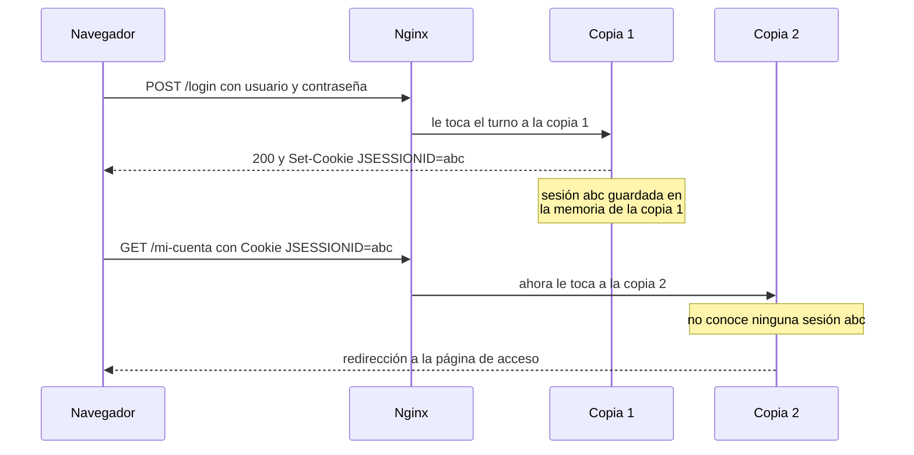

# 🧩 1. Servidor de aplicaciones

!!!info "Descarga de diapositivas"
    [Descarga las diapositivas](diapositivas/servidor-aplicaciones.pptx){target="_blank" rel="noopener"}

---

Llevas cuatro sesiones administrando un servidor web. Nginx es hoy la puerta única de tu servicio: sirve el front estático, reparte las peticiones de la API entre tres copias, termina el TLS, protege la zona de informes con usuario y contraseña y escribe en JSON todo lo que pasa por él. Es mucho. Pero hay algo que Nginx no ha hecho ni una sola vez en todo el curso: **ejecutar una línea de Escaparate**.

Cuando una petición llega a `/api/productos`, Nginx no sabe qué es un producto. Lo único que hace es reenviar esa petición a otro proceso y devolver lo que ese proceso conteste. Ese otro proceso lleva desde octubre en tu `compose.yaml`, arrancando cuando le dices `up` y muriendo cuando le dices `down`, y hasta hoy no le has puesto nombre. Hoy se lo pones: es un **servidor de aplicaciones**, y entender qué hace por dentro explica de golpe dos cosas que arrastras desde la primera sesión. La primera, por qué el mismo fichero de Escaparate se puede desplegar de dos formas distintas. La segunda, por qué al poner el proxy delante hay usuarios que se quedan fuera de su propia sesión.

---

## 🧱 Tres cosas que llamamos «el servidor»

En una conversación de trabajo, «el servidor» significa tres cosas distintas según quién hable. Conviene separarlas antes de seguir, porque cada una resuelve un problema diferente.

Un **servidor web** entiende HTTP y sabe convertir una URL en un fichero del disco. Le pides `/logo.png` y te devuelve ese fichero. Le pides algo que no sabe servir y lo reenvía a otro sitio, que es exactamente lo que hiciste en la sesión 7. No ejecuta tu código: no sabría cómo. Apache y Nginx son servidores web.

Un **servidor de aplicaciones** hace lo contrario: su trabajo es ejecutar tu código. Tú no le entregas ficheros, le entregas un **artefacto** —un paquete con tus clases dentro— y él se encarga de cargarlo, arrancarlo, mantenerlo vivo y entregarle cada petición que llegue. A cambio te da servicios que tú no tienes que programar: gestión de hilos, ciclo de vida, sesiones de usuario, seguridad declarativa, agrupaciones de conexiones a base de datos.

En este módulo vamos a usar «servidor de aplicaciones» en sentido amplio, para referirnos al componente que ejecuta la aplicación web. Pero conviene que sepas que hay grados: **Tomcat es un contenedor de servlets**, es decir, implementa la parte de HTTP de la especificación —servlets, páginas JSP, WebSocket— mientras que servidores como WildFly o Payara implementan un conjunto bastante más amplio de Jakarta EE, con transacciones distribuidas, mensajería y componentes de negocio remotos. La mayoría de aplicaciones web Java modernas no necesita ese conjunto amplio, y por eso Tomcat es con diferencia el más usado.

Un **servidor embebido** es la vuelta de tuerca moderna. En lugar de instalar un servidor y meter tu aplicación dentro, metes el servidor dentro de tu aplicación. El resultado es un único fichero que arranca solo, sin nada instalado alrededor. Es lo que has estado usando todo el curso sin saberlo: cuando tu contenedor de Escaparate arranca y responde en el puerto 8080, dentro de ese proceso hay un Tomcat completo que Spring Boot ha levantado por ti.

Un detalle que despista al principio: **el servidor de aplicaciones también sabe hablar HTTP y servir ficheros estáticos**. Podría atender él solo el tráfico de internet. Si en tu arquitectura no lo hace no es porque no sepa, es por reparto de responsabilidades. Mantener Nginx como puerta única concentra en una sola pieza el contenido estático, el enrutado, el balanceo, la terminación TLS, las restricciones de acceso y los registros —todo lo que montaste en el tema 3— y deja a Tomcat dedicado a lo único que Nginx no puede hacer. Cuando cada pieza hace una cosa, se configura, se mide y se sustituye por separado.

---

## ⚙️ Qué hace un contenedor de servlets

La palabra «contenedor» aquí no tiene nada que ver con Docker, y es una coincidencia desafortunada. Un contenedor de servlets es el entorno que rodea a tu código y le da vida. El contrato es sencillo: tú escribes clases que responden a peticiones y el contenedor se ocupa de todo lo demás.

El ciclo es siempre el mismo. Al **desplegar** el artefacto, el contenedor lo lee, carga sus clases con un cargador aislado del resto y crea un *contexto de aplicación*, que es el espacio propio donde vivirá. Después llama una sola vez al método de **inicialización** de cada componente, que es donde tu aplicación abre conexiones a la base de datos, lee su configuración y se prepara. A partir de ahí entra en régimen de **servicio**: por cada petición HTTP que llegue, el contenedor coge un hilo de su reserva, lo asocia a esa petición, llama a tu código y devuelve la respuesta. Cuando la aplicación se retira, llama al método de **destrucción** para que cierre lo que tenga abierto, y **repliega** el contexto liberando la memoria.

Tres consecuencias prácticas de ese ciclo, que vas a ver en la actividad.

La primera: **tu código no controla los hilos**. El contenedor mantiene una reserva de hilos y va asignándolos. Si llegan más peticiones simultáneas que hilos disponibles, las que sobran esperan en cola. Ese detalle no te importa hoy, pero es la mitad de la explicación de la sesión que viene.

La segunda: **el despliegue y el arranque son operaciones distintas**. Puedes desplegar una aplicación nueva en un servidor que ya está en marcha sin reiniciarlo, y puedes retirar una sin tocar las demás. Un mismo Tomcat puede tener tres aplicaciones desplegadas y detener solo una.

La tercera: **el contexto es un espacio con nombre**. Cuando despliegas un artefacto llamado `escaparate.war`, el contenedor lo publica bajo la ruta `/escaparate`. Si quieres que responda en la raíz, el fichero tiene que llamarse `ROOT.war`. Es una convención antigua, poco intuitiva y responsable de una cantidad notable de tiempo perdido.

!!! warning "El error que vas a cometer hoy"
    Tienes un proxy delante que reenvía `/api/` al backend. Si despliegas el artefacto con su nombre por defecto, la aplicación responderá en `/escaparate/api/` y el proxy seguirá pidiendo `/api/`. Resultado: un 404 impecable que no es culpa de nadie. O renombras el artefacto, o ajustas la ruta en el proxy. Las dos soluciones son válidas; lo que no vale es no saber por qué falla.

---

## 📦 El artefacto desplegable

Un `war` (*web application archive*) es un fichero comprimido con una estructura acordada. Si le cambias la extensión a `.zip` y lo abres, encuentras esto:

```text
escaparate.war
├── WEB-INF/
│   ├── classes/          clases compiladas y ficheros de configuración
│   ├── lib/              dependencias que la aplicación necesita siempre
│   ├── lib-provided/     dependencias que solo hacen falta si arranca sola
│   └── web.xml           descriptor de despliegue (opcional hoy)
├── META-INF/
│   └── MANIFEST.MF       metadatos del paquete
└── index.html, css/, js/ recursos servidos directamente
```

`WEB-INF/classes` guarda tu código ya compilado junto a los ficheros de propiedades. `WEB-INF/lib` contiene las bibliotecas de las que depende la aplicación, empaquetadas dentro para que el artefacto sea autosuficiente. `web.xml` es el descriptor de despliegue: el fichero donde clásicamente se declaraba qué componentes hay, en qué ruta responde cada uno y qué zonas están protegidas; desde hace años esa información suele ir en anotaciones dentro del código y el fichero es opcional. Y todo lo que está fuera de `WEB-INF` es público: el contenedor lo sirve tal cual, sin ejecutar nada.

El directorio que explica la magia es `WEB-INF/lib-provided`. Ahí dentro está el Tomcat embebido. Cuando ejecutas el fichero directamente, el arrancador lo usa y la aplicación levanta su propio servidor; cuando lo despliegas en un Tomcat instalado, **el servidor ignora ese directorio**, porque el contenedor ya lo pone él. Ese es todo el truco del `war` ejecutable de Escaparate: un fichero, dos huéspedes, y un directorio que a veces sobra.

La ventaja del formato es que **desacopla el artefacto del servidor concreto**: está pensado para desplegarse en cualquier contenedor compatible con las especificaciones que la aplicación usa, sin recompilar el código. Eso no significa portabilidad mágica —las versiones de la especificación, las bibliotecas que aporta cada servidor y su configuración propia siguen importando—, pero es una distancia enorme respecto a un formato propietario, y es la razón por la que Java lleva veinticinco años instalado en el mundo empresarial.

---

## 🔀 Embebido o externo: qué cambia de verdad

Puestos a elegir, la pregunta no es cuál es mejor sino qué modelo operativo quieres. Esta tabla resume lo que vas a medir tú mismo en la actividad.

| | Embebido (`java -jar`) | Servidor externo (`webapps/`) |
|---|---|---|
| **Qué despliegas** | Un artefacto que se basta solo | Un artefacto que necesita un servidor ya instalado |
| **Arranque** | Un proceso: arranca la aplicación con su servidor | Dos tiempos: arranca el servidor, luego despliega |
| **Configuración del servidor** | Dentro de la aplicación, en su fichero de propiedades | Fuera, en los ficheros del servidor, compartida |
| **Actualizar una versión** | Se reemplaza el artefacto y se reinicia el proceso | Se sustituye por el gestor, sin reiniciar el servidor |
| **Varias aplicaciones** | Un proceso por aplicación | Varias aplicaciones en el mismo servidor |
| **Quién manda en la versión de Tomcat** | La aplicación, en su `pom.xml` | El equipo de sistemas, en la instalación |
| **Encaja con contenedores** | De forma natural: un proceso, una imagen | A regañadientes: hay que meter el servidor en la imagen |

La lectura profesional es esta. El modelo externo nació cuando los servidores eran máquinas caras y escasas, y tenía todo el sentido: un equipo de sistemas administraba el servidor de aplicaciones, controlaba su versión y su configuración, y los equipos de desarrollo le entregaban artefactos para que los desplegara. La separación de responsabilidades era limpia y el ahorro de recursos, real.

El modelo embebido nació cuando desplegar dejó de ser copiar un fichero y pasó a ser publicar una imagen. Si cada aplicación va a vivir en su propio contenedor, meterle dentro un servidor completo para ejecutar una sola aplicación es absurdo: mejor que la aplicación lleve el trozo de servidor que necesita y nada más. Y de paso desaparece la clase de incidencia más frustrante que existe, la de «en mi máquina funciona pero en el servidor no», porque la versión del servidor deja de ser una variable del entorno y pasa a ser parte del artefacto.

Ninguno de los dos está obsoleto. Sigue habiendo muchísimo software corporativo desplegándose sobre servidores instalados, y muy probablemente te toque mantener alguno. Lo que sí está claro es cuál eliges si empiezas hoy de cero y despliegas en contenedores.

---

## 🗂️ Lo que aparece cuando el servidor es externo

Con el servidor embebido, todo lo que hace falta saber viaja dentro de la aplicación. Con el servidor externo aparece un conjunto de ficheros que se administran aparte y que, en una empresa, no son tuyos: son de quien mantiene el servidor. Te basta con reconocerlos.

| Fichero | Qué guarda |
|---|---|
| `server.xml` | El servidor: puertos, conectores, tamaño de la reserva de hilos, tiempos de espera |
| `context.xml` | Lo que se aplica a las aplicaciones: recursos, agrupaciones de conexiones y el gestor de sesiones propio del contenedor |
| `tomcat-users.xml` | Usuarios y roles del servidor |

Hay además un directorio `lib` en la instalación que funciona como **biblioteca compartida**: lo que pongas ahí lo ven todas las aplicaciones desplegadas, lo que evita empaquetar el mismo controlador de base de datos en cada `war`. Tiene su lado oscuro: si dos aplicaciones necesitan versiones distintas de la misma biblioteca, la compartida gana y una de las dos se rompe. Es un conflicto clásico y una razón más por la que el modelo embebido ganó terreno.

!!! warning "Dos mecanismos que se parecen y no son el mismo"
    Tomcat trae **su propio gestor de sesiones**, que se configura desde `context.xml` y que también sabe guardarlas fuera del proceso. Hoy no vamos a usar ese. Escaparate lleva **Spring Session**, que sustituye la sesión estándar por una implementación respaldada por Redis desde dentro de la propia aplicación, y por eso funciona igual con el servidor embebido y con el externo. Que existan los dos caminos está bien; confundirlos, no.

### El gestor de despliegue y sus dos candados

El gestor de despliegue es una aplicación web que Tomcat trae instalada y que permite desplegar, replegar, recargar y detener aplicaciones sin tocar el disco del servidor. Es la herramienta con la que un equipo de sistemas opera el servidor a distancia, y es también donde aparecen los **dominios de seguridad**.

Un dominio de seguridad es, sencillamente, **dónde busca el servidor los usuarios y sus roles cuando alguien intenta entrar en una zona protegida**. Puede ser un fichero, una base de datos o un directorio corporativo. Tomcat trae por defecto el más simple, que lee de `tomcat-users.xml`:

```xml
<tomcat-users>
  <role rolename="manager-script"/>
  <user username="despliegue" password="..." roles="manager-script"/>
</tomcat-users>
```

La primera línea declara que existe un rol. La segunda crea un usuario y se lo asigna. El detalle que importa es **cuál**: el gestor ofrece dos interfaces, una gráfica que se usa desde el navegador y otra de texto pensada para automatizar desde scripts, y **cada una exige un rol distinto** —`manager-gui` la primera, `manager-script` la segunda—. Si vas a automatizar por la interfaz de texto, no concedas también la gráfica: los permisos administrativos se dan por mínima necesidad, igual que los de red en la sesión 8.

Y hay un segundo candado que sorprende a todo el mundo la primera vez. Además del rol, **el gestor viene restringido por dirección de origen**: de fábrica solo acepta peticiones que lleguen desde la propia máquina. Son dos controles independientes que se comprueban por separado —*quién eres* y *desde dónde llamas*— y si falla el segundo obtendrás un rechazo aunque las credenciales sean impecables. Es exactamente la misma idea de la restricción por IP que viste en la sesión 8, aplicada aquí por el servidor de aplicaciones en lugar de por el proxy.

!!! danger "Esa contraseña no se sube al repositorio"
    `tomcat-users.xml` contiene una credencial administrativa. Se versiona una plantilla o se documenta cómo generarlo, nunca el fichero real, igual que hiciste con `.env` en la sesión 5 y con las contraseñas de Nginx en la sesión 8.

---

## 🕵️ Dónde vive la sesión

Llegamos a la deuda que arrastras desde la primera sesión del curso.

HTTP no tiene memoria. Cada petición llega sola, sin nada que la relacione con la anterior. Para que una aplicación pueda saber que eres tú quien está pidiendo `/mi-cuenta`, hace falta un truco, y el truco es siempre el mismo: cuando inicias sesión, el servidor crea en su memoria una entrada con tus datos, le pone un identificador aleatorio y te lo manda al navegador en una cookie —en el mundo Java se llama `JSESSIONID`—. A partir de ahí, tu navegador adjunta esa cookie en cada petición y el servidor busca la entrada correspondiente.

Fíjate en la parte que importa: **en su memoria**. La sesión es un mapa que vive dentro del proceso del servidor de aplicaciones. Si el proceso muere, se pierde. Y si hay tres procesos, cada uno tiene el suyo y ninguno sabe nada de los otros dos.

Ahora junta eso con tu arquitectura:



El navegador hace todo bien. El proxy hace todo bien. Las tres copias hacen todo bien. Y el usuario se queda fuera.

Lo más desconcertante es que **el fallo es intermitente**. Con reparto por turnos y tres copias, una de cada tres peticiones cae en la copia que sí tiene tu sesión y todo parece funcionar. Las otras dos te expulsan. Un usuario que reporte esto lo describirá como «a veces se cierra solo», que es la peor descripción posible de un problema perfectamente determinista. Cuando lo veas hoy en tu propio despliegue, comprobarás que el patrón encaja con el reparto.

Y la regla que resuelve esto ya la conoces. En la sesión 7 la aprendiste con las imágenes: cuando subías una foto de producto, se guardaba en el disco de una copia y las otras dos no la veían, y lo arreglaste sacando las imágenes fuera, a un almacenamiento compartido. La regla era: **nada que un usuario necesite volver a encontrar puede vivir dentro de una copia**. Lo que cambia hoy es que el dato que se pierde no se ve en ninguna carpeta. Es la misma regla aplicada a algo invisible.

---

## 🧩 Las tres salidas, y cuál se elige

El problema es viejo y tiene tres soluciones conocidas.

| Solución | Cómo funciona | Qué te cuesta |
|---|---|---|
| **Sesiones pegajosas** | El proxy recuerda a qué copia mandó a cada usuario y le manda siempre allí | Si esa copia cae o se reinicia, esos usuarios pierden la sesión igual. Y el reparto deja de ser equitativo |
| **Replicación entre copias** | Cada copia copia sus sesiones a las demás | Tráfico entre copias que crece muy deprisa. Complicado de configurar y frágil |
| **Almacén externo** | Ninguna copia guarda sesiones: todas leen y escriben en un almacén compartido | Una pieza más que mantener, y una dependencia más que puede caerse |

Las sesiones pegajosas las nombraste ya en la sesión 7 y son la solución que casi todo el mundo prueba primero, porque se activa cambiando una línea del proxy. El problema es que no resuelve nada, solo lo esconde: reduce la probabilidad de perder la sesión, pero mantiene el dato dentro de una copia. En cuanto esa copia se reinicie —y en un despliegue continuo se reinician constantemente— sus usuarios vuelven a caerse. Además rompen la premisa de la que depende todo lo demás que has montado: si las copias no son intercambiables, no puedes quitar una tranquilamente, ni actualizarlas de una en una, ni escalar de forma útil.

El almacén externo es la respuesta correcta y la que vas a montar hoy. Es lo mismo que hiciste con las imágenes: sacar el estado fuera de las copias. Para sesiones se usa habitualmente un almacén de clave-valor en memoria como **Redis**, porque el patrón de acceso encaja perfecto —una clave, un valor, lectura y escritura constantes, y datos que caducan solos—. Cada copia deja de guardar nada: en cada petición lee la sesión del almacén y, si la modifica, la vuelve a escribir.

!!! tip "La cookie cambia de nombre"
    Al activar Spring Session, la sesión deja de gestionarla el contenedor y la cookie pasa a llamarse `SESSION` en lugar de `JSESSIONID`. Si estás mirando las herramientas de desarrollo del navegador, ese cambio de nombre es la señal más rápida de que la externalización ha entrado en vigor. En el almacén verás aparecer varias entradas bajo el espacio de nombres `spring:session`: los datos de la sesión y la información de caducidad se guardan por separado.

El resultado es que las tres copias se vuelven **verdaderamente intercambiables**. Puedes apagar cualquiera de ellas, arrancar una cuarta o reemplazarlas todas por una versión nueva, y ningún usuario se entera. Esa propiedad tiene nombre —aplicación sin estado— y es el requisito previo de todo lo que verás en el resto del curso: del escalado, del despliegue sin caída de la sesión 13 y de la orquestación del tema 6.

!!! info "Para saber más"
    Hay una cuarta vía que evita el almacén: no guardar sesión en el servidor y meter la información del usuario, firmada criptográficamente, dentro de la propia cookie o de un testigo tipo JWT. El servidor no guarda nada, solo verifica la firma. Escala de maravilla, pero pierde parte de su sencillez en cuanto necesitas invalidar una sesión antes de que caduque: eso exige mecanismos adicionales, como una lista de revocación, que vuelven a introducir estado en alguna parte. No entra en este módulo, pero te lo vas a encontrar.

---

## 🎯 Qué debes saber hacer al salir de esta sesión

- Desplegar el `war` de Escaparate en un Tomcat externo ejecutado en contenedor, y determinar en qué ruta responde la aplicación y por qué.
- Comparar el arranque embebido y el despliegue en servidor externo sobre tu propio despliegue, y justificar cuál elegirías para un escenario concreto.
- Acceder al gestor de despliegue de Tomcat, sabiendo qué fichero declara los usuarios, qué rol corresponde a cada interfaz y que existe además un control por dirección de origen.
- Reconocer la pérdida de sesión al balancear, y explicar por qué es intermitente en vez de constante.
- Externalizar la sesión a un almacén compartido y demostrar que sobrevive a que el proxy te cambie de copia.

**Lo que basta con reconocer**: qué guardan `server.xml` y `context.xml`, el directorio de bibliotecas compartidas y sus conflictos, la existencia del gestor de sesiones propio de Tomcat como camino alternativo al que usamos, los servidores Jakarta EE completos, las sesiones pegajosas y la replicación entre copias, el descriptor `web.xml` y los testigos firmados como cuarta vía.

---

## ✅ Ideas clave

??? tip "Abrir resumen"

    - Un servidor web sirve ficheros y enruta peticiones; un servidor de aplicaciones ejecuta tu código dentro de un contrato que le da ciclo de vida, hilos, sesiones y seguridad.
    - Tomcat también sabría atender internet: si no lo hace es por reparto de responsabilidades, para que Nginx concentre estáticos, enrutado, TLS, accesos y registros.
    - En el modelo embebido el servidor va dentro de la aplicación; en el modelo clásico la aplicación va dentro del servidor. El mismo `war` de Escaparate vale para los dos, y el directorio `lib-provided` es lo que lo hace posible.
    - El formato `war` desacopla el artefacto del servidor concreto, aunque no elimina las diferencias de versión y configuración entre servidores.
    - Al desplegar en un servidor externo, el nombre del artefacto decide la ruta de publicación: `escaparate.war` responde en `/escaparate` y solo `ROOT.war` responde en la raíz.
    - Un dominio de seguridad es el sitio donde el servidor busca usuarios y roles; el gestor comprueba además desde qué dirección llamas. Son dos candados independientes.
    - Cada interfaz del gestor exige su propio rol, y los permisos administrativos se conceden por mínima necesidad.
    - La sesión de un usuario vive por defecto en la memoria del proceso que la creó, identificada por una cookie que el navegador reenvía en cada petición.
    - Con varias copias detrás de un proxy, la sesión en memoria se pierde en cuanto el reparto te manda a una copia distinta; el fallo es intermitente porque el reparto lo es.
    - Nada que un usuario necesite volver a encontrar puede vivir dentro de una copia: primero fueron las imágenes, ahora es la sesión.
    - Sacar la sesión a un almacén externo convierte las copias en intercambiables, y esa es la condición previa para escalar, actualizar sin caída y orquestar.

---

Con esto ya tienes las piezas para la **Actividad 4.1**: vas a desplegar el mismo artefacto de las dos formas y comparar lo que cambia, vas a entrar en Escaparate y perder la sesión al recargar con tu proxy delante, y vas a arreglarlo sacándola fuera de las copias. La semana que viene, con el servicio ya capaz de sobrevivir a un cambio de copia, toca la otra pregunta: qué pasa cuando llegan muchos usuarios a la vez.