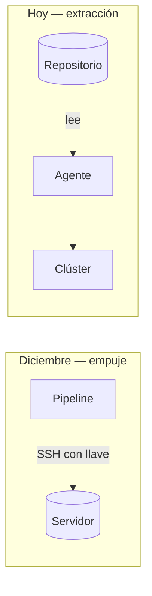

# 🔁 3. Clúster gestionado y GitOps

!!!info "Descarga de diapositivas"
    [Descarga las diapositivas](diapositivas/eks-gitops.pptx){target="_blank" rel="noopener"}

---

Última sesión de contenido del curso. La semana que viene empieza el proyecto integrador, así que hoy se cierran las dos cosas que quedaron apuntadas el viernes pasado.

La primera es fácil de enunciar: el clúster que montaste es tuyo, vive dentro de tu instancia y desaparece si la apagas — como comprobaste el viernes al recrearlo desde cero. Hoy verás uno que mantiene otro.

La segunda viene de más atrás y es la buena. En diciembre montaste un pipeline que **empujaba** hacia el servidor: entraba por SSH con una llave guardada en un secreto, y la actividad te hizo descubrir que el usuario `despliegue`, aunque no tuviera `sudo`, pertenecía al grupo `docker` y por tanto podía hacer prácticamente cualquier cosa en esa máquina. El viernes pasado, para desplegar sobre el clúster, volviste a entrar por SSH y a ejecutar órdenes a mano. Hoy le das la vuelta al sentido de la flecha: **nadie entra, algo tira desde dentro**.

---

## 🏢 Un plano de control que no es tuyo

Un clúster gestionado te vende una cosa concreta: el plano de control. El proveedor ejecuta y actualiza el servidor de API, el almacén de estado, el planificador y los controladores, los replica en varias zonas de disponibilidad y te los presenta como un punto de acceso. Tú sigues poniendo los nodos.

| Lo que deja de ser tuyo | Lo que sigue siendo tuyo |
|---|---|
| Disponibilidad y copias del almacén de estado | Cuántos nodos, de qué tamaño y cuándo se actualizan |
| Actualizar el plano de control | Decidir cuándo actualizar, y arreglar lo que rompa |
| Certificados internos del clúster | Tus manifiestos, tus sondas y tus recursos |
| Que el servidor de API esté en pie | Que tu aplicación funcione |

Ese reparto tiene un matiz que conviene no simplificar. Vas a usar un **grupo de nodos gestionado**, y ahí el proveedor automatiza buena parte del ciclo de vida: aprovisiona las máquinas, las vacía ordenadamente antes de sustituirlas y las reemplaza cuando fallan. Lo que sigue siendo decisión tuya es el tamaño, la cantidad y **cuándo** se lanza esa actualización. No es «los nodos son tuyos» a secas; es «las decisiones son tuyas, la mecánica la pone él».

La parte que no aparece en los diagramas es la factura. El plano de control se cobra **por hora y por clúster** —del orden de 0,10 $, unos 73 $ al mes en tarifa estándar— y se cobra igual con cero contenedores dentro. Encima van los nodos, el balanceador que crees hoy y el tráfico. Un clúster de prácticas olvidado un fin de semana cuesta más que la instancia que lleváis usando desde octubre.

!!! danger "Destruir el clúster antes de salir del aula"
    Esto no es una recomendación: es norma de aula y forma parte de la entrega. **El plano de control factura aunque el laboratorio esté cerrado y aunque no haya nada corriendo.** Un borrado no es instantáneo, y además hay que quitar antes el balanceador que ha creado Kubernetes, o la destrucción se queda esperando por una red que no puede liberar. Por eso la actividad de hoy tiene una hora de alto obligatorio. Si al terminar tu clúster sigue en pie, la práctica no está bien hecha aunque todo lo demás lo esté.

---

## 🧱 El clúster también es código

No vas a crear el clúster desde la consola web. En INU introdujiste la infraestructura como código el 16 de diciembre; hoy reutilizas ese enfoque, sin volver a explicar qué es un plan ni qué es un estado. Lo que sí conviene mirar es qué se declara:

- La **red** donde vive el clúster: subredes en varias zonas de disponibilidad. Sin eso no hay clúster gestionado.
- El **clúster** en sí, con su versión de Kubernetes.
- Un **grupo de nodos gestionado**: tipo de instancia y número de nodos.
- Los **roles** que necesitan el clúster y los nodos.

Esa última línea esconde la restricción de siempre y una trampa. En este laboratorio **no puedes crear roles**: la cuenta trae dos ya hechos, uno para el plano de control y otro para los nodos. La trampa es que **sus nombres llevan un prefijo que cambia cada sesión**, así que sus identificadores no pueden estar escritos en el repositorio: se consultan al empezar y se pasan como variables. En una cuenta real crearías roles propios con permisos mínimos, y esa diferencia merece un párrafo en tu informe.

Lo que de verdad condiciona la sesión son los tiempos. Crear un plano de control gestionado son del orden de quince minutos, y el grupo de nodos va después, porque no empieza hasta que el clúster existe. Entre que lanzas la creación y tienes un `kubectl get nodes` útil pasa cerca de media hora.

!!! tip "Diseña la sesión hacia atrás"
    La regla práctica del día es lanzar la creación lo primero y trabajar mientras se construye, y calcular la hora de la destrucción desde el final hacia atrás, no desde el principio hacia adelante. Es exactamente lo que hace un equipo que paga por horas. Y por si acaso: hoy hay una hora de control a media mañana. Si a esa hora el clúster no está en pie, se documenta la incidencia y el resto de la sesión se hace sobre el clúster local, porque lo que se aprende hoy no depende de quién sea el dueño del plano de control.

---

## 🔌 Lo que este laboratorio no da, y qué se hace en su lugar

El laboratorio del aula funciona para lo esencial, pero le faltan cosas que en una cuenta normal darías por hechas. Que falten no es mala suerte: cada ausencia obliga a una decisión de arquitectura, y esas decisiones son contenido.

| Lo que tenías el viernes | Hoy | Por qué |
|---|---|---|
| Ingress publicado por nombre y con TLS | **El mismo Ingress, sin nombre y sin TLS** | No vamos a delegar un dominio ni a emitir certificados en la última sesión |
| Base de datos con volumen persistente | **Base de datos sin almacenamiento persistente** | El laboratorio no tiene preparados el controlador ni los permisos necesarios para aprovisionar volúmenes de bloque |
| Imágenes de productos en un `hostPath` | **Se rompe** | Ese montaje funcionaba porque había un solo nodo. Hoy hay dos |

### Una sola puerta, y por qué

Un Service de tipo `LoadBalancer` hace que el proveedor te construya un balanceador de verdad, con su nombre público y su factura. Podrías declarar uno por cada cosa que quieras publicar, y ahí está el problema: **un balanceador por servicio no escala ni en dinero ni en administración**. Dos servicios, dos nombres distintos que memorizar, dos certificados el día que los pongas, dos facturas.

Lo que se hace —y es lo mismo que la semana pasada, un piso más arriba— es poner **un único** Service de tipo `LoadBalancer` delante del **controlador de Ingress**, que corre dentro del clúster. A partir de ahí, publicar algo nuevo no cuesta un balanceador: cuesta una regla en un Ingress. Hoy tienes una sola regla porque Escaparate empaqueta el front y la API en el mismo artefacto; el día que se separen, añades una regla y no cambias nada más. Esa es exactamente la propiedad que compras.

Del Ingress de la semana pasada cambian dos cosas: fuera el `host` —hoy entras por el nombre que te dé el balanceador— y fuera el bloque de TLS.

!!! warning "Ese balanceador lo crea el mecanismo heredado"
    Cuando declaras un Service de tipo `LoadBalancer` y no hay instalado el controlador de balanceadores de AWS, quien atiende la petición es el **controlador integrado en el proveedor de nube**, que crea un balanceador de la generación clásica. Funciona, y por eso lo usamos: instalar el controlador moderno exige permisos por pod que este laboratorio no permite configurar. Pero el propio AWS lo marca como heredado y solo le da correcciones críticas. **En una cuenta real no elegirías este camino**, y conviene que lo escribas así en el informe.

Y hay una pérdida real que hay que nombrar: hoy entras por HTTP y por un nombre feo. Todo lo que construiste en la S8 —nombre propio, certificado, redirección, HSTS— sigue siendo correcto y sigue siendo necesario; simplemente hoy no se monta. Que una decisión sea razonable en el aula no la convierte en buena práctica.

### La base de datos, sin almacenamiento persistente

Postgres corre hoy dentro del clúster sobre un volumen **efímero, ligado al ciclo de vida del pod**. La imagen siembra el catálogo al arrancar, así que verás productos, y durante las tres horas de clase no notarás nada raro.

Conviene ser preciso con qué significa «efímero», porque no es «se borra en cuanto pestañees»:

- Si **el contenedor se reinicia** dentro del mismo pod, el volumen sigue ahí y los datos permanecen.
- Si **el pod se elimina, se recrea o cambia de nodo**, el volumen desaparece con él y los datos se van.

O sea: sobrevive a un fallo del proceso y no sobrevive a nada de lo que hace un orquestador continuamente. Es una base de datos de demostración, no de producción, y la diferencia entre las dos frases anteriores es justo lo que hay que saber explicar.

La alternativa correcta, cuando no puedes darle almacenamiento persistente al clúster, es sacarla fuera: una base gestionada, o un servidor propio. Y ahí aparece una idea que merece conocerse aunque hoy no la ejecutes.

!!! info "Un Service puede apuntar fuera del clúster"
    Un Service es **un nombre más un conjunto de destinos**, y esos destinos no tienen por qué ser pods. Si declaras un Service **sin selector**, el clúster no rellena la lista sola: la escribes tú, creando un objeto **EndpointSlice** con la dirección de la máquina de fuera. (Antes esto se hacía con un objeto `Endpoints`; esa API está deprecada desde Kubernetes 1.33 y la documentación pide crear EndpointSlices directamente.)
    Lo interesante es el efecto: **tu Deployment no cambia ni una línea**, porque sigue conectándose a un nombre. Lo que hay detrás de ese nombre ha dejado de estar en el clúster y la aplicación no se ha enterado. Ese desacoplamiento es la mitad del valor de un Service.

### Las imágenes, por tercera vez

En septiembre te avisamos de que Escaparate guarda las imágenes que suben los usuarios en el disco local, y de que estaba mal a propósito. El fallo ha aparecido ya dos veces: al balancear entre tres copias en la S7, que resolviste con almacenamiento compartido, y agazapado en la S14, donde el montaje funcionó **solo porque el clúster tenía un único nodo**.

Hoy vuelve entero: con dos nodos, cada pod monta el disco de la máquina donde le ha tocado caer. Subes una foto, la ves al recargar, recargas otra vez y ha desaparecido. Y no lo vas a arreglar, porque las dos soluciones posibles quedan fuera de esta sesión:

- **Almacenamiento de objetos**, que es la respuesta preferente para un catálogo como este y la que ya usaste en INU con S3. Los ficheros dejan de estar en ninguna máquina.
- **Un sistema de ficheros en red** montado por todos los nodos a la vez, que es otra arquitectura válida y más parecida a lo que hiciste en la S7, pero que este laboratorio no tiene preparado.

Es el mismo fallo visto a tres escalas en cinco meses, y la conclusión es siempre la misma frase, cada vez con más fuerza: **nada que un usuario necesite volver a encontrar puede vivir dentro de una copia.**

---

## 🔁 Empujar o tirar: el argumento de las credenciales

Ahora el asunto de fondo. Compara los dos modelos.

En el modelo de **empuje**, que es el que montaste en diciembre, algo de fuera —el pipeline— tiene credenciales para entrar en producción y modificarla. Funciona. Pero implica que esas credenciales existen, viajan y se guardan en un secreto de la plataforma. En tu caso, además, la llave llevaba a un usuario del grupo `docker`, o sea, control efectivo de la máquina. Y para que aquello funcionara tuviste que abrir el acceso SSH a **un rango de direcciones que no controlas**: los ejecutores prestados por GitHub.

En el modelo de **extracción**, un agente instalado **dentro** del clúster lee el repositorio y aplica lo que encuentra. El repositorio es público y solo se lee. No hace falta abrir ningún puerto de administración hacia el clúster. Y el pipeline deja de necesitar acceso a producción: para desplegar, alguien fusiona una rama.

!!! warning "Cuidado con la frase fácil"
    Es tentador resumir esto como «ya no hay credenciales de producción fuera de producción», y sería falso. Esta misma mañana has pegado en tu instancia unas credenciales del laboratorio capaces de **crear y destruir el clúster entero**, que es bastante más poder del que tenía la llave SSH de diciembre. Lo que ha cambiado es más preciso y más útil:

    - **Aprovisionar la plataforma** sigue exigiendo credenciales potentes, en manos de quien administra la infraestructura y usadas en momentos contados.
    - **Desplegar una versión nueva de la aplicación** ya no exige ninguna: ni acceso administrativo al clúster, ni una llave en el sistema de integración continua.

    Separar esos dos caminos —quién puede crear la plataforma y quién puede desplegar sobre ella— es una de las decisiones de diseño más valiosas que te llevas del curso.



| | Empuje (S13) | Extracción (hoy) |
|---|---|---|
| Quién inicia | El pipeline, desde fuera | El agente, desde dentro |
| Credenciales en el sistema de CI | Una llave con acceso al servidor | Ninguna |
| Puerto de administración abierto | SSH, a un rango ajeno | Ninguno |
| Cuándo se comprueba | Solo al desplegar | Continuamente |
| Si alguien cambia algo a mano | Nadie se entera hasta el siguiente despliegue | Se detecta, y opcionalmente se revierte |
| Qué se rompe si cae el CI | No hay despliegues | Nada: el agente sigue reconciliando |

Esa penúltima fila es la novedad conceptual del día. Hasta ahora, «desplegar» era un suceso puntual. Con extracción es un estado permanente: alguien compara el repositorio con la realidad todo el rato. Es el mismo bucle de reconciliación de la S14, un nivel más arriba: si allí el clúster vigilaba que hubiera tres pods, ahora hay algo que vigila **que el clúster entero se parezca a un directorio de Git**.

---

## 🤖 Argo CD: el bucle, un nivel por encima

Argo CD es el agente que vas a instalar. Su objeto central se llama `Application` y declara de dónde salen los manifiestos, qué revisión seguir y dónde aplicarlos.

```yaml
apiVersion: argoproj.io/v1alpha1
kind: Application
metadata:
  name: escaparate
  namespace: argocd
spec:
  project: default
  source:
    repoURL: https://github.com/<tu-usuario>/daw-despliegue.git
    targetRevision: main
    path: k8s/eks
  destination:
    server: https://kubernetes.default.svc
    namespace: default
  syncPolicy:
    automated:
      selfHeal: true
      prune: true
```

- `path` es la clave del montaje: Argo CD **no mira todo el repositorio**, mira un directorio. Por eso el código de Escaparate y los manifiestos conviven sin estorbarse — y por eso ese directorio no puede contener nada que no quieras aplicar.
- `targetRevision: main` es lo que convierte un `merge` en un despliegue.
- `automated` hace que aplique solo. Sin ello, Argo CD detecta las diferencias y espera a que alguien pulse.
- `selfHeal: true` revierte los cambios hechos a mano en el clúster. **Está desactivado por defecto**, y es una elección deliberada del producto: no todo el mundo quiere que le deshagan una intervención de urgencia.
- `prune: true` borra del clúster lo que desaparece del repositorio. Sin esto, quitar un fichero no quita nada y se acumula basura.

Sobre los tiempos, para que la actividad no te sorprenda: Argo CD consulta el repositorio de forma periódica, con un intervalo por defecto de hasta unos tres minutos. **Un cambio en Git no aparece al instante**; en una instalación seria se acelera con un aviso del propio Git. Cuando lo que cambia es el clúster —porque alguien ha escalado a mano— la detección es mucho más rápida, porque el agente está observando el clúster, no consultándolo cada tanto.

!!! warning "Con sincronización automática, no se «deshace» desde el agente"
    Si tienes `automated` activado, no tiene sentido pedirle a Argo CD que vuelva a una versión anterior: aplicaría el repositorio otra vez a los pocos segundos. **La vuelta atrás se hace en Git**, revirtiendo el cambio. Es coherente y es incómodo la primera vez: el procedimiento de emergencia deja de ser una orden y pasa a ser un `revert` y un `push`.

---

## 🧾 Qué vive en el repositorio y qué no

Con GitOps el repositorio pasa a ser la descripción de producción, y eso obliga a dos decisiones.

**Los secretos no se versionan.** Sigue siendo cierto lo de siempre y ahora molesta más, porque todo lo demás sí está. La solución de aula es la de octubre: plantilla fuera del directorio que se aplica, y valor real aplicado aparte y documentado. La profesional es cifrar el secreto de forma que solo el clúster pueda descifrarlo —lo que sí permite versionarlo— o dejarlo en el gestor de secretos del proveedor y versionar solo una referencia. Se nombra y no se monta.

**Y hay que decidir qué dispara qué.** Con los manifiestos en el mismo repositorio que el código, cambiar una etiqueta de imagen en un YAML dispararía tu `ci.yml` entero: compilación, tests, cobertura y escaneo de una aplicación que no ha cambiado. La respuesta técnica es un filtro de rutas en el disparador del workflow. Pero antes de tocarlo, piénsalo dos veces: `main` está protegida y exige que esas comprobaciones pasen, así que impedir que se ejecuten deja el pull request bloqueado para siempre. La pregunta de fondo —*si el repositorio describe producción, ¿qué comprobación protege un cambio en producción que no toca ni una línea de código?*— no tiene respuesta obvia, y es la que abre de verdad este modelo.

---

## 🧭 Cuatro formas del mismo catálogo

Con la sesión de hoy cierras la UD6 y cierras el curso. El mismo catálogo, el mismo `war`, la misma imagen de GHCR, se ha ejecutado de cuatro maneras:

| Forma | Dónde | Cuándo lo montaste |
|---|---|---|
| Contenedores sobre una instancia, con proxy propio | Una máquina que administras | S5 a S13 |
| Contenedor como servicio gestionado | Sin servidores que administrar | INU, el miércoles |
| Clúster propio sobre una instancia | Orquestación que mantienes tú | S14 y S15 |
| Clúster gestionado con despliegue por extracción | Orquestación que mantiene otro | Hoy |

Ninguna es «la buena». Cada una tiene su tiempo de despliegue, su coste, su esfuerzo operativo y su caso. Esa comparación es el entregable conjunto de esta semana con INU, y la pregunta con la que se defiende el proyecto en febrero es exactamente esa: **cuál de las cuatro le venderías a un cliente concreto, y por qué.** Tienes datos propios de las cuatro. Úsalos.

Con esto ya tienes las piezas para la **Actividad 6.3**: levantarás el clúster gestionado, publicarás el catálogo por un único balanceador, instalarás el agente, verás cómo deshace un cambio hecho a mano, cambiarás la versión por pull request sin tocar ninguna consola — y destruirás el clúster antes de salir.

---

## 🎯 Qué debes saber hacer al salir de esta sesión

- Levantar un clúster gestionado con el código entregado, ajustando sus variables, y **destruirlo** dejando la cuenta limpia.
- Configurar el acceso con `kubectl` a ese clúster y comprobar los nodos.
- Adaptar los manifiestos de la semana pasada a este entorno y justificar cada cambio.
- Publicar la aplicación con el controlador de Ingress detrás de un único Service de tipo `LoadBalancer`, y explicar qué has perdido respecto al viernes y por qué ese balanceador no sería tu elección en una cuenta real.
- Instalar Argo CD y declarar una `Application` apuntando a un directorio del repositorio, con sincronización automática.
- Demostrar que un cambio hecho a mano en el clúster se revierte, y que un cambio hecho por pull request se despliega.
- Distinguir, con tu propio caso de hoy, qué credenciales siguen haciendo falta para aprovisionar la plataforma y cuáles han dejado de hacer falta para desplegar la aplicación.

**Lo que basta con reconocer**: la anatomía interna de Argo CD, las estrategias de gestión de secretos en GitOps, el detalle del código de infraestructura que no has editado y la sintaxis de un EndpointSlice.

---

## ✅ Ideas clave

??? tip "Abrir resumen"

    - Un clúster gestionado te quita el plano de control, no las decisiones sobre los nodos ni la responsabilidad sobre tu aplicación. En un grupo de nodos gestionado, el proveedor pone la mecánica y tú pones el cuándo.
    - Se cobra por hora y por clúster, con cero contenedores dentro. Destruirlo al salir es parte del trabajo, y antes hay que quitar el balanceador.
    - Crear el clúster son del orden de quince minutos, y el grupo de nodos va después. La hora de la destrucción se calcula desde el final de la sesión hacia atrás.
    - Los roles del laboratorio no se pueden crear y sus nombres cambian cada sesión: no caben en el repositorio, se pasan como variables.
    - Un balanceador por servicio no escala ni en dinero ni en administración. Con un solo balanceador delante del controlador de Ingress, publicar algo nuevo cuesta una regla, no un balanceador.
    - Ese balanceador lo crea el mecanismo heredado del proveedor, que solo recibe correcciones críticas. Es un compromiso del laboratorio, no una recomendación.
    - Un volumen efímero sobrevive al reinicio del contenedor y desaparece cuando el pod se elimina, se recrea o cambia de nodo. Hoy la base de datos es una demostración, no una producción.
    - Un Service es un nombre y un conjunto de destinos; sin selector, esos destinos los escribes tú en un EndpointSlice y pueden estar fuera del clúster. La aplicación no se entera.
    - El fallo de las imágenes en disco local, plantado en septiembre, se rompe definitivamente con varios nodos. La respuesta preferente es almacenamiento de objetos; un sistema de ficheros en red sería otra arquitectura válida.
    - Empujar exige una credencial de acceso a producción guardada en el sistema de integración continua, y un puerto de administración abierto. Tirar no exige ninguna de las dos cosas.
    - Pero aprovisionar la infraestructura sigue exigiendo credenciales potentes. Lo que desaparece es la credencial del **despliegue de la aplicación**, no todas las credenciales.
    - Con GitOps, desplegar deja de ser un suceso y pasa a ser un estado: algo compara el repositorio con la realidad continuamente.
    - Argo CD consulta el repositorio cada pocos minutos, mientras que un cambio hecho a mano en el clúster se detecta enseguida.
    - `selfHeal` y `prune` están desactivados por defecto: revertir intervenciones manuales y borrar lo que desaparece del repositorio son decisiones, no automatismos.
    - Con sincronización automática, la vuelta atrás se hace revirtiendo en Git. El procedimiento de emergencia cambia de forma.
    - El directorio que mira Argo CD no puede contener nada que no quieras aplicar, plantillas incluidas.