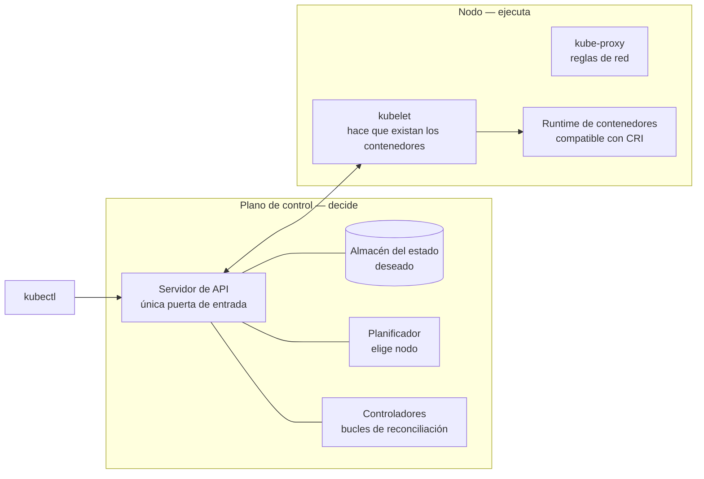

# 🧩 1. Arquitectura de Kubernetes: el estado deseado

!!!info "Descarga de diapositivas"
    [Descarga las diapositivas](diapositivas/kubernetes-arquitectura.pptx){target="_blank" rel="noopener"}

---

Hoy has empezado la sesión rearrancando el laboratorio, apuntando el registro A de tu subdominio a la IP nueva y levantando el stack desde `main`. Diez minutos, si tu `README` está bien escrito. Durante las tres semanas de vacaciones tu catálogo no ha estado caído: ha estado inexistente, porque la instancia estaba apagada y nadie iba a encenderla. Y cuando vuelva a estar en marcha, si esta tarde se muere uno de los tres contenedores de la API por una razón que no sea trivial, tampoco va a venir nadie a mirarlo.

Llevas once sesiones montando a mano un servicio que funciona. Este tema no añade una pieza más: pregunta quién mantiene todo eso cuando tú no estás delante, qué parte de esa respuesta puede darla una máquina, y —esto importa igual— en qué casos la respuesta correcta sigue siendo el `compose.yaml` que ya tienes.

---

## 🔁 Lo que tu stack hace solo y lo que haces tú

Antes de meter una herramienta nueva, conviene mirar con honestidad qué automatismos tienes ya. No son pocos:

| Situación | Quién responde hoy | Hasta dónde llega |
|---|---|---|
| Un contenedor de la API muere | La política de reinicio de Docker lo vuelve a arrancar, y Nginx deja de mandarle tráfico (S7) | Reinicia el mismo contenedor en la misma máquina. Si el fallo persiste, entra en bucle y nadie lo mira |
| Llega el triple de tráfico | Nadie | Las tres copias son las que son. Escalar es editar `compose.yaml`, subir copias y tocar el `upstream` |
| Sale una versión nueva | El pipeline de la S13: `pull` + `up -d` | Para y arranca. Hay un hueco, corto pero real, en el que el servicio no responde |
| Un despliegue rompe la aplicación | La prueba de humo lo detecta | **Después.** El usuario ya ha visto la pantalla rota |
| Se reinicia la instancia | La política de reinicio levanta los contenedores | Solo si el demonio de Docker arranca al inicio y solo en esa máquina |
| La máquina entera desaparece | Nadie | Se acabó |

Fíjate en el patrón. Todo lo que se recupera solo se recupera **dentro de un contenedor o dentro de una máquina**, y siempre reaccionando a un suceso concreto. No hay nadie que se pregunte periódicamente «¿esto sigue pareciéndose a lo que se pidió?».

Tu `compose.yaml` **sí** es una descripción del estado deseado: dice qué servicios hay, con qué imagen y con qué red. Lo que le falta no es la descripción, es el bucle. Compose compara lo descrito con lo que hay **solo cuando tú ejecutas la orden**. En cuanto sales de la sesión SSH, ese fichero es un documento.

---

## 🧭 Estado deseado, estado real y el bucle que los compara

La idea que sostiene Kubernetes cabe en una frase: **tú declaras cómo debería estar el sistema, y unos procesos comparan sin descanso esa declaración con la realidad y actúan sobre la diferencia**. Eso se llama bucle de reconciliación, y es lo único verdaderamente nuevo del tema. El resto es vocabulario.

!!! example "La analogía del termostato"
    Un interruptor de la calefacción es imperativo: le dices «enciéndete» y se enciende. Si abres la ventana, sigue encendido hasta que vayas a apagarlo. Un termostato es declarativo: le dices «21 grados» y él mide, compara y decide encender o apagar cuantas veces haga falta. Nunca le dices «enciéndete»; le dices en qué estado quieres la habitación. `docker compose up -d` es el interruptor. Kubernetes es el termostato.

En la práctica esto cambia tres cosas en tu forma de trabajar:

- **Ya no ordenas acciones, registras intenciones.** `kubectl apply` no arranca nada: guarda tu descripción en el almacén del clúster. Que aparezcan contenedores es una consecuencia, y puede tardar unos segundos.
- **El fichero es la verdad, no la máquina.** Si alguien borra un contenedor a mano, vuelve. Si quieres que no vuelva, cambia la declaración. Esto tendrá consecuencias enormes en la S16.
- **Los errores se cuentan distinto.** Un `apply` puede terminar con éxito y el servicio no funcionar: has registrado bien una intención imposible de cumplir. Preguntar «¿se aplicó?» no es preguntar «¿funciona?». Esa distinción ya te sonará: es la misma que descubriste en diciembre con el pipeline en verde y la aplicación rota.

---

## 🏗️ Quién decide y quién ejecuta

Hasta ahora tú hacías los dos papeles: decidías qué tenía que correr y entrabas por SSH a hacerlo. Kubernetes los separa.



- El **servidor de API** es la única puerta. Todo —`kubectl`, los controladores, los nodos— habla con él y con nadie más. Es también el único sitio donde poner autorización, y por eso importa tanto quién tiene acceso.
- El **almacén de estado** guarda lo que has declarado y lo que se ha observado. Es la pieza que hay que salvar en una copia de seguridad; en la S16 dejará de ser tu problema.
- El **planificador** decide en qué nodo cabe cada carga. Con un solo nodo la decisión es aburrida, pero el mecanismo es el mismo.
- Los **controladores** son los bucles: «se piden tres copias, veo dos, creo una».
- En cada nodo, el **kubelet** recibe la lista de lo que le toca ejecutar y se encarga de que exista. Para eso habla con un **runtime de contenedores compatible con CRI** —normalmente `containerd`—, que es quien de verdad crea los procesos.

Esa última línea merece precisión, porque es una confusión muy extendida. Kubernetes **no** ejecuta Docker: define una interfaz, CRI, y habla con cualquier runtime que la implemente. Lo que sí es idéntico es la carga: la imagen OCI que publicaste en GHCR en la S4 no cambia ni un byte, y `containerd` la ejecuta igual que la ejecutaba tu Docker. Lo que cambia no es el contenedor, es **quién decide arrancarlo y con qué capa de orquestación por encima**.

!!! tip "Un nodo, dos papeles"
    El clúster de hoy se monta con **minikube** sobre tu instancia, usando el controlador de Docker: minikube crea un contenedor grande que hace de nodo completo de Kubernetes, con su propio `containerd` dentro. Con un solo nodo, esa misma máquina hace de plano de control y de trabajador. Es una simplificación de aula: en la S16 verás los dos papeles de verdad separados, y el plano de control será de otro.

---

## 📦 Las piezas mínimas, traducidas desde tu `compose.yaml`

Cuatro objetos bastan para poner Escaparate en marcha.

Un **Pod** es la unidad mínima que se planifica: uno o más contenedores que comparten dirección de red y volúmenes. Casi nunca escribirás uno. Un **ReplicaSet** vigila que exista un número concreto de pods iguales. Tampoco lo escribirás. Un **Deployment** gestiona ReplicaSets y es el objeto que sí escribes. Y un **Service** da un nombre estable y reparte tráfico entre pods que van y vienen.

```yaml
apiVersion: apps/v1
kind: Deployment
metadata:
  name: escaparate-api
spec:
  replicas: 3
  selector:
    matchLabels:
      app: escaparate-api
  template:
    metadata:
      labels:
        app: escaparate-api
    spec:
      containers:
        - name: api
          image: ghcr.io/<tu-usuario>/escaparate:v1.0.0
          ports:
            - containerPort: 8080
```

Línea a línea, y solo lo que no es evidente:

- `kind: Deployment` es el tipo de objeto. `metadata.name` es su nombre dentro del clúster: el equivalente al nombre del servicio en Compose.
- `spec.replicas: 3` es tu declaración. Aquí vive el número que en la S7 eran tres bloques `api-1`, `api-2` y `api-3` escritos a mano en `compose.yaml` **y** tres líneas en el `upstream` de Nginx.
- `spec.template` es el molde del pod. Todo lo que hay bajo `template` describe cómo será cada copia; cambiar cualquier cosa ahí dentro es lo que dispara una actualización, y de eso va la sesión que viene.
- `spec.selector.matchLabels` y `template.metadata.labels` **tienen que coincidir**. Es el mecanismo por el que el Deployment reconoce «sus» pods: no por nombre, sino por etiqueta. Es el error de principiante más frecuente del tema.
- `containerPort: 8080` es documentación, no publicación. Ahí no se abre nada hacia fuera; para eso está el Service.

Y esta es la traducción completa, que te toca comprobar en la actividad:

| En tu `compose.yaml` de la S5 | En Kubernetes | Matiz que no conviene pasar por alto |
|---|---|---|
| Una entrada bajo `services:` | Un Deployment **y** un Service | En Compose una entrada hace las dos cosas: ejecuta y da nombre |
| `image:` | `containers[].image` | Idéntico. La imagen no cambia |
| Tres servicios `api-1..3` | `replicas: 3` | De copiar y pegar bloques a cambiar una cifra |
| `environment:` / `env_file:` | `env:`, ConfigMap y Secret | Se ve en la S15 |
| Volumen con nombre | PersistentVolumeClaim | El clúster local trae una clase de almacenamiento por defecto que lo resuelve sobre el disco del nodo |
| Montaje de un directorio del anfitrión | `hostPath` | **Solo funciona porque hay un nodo**. Con dos, cada pod vería un disco distinto |
| Red interna y resolución por nombre de servicio | Service + DNS del clúster | Mismo concepto, otro implementador |
| `ports:` publicado | Service `NodePort`, `LoadBalancer` o Ingress | Publicar es una decisión aparte, no un atributo del servicio |
| `depends_on` | **No hay equivalente directo** | Kubernetes no ordena arranques: asume que las cosas reintentan hasta que la dependencia esté |
| `restart: unless-stopped` | Política de reinicio del pod **y** el ReplicaSet | Dos niveles: el contenedor se reinicia en su sitio; el pod que desaparece se **crea de nuevo**, con otro nombre y otra IP |
| `docker compose up -d` | `kubectl apply -f` | Uno ejecuta una vez; el otro registra una intención permanente |

La fila de `depends_on` merece un segundo. En Compose podías escribir que la API espera a la base de datos. Aquí no tienes esa herramienta: si la API arranca antes que Postgres, se caerá, se reiniciará y a la tercera o cuarta encontrará la base en pie. Es feo de mirar y es deliberado: **un sistema que solo funciona si las cosas arrancan en orden es un sistema que no sobrevive a un reinicio nocturno.**

---

## 🔀 Cómo llega una petición hasta un pod

Los pods son desechables: mueren, nacen con otro nombre y otra IP, y se mueven de nodo. Ninguna configuración puede apuntar a uno.

Un **Service** resuelve eso con el mismo truco de las etiquetas. Declaras un selector, y el clúster mantiene vivo el conjunto de pods que lo cumplen: si escalas a seis, entran tres más; si muere uno, sale. A cambio te da un nombre DNS interno estable —`escaparate-api`, resoluble desde cualquier pod del clúster— y una IP virtual que reparte entre los destinos que en ese momento existan.

Compáralo con lo que hiciste en la S7. Aquel `upstream` de Nginx era una **lista escrita a mano**: añadir una copia significaba editar el fichero, validarlo y recargar. Aquí la lista se deriva de una etiqueta y se mantiene sola. Es la misma idea —un nombre delante de un conjunto de destinos— con el mantenimiento automatizado.

!!! warning "Un Service no es tu proxy inverso"
    El reparto de un Service es de red, a nivel de conexión: no entiende rutas, no lee cabeceras, no termina TLS y no tiene reglas por `location`. Todo lo que montaste en las sesiones 6 a 8 —hosts virtuales, `X-Forwarded-*`, HTTPS, zona protegida— necesita algo por encima. Ese algo es el Ingress, y llega en la S15.

Para hoy te bastan dos tipos. `ClusterIP` es el valor por defecto: visible solo dentro del clúster, exactamente como la API y la base de datos «sin puertos publicados» de la S5. `NodePort` abre además un puerto en el nodo para que puedas mirarlo desde fuera; es tosco y sirve para comprobar.

---

## ⚖️ Cuándo esto es sobreingeniería

Toca la parte incómoda, y no es un descargo de responsabilidad: es contenido evaluable.

Kubernetes cobra por adelantado y cobra siempre. Lo que en Compose eran veinte líneas aquí son cinco objetos y ciento y pico de YAML. Aparecen conceptos de red y almacenamiento que antes no tenías. El clúster hay que actualizarlo, y las actualizaciones rompen cosas. Un clúster gestionado tiene además un precio fijo por el plano de control —del orden de 0,10 $ por hora, unos 73 $ al mes, **sin un solo contenedor corriendo**— que pagas aunque el servicio no reciba visitas. Y sobre todo: cuando algo falla, la cadena de diagnóstico es mucho más larga que un `docker logs`.

Y hay cosas que sencillamente no resuelve:

- **El estado sigue siendo el problema difícil.** Poner Postgres en el clúster no lo hace más disponible; hace que su disco dependa de dónde se planifique el pod. Por eso, cuando en la S16 tengas varios nodos, la base de datos dejará de tener disco.
- **Los ficheros que suben los usuarios siguen sin duplicarse solos.** El mismo fallo de septiembre —una copia tiene la foto y la otra no— sigue ahí esperándote.
- **No arregla una aplicación mal hecha.** Si tu proceso tarda dos minutos en arrancar, reponerlo automáticamente son dos minutos de espera.
- **No evita que despliegues algo roto.** Solo cambia cómo y cuándo te enteras.

| Señales de que compensa | Señales de que no |
|---|---|
| Varios servicios que se despliegan por separado y a ritmos distintos | Un servicio y una base de datos |
| Despliegues frecuentes, varios al día | Un despliegue semanal, planificado |
| Un corte de dos minutos cuesta dinero o reputación | Un corte de dos minutos no lo nota nadie |
| Demanda variable de verdad, con picos que no caben en una máquina | Carga estable que cabe holgadamente en una instancia |
| Alguien en el equipo mantiene la plataforma como parte de su trabajo | Nadie tiene ese tiempo |
| Necesitas el mismo despliegue en varios entornos o proveedores | Un entorno, un proveedor |

Mira tu columna derecha. **Para el Escaparate de este curso, la respuesta honesta es que el `compose.yaml` de diciembre era la correcta.** Aprendes Kubernetes porque en el mercado laboral es la pieza que orquesta lo que despliegan los equipos grandes, y porque hasta que no lo has montado no puedes decidir con criterio. Saber cuándo *no* usarlo forma parte de saber usarlo, y es una respuesta que se pide en la defensa de febrero.

Con esto ya tienes las piezas para la **Actividad 6.1**: montarás el clúster sobre tu instancia, traducirás tu propio `compose.yaml` a manifiestos, verás reponerse un pod que has matado tú y escalarás de tres a seis y de seis a tres cambiando una cifra.

---

## 🎯 Qué debes saber hacer al salir de esta sesión

- Arrancar el clúster local con las opciones indicadas y comprobar que el nodo está listo.
- Escribir y aplicar un Deployment con un número de réplicas y una imagen de GHCR, y leer el resultado con `kubectl get` y `kubectl describe`.
- Exponer ese Deployment con un Service y alcanzarlo, distinguiendo `ClusterIP` de `NodePort`.
- Provocar la desaparición de un pod y explicar **quién** lo repone y por qué el nuevo tiene otro nombre.
- Escalar a seis réplicas y volver a tres modificando la declaración, no ejecutando órdenes de arranque.
- Traducir cada entrada de tu `compose.yaml` de la S5 al objeto equivalente, señalando las dos que no tienen traducción directa.

**Lo que basta con reconocer**: los nombres de los procesos internos del plano de control y el reparto exacto de funciones entre planificador, controladores y kubelet.

---

## ✅ Ideas clave

??? tip "Abrir resumen"

    - Un orquestador no añade automatismos sueltos: añade un bucle que compara sin parar lo declarado con lo real y actúa sobre la diferencia.
    - `docker compose up -d` también parte de una descripción, pero solo la aplica cuando alguien ejecuta la orden. Esa es la diferencia, no el formato del fichero.
    - `kubectl apply` registra una intención; que se cumpla es otra pregunta. «Se ha aplicado» no significa «funciona».
    - El plano de control decide y los nodos ejecutan. El kubelet no ejecuta Docker: habla con un runtime compatible con CRI, normalmente `containerd`, y la imagen que le pasas es la misma que ya publicabas.
    - El Deployment reconoce sus pods por etiqueta, no por nombre; si el selector y las etiquetas del molde no coinciden, nada funciona.
    - Un pod que desaparece no se reinicia: se crea otro, con otro nombre y otra IP. Por eso nada puede apuntar a un pod.
    - Un Service es un nombre estable delante de un conjunto de destinos que se mantiene solo. Es el `upstream` de la S7 sin la parte de editarlo a mano.
    - Kubernetes no ordena arranques: no hay equivalente directo de `depends_on`. Se asume que los servicios reintentan hasta que su dependencia esté disponible.
    - Un volumen de tipo `hostPath` funciona con un nodo y deja de funcionar con dos. Que hoy funcione no significa que sea correcto.
    - Kubernetes no resuelve el estado, ni los ficheros compartidos, ni una aplicación lenta, ni un despliegue defectuoso. Cobra complejidad permanente y, si es gestionado, una cuota fija por hora.